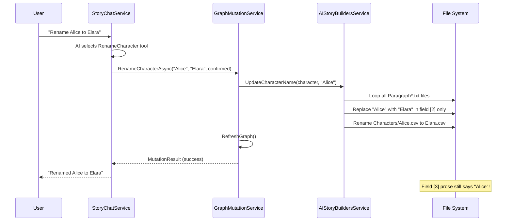
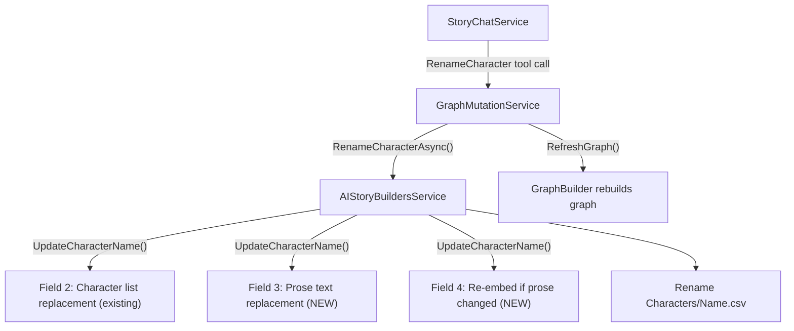
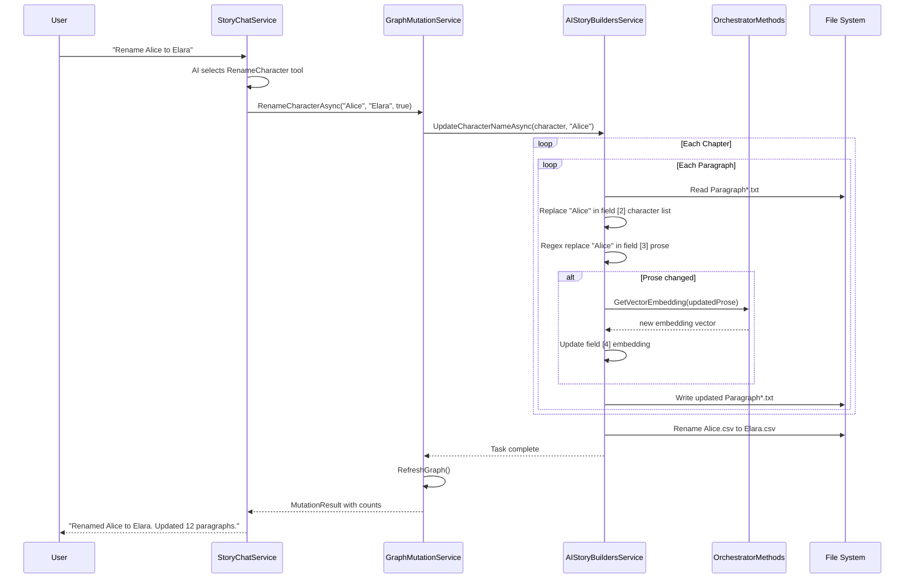
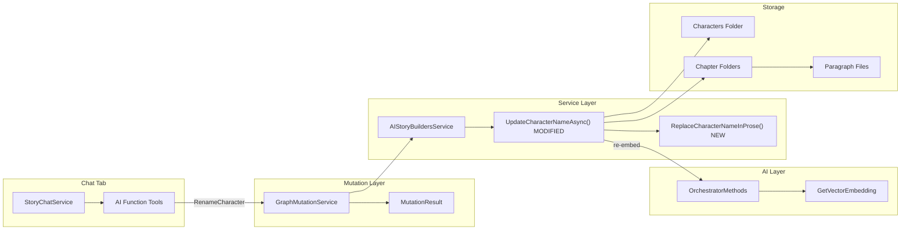

# Character Rename Propagation — Full Plan

## Problem Statement

When a user asks the AI (via the Chat tab) to rename a character, the `RenameCharacter` tool correctly:

1. Renames the character's `.csv` file in the `Characters/` folder.
2. Updates the `[characters]` metadata array (field index 2) in every `Paragraph*.txt` file across all chapter folders.
3. Refreshes the in-memory knowledge graph.

However, the character's **old name still appears inside the paragraph prose text** (field index 3 of each `Paragraph*.txt`). The narrative sentences — "Alice walked into the room" — are never rewritten to use the new name. This means the story text and the metadata become inconsistent after a rename.

### Root Cause

`AIStoryBuildersService.UpdateCharacterName()` iterates over every paragraph file and replaces the old name in `ParagraphArray[2]` (the bracketed character list), but it never touches `ParagraphArray[3]` (the prose content). The `GraphMutationService.RenameCharacterAsync()` method delegates entirely to that service method and adds no additional logic.

---

## Current Architecture

### File Layout

```
{Documents}/AIStoryBuilders/{StoryTitle}/
  Characters/
    Alice.csv          <-- pipe-delimited: Type|Timeline|Description|Vector
    Bob.csv
  Chapters/
    Chapter01/
      Chapter01.txt    <-- synopsis|vector
      Paragraph1.txt   <-- Location|Timeline|[Alice,Bob]|prose text...|vector
      Paragraph2.txt
    Chapter02/
      ...
  Locations/
    ...
  Timelines.csv
```

### Paragraph File Format

Each `Paragraph*.txt` is a single logical line with pipe-delimited fields:

| Index | Field | Example |
|-------|-------|---------|
| 0 | Location name | `Tavern` |
| 1 | Timeline name | `Medieval Era` |
| 2 | Character list (JSON-style array) | `[Alice,Bob]` |
| 3 | Prose content | `Alice poured Bob a drink.` |
| 4 | Vector embedding | `0.123,0.456,...` |

### Current Rename Call Chain



---

## Proposed Solution

### Strategy Overview

Add a **prose-level find-and-replace** step to `UpdateCharacterName()` that also updates field index 3 (the paragraph prose text) in every `Paragraph*.txt`. Additionally, re-generate the vector embedding for any paragraph whose prose content was modified.

For cases where the character name is ambiguous or appears as a substring of another word (e.g., "Al" inside "Also"), the implementation should use **word-boundary-aware replacement** to avoid false positives.

---

## Detailed Design

### Component Diagram



### Phase 1: Prose Content Replacement

#### 1.1 Modify `UpdateCharacterName()` in `AIStoryBuildersService.Story.cs`

After the existing character-list replacement logic, add a prose replacement step that:

1. Reads `ParagraphArray[3]` (the prose content).
2. Performs a **case-sensitive, word-boundary-aware** replacement of the old character name with the new name.
3. Writes the updated content back.
4. Tracks whether the prose was actually modified (for the embedding step).

**Pseudocode:**

```csharp
// After the existing character-list update in ParagraphArray[2]...

// --- NEW: Update prose content in ParagraphArray[3] ---
string originalProse = ParagraphArray[3];
string updatedProse = ReplaceCharacterNameInProse(
    originalProse,
    paramOrginalCharcterName,
    character.CharacterName);

bool proseChanged = (originalProse != updatedProse);
if (proseChanged)
{
    ParagraphArray[3] = updatedProse;
}
```

#### 1.2 Add `ReplaceCharacterNameInProse()` Helper

A private method using `Regex` with word boundaries to avoid partial-word matches:

```csharp
private string ReplaceCharacterNameInProse(
    string prose, string oldName, string newName)
{
    // Use word boundary \b to avoid replacing substrings
    // e.g., "Al" inside "Also" or "Alice" inside "Malice"
    string pattern = @"\b" + Regex.Escape(oldName) + @"\b";
    return Regex.Replace(prose, pattern, newName);
}
```

**Why word boundaries?**
- Prevents "Alice" from being replaced inside "Malice" or "Alice's" edge cases.
- `\b` in .NET regex handles possessives correctly ("Alice's" will match "Alice" at the boundary before the apostrophe).

### Phase 2: Re-embed Modified Paragraphs

When prose content changes, the existing vector embedding for that paragraph becomes stale. The embedding was computed from the old text and no longer reflects the updated names.

#### 2.1 Regenerate Embedding for Changed Paragraphs

After the prose replacement, if the content changed, regenerate the embedding:

```csharp
if (proseChanged)
{
    ParagraphArray[3] = updatedProse;

    // Regenerate embedding for the updated prose
    if (ParagraphArray.Length > 4)
    {
        string newEmbedding = await OrchestratorMethods
            .GetVectorEmbedding(updatedProse, true);
        // The embedding is the portion after the last pipe
        // Update the vector portion of the paragraph
        ParagraphContent[ParagraphContent.Length - 1] = newEmbedding;
    }
}
```

> **Note:** This makes `UpdateCharacterName()` async. The method signature changes from `void` to `async Task`. Callers must be updated accordingly.

#### 2.2 Update Callers

| Caller | File | Change |
|--------|------|--------|
| `GraphMutationService.RenameCharacterAsync()` | `GraphMutationService.cs` | Change to `await _storyService.UpdateCharacterName(...)` |
| `CharacterEdit.razor` | `Components/Pages/Controls/Characters/CharacterEdit.razor` | Change to `await AIStoryBuildersService.UpdateCharacterName(...)` |

### Phase 3: Enhance `MutationResult` Reporting

Update `GraphMutationService.RenameCharacterAsync()` to report exactly how many paragraph files had their prose content updated, giving the user visibility into what changed.

```csharp
result.AffectedFiles.Add($"Characters/{newName}.csv (renamed from {currentName}.csv)");
result.AffectedFiles.Add($"{proseUpdatedCount} paragraph(s) had prose content updated");
result.AffectedFiles.Add($"{metadataUpdatedCount} paragraph(s) had character list updated");
if (embeddingsRegenerated > 0)
    result.AffectedFiles.Add($"{embeddingsRegenerated} paragraph embedding(s) regenerated");
```

---

## Process Flow — After Implementation



---

## Files to Modify

| File | Change | Complexity |
|------|--------|------------|
| `Services/AIStoryBuildersService.Story.cs` | Add prose replacement in `UpdateCharacterName()`, add `ReplaceCharacterNameInProse()` helper, make method async, add embedding regeneration | Medium |
| `Services/GraphMutationService.cs` | Await the now-async `UpdateCharacterName()`, add detailed counts to `MutationResult` | Low |
| `Components/Pages/Controls/Characters/CharacterEdit.razor` | Await the now-async `UpdateCharacterName()` call | Low |

---

## Edge Cases and Considerations

### 1. Character Names That Are Common Words

If a character is named "Will" or "May", word-boundary replacement could inadvertently change occurrences of the English words "will" and "may" in prose.

**Mitigation:** The replacement is **case-sensitive** by default. Since character names are typically capitalized ("Will") and common words are lowercase ("will"), most false positives are avoided. If issues arise, a future enhancement could use context-aware NLP, but case-sensitive word-boundary regex is the pragmatic first step.

### 2. Character Names with Multiple Words

A character named "Mary Jane" must be matched as the full phrase, not "Mary" and "Jane" separately.

**Mitigation:** `Regex.Escape()` handles spaces and special characters correctly. The pattern `\bMary Jane\b` will match the full name.

### 3. Possessives and Punctuation

"Alice's hat" should become "Elara's hat". The word boundary `\b` in .NET regex sits between a word character and a non-word character, so `\bAlice\b` matches "Alice" in "Alice's" correctly (the boundary is between 'e' and the apostrophe).

### 4. Pipe Characters in Prose

The paragraph file uses `|` as a field delimiter. If prose content contains a literal pipe, the split on `|` will produce too many array elements.

**Mitigation:** The existing `SanitizePipe()` utility strips pipes on content write. This is an existing concern, not introduced by this change. However, the rename logic should use `Split('|', 4)` or equivalent to limit the split to the first three delimiters, treating everything after the third pipe as prose+embedding content.

### 5. Performance on Large Stories

For a story with 50 chapters and 20 paragraphs each (1,000 files), the rename involves:
- 1,000 file reads + writes (already done by the existing method)
- 1,000 regex replacements (negligible cost)
- Up to 1,000 embedding API calls (if every paragraph mentions the character)

**Mitigation:** Only call the embedding API when prose text actually changed. Most paragraphs will not mention every character, so the actual number of embedding calls will be much lower. Consider batching embedding calls if the provider supports it.

### 6. First Name vs. Full Name References

A character file is named by full name (e.g., "Alice Cooper.csv"), but the prose might refer to the character as just "Alice". The current scope of this plan only replaces the exact full name as it appears in the character file.

**Future Enhancement:** A separate tool could be added — `FindAndReplaceInProse(oldText, newText)` — to handle first-name-only or nickname replacements at the user's discretion.

---

## Architecture Diagram — Updated Components



---

## Testing Plan

### Unit Tests

| Test | Description |
|------|-------------|
| `ReplaceCharacterNameInProse_ExactMatch` | "Alice walked in" becomes "Elara walked in" |
| `ReplaceCharacterNameInProse_NoMatch` | "Bob walked in" is unchanged when renaming Alice |
| `ReplaceCharacterNameInProse_SubstringIgnored` | "Malice" is not changed when renaming "Alice" |
| `ReplaceCharacterNameInProse_Possessive` | "Alice's hat" becomes "Elara's hat" |
| `ReplaceCharacterNameInProse_MultipleOccurrences` | All instances in one paragraph are replaced |
| `ReplaceCharacterNameInProse_CaseSensitive` | "alice" (lowercase) is not changed |
| `ReplaceCharacterNameInProse_MultiWordName` | "Mary Jane" is replaced as a whole phrase |

### Integration Tests

| Test | Description |
|------|-------------|
| `RenameCharacter_UpdatesProseAcrossAllChapters` | Create a story with 3 chapters, rename a character, verify all paragraph prose is updated |
| `RenameCharacter_OnlyUpdatesAffectedParagraphs` | Verify paragraphs not mentioning the character are untouched |
| `RenameCharacter_FileAndMetadataConsistent` | After rename, character list in field [2] and prose in field [3] both use the new name |
| `RenameCharacter_EmbeddingsRegenerated` | Verify embedding field is different after prose change |
| `RenameCharacter_ViaChat` | End-to-end: send "rename Alice to Elara" in chat, verify all files |

---

## Summary of Required New Methods

| Method | Location | Purpose |
|--------|----------|---------|
| `UpdateCharacterNameAsync()` | `AIStoryBuildersService.Story.cs` | Async version of existing `UpdateCharacterName()` with prose replacement and re-embedding |
| `ReplaceCharacterNameInProse()` | `AIStoryBuildersService.Story.cs` | Word-boundary regex replacement helper |

No new AI tools need to be added to `StoryChatService`. The existing `RenameCharacter` tool already exists and is correctly wired. The fix is entirely within the service layer — making the existing rename operation more thorough by also updating prose content and regenerating embeddings.

---

## Implementation Checklist

- [ ] Add `ReplaceCharacterNameInProse()` private method to `AIStoryBuildersService.Story.cs`
- [ ] Modify `UpdateCharacterName()` to also replace names in `ParagraphArray[3]` (prose content)
- [ ] Make `UpdateCharacterName()` async (rename to `UpdateCharacterNameAsync()`)
- [ ] Add embedding regeneration for paragraphs with changed prose
- [ ] Update `GraphMutationService.RenameCharacterAsync()` to await the async method
- [ ] Update `CharacterEdit.razor` to await the async method
- [ ] Add prose-updated and embedding-regenerated counts to `MutationResult`
- [ ] Test with single-word character names
- [ ] Test with multi-word character names
- [ ] Test with possessives and punctuation
- [ ] Test that common-word names (case-sensitive) are handled correctly
- [ ] End-to-end test via Chat tab
