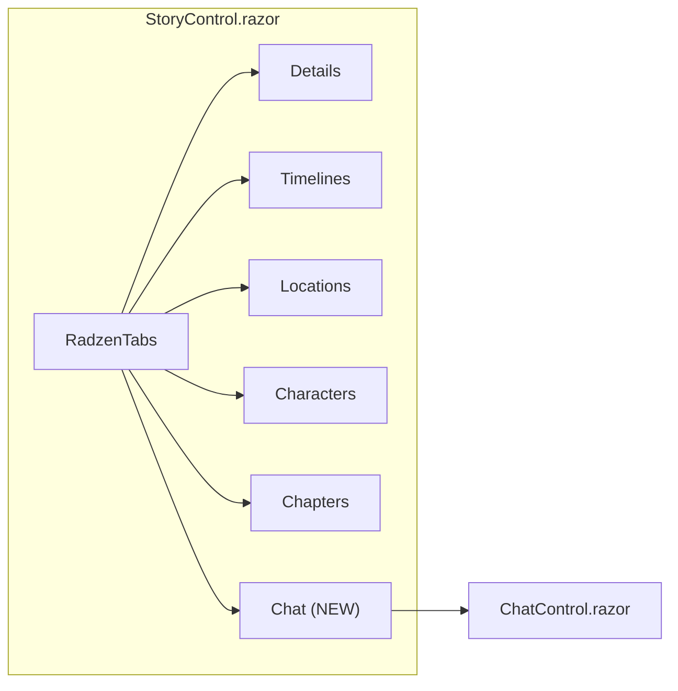
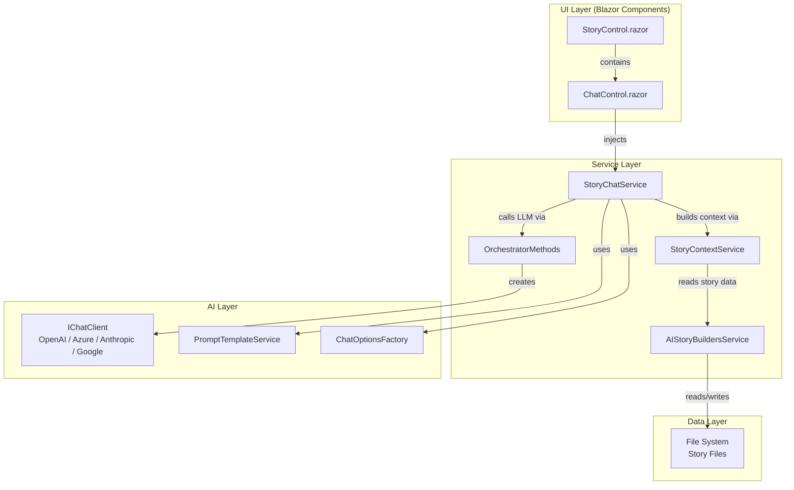
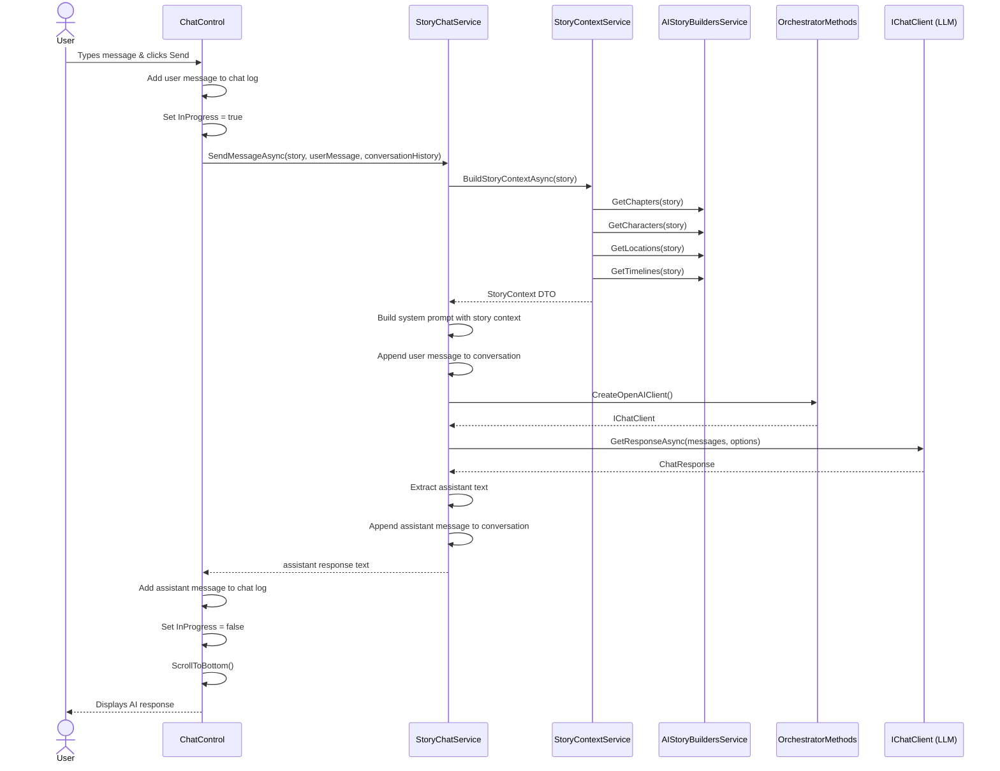
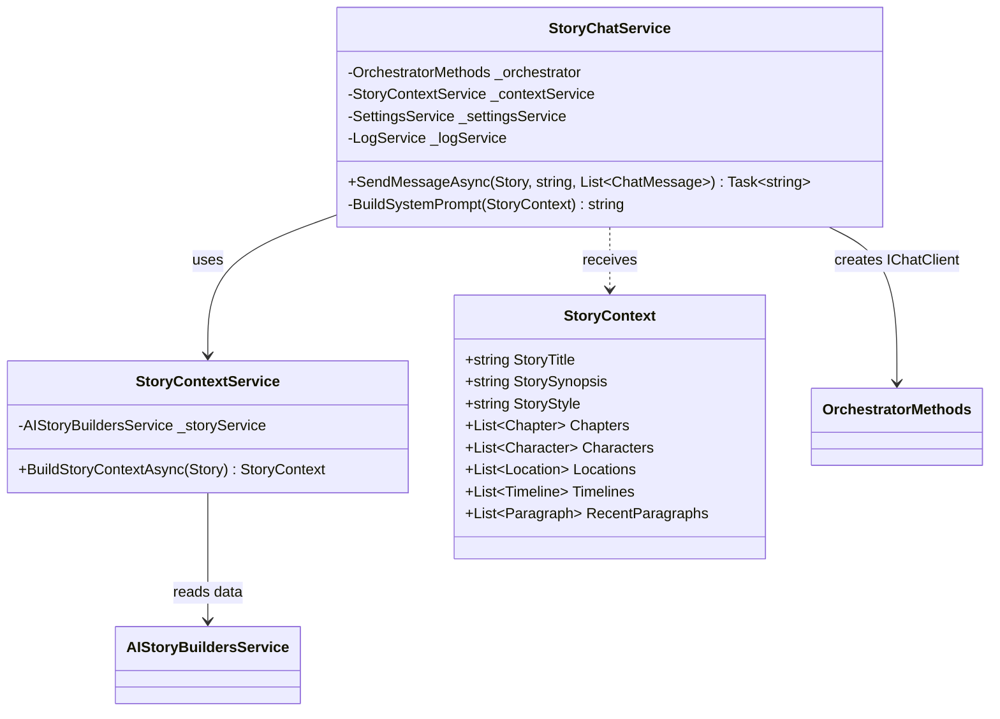
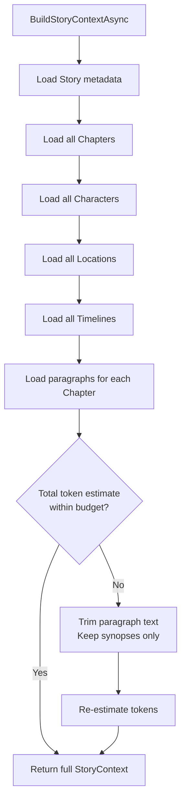
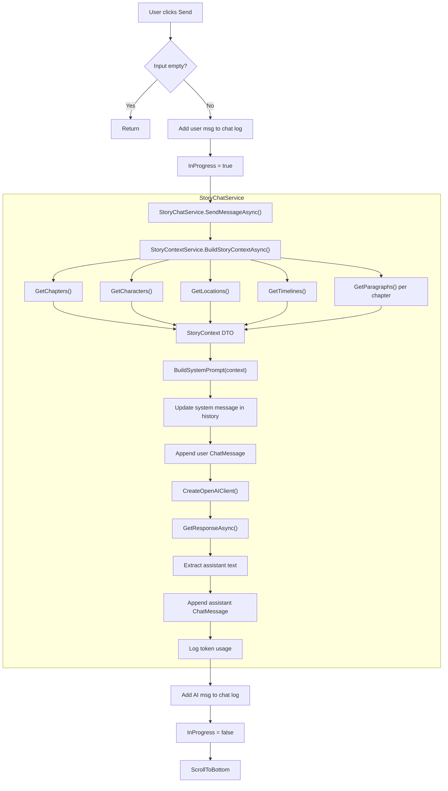
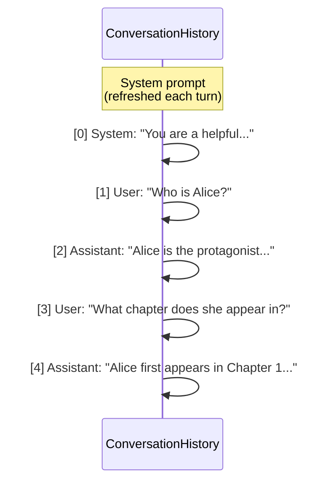
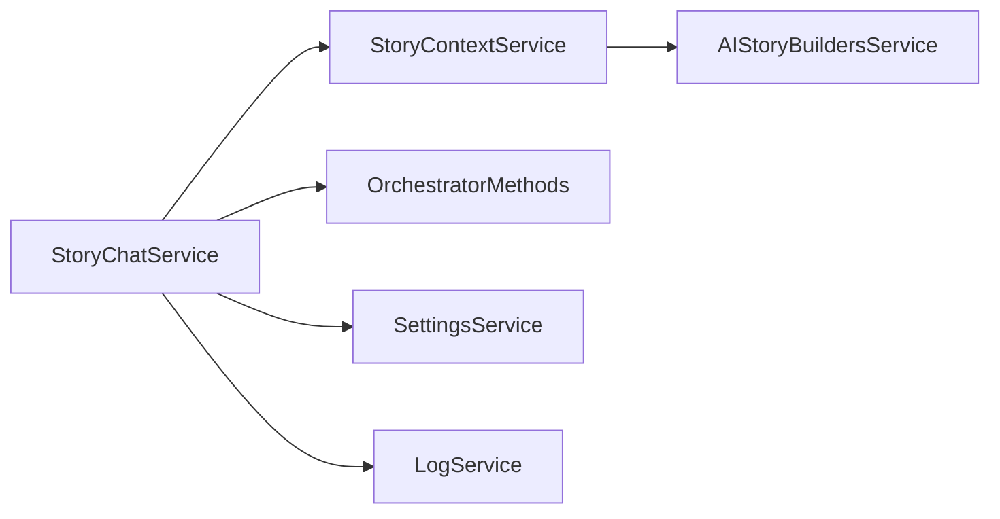

# AIStoryBuilders — Chat Tab Implementation Plan

> **Date:** 2026-04-14  
> **Status:** Draft  
> **Scope:** Features #1 – #2 (New Chat tab, story-aware chat functionality)  
> **Reference implementation:** `AIStoryBuildersGraph` — `Home.razor` UI and `StoryChatService` / `GraphQueryService` call chain

---

## Table of Contents

1. [Overview](#1-overview)
2. [Feature #1 — Add a "Chat" Tab to StoryControl](#2-feature-1--add-a-chat-tab-to-storycontrol)
3. [Feature #2 — Implement Story-Aware Chat Functionality](#3-feature-2--implement-story-aware-chat-functionality)
4. [System Architecture](#4-system-architecture)
5. [Detailed Component Design](#5-detailed-component-design)
6. [Chat Service — StoryChatService](#6-chat-service--storychatservice)
7. [Story Context Retrieval — StoryContextService](#7-story-context-retrieval--storycontextservice)
8. [Detailed Call Chain — Chat AI → StoryChatService → StoryContextService](#8-detailed-call-chain--chat-ai--storychatservice--storycontextservice)
9. [Prompt Engineering](#9-prompt-engineering)
10. [Data Model Changes](#10-data-model-changes)
11. [Dependency Injection Registration](#11-dependency-injection-registration)
12. [UI/UX Details](#12-uiux-details)
13. [Implementation Checklist](#13-implementation-checklist)

---

## 1. Overview

This plan adds a **Chat** tab to the story-editing dialog (alongside Details, Timelines, Locations, Characters, and Chapters) and implements a conversational AI assistant that is aware of the full story context — characters, locations, timelines, chapters, and paragraphs.

The chat allows an author to ask questions about their story, request suggestions, brainstorm plot points, and receive AI-generated advice grounded in the story's actual content. The design mirrors the architecture described in the `AIStoryBuildersGraph` project's `Home.razor` and its `StoryChatService` / `GraphQueryService` call chain, adapted to fit this project's .NET MAUI Blazor + Radzen UI framework.

---

## 2. Feature #1 — Add a "Chat" Tab to StoryControl

### 2.1 Current Tab Structure

The story editing dialog is rendered by `StoryControl.razor`, which uses a `RadzenTabs` component:

| Index | Tab Label   | Component              |
|-------|-------------|------------------------|
| 0     | Details     | `StoryEdit`            |
| 1     | Timelines   | `TimelinesControl`     |
| 2     | Locations   | `LocationsControl`     |
| 3     | Characters  | `CharactersEdit`       |
| 4     | Chapters    | `ChaptersControl`      |

### 2.2 Proposed Tab Structure

| Index | Tab Label   | Component              |
|-------|-------------|------------------------|
| 0     | Details     | `StoryEdit`            |
| 1     | Timelines   | `TimelinesControl`     |
| 2     | Locations   | `LocationsControl`     |
| 3     | Characters  | `CharactersEdit`       |
| 4     | Chapters    | `ChaptersControl`      |
| **5** | **Chat**    | **`ChatControl`**      |

### 2.3 Files to Modify

| File | Change |
|------|--------|
| `Components/Pages/Controls/Story/StoryControl.razor` | Add `<RadzenTabsItem Text="Chat">` with `<ChatControl>` component; update `OnTabChange` switch to handle index 5 |

### 2.4 Files to Create

| File | Purpose |
|------|---------|
| `Components/Pages/Controls/Chat/ChatControl.razor` | New Blazor component for the chat UI |

### 2.5 Tab Wiring Diagram



---

## 3. Feature #2 — Implement Story-Aware Chat Functionality

### 3.1 Functional Requirements

| ID | Requirement |
|----|-------------|
| F-01 | The user types a message in a text input and presses Send (or Enter) |
| F-02 | The system builds a context payload from the current story (characters, locations, timelines, chapters, paragraphs) |
| F-03 | The context payload and the user's message are sent to the configured LLM via the existing `OrchestratorMethods.CreateOpenAIClient()` pipeline |
| F-04 | The AI response is streamed (or returned in full) and displayed in a scrollable chat log |
| F-05 | The conversation history (system + user + assistant turns) is maintained for the session |
| F-06 | A "Clear Chat" button resets the conversation |
| F-07 | A progress indicator is shown while the AI is generating a response |
| F-08 | The chat uses the same AI provider/model configured in Settings (OpenAI, Azure OpenAI, Anthropic, Google AI) |

### 3.2 Non-Functional Requirements

| ID | Requirement |
|----|-------------|
| NF-01 | Conversation state is kept in-memory only (no file persistence) |
| NF-02 | Story context is gathered on-demand each time the Chat tab is activated, ensuring freshness |
| NF-03 | Token usage is logged via `LogService` |
| NF-04 | Errors are surfaced via `NotificationService` |

---

## 4. System Architecture

### 4.1 High-Level Component Diagram



### 4.2 Sequence Diagram — User Sends a Chat Message



---

## 5. Detailed Component Design

### 5.1 `ChatControl.razor` — UI Component

**Location:** `Components/Pages/Controls/Chat/ChatControl.razor`

#### Responsibilities

- Renders the chat message list (scrollable container)
- Provides a text input and Send button
- Provides a Clear Chat button
- Shows an indeterminate progress bar while waiting for AI
- Holds the in-memory `List<ChatMessageDisplay>` for the conversation log
- Delegates all AI interaction to `StoryChatService`

#### Razor Markup Structure

```
┌─────────────────────────────────────────┐
│  Chat Panel (RadzenPanel)               │
│ ┌─────────────────────────────────────┐ │
│ │  Message List (scrollable div)      │ │
│ │  ┌───────────────────────────────┐  │ │
│ │  │ [User]: How old is Alice?     │  │ │
│ │  │ [AI]: Based on Chapter 2...   │  │ │
│ │  │ [User]: What about Bob?       │  │ │
│ │  │ [AI]: Bob is introduced in... │  │ │
│ │  └───────────────────────────────┘  │ │
│ └─────────────────────────────────────┘ │
│  [Progress Bar — visible when loading]  │
│ ┌─────────────────────────────────────┐ │
│ │ [RadzenTextArea] [Send] [Clear]     │ │
│ └─────────────────────────────────────┘ │
└─────────────────────────────────────────┘
```

#### Component Parameters & Injected Services

| Member | Type | Source |
|--------|------|--------|
| `objStory` | `Story` | `[Parameter]` from `StoryControl` |
| `StoryChatService` | `StoryChatService` | `ScopedServices` via `OwningComponentBase` |
| `NotificationService` | `NotificationService` | `@inject` |
| `LogService` | `LogService` | `ScopedServices` |

#### State Fields

| Field | Type | Purpose |
|-------|------|---------|
| `chatMessages` | `List<ChatMessageDisplay>` | Rendered message log |
| `userInput` | `string` | Bound to the text input |
| `InProgress` | `bool` | Controls progress bar visibility |
| `conversationHistory` | `List<ChatMessage>` | Full M.E.AI `ChatMessage` history sent to the LLM |

#### Key Methods

| Method | Trigger | Description |
|--------|---------|-------------|
| `SendMessage()` | Send button click / Enter key | Validates input, calls `StoryChatService.SendMessageAsync`, updates UI |
| `ClearChat()` | Clear button click | Resets `chatMessages` and `conversationHistory` |
| `LoadChat(Story)` | Tab activation (called from `StoryControl.OnTabChange`) | Re-initialises context if story changed |
| `ScrollToBottom()` | After each message | JS interop or element reference to scroll the message container |

### 5.2 `ChatMessageDisplay` — UI Model

A simple display-only class for rendering messages in the chat log.

| Property | Type | Description |
|----------|------|-------------|
| `Role` | `string` | `"User"` or `"AI"` |
| `Content` | `string` | The message text |
| `Timestamp` | `DateTime` | When the message was created |

This class lives alongside the component or in the `Models/` folder.

---

## 6. Chat Service — StoryChatService

**Location:** `Services/StoryChatService.cs`

### 6.1 Responsibilities

- Orchestrates a single chat turn: context retrieval → prompt assembly → LLM call → response extraction
- Manages the `List<ChatMessage>` conversation (system + user + assistant messages)
- Ensures the system prompt is prepended with up-to-date story context on each call
- Delegates AI client creation to `OrchestratorMethods`
- Logs token usage and errors

### 6.2 Class Diagram



### 6.3 `SendMessageAsync` Flow

1. Call `StoryContextService.BuildStoryContextAsync(story)` to gather current story data.
2. Build a system prompt from the `StoryContext` using a template (see [§9](#9-prompt-engineering)).
3. If `conversationHistory` is empty, prepend the system message.
4. Otherwise, replace the first (system) message with a freshly built one to capture any story edits.
5. Append the new user `ChatMessage`.
6. Create an `IChatClient` via `OrchestratorMethods.CreateOpenAIClient()`.
7. Create `ChatOptions` via `ChatOptionsFactory` (plain text, no JSON mode).
8. Call `client.GetResponseAsync(conversationHistory, options)`.
9. Extract the assistant text from the response.
10. Append the assistant `ChatMessage` to `conversationHistory`.
11. Log token usage.
12. Return the assistant text.

---

## 7. Story Context Retrieval — StoryContextService

**Location:** `Services/StoryContextService.cs`

### 7.1 Responsibilities

- Gathers all story metadata and content into a single `StoryContext` DTO
- Acts as the equivalent of the `GraphQueryService` in `AIStoryBuildersGraph`, but queries the file-system-backed `AIStoryBuildersService` instead of a graph database

### 7.2 Data Gathering

| Data | Source Method | Notes |
|------|---------------|-------|
| Chapters | `AIStoryBuildersService.GetChapters(story)` | All chapters |
| Characters | `AIStoryBuildersService.GetCharacters(story)` | With backgrounds |
| Locations | `AIStoryBuildersService.GetLocations(story)` | With descriptions |
| Timelines | `AIStoryBuildersService.GetTimelines(story)` | All timelines |
| Paragraphs | `AIStoryBuildersService.GetParagraphs(chapter)` | Per-chapter, combined |

### 7.3 Token Budget Management

Full story context can exceed the model's context window. The service applies the following strategy:

1. **Always include:** Story title, synopsis, style, and theme/system message.
2. **Always include:** All character names, location names, and timeline names (compact form).
3. **Summarise:** Chapter synopses (not full paragraph text) for all chapters.
4. **Trim:** Include full paragraph text only for the most recent N paragraphs (configurable, default 20). Use `OrchestratorMethods.TrimToMaxWords` for individual paragraphs.
5. **Estimate tokens** using `TokenEstimator.EstimateTokens` before sending.



---

## 8. Detailed Call Chain — Chat AI → StoryChatService → StoryContextService

This section mirrors the detailed call-chain documentation from the `AIStoryBuildersGraph` architecture document, adapted for this codebase.

### 8.1 Entry Point: `ChatControl.SendMessage()`

```
ChatControl.SendMessage()
├── Validate userInput is not empty
├── Create ChatMessageDisplay("User", userInput)  → add to chatMessages
├── Set InProgress = true, StateHasChanged()
├── Call StoryChatService.SendMessageAsync(objStory, userInput, conversationHistory)
│   ├── StoryContextService.BuildStoryContextAsync(objStory)
│   │   ├── AIStoryBuildersService.GetChapters(objStory)
│   │   ├── AIStoryBuildersService.GetCharacters(objStory)
│   │   ├── AIStoryBuildersService.GetLocations(objStory)
│   │   ├── AIStoryBuildersService.GetTimelines(objStory)
│   │   ├── foreach chapter → AIStoryBuildersService.GetParagraphs(chapter)
│   │   └── return StoryContext
│   │
│   ├── BuildSystemPrompt(storyContext)
│   │   └── PromptTemplateService.HydratePlaceholders(Chat_System, values)
│   │
│   ├── Update conversationHistory[0] with fresh system prompt
│   ├── Append ChatMessage(User, userInput) to conversationHistory
│   │
│   ├── OrchestratorMethods.CreateOpenAIClient()
│   │   └── switch(SettingsService.AIType)
│   │       ├── "OpenAI"       → OpenAIClient → IChatClient
│   │       ├── "Azure OpenAI" → AzureOpenAIClient → IChatClient
│   │       ├── "Anthropic"    → AnthropicChatClient
│   │       └── "Google AI"    → GoogleAIChatClient
│   │
│   ├── ChatOptions (NO JSON mode — plain text response)
│   ├── client.GetResponseAsync(conversationHistory, options)
│   ├── Extract response.Text
│   ├── Append ChatMessage(Assistant, responseText) to conversationHistory
│   ├── LogService.WriteToLog(token usage)
│   └── return responseText
│
├── Create ChatMessageDisplay("AI", responseText)  → add to chatMessages
├── Set InProgress = false, StateHasChanged()
└── ScrollToBottom()
```

### 8.2 Full Call-Chain Diagram



---

## 9. Prompt Engineering

### 9.1 Chat System Prompt Template

Add to `PromptTemplateService.Templates`:

```
Chat_System =
    """
    You are a helpful story-writing assistant for the novel titled "{StoryTitle}".
    You have full knowledge of the story's content. Use ONLY the provided story
    information to answer questions. If the answer is not in the provided context,
    say so.

    <story_synopsis>{StorySynopsis}</story_synopsis>
    <story_style>{StoryStyle}</story_style>
    <system_directions>{SystemMessage}</system_directions>

    <characters>
    {CharacterSummary}
    </characters>

    <locations>
    {LocationSummary}
    </locations>

    <timelines>
    {TimelineSummary}
    </timelines>

    <chapters>
    {ChapterSummary}
    </chapters>

    <recent_paragraphs>
    {RecentParagraphs}
    </recent_paragraphs>

    Rules:
    - Answer based ONLY on the story information above.
    - Be concise but thorough.
    - If asked for creative suggestions, ground them in the existing story.
    - Use the story's writing style when generating sample prose.
    """;
```

### 9.2 Template Variable Mapping

| Placeholder | Source |
|-------------|--------|
| `{StoryTitle}` | `story.Title` |
| `{StorySynopsis}` | `story.Synopsis` |
| `{StoryStyle}` | `story.Style` |
| `{SystemMessage}` | `story.Theme` (the system directions field) |
| `{CharacterSummary}` | Serialised list of character names + key descriptions |
| `{LocationSummary}` | Serialised list of location names + descriptions |
| `{TimelineSummary}` | Serialised list of timeline names + descriptions |
| `{ChapterSummary}` | Chapter names + synopses |
| `{RecentParagraphs}` | Last N paragraphs (full text) |

### 9.3 Conversation Message Flow



The system prompt at index 0 is **replaced** on each turn to reflect the latest story state, while the rest of the conversation history is preserved.

---

## 10. Data Model Changes

### 10.1 New Classes

| Class | Namespace | Location | Purpose |
|-------|-----------|----------|---------|
| `ChatMessageDisplay` | `AIStoryBuilders.Models` | `Models/ChatMessageDisplay.cs` | UI display model for chat messages |
| `StoryContext` | `AIStoryBuilders.Models` | `Models/StoryContext.cs` | DTO holding aggregated story data for chat prompts |

### 10.2 `ChatMessageDisplay`

```
Properties:
  - Role       : string    ("User" | "AI")
  - Content    : string
  - Timestamp  : DateTime
```

### 10.3 `StoryContext`

```
Properties:
  - StoryTitle       : string
  - StorySynopsis    : string
  - StoryStyle       : string
  - SystemMessage    : string
  - Chapters         : List<Chapter>
  - Characters       : List<Character>
  - Locations        : List<Location>
  - Timelines        : List<Timeline>
  - RecentParagraphs : List<Paragraph>
```

### 10.4 Existing Models Used As-Is

| Model | Usage in Chat |
|-------|---------------|
| `Story` | Passed to ChatControl as parameter |
| `Conversation` | Not directly used (chat uses `List<ChatMessage>` from M.E.AI) |
| `Message` / `Role` | Not directly used (M.E.AI has its own `ChatMessage` / `ChatRole`) |

---

## 11. Dependency Injection Registration

### 11.1 Changes to `MauiProgram.cs`

Register the two new services as singletons (matching the existing service registration pattern):

```
builder.Services.AddSingleton<StoryChatService>();
builder.Services.AddSingleton<StoryContextService>();
```

### 11.2 Service Dependency Graph



### 11.3 Constructor Signatures

**StoryChatService:**
```
StoryChatService(
    StoryContextService contextService,
    OrchestratorMethods orchestrator,
    SettingsService settingsService,
    LogService logService)
```

**StoryContextService:**
```
StoryContextService(
    AIStoryBuildersService storyService)
```

---

## 12. UI/UX Details

### 12.1 Message Styling

| Element | Style |
|---------|-------|
| User messages | Right-aligned, light blue background (`#e3f2fd`), rounded corners |
| AI messages | Left-aligned, light grey background (`#f5f5f5`), rounded corners |
| Timestamps | Small muted text below each message |
| Message container | `height: 400px; overflow-y: auto;` — scrollable |

### 12.2 Input Area

| Element | Detail |
|---------|--------|
| Text input | `RadzenTextArea` with `Rows="3"`, placeholder "Ask about your story..." |
| Send button | `RadzenButton` with `Icon="send"`, `ButtonStyle.Primary` |
| Clear button | `RadzenButton` with `Icon="delete_sweep"`, `ButtonStyle.Light` |
| Enter key | Submits message (via `@onkeydown` handler checking for Enter without Shift) |

### 12.3 Progress Indicator

While `InProgress == true`, display a `RadzenProgressBar` in indeterminate mode, identical to the pattern used on `Index.razor`:

```
<RadzenProgressBar Value="100" ShowValue="false" Mode="ProgressBarMode.Indeterminate" />
```

### 12.4 Wireframe

```
┌──────────────────────────────────────────────────────┐
│ Details │ Timelines │ Locations │ Characters │ Chapters │ Chat │
├──────────────────────────────────────────────────────┤
│                                                      │
│  ┌────────────────────────────────────────────────┐  │
│  │                                        [User]  │  │
│  │  Tell me about Alice's backstory        14:32  │  │
│  │                                                │  │
│  │  [AI]                                          │  │
│  │  Alice is the protagonist introduced in        │  │
│  │  Chapter 1. Her background includes...  14:33  │  │
│  │                                                │  │
│  │                                        [User]  │  │
│  │  What conflicts does she face?          14:34  │  │
│  │                                                │  │
│  │  [AI]                                          │  │
│  │  In Chapter 3, Alice encounters...      14:34  │  │
│  │                                                │  │
│  └────────────────────────────────────────────────┘  │
│                                                      │
│  ▓▓▓▓▓▓▓▓▓▓▓▓ (progress bar, if loading) ▓▓▓▓▓▓▓▓  │
│                                                      │
│  ┌──────────────────────────────────┐ [Send] [Clear] │
│  │ Ask about your story...          │                │
│  │                                  │                │
│  └──────────────────────────────────┘                │
└──────────────────────────────────────────────────────┘
```

---

## 13. Implementation Checklist

### Phase 1 — Models & Services (backend)

- [ ] Create `Models/ChatMessageDisplay.cs`
- [ ] Create `Models/StoryContext.cs`
- [ ] Create `Services/StoryContextService.cs` with `BuildStoryContextAsync(Story)`
- [ ] Create `Services/StoryChatService.cs` with `SendMessageAsync(Story, string, List<ChatMessage>)`
- [ ] Add `Chat_System` template to `AI/PromptTemplateService.cs`
- [ ] Register `StoryChatService` and `StoryContextService` in `MauiProgram.cs`

### Phase 2 — UI Component (frontend)

- [ ] Create directory `Components/Pages/Controls/Chat/`
- [ ] Create `Components/Pages/Controls/Chat/ChatControl.razor` with full markup and code-behind
- [ ] Add `<RadzenTabsItem Text="Chat">` to `StoryControl.razor`
- [ ] Add `ChatControl` reference and `OnTabChange` case 5 handler in `StoryControl.razor`
- [ ] Add `@using AIStoryBuilders.Components.Pages.Controls.Chat` to `StoryControl.razor`

### Phase 3 — Testing & Polish

- [ ] Verify chat works with OpenAI provider
- [ ] Verify chat works with Azure OpenAI provider
- [ ] Verify chat works with Anthropic provider
- [ ] Verify chat works with Google AI provider
- [ ] Verify conversation context is maintained across multiple turns
- [ ] Verify Clear Chat resets properly
- [ ] Verify tab switching preserves/reinitialises chat state correctly
- [ ] Verify token budget trimming for large stories
- [ ] Review error handling for API failures
- [ ] Review UI scrolling and layout on different dialog sizes
