# AIStoryBuilders — Chat Tab Implementation Plan

> **Date:** 2026-04-14  
> **Status:** Draft  
> **Scope:** Features #1 – #2 (New Chat tab, story-aware chat functionality)  
> **Reference implementation:** `AIStoryBuildersGraph` — `Home.razor` UI and `StoryChatService` / `GraphQueryService` call chain  
> **Architecture reference:** `AIStoryBuildersGraph/docs/knowledge-graph-and-chat-architecture.md`

---

## Table of Contents

1. [Overview](#1-overview)
2. [Knowledge Graph — End-to-End Process](#2-knowledge-graph--end-to-end-process)
3. [Feature #1 — Add a "Chat" Tab to StoryControl](#3-feature-1--add-a-chat-tab-to-storycontrol)
4. [Feature #2 — Implement Story-Aware Chat Functionality](#4-feature-2--implement-story-aware-chat-functionality)
5. [System Architecture](#5-system-architecture)
6. [Detailed Component Design](#6-detailed-component-design)
7. [Graph Construction — GraphBuilder](#7-graph-construction--graphbuilder)
8. [Graph State Management — GraphState](#8-graph-state-management--graphstate)
9. [Graph Query Service — GraphQueryService](#9-graph-query-service--graphqueryservice)
10. [Graph Mutation Service — GraphMutationService](#10-graph-mutation-service--graphmutationservice)
11. [Chat Service — StoryChatService](#11-chat-service--storychatservice)
12. [AI Provider Layer](#12-ai-provider-layer)
13. [Detailed Call Chain — Chat AI → StoryChatService → GraphQueryService / GraphMutationService](#13-detailed-call-chain--chat-ai--storychatservice--graphqueryservice--graphmutationservice)
14. [Prompt Engineering](#14-prompt-engineering)
15. [Data Model Changes](#15-data-model-changes)
16. [Dependency Injection Registration](#16-dependency-injection-registration)
17. [UI/UX Details](#17-uiux-details)
18. [Implementation Checklist](#18-implementation-checklist)

---

## 1. Overview

This plan adds a **Chat** tab to the story-editing dialog (alongside Details, Timelines, Locations, Characters, and Chapters) and implements a conversational AI assistant that is aware of the full story context — characters, locations, timelines, chapters, and paragraphs.

The chat allows an author to ask questions about their story, request suggestions, brainstorm plot points, and receive AI-generated advice grounded in the story's actual content. **The chat also allows the author to make changes to the story** — adding, updating, renaming, or removing characters, locations, timelines, chapters, and paragraphs — with all changes persisted to the `.stybld` file structure including embedding regeneration. The implementation follows the architecture in `AIStoryBuildersGraph`, which:

1. **Imports a manuscript** (`.docx`, `.pdf`, `.txt`, `.md`) through a multi-stage LLM pipeline to produce a structured `Story` model.
2. **Builds a knowledge graph** (`StoryGraph`) of nodes (characters, locations, timelines, chapters, paragraphs) and labelled edges (APPEARS_IN, MENTIONED_IN, INTERACTS_WITH, SEEN_AT, SETTING_OF, COVERS, ACTIVE_ON, CONTAINS).
3. **Exposes 15 read query tools** via `GraphQueryService` that the LLM can invoke dynamically during the chat conversation.
4. **Exposes 20 write mutation tools** via `GraphMutationService` that the LLM can invoke to modify story data, with a preview→confirm flow for safety.
5. **Runs a tool-calling chat loop** in `StoryChatService` where the LLM can call graph query and mutation tools, receive JSON results, and synthesise answers grounded in actual story data.

This design replaces the earlier `StoryContextService` approach (which stuffed all story data into the system prompt) with a **tool-calling architecture** where the LLM queries and modifies the knowledge graph on demand.

---

## 2. Knowledge Graph — End-to-End Process

This section describes the complete pipeline from raw manuscript to interactive chat, as implemented in `AIStoryBuildersGraph`.

### 2.1 High-Level Pipeline

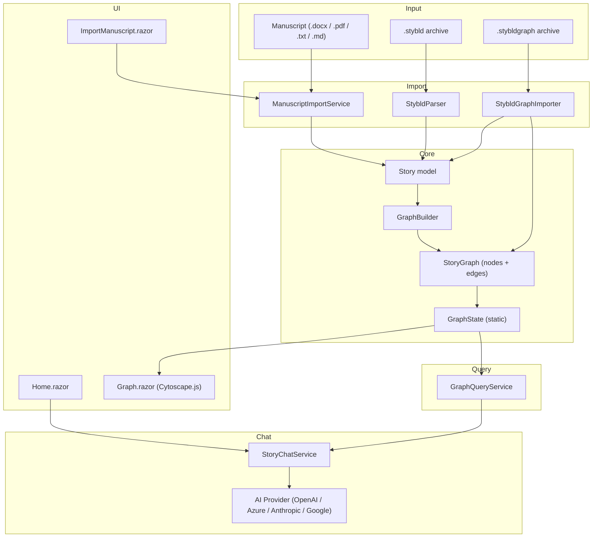

### 2.2 Manuscript Import Pipeline (ManuscriptImportService)

The import pipeline turns a raw manuscript file into a fully annotated `Story` object through five LLM-powered stages plus an optional pronoun resolution pass.

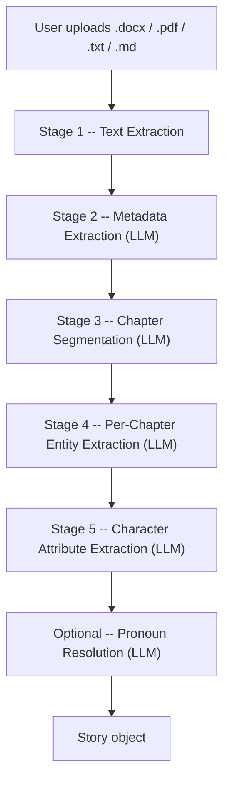

**Stage 1 — Text Extraction:**

| Format | Library | Method |
|--------|---------|--------|
| `.docx` | DocumentFormat.OpenXml | Extract paragraph text |
| `.pdf` | UglyToad.PdfPig | Extract page text |
| `.txt` / `.md` | StreamReader | Read entire content |

Text is sanitised via `TextSanitiser.Sanitise()` to strip invisible Unicode, normalise whitespace, and remove control characters.

**Stage 2 — Metadata Extraction (LLM Pass 1):**
- Input: First 8,000 characters. Temperature: 0.1.
- Extracts: `title`, `genre`, `theme`, `synopsis`, `logline` as JSON.

**Stage 3 — Chapter Segmentation (LLM Pass 2):**
- Input: Full manuscript text (up to 50,000 characters).
- Output: JSON array of `{ title, startIndex, endIndex }`.
- Fallback: Entire text treated as one chapter if segmentation fails.

**Stage 4 — Per-Chapter Entity Extraction (LLM Pass 3, per chapter):**
- Strips chapter headings, splits text on blank lines into paragraphs.
- Paragraphs exceeding 500 words are split at sentence boundaries (~250 words per chunk).
- LLM returns: `beatsSummary`, `characters`, `locations`, `timelines`, and per-paragraph `annotations` (index, location, timeline, characters list).

**Stage 5 — Character Attribute Extraction (LLM Pass 4, per chapter):**
- Extracts per-character: Appearance, Goals, History, Aliases, Facts.
- Stored as `CharacterBackground` entries.

**Optional — Pronoun Resolution (PronounResolver):**
- Splits chapters into 20-paragraph chunks with 3-paragraph overlap.
- LLM resolves pronouns (he, she, they, I) to actual character names.
- Merged into `Paragraph.Characters` (deduplicated).
- On invalid JSON, retries once then skips with a warning.

### 2.3 Story Data Model

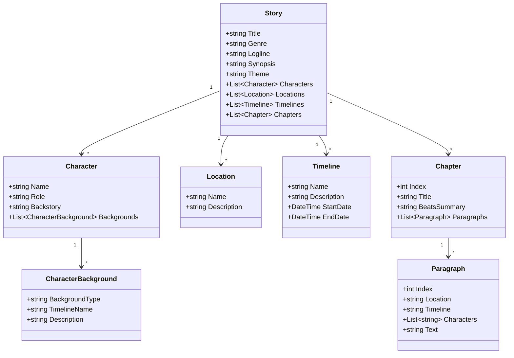

Each `Paragraph` is annotated with the location, timeline, and character names that appear in it. These annotations are consumed by the graph builder to create edges.

### 2.4 Graph Data Model

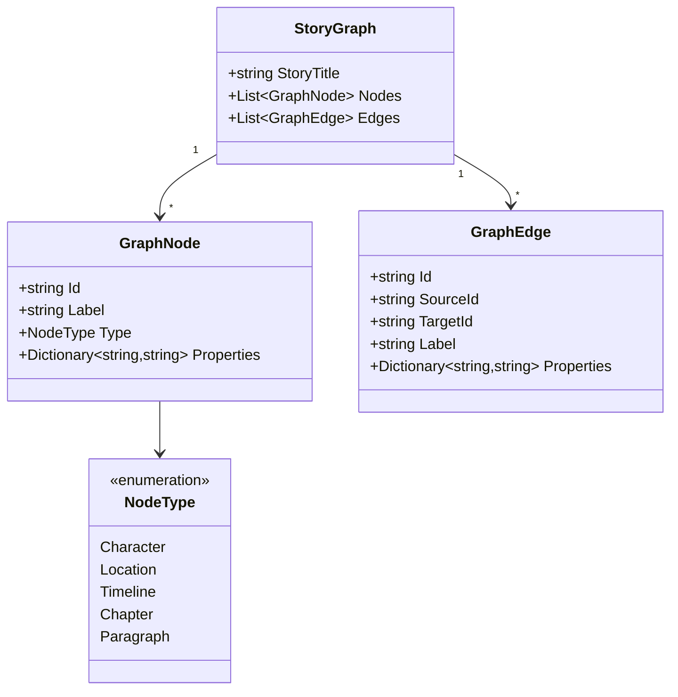

**Node ID format:** `{type}:{normalised-name-lowercase}` — e.g., `character:alice`, `paragraph:chapter 1:p3`

**Edge ID format:** `{sourceId}--{label}--{targetId}` — e.g., `character:alice--APPEARS_IN--chapter:chapter 1`

### 2.5 Chat Models

```csharp
public class ConversationSession
{
    public string Id         { get; set; } = string.Empty;
    public DateTime CreatedAt { get; set; }
    public List<ChatMessage> Messages { get; set; } = new();
}

public class ChatDisplayMessage
{
    public bool IsUser    { get; set; }
    public string Content { get; set; } = "";
}
```

- `ConversationSession` stores the full multi-turn history sent to the LLM on every request.
- `ChatDisplayMessage` is the UI-facing display model.

---

## 3. Feature #1 — Add a "Chat" Tab to StoryControl

### 3.1 Current Tab Structure

The story editing dialog is rendered by `StoryControl.razor`, which uses a `RadzenTabs` component:

| Index | Tab Label   | Component              |
|-------|-------------|------------------------|
| 0     | Details     | `StoryEdit`            |
| 1     | Timelines   | `TimelinesControl`     |
| 2     | Locations   | `LocationsControl`     |
| 3     | Characters  | `CharactersEdit`       |
| 4     | Chapters    | `ChaptersControl`      |

### 3.2 Proposed Tab Structure

| Index | Tab Label   | Component              |
|-------|-------------|------------------------|
| 0     | Details     | `StoryEdit`            |
| 1     | Timelines   | `TimelinesControl`     |
| 2     | Locations   | `LocationsControl`     |
| 3     | Characters  | `CharactersEdit`       |
| 4     | Chapters    | `ChaptersControl`      |
| **5** | **Chat**    | **`ChatControl`**      |

### 3.3 Files to Modify

| File | Change |
|------|--------|
| `Components/Pages/Controls/Story/StoryControl.razor` | Add `<RadzenTabsItem Text="Chat">` with `<ChatControl>` component; update `OnTabChange` switch to handle index 5 |

### 3.4 Files to Create

| File | Purpose |
|------|---------|
| `Components/Pages/Controls/Chat/ChatControl.razor` | New Blazor component for the chat UI |

### 3.5 Tab Wiring Diagram

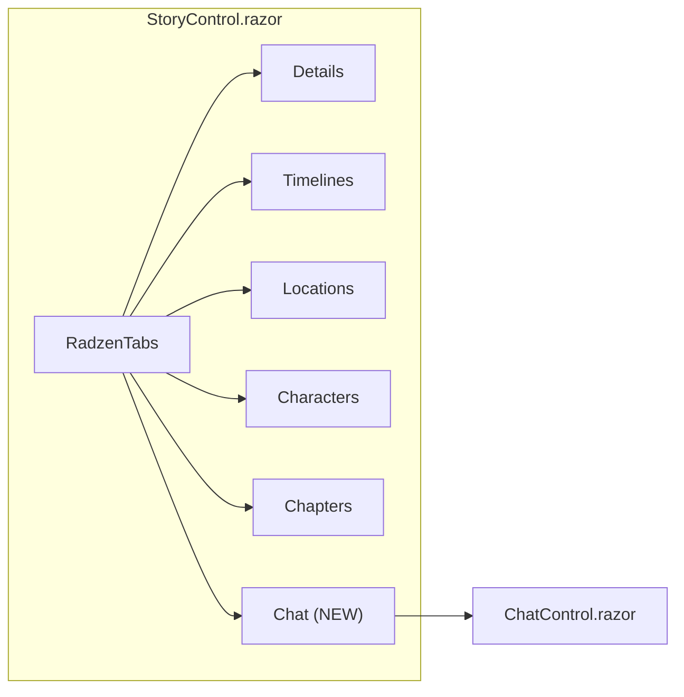

---

## 4. Feature #2 — Implement Story-Aware Chat Functionality

### 4.1 Functional Requirements

| ID | Requirement |
|----|-------------|
| F-01 | The user types a message in a text input and presses Send (or Ctrl+Enter) |
| F-02 | The system builds a knowledge graph from the current story (characters, locations, timelines, chapters, paragraphs) with labelled edges representing relationships |
| F-03 | The LLM receives 15 graph query tools and autonomously invokes them to retrieve specific story data on demand (tool-calling loop, max 10 rounds) |
| F-04 | The AI response is streamed via `IAsyncEnumerable<string>` and displayed incrementally in a scrollable chat log |
| F-05 | The conversation history (system + user + assistant + tool turns) is maintained in a `ConversationSession` keyed by session ID |
| F-06 | A "Clear Chat" button resets the conversation session |
| F-07 | A streaming "Thinking..." indicator is shown while the AI is generating a response |
| F-08 | The chat uses the same AI provider/model configured in Settings (OpenAI, Azure OpenAI, Anthropic, Google AI) |
| F-09 | AI responses are rendered as Markdown (via Markdig) supporting tables, code blocks, and task lists |

### 4.2 Non-Functional Requirements

| ID | Requirement |
|----|-------------|
| NF-01 | Conversation state is kept in-memory only via `ConcurrentDictionary<string, ConversationSession>` (no file persistence) |
| NF-02 | The knowledge graph is built from the current `Story` and stored in `GraphState` (static holder) |
| NF-03 | Only the last 20 messages from the session are sent with each request (message history windowing) |
| NF-04 | Errors are surfaced inline in the chat log as error messages |
| NF-05 | Tool-call loop is capped at 10 rounds to prevent infinite loops |
| NF-06 | LLM operation timeout is 10 minutes |

---

## 5. System Architecture

### 5.1 High-Level Component Diagram

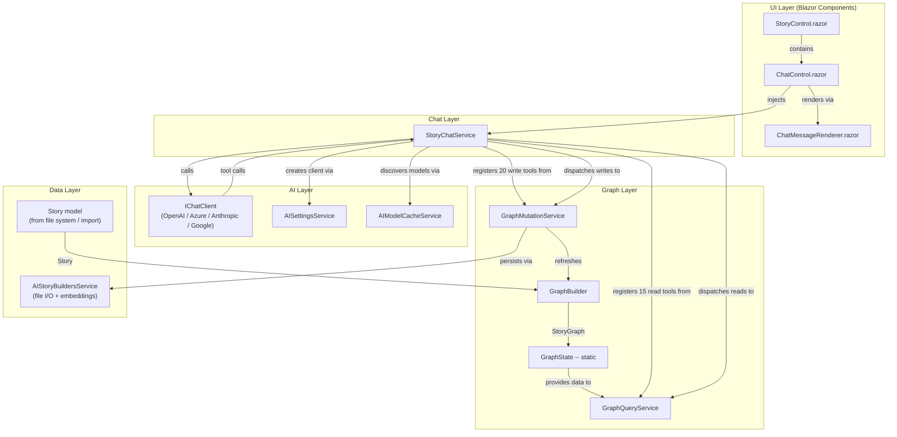

### 5.2 Sequence Diagram — User Sends a Chat Message (with Tool Calls)

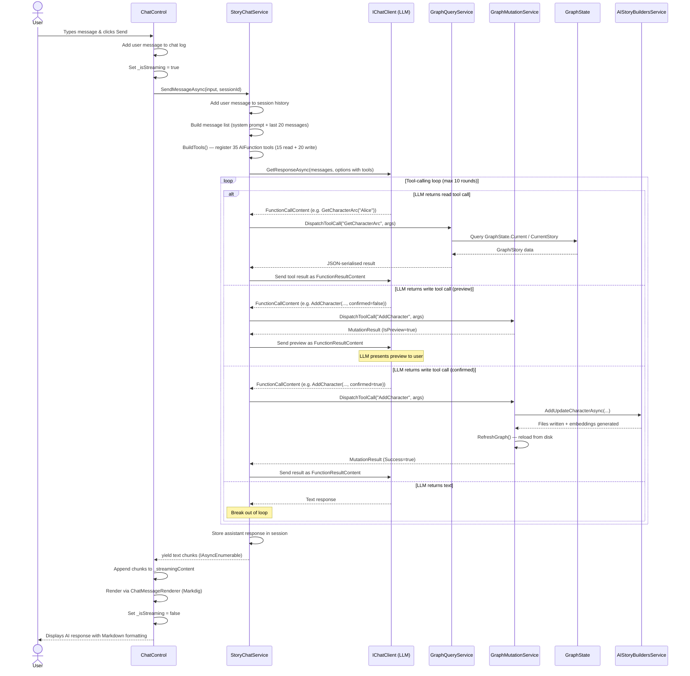

---

## 6. Detailed Component Design

### 6.1 `ChatControl.razor` — UI Component

**Location:** `Components/Pages/Controls/Chat/ChatControl.razor`

**Reference implementation:** `AIStoryBuildersGraph/Components/Pages/Home.razor` (chat section)

#### Responsibilities

- Renders the chat message list (scrollable container)
- Provides a text input (`<textarea>`) and Send button
- Provides a Clear Chat button and a Configure AI (⚙️) button
- Shows a streaming "Thinking..." indicator while the AI is generating
- Renders AI responses as Markdown via `ChatMessageRenderer` (Markdig)
- Holds the in-memory `List<ChatDisplayMessage>` for the conversation log
- Delegates all AI interaction to `StoryChatService`

#### Implemented Chat UI (from Home.razor)

```html
<div class="card mt-4">
    <div class="card-header d-flex align-items-center justify-content-between">
        <span class="fw-bold">Story Chat Assistant</span>
        <div>
            <button class="btn btn-sm btn-outline-secondary me-1"
                    @onclick="ShowSettings" title="Configure AI">⚙️</button>
            <button class="btn btn-sm btn-outline-secondary"
                    @onclick="ClearChat" title="Clear conversation">🔄</button>
        </div>
    </div>
    <div class="card-body d-flex flex-column" style="height:400px;">
        <div class="flex-grow-1 overflow-auto mb-2" id="homeChatMessages">
            <!-- Empty state -->
            @if (_messages.Count == 0)
            {
                <div class="text-muted text-center mt-5">
                    <p>No messages yet. Ask a question about your story!</p>
                    <p class="small">Examples: "Are there any orphaned characters?",
                       "Tell me about the main characters"</p>
                </div>
            }
            <!-- Message list -->
            @foreach (var msg in _messages)
            {
                <div class="mb-3 d-flex @(msg.IsUser ? "justify-content-end" : "justify-content-start")">
                    <div class="p-2 rounded-3 @(msg.IsUser ? "bg-primary text-white" : "bg-light border")"
                         style="max-width: 80%; word-wrap: break-word;">
                        <small class="d-block fw-bold mb-1">@(msg.IsUser ? "You" : "AI")</small>
                        @if (msg.IsUser)
                        {
                            <span style="white-space: pre-wrap;">@msg.Content</span>
                        }
                        else
                        {
                            <ChatMessageRenderer Content="@msg.Content" />
                        }
                    </div>
                </div>
            }
            <!-- Streaming indicator -->
            @if (_isStreaming)
            {
                <div class="mb-3 d-flex justify-content-start">
                    <div class="p-2 rounded-3 bg-light border"
                         style="max-width: 80%; word-wrap: break-word;">
                        <small class="d-block fw-bold mb-1">AI</small>
                        @if (string.IsNullOrEmpty(_streamingContent))
                        {
                            <span class="text-muted">Thinking...</span>
                        }
                        else
                        {
                            <ChatMessageRenderer Content="@_streamingContent" />
                        }
                    </div>
                </div>
            }
        </div>
        <div class="input-group">
            <textarea class="form-control" rows="2"
                      placeholder="Ask about your story..."
                      @bind="_userInput" @bind:event="oninput"
                      @onkeydown="HandleKeyDown"
                      disabled="@_isStreaming"></textarea>
            <button class="btn btn-primary" @onclick="SendMessage"
                    disabled="@(_isStreaming || string.IsNullOrWhiteSpace(_userInput))">
                Send
            </button>
        </div>
    </div>
</div>
```

#### State Fields (from Home.razor)

| Field | Type | Purpose |
|-------|------|---------|
| `_messages` | `List<ChatDisplayMessage>` | Rendered message log |
| `_userInput` | `string` | Bound to the textarea input |
| `_isStreaming` | `bool` | Controls streaming indicator visibility & input disable |
| `_streamingContent` | `string` | Accumulated streaming response text |
| `_sessionId` | `string` | `Guid.NewGuid().ToString()` — unique per component instance |

#### Key Methods (implemented in Home.razor @code block)

```csharp
private async Task SendMessage()
{
    if (string.IsNullOrWhiteSpace(_userInput) || _isStreaming) return;

    var input = _userInput.Trim();
    _userInput = "";
    _messages.Add(new ChatDisplayMessage { IsUser = true, Content = input });
    _isStreaming = true;
    _streamingContent = "";
    StateHasChanged();

    try
    {
        await foreach (var chunk in ChatService.SendMessageAsync(input, _sessionId))
        {
            _streamingContent += chunk;
            StateHasChanged();
        }
        _messages.Add(new ChatDisplayMessage { IsUser = false, Content = _streamingContent });
    }
    catch (Exception ex)
    {
        _messages.Add(new ChatDisplayMessage { IsUser = false, Content = $"❌ Error: {ex.Message}" });
    }
    finally
    {
        _isStreaming = false;
        _streamingContent = "";
        StateHasChanged();
    }
}

private async Task HandleKeyDown(KeyboardEventArgs e)
{
    // Ctrl+Enter or Enter (without Shift) sends; Shift+Enter inserts newline
    if (e.Key == "Enter" && !e.ShiftKey)
    {
        await SendMessage();
    }
}

private void ClearChat()
{
    _messages.Clear();
    ChatService.ClearSession(_sessionId);
}
```

### 6.2 `ChatMessageRenderer.razor` — Markdown Rendering

Renders AI response text as HTML using the Markdig library with advanced extensions (tables, strikethrough, task lists, etc.):

```razor
@using Markdig

<div class="chat-markdown">
    @((MarkupString)RenderedHtml)
</div>

@code {
    private static readonly MarkdownPipeline Pipeline = new MarkdownPipelineBuilder()
        .UseAdvancedExtensions()
        .Build();

    [Parameter, EditorRequired]
    public string Content { get; set; } = "";

    private string RenderedHtml =>
        string.IsNullOrEmpty(Content)
            ? ""
            : Markdown.ToHtml(Content, Pipeline);
}
```

### 6.3 `ChatDisplayMessage` — UI Model

A simple display-only class (defined as a private nested class in Home.razor):

```csharp
private class ChatDisplayMessage
{
    public bool IsUser { get; set; }
    public string Content { get; set; } = "";
}
```

---

## 7. Graph Construction — GraphBuilder

**Source:** `AIStoryBuildersGraph/Services/GraphBuilder.cs`

`GraphBuilder.Build(Story)` transforms a `Story` into a `StoryGraph` through two phases.

### 7.1 Phase 1: Node Creation

Nodes are created for every entity. A `Dictionary<string, GraphNode>` with case-insensitive keys prevents duplicates.

| Node Type | ID Pattern | Properties Stored |
|---|---|---|
| Character | `character:{name}` | `role`, `backstory` |
| Location | `location:{name}` | `description` |
| Timeline | `timeline:{name}` | `description`, `startDate`, `endDate` |
| Chapter | `chapter:{title}` | `index`, `beatsSummary` |
| Paragraph | `paragraph:{chapter}:p{index}` | `text`, `location`, `timeline` |

### 7.2 Phase 2: Edge Creation

A `HashSet<string>` of edge IDs prevents duplicate edges.

| Edge Label | Source Node | Target Node | Created When |
|---|---|---|---|
| `CONTAINS` | Chapter | Paragraph | For every paragraph in the chapter |
| `APPEARS_IN` | Character | Chapter | Character mentioned in any paragraph of the chapter |
| `MENTIONED_IN` | Character | Paragraph | Character listed in `Paragraph.Characters` |
| `SEEN_AT` | Character | Location | Character appears in a paragraph at that location |
| `INTERACTS_WITH` | Character | Character | Two or more characters appear in the same paragraph (sorted IDs for determinism) |
| `SETTING_OF` | Location | Chapter | Location appears in any paragraph of the chapter |
| `COVERS` | Timeline | Chapter | Timeline mentioned in any paragraph of the chapter |
| `ACTIVE_ON` | Character | Timeline | Character has a `CharacterBackground` for that timeline |

### 7.3 Character Name Resolution (Fuzzy Matching)

When matching character names from paragraph annotations, the builder applies three strategies:

1. **Exact match** (case-insensitive).
2. **Contains match** — the annotation contains a known name, or vice versa (handles "Dr. Smith" matching "Smith").
3. **Levenshtein distance ≤ 2** — handles typos.

```csharp
private static string ResolveCharacterName(string name, List<string> knownNames)
{
    // 1. Exact case-insensitive match
    var exact = knownNames.FirstOrDefault(k =>
        k.Equals(name, StringComparison.OrdinalIgnoreCase));
    if (exact is not null) return exact;

    // 2. Contains match
    var contains = knownNames.FirstOrDefault(k =>
        name.Contains(k, StringComparison.OrdinalIgnoreCase) ||
        k.Contains(name, StringComparison.OrdinalIgnoreCase));
    if (contains is not null) return contains;

    // 3. Levenshtein distance <= 2
    var closest = knownNames
        .Select(k => (Name: k, Distance: LevenshteinDistance(
            name.ToLowerInvariant(), k.ToLowerInvariant())))
        .Where(x => x.Distance <= 2)
        .OrderBy(x => x.Distance)
        .FirstOrDefault();
    if (closest.Name is not null) return closest.Name;

    return name;
}
```

### 7.4 Entity Validation

All entity references are validated before node/edge creation:
- Reject `null`, empty string, or whitespace-only values.
- Reject the literal value `"Unknown"`.
- Normalise by collapsing whitespace, underscores, and hyphens.

### 7.5 Complete Graph Build Flow

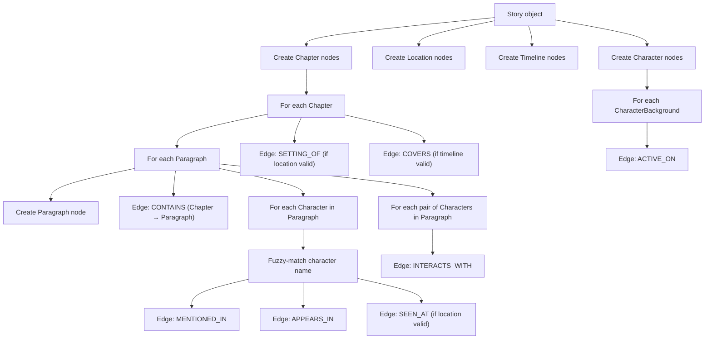

---

## 8. Graph State Management — GraphState

**Source:** `AIStoryBuildersGraph/GraphState.cs`

```csharp
public static class GraphState
{
    public static StoryGraph? Current      { get; set; }
    public static Story?      CurrentStory { get; set; }
}
```

**Populated by:**
- `GraphBuilder.Build(story)` — sets both `Current` and `CurrentStory`.
- `StybldGraphImporter.ImportAsync()` — sets `Current` and uses `ReconstructStory()` to set `CurrentStory`.

**Consumed by:**
- `GraphQueryService` (all query methods).
- `StoryChatService` (checks for null before chat).
- `Graph.razor` (visualisation).

> **Note:** This is a static holder shared across all connections. The current design assumes a single-user scenario. Multi-user deployment would require replacing it with a scoped or keyed service.

---

## 9. Graph Query Service — GraphQueryService

**Source:** `AIStoryBuildersGraph/Services/GraphQueryService.cs`

Provides a read-only query API over `GraphState`. Every method uses LINQ to traverse the in-memory graph and story objects. These methods are exposed as **tools** to the chat service LLM via `AIFunctionFactory`.

### 9.1 Interface

```csharp
public interface IGraphQueryService
{
    List<CharacterDto> GetCharacters();
    List<LocationDto> GetLocations();
    List<TimelineDto> GetTimelines();
    List<ChapterDto> GetChapters();
    ParagraphDto? GetParagraph(string chapterTitle, int paragraphIndex);
    List<RelationshipDto> GetCharacterRelationships(string characterName);
    List<AppearanceDto> GetCharacterAppearances(string characterName);
    List<CharacterDto> GetChapterCharacters(string chapterTitle);
    List<LocationUsageDto> GetLocationUsage(string locationName);
    List<InteractionDto> GetCharacterInteractions(string characterName);
    List<string> GetTimelineChapters(string timelineName);
    List<OrphanDto> GetOrphanedNodes();
    List<ArcStepDto> GetCharacterArc(string characterName);
    List<LocationEventDto> GetLocationTimeline(string locationName);
    GraphSummaryDto GetGraphSummary();
}
```

### 9.2 Available Queries (15 Tools)

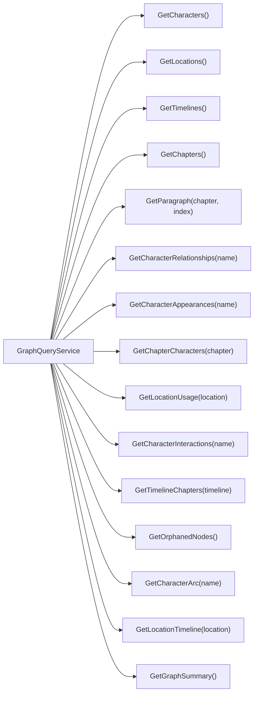

| Method | Returns | Description |
|---|---|---|
| `GetCharacters()` | `List<CharacterDto>` | All character names, roles, and backstories |
| `GetLocations()` | `List<LocationDto>` | All location names and descriptions |
| `GetTimelines()` | `List<TimelineDto>` | All timeline names with date ranges |
| `GetChapters()` | `List<ChapterDto>` | All chapters with title, beats summary, and paragraph count (no full text) |
| `GetParagraph(chapter, index)` | `ParagraphDto` | A single paragraph with full text, location, timeline, and characters |
| `GetCharacterRelationships(name)` | `List<RelationshipDto>` | All graph edges to/from a character node |
| `GetCharacterAppearances(name)` | `List<AppearanceDto>` | Chapters and paragraphs where a character appears |
| `GetChapterCharacters(chapter)` | `List<CharacterDto>` | All characters that appear in a chapter |
| `GetLocationUsage(location)` | `List<LocationUsageDto>` | Chapters where a location is used plus which characters are there |
| `GetCharacterInteractions(name)` | `List<InteractionDto>` | Co-appearing characters and the chapters of their interactions |
| `GetTimelineChapters(timeline)` | `List<string>` | Chapter titles that cover a timeline |
| `GetOrphanedNodes()` | `List<OrphanDto>` | Nodes with no edges (disconnected entities) |
| `GetCharacterArc(name)` | `List<ArcStepDto>` | Chronological journey: chapter, locations, timelines, co-characters |
| `GetLocationTimeline(location)` | `List<LocationEventDto>` | Sequence of events at a location over time |
| `GetGraphSummary()` | `GraphSummaryDto` | Counts of nodes, edges, and nodes by type |

### 9.3 DTO Classes

```csharp
public class CharacterDto   { string Name, Role, Backstory; }
public class LocationDto     { string Name, Description; }
public class TimelineDto     { string Name, Description; DateTime Start, End; }
public class ChapterDto      { string Title, BeatsSummary; int ParagraphCount; }
public class ParagraphDto    { string Text, Location, Timeline; List<string> Characters; }
public class RelationshipDto { string RelatedTo, EdgeLabel; }
public class AppearanceDto   { string Chapter; int ParagraphIndex; }
public class LocationUsageDto { string Chapter; List<string> Characters; }
public class InteractionDto  { string InteractsWith; List<string> Chapters; }
public class OrphanDto       { string Id, Type, Label; }
public class ArcStepDto      { string Chapter, Location, Timeline; List<string> CoCharacters; }
public class LocationEventDto { string Chapter, Timeline; List<string> Characters; }
public class GraphSummaryDto { int NodeCount, EdgeCount; Dictionary<string, int> ByType; }
```

---

## 10. Graph Mutation Service — GraphMutationService

**New service (not in AIStoryBuildersGraph).** This section introduces **write tools** that allow the LLM to modify the story through the chat. Each mutation tool wraps an existing `AIStoryBuildersService` method, persists changes to the `.stybld` file structure (pipe-delimited text files), generates or updates embeddings, and refreshes the in-memory `GraphState` so subsequent read queries reflect the changes.

### 10.1 Design Principles

1. **Confirmation before write.** Every mutation tool returns a preview DTO to the LLM. The LLM must present the planned change to the user in chat and ask for confirmation before applying. The tool has a `confirmed` boolean parameter — when `false`, it returns a preview; when `true`, it performs the write.
2. **Atomic file I/O.** Each write calls the existing `AIStoryBuildersService` method which handles all cascading file updates (e.g., renaming a timeline updates `Timelines.csv`, all paragraph files, all location files, and all character files).
3. **Embedding generation.** Methods that store text content call `OrchestratorMethods.GetVectorEmbedding()` (local ONNX `all-MiniLM-L6-v2`, 384 dimensions). `GetVectorEmbedding(text, includeText)` returns either `text|[v1,...,v384]` (when `includeText=true`) or just `[v1,...,v384]` (when `false`).
4. **Graph refresh.** After every confirmed mutation, the service calls `GraphBuilder.Build(story)` and updates `GraphState.Current` and `GraphState.CurrentStory` so subsequent read-tool calls return current data.
5. **Pipe-safe input.** All text inputs have `|` characters stripped (it is the field delimiter).

### 10.2 Interface — `IGraphMutationService`

```csharp
public interface IGraphMutationService
{
    // Character mutations
    Task<MutationResult> AddCharacterAsync(string name, string type, string description,
        string? timelineName, bool confirmed);
    Task<MutationResult> UpdateCharacterAsync(string name, string type, string description,
        string? timelineName, bool confirmed);
    Task<MutationResult> RenameCharacterAsync(string currentName, string newName, bool confirmed);
    Task<MutationResult> DeleteCharacterAsync(string name, bool confirmed);

    // Location mutations
    Task<MutationResult> AddLocationAsync(string name, string description,
        string? timelineName, bool confirmed);
    Task<MutationResult> UpdateLocationAsync(string name, string description,
        string? timelineName, bool confirmed);
    Task<MutationResult> RenameLocationAsync(string currentName, string newName, bool confirmed);
    Task<MutationResult> DeleteLocationAsync(string name, bool confirmed);

    // Timeline mutations
    Task<MutationResult> AddTimelineAsync(string name, string description,
        DateTime startDate, DateTime? stopDate, bool confirmed);
    Task<MutationResult> UpdateTimelineAsync(string name, string description,
        DateTime startDate, DateTime? stopDate, bool confirmed);
    Task<MutationResult> RenameTimelineAsync(string currentName, string newName,
        string description, DateTime startDate, DateTime? stopDate, bool confirmed);
    Task<MutationResult> DeleteTimelineAsync(string name, bool confirmed);

    // Chapter mutations
    Task<MutationResult> AddChapterAsync(string synopsis, int? insertAtPosition, bool confirmed);
    Task<MutationResult> UpdateChapterAsync(int chapterNumber, string synopsis, bool confirmed);
    Task<MutationResult> DeleteChapterAsync(int chapterNumber, bool confirmed);

    // Paragraph mutations
    Task<MutationResult> AddParagraphAsync(int chapterNumber, int position,
        string locationName, string timelineName, List<string> characterNames, bool confirmed);
    Task<MutationResult> UpdateParagraphAsync(int chapterNumber, int paragraphNumber,
        string content, string locationName, string timelineName,
        List<string> characterNames, bool confirmed);
    Task<MutationResult> DeleteParagraphAsync(int chapterNumber, int paragraphNumber,
        bool confirmed);

    // Story-level mutations
    Task<MutationResult> UpdateStoryDetailsAsync(string? style, string? theme,
        string? synopsis, bool confirmed);

    // Re-embed entire story
    Task<MutationResult> ReEmbedStoryAsync(bool confirmed);
}
```

### 10.3 MutationResult DTO

```csharp
public class MutationResult
{
    public bool Success { get; set; }
    public bool IsPreview { get; set; }  // true when confirmed=false
    public string Operation { get; set; } = "";  // e.g. "AddCharacter", "DeleteParagraph"
    public string Entity { get; set; } = "";     // e.g. "Alice", "Chapter 3"
    public string Summary { get; set; } = "";    // Human-readable description of the change
    public string? Error { get; set; }           // Non-null when Success=false
    public List<string> AffectedFiles { get; set; } = new();  // Files that were/will be modified
    public bool EmbeddingsUpdated { get; set; }  // Whether embeddings were regenerated
    public bool GraphRefreshed { get; set; }     // Whether GraphState was rebuilt
}
```

### 10.4 File Structure Reference

All files live under `{MyDocuments}/AIStoryBuilders/{StoryTitle}/`:

| Entity | Path | Line Format (pipe-delimited) |
|---|---|---|
| Story index | `../AIStoryBuildersStories.csv` | `{id}\|{title}\|{style}\|{theme}\|{synopsis}\|{worldFacts}` |
| Timeline | `Timelines.csv` | `{name}\|{description}\|{startDate}\|{stopDate}` |
| Character | `Characters/{Name}.csv` | `{type}\|{timelineName}\|{description}\|{embedding}` |
| Location | `Locations/{Name}.csv` | `{description}\|{timelineName}\|{embedding}` |
| Chapter synopsis | `Chapters/Chapter{N}/Chapter{N}.txt` | `{synopsis}\|{embedding}` |
| Paragraph | `Chapters/Chapter{N}/Paragraph{N}.txt` | `{location}\|{timeline}\|[{char1},{char2}]\|{text}\|{embedding}` |

**Embedding format:** `[v1,v2,...,v384]` (384-dimensional float vector from `all-MiniLM-L6-v2`).

### 10.5 Implementation — `GraphMutationService`

```csharp
public class GraphMutationService : IGraphMutationService
{
    private readonly AIStoryBuildersService _storyService;
    private readonly IGraphBuilder _graphBuilder;

    public GraphMutationService(
        AIStoryBuildersService storyService,
        IGraphBuilder graphBuilder)
    {
        _storyService = storyService;
        _graphBuilder = graphBuilder;
    }

    // ── Character ──────────────────────────────────────────────

    public async Task<MutationResult> AddCharacterAsync(
        string name, string type, string description,
        string? timelineName, bool confirmed)
    {
        var result = new MutationResult
        {
            Operation = "AddCharacter",
            Entity = name,
            Summary = $"Add character '{name}' ({type}) with description: {Truncate(description, 80)}"
        };

        if (!confirmed) { result.IsPreview = true; result.Success = true; return result; }

        var character = new Character
        {
            CharacterName = name,
            Story = GraphState.CurrentStory,
            CharacterBackground = new List<CharacterBackground>
            {
                new CharacterBackground
                {
                    Type = type,
                    Timeline = string.IsNullOrEmpty(timelineName)
                        ? null : new Timeline { TimelineName = timelineName },
                    Description = SanitizePipe(description)
                }
            }
        };

        await _storyService.AddUpdateCharacterAsync(character, name);
        await RefreshGraph();

        result.Success = true;
        result.EmbeddingsUpdated = true;
        result.GraphRefreshed = true;
        result.AffectedFiles.Add($"Characters/{name}.csv");
        return result;
    }

    public async Task<MutationResult> UpdateCharacterAsync(
        string name, string type, string description,
        string? timelineName, bool confirmed)
    {
        var result = new MutationResult
        {
            Operation = "UpdateCharacter",
            Entity = name,
            Summary = $"Update character '{name}' — type: {type}, description: {Truncate(description, 80)}"
        };

        if (!confirmed) { result.IsPreview = true; result.Success = true; return result; }

        var character = new Character
        {
            CharacterName = name,
            Story = GraphState.CurrentStory,
            CharacterBackground = new List<CharacterBackground>
            {
                new CharacterBackground
                {
                    Type = type,
                    Timeline = string.IsNullOrEmpty(timelineName)
                        ? null : new Timeline { TimelineName = timelineName },
                    Description = SanitizePipe(description)
                }
            }
        };

        await _storyService.AddUpdateCharacterAsync(character, name);
        await RefreshGraph();

        result.Success = true;
        result.EmbeddingsUpdated = true;
        result.GraphRefreshed = true;
        result.AffectedFiles.Add($"Characters/{name}.csv");
        return result;
    }

    public async Task<MutationResult> RenameCharacterAsync(
        string currentName, string newName, bool confirmed)
    {
        var result = new MutationResult
        {
            Operation = "RenameCharacter",
            Entity = currentName,
            Summary = $"Rename character '{currentName}' → '{newName}' (updates all paragraph references)"
        };

        if (!confirmed) { result.IsPreview = true; result.Success = true; return result; }

        var character = new Character
        {
            CharacterName = newName,
            Story = GraphState.CurrentStory
        };
        _storyService.UpdateCharacterName(character, currentName);
        await RefreshGraph();

        result.Success = true;
        result.GraphRefreshed = true;
        result.AffectedFiles.Add($"Characters/{newName}.csv (renamed from {currentName}.csv)");
        result.AffectedFiles.Add("All paragraph files with character references updated");
        return result;
    }

    public async Task<MutationResult> DeleteCharacterAsync(string name, bool confirmed)
    {
        var result = new MutationResult
        {
            Operation = "DeleteCharacter",
            Entity = name,
            Summary = $"Delete character '{name}' and remove from all paragraph character lists"
        };

        if (!confirmed) { result.IsPreview = true; result.Success = true; return result; }

        var character = new Character
        {
            CharacterName = name,
            Story = GraphState.CurrentStory
        };
        _storyService.DeleteCharacter(character, name);
        await RefreshGraph();

        result.Success = true;
        result.GraphRefreshed = true;
        result.AffectedFiles.Add($"Characters/{name}.csv (deleted)");
        result.AffectedFiles.Add("All paragraph files with character references updated");
        return result;
    }

    // ── Location ───────────────────────────────────────────────

    public async Task<MutationResult> AddLocationAsync(
        string name, string description, string? timelineName, bool confirmed)
    {
        var result = new MutationResult
        {
            Operation = "AddLocation",
            Entity = name,
            Summary = $"Add location '{name}': {Truncate(description, 80)}"
        };

        if (!confirmed) { result.IsPreview = true; result.Success = true; return result; }

        var location = new Location
        {
            LocationName = name,
            Story = GraphState.CurrentStory,
            LocationDescription = new List<LocationDescription>
            {
                new LocationDescription
                {
                    Description = SanitizePipe(description),
                    Timeline = string.IsNullOrEmpty(timelineName)
                        ? null : new Timeline { TimelineName = timelineName }
                }
            }
        };

        await _storyService.AddLocationAsync(location);
        await RefreshGraph();

        result.Success = true;
        result.EmbeddingsUpdated = true;
        result.GraphRefreshed = true;
        result.AffectedFiles.Add($"Locations/{name}.csv");
        return result;
    }

    public async Task<MutationResult> UpdateLocationAsync(
        string name, string description, string? timelineName, bool confirmed)
    {
        var result = new MutationResult
        {
            Operation = "UpdateLocation",
            Entity = name,
            Summary = $"Update location '{name}': {Truncate(description, 80)}"
        };

        if (!confirmed) { result.IsPreview = true; result.Success = true; return result; }

        var location = new Location
        {
            LocationName = name,
            Story = GraphState.CurrentStory,
            LocationDescription = new List<LocationDescription>
            {
                new LocationDescription
                {
                    Description = SanitizePipe(description),
                    Timeline = string.IsNullOrEmpty(timelineName)
                        ? null : new Timeline { TimelineName = timelineName }
                }
            }
        };

        await _storyService.UpdateLocationDescriptions(location);
        await RefreshGraph();

        result.Success = true;
        result.EmbeddingsUpdated = true;
        result.GraphRefreshed = true;
        result.AffectedFiles.Add($"Locations/{name}.csv");
        return result;
    }

    public async Task<MutationResult> RenameLocationAsync(
        string currentName, string newName, bool confirmed)
    {
        var result = new MutationResult
        {
            Operation = "RenameLocation",
            Entity = currentName,
            Summary = $"Rename location '{currentName}' → '{newName}' (updates all paragraph references)"
        };

        if (!confirmed) { result.IsPreview = true; result.Success = true; return result; }

        var location = new Location
        {
            LocationName = newName,
            Story = GraphState.CurrentStory
        };
        _storyService.UpdateLocationName(location, currentName);
        await RefreshGraph();

        result.Success = true;
        result.GraphRefreshed = true;
        result.AffectedFiles.Add($"Locations/{newName}.csv (renamed from {currentName}.csv)");
        result.AffectedFiles.Add("All paragraph files with location references updated");
        return result;
    }

    public async Task<MutationResult> DeleteLocationAsync(string name, bool confirmed)
    {
        var result = new MutationResult
        {
            Operation = "DeleteLocation",
            Entity = name,
            Summary = $"Delete location '{name}' and clear from all paragraph references"
        };

        if (!confirmed) { result.IsPreview = true; result.Success = true; return result; }

        var location = new Location
        {
            LocationName = name,
            Story = GraphState.CurrentStory
        };
        _storyService.DeleteLocation(location);
        await RefreshGraph();

        result.Success = true;
        result.GraphRefreshed = true;
        result.AffectedFiles.Add($"Locations/{name}.csv (deleted)");
        result.AffectedFiles.Add("All paragraph files with location references cleared");
        return result;
    }

    // ── Timeline ───────────────────────────────────────────────

    public async Task<MutationResult> AddTimelineAsync(
        string name, string description, DateTime startDate, DateTime? stopDate,
        bool confirmed)
    {
        var result = new MutationResult
        {
            Operation = "AddTimeline",
            Entity = name,
            Summary = $"Add timeline '{name}': {Truncate(description, 80)}"
        };

        if (!confirmed) { result.IsPreview = true; result.Success = true; return result; }

        var timeline = new Timeline
        {
            TimelineName = name,
            TimelineDescription = SanitizePipe(description),
            StartDate = startDate,
            StopDate = stopDate,
            Story = GraphState.CurrentStory
        };
        _storyService.AddTimeline(timeline);
        await RefreshGraph();

        result.Success = true;
        result.GraphRefreshed = true;
        result.AffectedFiles.Add("Timelines.csv");
        return result;
    }

    public async Task<MutationResult> UpdateTimelineAsync(
        string name, string description, DateTime startDate, DateTime? stopDate,
        bool confirmed)
    {
        var result = new MutationResult
        {
            Operation = "UpdateTimeline",
            Entity = name,
            Summary = $"Update timeline '{name}': {Truncate(description, 80)}"
        };

        if (!confirmed) { result.IsPreview = true; result.Success = true; return result; }

        var timeline = new Timeline
        {
            TimelineName = name,
            TimelineDescription = SanitizePipe(description),
            StartDate = startDate,
            StopDate = stopDate,
            Story = GraphState.CurrentStory
        };
        _storyService.UpdateTimeline(timeline, name);
        await RefreshGraph();

        result.Success = true;
        result.GraphRefreshed = true;
        result.AffectedFiles.Add("Timelines.csv");
        return result;
    }

    public async Task<MutationResult> RenameTimelineAsync(
        string currentName, string newName, string description,
        DateTime startDate, DateTime? stopDate, bool confirmed)
    {
        var result = new MutationResult
        {
            Operation = "RenameTimeline",
            Entity = currentName,
            Summary = $"Rename timeline '{currentName}' → '{newName}' (updates all characters, locations, and paragraphs)"
        };

        if (!confirmed) { result.IsPreview = true; result.Success = true; return result; }

        var timeline = new Timeline
        {
            TimelineName = newName,
            TimelineDescription = SanitizePipe(description),
            StartDate = startDate,
            StopDate = stopDate,
            Story = GraphState.CurrentStory
        };
        await _storyService.UpdateTimelineAndTimelineNameAsync(timeline, currentName);
        await RefreshGraph();

        result.Success = true;
        result.EmbeddingsUpdated = true;  // Re-embeds all locations and characters
        result.GraphRefreshed = true;
        result.AffectedFiles.Add("Timelines.csv");
        result.AffectedFiles.Add("All character files (re-embedded)");
        result.AffectedFiles.Add("All location files (re-embedded)");
        result.AffectedFiles.Add("All paragraph files with timeline references updated");
        return result;
    }

    public async Task<MutationResult> DeleteTimelineAsync(string name, bool confirmed)
    {
        var result = new MutationResult
        {
            Operation = "DeleteTimeline",
            Entity = name,
            Summary = $"Delete timeline '{name}' and clear from all characters, locations, and paragraphs"
        };

        if (!confirmed) { result.IsPreview = true; result.Success = true; return result; }

        var timeline = new Timeline
        {
            TimelineName = name,
            Story = GraphState.CurrentStory
        };
        await _storyService.DeleteTimelineAndTimelineNameAsync(timeline, name);
        await RefreshGraph();

        result.Success = true;
        result.EmbeddingsUpdated = true;
        result.GraphRefreshed = true;
        result.AffectedFiles.Add("Timelines.csv");
        result.AffectedFiles.Add("All character files (re-embedded)");
        result.AffectedFiles.Add("All location files (re-embedded)");
        result.AffectedFiles.Add("All paragraph files with timeline references cleared");
        return result;
    }

    // ── Chapter ────────────────────────────────────────────────

    public async Task<MutationResult> AddChapterAsync(
        string synopsis, int? insertAtPosition, bool confirmed)
    {
        var story = GraphState.CurrentStory;
        int totalChapters = _storyService.CountChapters(story);
        int position = insertAtPosition ?? (totalChapters + 1);

        var result = new MutationResult
        {
            Operation = insertAtPosition.HasValue ? "InsertChapter" : "AddChapter",
            Entity = $"Chapter {position}",
            Summary = $"Add chapter at position {position}: {Truncate(synopsis, 80)}"
        };

        if (!confirmed) { result.IsPreview = true; result.Success = true; return result; }

        var chapter = new Chapter
        {
            ChapterName = $"Chapter {position}",
            Sequence = position,
            Synopsis = SanitizePipe(synopsis),
            Story = story
        };

        if (insertAtPosition.HasValue && insertAtPosition.Value <= totalChapters)
        {
            _storyService.RestructureChapters(chapter, RestructureType.Add);
            await _storyService.InsertChapterAsync(chapter);
        }
        else
        {
            string chapterFolderName = $"Chapter{position}";
            await _storyService.AddChapterAsync(chapter, chapterFolderName);
        }

        await RefreshGraph();

        result.Success = true;
        result.EmbeddingsUpdated = true;
        result.GraphRefreshed = true;
        result.AffectedFiles.Add($"Chapters/Chapter{position}/Chapter{position}.txt");
        return result;
    }

    public async Task<MutationResult> UpdateChapterAsync(
        int chapterNumber, string synopsis, bool confirmed)
    {
        var result = new MutationResult
        {
            Operation = "UpdateChapter",
            Entity = $"Chapter {chapterNumber}",
            Summary = $"Update Chapter {chapterNumber} synopsis: {Truncate(synopsis, 80)}"
        };

        if (!confirmed) { result.IsPreview = true; result.Success = true; return result; }

        var chapter = new Chapter
        {
            ChapterName = $"Chapter {chapterNumber}",
            Sequence = chapterNumber,
            Synopsis = SanitizePipe(synopsis),
            Story = GraphState.CurrentStory
        };
        await _storyService.UpdateChapterAsync(chapter);
        await RefreshGraph();

        result.Success = true;
        result.EmbeddingsUpdated = true;
        result.GraphRefreshed = true;
        result.AffectedFiles.Add($"Chapters/Chapter{chapterNumber}/Chapter{chapterNumber}.txt");
        return result;
    }

    public async Task<MutationResult> DeleteChapterAsync(int chapterNumber, bool confirmed)
    {
        var result = new MutationResult
        {
            Operation = "DeleteChapter",
            Entity = $"Chapter {chapterNumber}",
            Summary = $"Delete Chapter {chapterNumber} and all its paragraphs, then renumber subsequent chapters"
        };

        if (!confirmed) { result.IsPreview = true; result.Success = true; return result; }

        var chapter = new Chapter
        {
            ChapterName = $"Chapter {chapterNumber}",
            Sequence = chapterNumber,
            Story = GraphState.CurrentStory
        };
        _storyService.DeleteChapter(chapter);
        _storyService.RestructureChapters(chapter, RestructureType.Delete);
        await RefreshGraph();

        result.Success = true;
        result.GraphRefreshed = true;
        result.AffectedFiles.Add($"Chapters/Chapter{chapterNumber}/ (deleted)");
        result.AffectedFiles.Add("Subsequent chapter folders renumbered");
        return result;
    }

    // ── Paragraph ──────────────────────────────────────────────

    public async Task<MutationResult> AddParagraphAsync(
        int chapterNumber, int position, string locationName,
        string timelineName, List<string> characterNames, bool confirmed)
    {
        var result = new MutationResult
        {
            Operation = "AddParagraph",
            Entity = $"Chapter {chapterNumber}, Paragraph {position}",
            Summary = $"Insert empty paragraph at Chapter {chapterNumber}, position {position} (location: {locationName}, timeline: {timelineName})"
        };

        if (!confirmed) { result.IsPreview = true; result.Success = true; return result; }

        var chapter = new Chapter
        {
            ChapterName = $"Chapter {chapterNumber}",
            Sequence = chapterNumber,
            Story = GraphState.CurrentStory
        };
        var paragraph = new Paragraph
        {
            Sequence = position,
            Location = new Location { LocationName = locationName },
            Timeline = new Timeline { TimelineName = timelineName },
            Characters = characterNames
                .Select(n => new Character { CharacterName = n }).ToList()
        };

        _storyService.AddParagraph(chapter, paragraph);
        await RefreshGraph();

        result.Success = true;
        result.GraphRefreshed = true;
        result.AffectedFiles.Add($"Chapters/Chapter{chapterNumber}/Paragraph{position}.txt");
        result.AffectedFiles.Add("Subsequent paragraph files renumbered");
        return result;
    }

    public async Task<MutationResult> UpdateParagraphAsync(
        int chapterNumber, int paragraphNumber, string content,
        string locationName, string timelineName,
        List<string> characterNames, bool confirmed)
    {
        var result = new MutationResult
        {
            Operation = "UpdateParagraph",
            Entity = $"Chapter {chapterNumber}, Paragraph {paragraphNumber}",
            Summary = $"Update paragraph {paragraphNumber} in Chapter {chapterNumber}: {Truncate(content, 80)}"
        };

        if (!confirmed) { result.IsPreview = true; result.Success = true; return result; }

        var chapter = new Chapter
        {
            ChapterName = $"Chapter {chapterNumber}",
            Sequence = chapterNumber,
            Story = GraphState.CurrentStory
        };
        var paragraph = new Paragraph
        {
            Sequence = paragraphNumber,
            ParagraphContent = SanitizePipe(content),
            Location = new Location { LocationName = locationName },
            Timeline = new Timeline { TimelineName = timelineName },
            Characters = characterNames
                .Select(n => new Character { CharacterName = n }).ToList()
        };

        await _storyService.UpdateParagraph(chapter, paragraph);
        await RefreshGraph();

        result.Success = true;
        result.EmbeddingsUpdated = true;
        result.GraphRefreshed = true;
        result.AffectedFiles.Add($"Chapters/Chapter{chapterNumber}/Paragraph{paragraphNumber}.txt");
        return result;
    }

    public async Task<MutationResult> DeleteParagraphAsync(
        int chapterNumber, int paragraphNumber, bool confirmed)
    {
        var result = new MutationResult
        {
            Operation = "DeleteParagraph",
            Entity = $"Chapter {chapterNumber}, Paragraph {paragraphNumber}",
            Summary = $"Delete paragraph {paragraphNumber} from Chapter {chapterNumber} and renumber remaining paragraphs"
        };

        if (!confirmed) { result.IsPreview = true; result.Success = true; return result; }

        var chapter = new Chapter
        {
            ChapterName = $"Chapter {chapterNumber}",
            Sequence = chapterNumber,
            Story = GraphState.CurrentStory
        };
        var paragraph = new Paragraph { Sequence = paragraphNumber };

        _storyService.DeleteParagraph(chapter, paragraph);
        await RefreshGraph();

        result.Success = true;
        result.GraphRefreshed = true;
        result.AffectedFiles.Add($"Chapters/Chapter{chapterNumber}/Paragraph{paragraphNumber}.txt (deleted)");
        result.AffectedFiles.Add("Subsequent paragraph files renumbered");
        return result;
    }

    // ── Story Details ──────────────────────────────────────────

    public async Task<MutationResult> UpdateStoryDetailsAsync(
        string? style, string? theme, string? synopsis, bool confirmed)
    {
        var story = GraphState.CurrentStory;
        var result = new MutationResult
        {
            Operation = "UpdateStoryDetails",
            Entity = story.Title,
            Summary = $"Update story details — style: {style ?? "(unchanged)"}, theme: {theme ?? "(unchanged)"}, synopsis: {Truncate(synopsis ?? "(unchanged)", 60)}"
        };

        if (!confirmed) { result.IsPreview = true; result.Success = true; return result; }

        if (style != null) story.Style = SanitizePipe(style);
        if (theme != null) story.Theme = SanitizePipe(theme);
        if (synopsis != null) story.Synopsis = SanitizePipe(synopsis);

        _storyService.UpdateStory(story);
        await RefreshGraph();

        result.Success = true;
        result.GraphRefreshed = true;
        result.AffectedFiles.Add("../AIStoryBuildersStories.csv");
        return result;
    }

    // ── Re-Embed ───────────────────────────────────────────────

    public async Task<MutationResult> ReEmbedStoryAsync(bool confirmed)
    {
        var result = new MutationResult
        {
            Operation = "ReEmbedStory",
            Entity = GraphState.CurrentStory.Title,
            Summary = "Regenerate all embeddings for every paragraph, chapter, character, and location file in the story"
        };

        if (!confirmed) { result.IsPreview = true; result.Success = true; return result; }

        await _storyService.ReEmbedStory(GraphState.CurrentStory);
        await RefreshGraph();

        result.Success = true;
        result.EmbeddingsUpdated = true;
        result.GraphRefreshed = true;
        result.AffectedFiles.Add("All paragraph, chapter, character, and location files");
        return result;
    }

    // ── Helpers ────────────────────────────────────────────────

    private async Task RefreshGraph()
    {
        var story = GraphState.CurrentStory;
        // Reload story data from disk (files may have changed)
        var freshStory = _storyService.LoadStoryFromDisk(story.Title);
        var graph = _graphBuilder.Build(freshStory);
        GraphState.Current = graph;
        GraphState.CurrentStory = freshStory;
    }

    private static string SanitizePipe(string input)
        => input.Replace("|", "");

    private static string Truncate(string text, int maxLen)
        => text.Length <= maxLen ? text : text[..maxLen] + "…";
}
```

### 10.6 Cascading Effects by Operation

| Mutation | Files Modified | Embeddings Regenerated | Cascading Updates |
|---|---|---|---|
| `AddCharacter` | `Characters/{Name}.csv` | Yes (description) | None |
| `UpdateCharacter` | `Characters/{Name}.csv` | Yes (description) | None |
| `RenameCharacter` | `Characters/{NewName}.csv`, all `Paragraph*.txt` | No | Paragraph `[characters]` lists updated |
| `DeleteCharacter` | `Characters/{Name}.csv` (deleted), all `Paragraph*.txt` | No | Paragraph `[characters]` lists pruned |
| `AddLocation` | `Locations/{Name}.csv` | Yes (description) | None |
| `UpdateLocation` | `Locations/{Name}.csv` | Yes (description) | None |
| `RenameLocation` | `Locations/{NewName}.csv`, all `Paragraph*.txt` | No | Paragraph `location` field updated |
| `DeleteLocation` | `Locations/{Name}.csv` (deleted), all `Paragraph*.txt` | No | Paragraph `location` field cleared |
| `AddTimeline` | `Timelines.csv` | No | None |
| `UpdateTimeline` | `Timelines.csv` | No | None |
| `RenameTimeline` | `Timelines.csv`, all `Characters/*.csv`, all `Locations/*.csv`, all `Paragraph*.txt` | Yes (all chars & locs) | All entity files with old name updated |
| `DeleteTimeline` | `Timelines.csv`, all `Characters/*.csv`, all `Locations/*.csv`, all `Paragraph*.txt` | Yes (all chars & locs) | Timeline references cleared everywhere |
| `AddChapter` | `Chapters/Chapter{N}/Chapter{N}.txt` | Yes (synopsis) | Subsequent chapters renumbered |
| `UpdateChapter` | `Chapters/Chapter{N}/Chapter{N}.txt` | Yes (synopsis) | None |
| `DeleteChapter` | `Chapters/Chapter{N}/` (deleted) | No | Subsequent chapters renumbered |
| `AddParagraph` | `Chapters/Chapter{N}/Paragraph{M}.txt` | No (empty) | Subsequent paragraphs renumbered |
| `UpdateParagraph` | `Chapters/Chapter{N}/Paragraph{M}.txt` | Yes (content) | None |
| `DeleteParagraph` | `Chapters/Chapter{N}/Paragraph{M}.txt` (deleted) | No | Subsequent paragraphs renumbered |
| `UpdateStoryDetails` | `AIStoryBuildersStories.csv` | No | None |
| `ReEmbedStory` | All text files in story | Yes (everything) | None |

### 10.7 Graph Refresh Strategy

After every confirmed mutation:

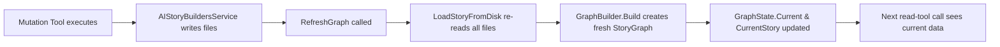

This ensures the LLM can immediately query the updated state after a mutation. For example, after adding a character, `GetCharacters()` will return the new character in its results.

---

## 11. Chat Service — StoryChatService

**Source:** `AIStoryBuildersGraph/Services/StoryChatService.cs`

### 11.1 Responsibilities

- Maintains conversation sessions in a `ConcurrentDictionary<string, ConversationSession>`
- Builds **15 read tools** wrapping `GraphQueryService` methods and **20 write tools** wrapping `GraphMutationService` methods via `AIFunctionFactory.Create()`
- Runs a **tool-calling loop** (max 10 rounds): sends messages to LLM → processes tool calls → feeds results back → repeats until text response
- Creates and caches the `IChatClient` based on current `AISettings`
- Returns streamed responses via `IAsyncEnumerable<string>`
- Dispatches tool calls to `GraphQueryService` (reads) and `GraphMutationService` (writes) and returns JSON-serialised results

### 11.2 Class Diagram

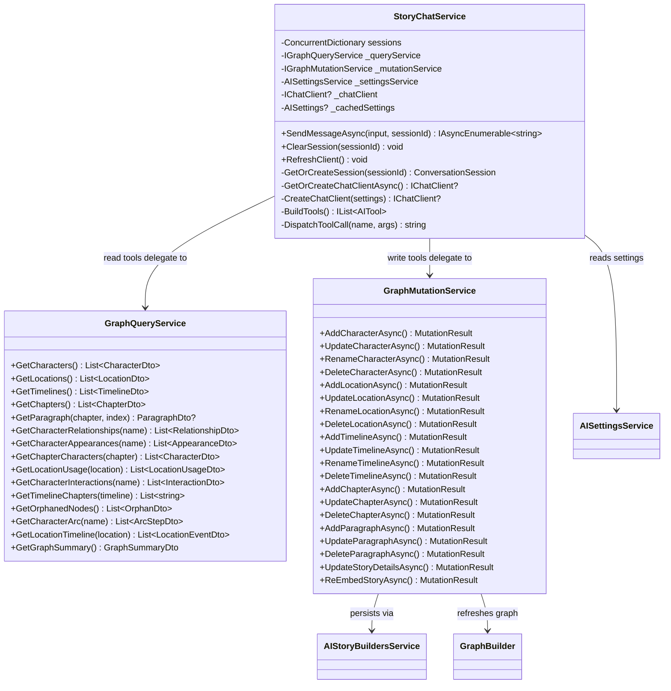

### 11.3 System Prompt

```
You are a professional story analyst and editor assistant. You have access to a
knowledge graph of a story with characters, locations, timelines,
chapters, and paragraphs connected by relationship edges.

You can help the user with:
- Critiquing the story for inconsistencies, plot holes, and orphaned entities
- Answering questions about characters, locations, timelines, and chapters
- Tracing character arcs across chapters
- Finding timeline conflicts or location mismatches
- Summarizing story structure and relationships
- Brainstorming improvements or alternatives
- Making changes to the story — adding, updating, renaming, or removing
  characters, locations, timelines, chapters, and paragraphs

Use the available tools to query the graph when you need specific data.
Do not guess — always verify with a tool call when facts are available
in the graph.

When modifying the story: Always call the mutation tool with
confirmed=false first to preview the change, then present the preview
to the user. Only call with confirmed=true after the user approves.
Explain what files will be affected and whether embeddings will be
regenerated.

Be conversational and helpful. When you find issues, explain them clearly
and suggest potential fixes.
```

### 11.4 Tool Registration (BuildTools)

All **35 tools** (15 read + 20 write) are registered using `AIFunctionFactory.Create()` with `[Description]` attributes for each tool and parameter:

```csharp
private IList<AITool> BuildTools()
{
    return
    [
        AIFunctionFactory.Create(
            [Description("List all characters in the story with name, role, and backstory")]
            () => _queryService.GetCharacters(),
            "GetCharacters"),

        AIFunctionFactory.Create(
            [Description("List all locations in the story")]
            () => _queryService.GetLocations(),
            "GetLocations"),

        // ... (13 more tools)

        AIFunctionFactory.Create(
            [Description("Get the chronological journey of a character across chapters")]
            ([Description("The character name")] string characterName)
                => _queryService.GetCharacterArc(characterName),
            "GetCharacterArc"),

        AIFunctionFactory.Create(
            [Description("Get high-level graph statistics")]
            () => _queryService.GetGraphSummary(),
            "GetGraphSummary"),

        // ── Write / Mutation Tools (20) ────────────────────────────

        AIFunctionFactory.Create(
            [Description("Add a new character to the story. Set confirmed=false to preview, true to apply.")]
            ([Description("Character name")] string name,
             [Description("Character type (e.g. Protagonist, Antagonist, Supporting)")] string type,
             [Description("Character description/backstory")] string description,
             [Description("Timeline name (optional)")] string? timelineName,
             [Description("false=preview, true=apply")] bool confirmed)
                => _mutationService.AddCharacterAsync(name, type, description, timelineName, confirmed),
            "AddCharacter"),

        AIFunctionFactory.Create(
            [Description("Update an existing character's description. Set confirmed=false to preview.")]
            ([Description("Character name")] string name,
             [Description("Character type")] string type,
             [Description("Updated description")] string description,
             [Description("Timeline name (optional)")] string? timelineName,
             [Description("false=preview, true=apply")] bool confirmed)
                => _mutationService.UpdateCharacterAsync(name, type, description, timelineName, confirmed),
            "UpdateCharacter"),

        AIFunctionFactory.Create(
            [Description("Rename a character (updates all paragraph references). Set confirmed=false to preview.")]
            ([Description("Current character name")] string currentName,
             [Description("New character name")] string newName,
             [Description("false=preview, true=apply")] bool confirmed)
                => _mutationService.RenameCharacterAsync(currentName, newName, confirmed),
            "RenameCharacter"),

        AIFunctionFactory.Create(
            [Description("Delete a character and remove from all paragraphs. Set confirmed=false to preview.")]
            ([Description("Character name to delete")] string name,
             [Description("false=preview, true=apply")] bool confirmed)
                => _mutationService.DeleteCharacterAsync(name, confirmed),
            "DeleteCharacter"),

        AIFunctionFactory.Create(
            [Description("Add a new location. Set confirmed=false to preview.")]
            ([Description("Location name")] string name,
             [Description("Location description")] string description,
             [Description("Timeline name (optional)")] string? timelineName,
             [Description("false=preview, true=apply")] bool confirmed)
                => _mutationService.AddLocationAsync(name, description, timelineName, confirmed),
            "AddLocation"),

        AIFunctionFactory.Create(
            [Description("Update a location's description. Set confirmed=false to preview.")]
            ([Description("Location name")] string name,
             [Description("Updated description")] string description,
             [Description("Timeline name (optional)")] string? timelineName,
             [Description("false=preview, true=apply")] bool confirmed)
                => _mutationService.UpdateLocationAsync(name, description, timelineName, confirmed),
            "UpdateLocation"),

        AIFunctionFactory.Create(
            [Description("Rename a location (updates all paragraph references). Set confirmed=false to preview.")]
            ([Description("Current location name")] string currentName,
             [Description("New location name")] string newName,
             [Description("false=preview, true=apply")] bool confirmed)
                => _mutationService.RenameLocationAsync(currentName, newName, confirmed),
            "RenameLocation"),

        AIFunctionFactory.Create(
            [Description("Delete a location and clear from all paragraphs. Set confirmed=false to preview.")]
            ([Description("Location name to delete")] string name,
             [Description("false=preview, true=apply")] bool confirmed)
                => _mutationService.DeleteLocationAsync(name, confirmed),
            "DeleteLocation"),

        AIFunctionFactory.Create(
            [Description("Add a new timeline. Set confirmed=false to preview.")]
            ([Description("Timeline name")] string name,
             [Description("Timeline description")] string description,
             [Description("Start date")] DateTime startDate,
             [Description("Stop date (optional)")] DateTime? stopDate,
             [Description("false=preview, true=apply")] bool confirmed)
                => _mutationService.AddTimelineAsync(name, description, startDate, stopDate, confirmed),
            "AddTimeline"),

        AIFunctionFactory.Create(
            [Description("Update a timeline's details. Set confirmed=false to preview.")]
            ([Description("Timeline name")] string name,
             [Description("Updated description")] string description,
             [Description("Start date")] DateTime startDate,
             [Description("Stop date (optional)")] DateTime? stopDate,
             [Description("false=preview, true=apply")] bool confirmed)
                => _mutationService.UpdateTimelineAsync(name, description, startDate, stopDate, confirmed),
            "UpdateTimeline"),

        AIFunctionFactory.Create(
            [Description("Rename a timeline (updates all characters, locations, and paragraphs). Set confirmed=false to preview.")]
            ([Description("Current timeline name")] string currentName,
             [Description("New timeline name")] string newName,
             [Description("Description")] string description,
             [Description("Start date")] DateTime startDate,
             [Description("Stop date (optional)")] DateTime? stopDate,
             [Description("false=preview, true=apply")] bool confirmed)
                => _mutationService.RenameTimelineAsync(currentName, newName, description, startDate, stopDate, confirmed),
            "RenameTimeline"),

        AIFunctionFactory.Create(
            [Description("Delete a timeline and clear from all entities. Set confirmed=false to preview.")]
            ([Description("Timeline name to delete")] string name,
             [Description("false=preview, true=apply")] bool confirmed)
                => _mutationService.DeleteTimelineAsync(name, confirmed),
            "DeleteTimeline"),

        AIFunctionFactory.Create(
            [Description("Add a new chapter (optionally insert at a position). Set confirmed=false to preview.")]
            ([Description("Chapter synopsis")] string synopsis,
             [Description("Insert position (null = append at end)")] int? insertAtPosition,
             [Description("false=preview, true=apply")] bool confirmed)
                => _mutationService.AddChapterAsync(synopsis, insertAtPosition, confirmed),
            "AddChapter"),

        AIFunctionFactory.Create(
            [Description("Update a chapter's synopsis. Set confirmed=false to preview.")]
            ([Description("Chapter number")] int chapterNumber,
             [Description("Updated synopsis")] string synopsis,
             [Description("false=preview, true=apply")] bool confirmed)
                => _mutationService.UpdateChapterAsync(chapterNumber, synopsis, confirmed),
            "UpdateChapter"),

        AIFunctionFactory.Create(
            [Description("Delete a chapter and all its paragraphs. Set confirmed=false to preview.")]
            ([Description("Chapter number to delete")] int chapterNumber,
             [Description("false=preview, true=apply")] bool confirmed)
                => _mutationService.DeleteChapterAsync(chapterNumber, confirmed),
            "DeleteChapter"),

        AIFunctionFactory.Create(
            [Description("Add an empty paragraph at a position in a chapter. Set confirmed=false to preview.")]
            ([Description("Chapter number")] int chapterNumber,
             [Description("Paragraph position")] int position,
             [Description("Location name")] string locationName,
             [Description("Timeline name")] string timelineName,
             [Description("Character names")] List<string> characterNames,
             [Description("false=preview, true=apply")] bool confirmed)
                => _mutationService.AddParagraphAsync(chapterNumber, position, locationName, timelineName, characterNames, confirmed),
            "AddParagraph"),

        AIFunctionFactory.Create(
            [Description("Update a paragraph's content, location, timeline, and characters. Set confirmed=false to preview.")]
            ([Description("Chapter number")] int chapterNumber,
             [Description("Paragraph number")] int paragraphNumber,
             [Description("New paragraph text content")] string content,
             [Description("Location name")] string locationName,
             [Description("Timeline name")] string timelineName,
             [Description("Character names")] List<string> characterNames,
             [Description("false=preview, true=apply")] bool confirmed)
                => _mutationService.UpdateParagraphAsync(chapterNumber, paragraphNumber, content, locationName, timelineName, characterNames, confirmed),
            "UpdateParagraph"),

        AIFunctionFactory.Create(
            [Description("Delete a paragraph and renumber remaining. Set confirmed=false to preview.")]
            ([Description("Chapter number")] int chapterNumber,
             [Description("Paragraph number to delete")] int paragraphNumber,
             [Description("false=preview, true=apply")] bool confirmed)
                => _mutationService.DeleteParagraphAsync(chapterNumber, paragraphNumber, confirmed),
            "DeleteParagraph"),

        AIFunctionFactory.Create(
            [Description("Update story-level details (style, theme, synopsis). Set confirmed=false to preview.")]
            ([Description("Story style (null to keep current)")] string? style,
             [Description("Story theme (null to keep current)")] string? theme,
             [Description("Story synopsis (null to keep current)")] string? synopsis,
             [Description("false=preview, true=apply")] bool confirmed)
                => _mutationService.UpdateStoryDetailsAsync(style, theme, synopsis, confirmed),
            "UpdateStoryDetails"),

        AIFunctionFactory.Create(
            [Description("Regenerate all embeddings for the entire story. Set confirmed=false to preview.")]
            ([Description("false=preview, true=apply")] bool confirmed)
                => _mutationService.ReEmbedStoryAsync(confirmed),
            "ReEmbedStory"),
    ];
}
```

### 11.5 `SendMessageAsync` Flow (Tool-Calling Loop)

```csharp
public async IAsyncEnumerable<string> SendMessageAsync(
    string userInput, string? sessionId = null,
    CancellationToken cancellationToken = default)
{
    var session = GetOrCreateSession(sessionId);
    session.Messages.Add(new ChatMessage(ChatRole.User, userInput));

    var chatClient = await GetOrCreateChatClientAsync();
    if (chatClient == null) { /* yield fallback message */ yield break; }
    if (GraphState.Current == null) { /* yield fallback message */ yield break; }

    var messages = new List<ChatMessage> { new(ChatRole.System, SystemPrompt) };
    messages.AddRange(session.Messages.TakeLast(20));  // Window: last 20 messages

    var tools = BuildTools();
    var options = new ChatOptions
    {
        ModelId = _cachedSettings?.AIModel,
        Temperature = 0.7f,
        MaxOutputTokens = 4096,
        Tools = tools
    };

    var responseBuilder = new StringBuilder();

    // Tool-call loop: max 10 rounds
    for (int round = 0; round < 10; round++)
    {
        var response = await chatClient.GetResponseAsync(messages, options, cancellationToken);
        var lastMessage = response.Messages[^1];

        var toolCalls = lastMessage.Contents.OfType<FunctionCallContent>().ToList();
        if (toolCalls.Count > 0)
        {
            messages.Add(lastMessage);
            foreach (var toolCall in toolCalls)
            {
                var result = DispatchToolCall(toolCall.Name, toolCall.Arguments);
                messages.Add(new ChatMessage(ChatRole.Tool,
                    [new FunctionResultContent(toolCall.CallId, result)]));
            }
            continue;  // Let the LLM process tool results
        }

        // No tool calls — return text
        var text = response.Text ?? "";
        responseBuilder.Append(text);
        yield return text;
        break;
    }

    session.Messages.Add(new ChatMessage(ChatRole.Assistant, responseBuilder.ToString()));
}
```

### 11.6 Tool Call Dispatch

```csharp
private string DispatchToolCall(string toolName, IDictionary<string, object?>? args)
{
    args ??= new Dictionary<string, object?>();

    object? result = toolName switch
    {
        // ── Read Tools (15) ──────────────────────────────────────
        "GetCharacters"            => _queryService.GetCharacters(),
        "GetLocations"             => _queryService.GetLocations(),
        "GetTimelines"             => _queryService.GetTimelines(),
        "GetChapters"              => _queryService.GetChapters(),
        "GetParagraph"             => _queryService.GetParagraph(
                                        GetArg<string>(args, "chapterTitle"),
                                        GetArg<int>(args, "paragraphIndex")),
        "GetCharacterRelationships" => _queryService.GetCharacterRelationships(
                                        GetArg<string>(args, "characterName")),
        "GetCharacterAppearances"  => _queryService.GetCharacterAppearances(
                                        GetArg<string>(args, "characterName")),
        "GetChapterCharacters"     => _queryService.GetChapterCharacters(
                                        GetArg<string>(args, "chapterTitle")),
        "GetLocationUsage"         => _queryService.GetLocationUsage(
                                        GetArg<string>(args, "locationName")),
        "GetCharacterInteractions" => _queryService.GetCharacterInteractions(
                                        GetArg<string>(args, "characterName")),
        "GetTimelineChapters"      => _queryService.GetTimelineChapters(
                                        GetArg<string>(args, "timelineName")),
        "GetOrphanedNodes"         => _queryService.GetOrphanedNodes(),
        "GetCharacterArc"          => _queryService.GetCharacterArc(
                                        GetArg<string>(args, "characterName")),
        "GetLocationTimeline"      => _queryService.GetLocationTimeline(
                                        GetArg<string>(args, "locationName")),
        "GetGraphSummary"          => _queryService.GetGraphSummary(),

        // ── Write / Mutation Tools (20) ──────────────────────────
        "AddCharacter"          => _mutationService.AddCharacterAsync(
                                      GetArg<string>(args, "name"), GetArg<string>(args, "type"),
                                      GetArg<string>(args, "description"),
                                      GetArgOrNull<string>(args, "timelineName"),
                                      GetArg<bool>(args, "confirmed")).Result,
        "UpdateCharacter"       => _mutationService.UpdateCharacterAsync(
                                      GetArg<string>(args, "name"), GetArg<string>(args, "type"),
                                      GetArg<string>(args, "description"),
                                      GetArgOrNull<string>(args, "timelineName"),
                                      GetArg<bool>(args, "confirmed")).Result,
        "RenameCharacter"       => _mutationService.RenameCharacterAsync(
                                      GetArg<string>(args, "currentName"),
                                      GetArg<string>(args, "newName"),
                                      GetArg<bool>(args, "confirmed")).Result,
        "DeleteCharacter"       => _mutationService.DeleteCharacterAsync(
                                      GetArg<string>(args, "name"),
                                      GetArg<bool>(args, "confirmed")).Result,
        "AddLocation"           => _mutationService.AddLocationAsync(
                                      GetArg<string>(args, "name"), GetArg<string>(args, "description"),
                                      GetArgOrNull<string>(args, "timelineName"),
                                      GetArg<bool>(args, "confirmed")).Result,
        "UpdateLocation"        => _mutationService.UpdateLocationAsync(
                                      GetArg<string>(args, "name"), GetArg<string>(args, "description"),
                                      GetArgOrNull<string>(args, "timelineName"),
                                      GetArg<bool>(args, "confirmed")).Result,
        "RenameLocation"        => _mutationService.RenameLocationAsync(
                                      GetArg<string>(args, "currentName"),
                                      GetArg<string>(args, "newName"),
                                      GetArg<bool>(args, "confirmed")).Result,
        "DeleteLocation"        => _mutationService.DeleteLocationAsync(
                                      GetArg<string>(args, "name"),
                                      GetArg<bool>(args, "confirmed")).Result,
        "AddTimeline"           => _mutationService.AddTimelineAsync(
                                      GetArg<string>(args, "name"), GetArg<string>(args, "description"),
                                      GetArg<DateTime>(args, "startDate"),
                                      GetArgOrNull<DateTime>(args, "stopDate"),
                                      GetArg<bool>(args, "confirmed")).Result,
        "UpdateTimeline"        => _mutationService.UpdateTimelineAsync(
                                      GetArg<string>(args, "name"), GetArg<string>(args, "description"),
                                      GetArg<DateTime>(args, "startDate"),
                                      GetArgOrNull<DateTime>(args, "stopDate"),
                                      GetArg<bool>(args, "confirmed")).Result,
        "RenameTimeline"        => _mutationService.RenameTimelineAsync(
                                      GetArg<string>(args, "currentName"),
                                      GetArg<string>(args, "newName"),
                                      GetArg<string>(args, "description"),
                                      GetArg<DateTime>(args, "startDate"),
                                      GetArgOrNull<DateTime>(args, "stopDate"),
                                      GetArg<bool>(args, "confirmed")).Result,
        "DeleteTimeline"        => _mutationService.DeleteTimelineAsync(
                                      GetArg<string>(args, "name"),
                                      GetArg<bool>(args, "confirmed")).Result,
        "AddChapter"            => _mutationService.AddChapterAsync(
                                      GetArg<string>(args, "synopsis"),
                                      GetArgOrNull<int>(args, "insertAtPosition"),
                                      GetArg<bool>(args, "confirmed")).Result,
        "UpdateChapter"         => _mutationService.UpdateChapterAsync(
                                      GetArg<int>(args, "chapterNumber"),
                                      GetArg<string>(args, "synopsis"),
                                      GetArg<bool>(args, "confirmed")).Result,
        "DeleteChapter"         => _mutationService.DeleteChapterAsync(
                                      GetArg<int>(args, "chapterNumber"),
                                      GetArg<bool>(args, "confirmed")).Result,
        "AddParagraph"          => _mutationService.AddParagraphAsync(
                                      GetArg<int>(args, "chapterNumber"),
                                      GetArg<int>(args, "position"),
                                      GetArg<string>(args, "locationName"),
                                      GetArg<string>(args, "timelineName"),
                                      GetArg<List<string>>(args, "characterNames"),
                                      GetArg<bool>(args, "confirmed")).Result,
        "UpdateParagraph"       => _mutationService.UpdateParagraphAsync(
                                      GetArg<int>(args, "chapterNumber"),
                                      GetArg<int>(args, "paragraphNumber"),
                                      GetArg<string>(args, "content"),
                                      GetArg<string>(args, "locationName"),
                                      GetArg<string>(args, "timelineName"),
                                      GetArg<List<string>>(args, "characterNames"),
                                      GetArg<bool>(args, "confirmed")).Result,
        "DeleteParagraph"       => _mutationService.DeleteParagraphAsync(
                                      GetArg<int>(args, "chapterNumber"),
                                      GetArg<int>(args, "paragraphNumber"),
                                      GetArg<bool>(args, "confirmed")).Result,
        "UpdateStoryDetails"    => _mutationService.UpdateStoryDetailsAsync(
                                      GetArgOrNull<string>(args, "style"),
                                      GetArgOrNull<string>(args, "theme"),
                                      GetArgOrNull<string>(args, "synopsis"),
                                      GetArg<bool>(args, "confirmed")).Result,
        "ReEmbedStory"          => _mutationService.ReEmbedStoryAsync(
                                      GetArg<bool>(args, "confirmed")).Result,

        _                          => new { error = $"Unknown tool: {toolName}" }
    };

    return JsonSerializer.Serialize(result, new JsonSerializerOptions { WriteIndented = false });
}
```

### 11.7 AI Client Creation & Caching

The chat client is cached and only recreated when settings change:

```csharp
private IChatClient? CreateChatClient(AISettings settings)
{
    return settings.AIServiceType switch
    {
        "Azure OpenAI" => new AzureOpenAIClient(
            new Uri(settings.Endpoint),
            new ApiKeyCredential(settings.ApiKey),
            new AzureOpenAIClientOptions { NetworkTimeout = LlmTimeout })
            .GetChatClient(settings.AIModel).AsIChatClient(),

        "Anthropic" => new AnthropicChatClientAdapter(
            settings.ApiKey, settings.AIModel),

        "Google AI" => new GoogleAIChatClientAdapter(
            settings.ApiKey, settings.AIModel),

        _ => new OpenAIClient(new ApiKeyCredential(settings.ApiKey),
            new OpenAIClientOptions { NetworkTimeout = LlmTimeout })
            .GetChatClient(settings.AIModel).AsIChatClient(),
    };
}
```

### 11.8 Session Management

- Sessions stored in `ConcurrentDictionary<string, ConversationSession>`.
- Default session ID: `"default"` (or `Guid.NewGuid()` from the UI).
- `ClearSession(sessionId)` clears the message list.
- `RefreshClient()` forces re-creation of the AI client on the next call (used after changing AI settings).

---

## 12. AI Provider Layer

### 12.1 Provider Selection

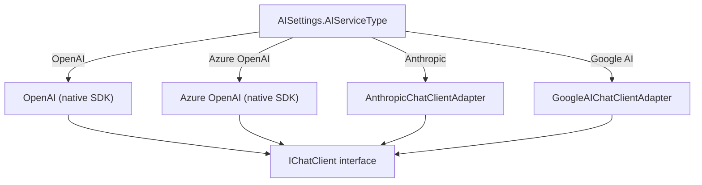

All providers are normalised behind the `IChatClient` interface from `Microsoft.Extensions.AI`.

### 12.2 AnthropicChatClientAdapter

Implements `IChatClient` for Claude models:
- Maps system-role messages to Anthropic `SystemMessage`.
- Converts user/assistant roles to Anthropic message format.
- Merges consecutive same-role messages (Anthropic requires strict alternation).
- Translates `FunctionCallContent` to `ToolUseContent` and `FunctionResultContent` to `ToolResultContent`.
- Supports both `GetResponseAsync` and streaming `GetStreamingResponseAsync`.

### 12.3 GoogleAIChatClientAdapter

Implements `IChatClient` for Gemini models:
- Maps system-role messages to `systemInstruction`.
- Converts user/assistant roles to Google AI `Content` objects.
- Currently text-only (no tool/function-call support in the adapter).

### 12.4 AI Settings

```csharp
public class AISettings
{
    public string AIServiceType { get; set; } = "OpenAI";
    public string ApiKey         { get; set; } = "";
    public string AIModel        { get; set; } = "gpt-4o-mini";
    public string Endpoint       { get; set; } = "";
    public bool   IsConfigured   => !string.IsNullOrWhiteSpace(ApiKey);
}
```

Supported `AIServiceType` values: `OpenAI`, `Azure OpenAI`, `Anthropic`, `Google AI`.

### 12.5 Model Discovery (AIModelCacheService)

Dynamically discovers available models with a 30-minute cache per service/key/endpoint:

| Provider | Discovery Method |
|---|---|
| OpenAI | List models via API, filter for `gpt-4o`, `gpt-4o-mini`, `gpt-4`, `o1`, `o3`, `o4` prefixes |
| Azure OpenAI | Return hardcoded defaults |
| Anthropic | `client.Models.ListModelsAsync()` |
| Google AI | HTTP GET to `generativelanguage.googleapis.com/v1beta/models` |

---

## 13. Detailed Call Chain — Chat AI → StoryChatService → GraphQueryService / GraphMutationService

### 13.1 Entry Point: `ChatControl.SendMessage()` / `Home.razor.SendMessage()`

```
SendMessage()
├── Validate _userInput is not empty and not already streaming
├── Create ChatDisplayMessage(IsUser=true, Content=input) → add to _messages
├── Set _isStreaming = true, _streamingContent = "", StateHasChanged()
├── await foreach (chunk in ChatService.SendMessageAsync(input, _sessionId))
│   │
│   ├── [Inside StoryChatService.SendMessageAsync]
│   ├── GetOrCreateSession(_sessionId) → ConversationSession
│   ├── session.Messages.Add(ChatMessage(User, input))
│   │
│   ├── GetOrCreateChatClientAsync()
│   │   └── Check cached settings vs current settings
│   │       └── If changed: CreateChatClient(settings) → IChatClient
│   │           └── switch(AIServiceType)
│   │               ├── "OpenAI"       → OpenAIClient.GetChatClient().AsIChatClient()
│   │               ├── "Azure OpenAI" → AzureOpenAIClient.GetChatClient().AsIChatClient()
│   │               ├── "Anthropic"    → AnthropicChatClientAdapter
│   │               └── "Google AI"    → GoogleAIChatClientAdapter
│   │
│   ├── Guard: chatClient == null → yield "⚠️ AI not configured"
│   ├── Guard: GraphState.Current == null → yield "⚠️ No graph loaded"
│   │
│   ├── Build messages = [System(SystemPrompt)] + session.Messages.TakeLast(20)
│   ├── BuildTools() → 15 AIFunction tools wrapping GraphQueryService
│   ├── ChatOptions { ModelId, Temperature=0.7, MaxOutputTokens=4096, Tools }
│   │
│   ├── TOOL-CALLING LOOP (max 10 rounds):
│   │   ├── chatClient.GetResponseAsync(messages, options)
│   │   ├── Check response for FunctionCallContent
│   │   │
│   │   ├── IF tool calls present:
│   │   │   ├── Add assistant message (with tool calls) to messages
│   │   │   ├── foreach toolCall:
│   │   │   │   ├── DispatchToolCall(toolCall.Name, toolCall.Arguments)
│   │   │   │   │   └── switch(toolName)
│   │   │   │   │       ├── "GetCharacters" → _queryService.GetCharacters()
│   │   │   │   │       │   └── Story.Characters → List<CharacterDto>
│   │   │   │   │       ├── "GetCharacterArc" → _queryService.GetCharacterArc(name)
│   │   │   │   │       │   └── For each Chapter, find paragraphs with character
│   │   │   │   │       │       → List<ArcStepDto>
│   │   │   │   │       └── ... (13 more tools)
│   │   │   │   └── Add ChatMessage(Tool, FunctionResultContent(callId, jsonResult))
│   │   │   └── continue loop
│   │   │
│   │   └── IF text response (no tool calls):
│   │       ├── yield return response.Text
│   │       └── break loop
│   │
│   └── session.Messages.Add(ChatMessage(Assistant, fullResponseText))
│
├── _streamingContent += chunk; StateHasChanged()
├── On loop complete: _messages.Add(ChatDisplayMessage(IsUser=false, Content=_streamingContent))
├── On exception: _messages.Add(ChatDisplayMessage(IsUser=false, Content="❌ Error: ..."))
├── Set _isStreaming = false, _streamingContent = "", StateHasChanged()
```

### 13.2 Full Call-Chain Diagram

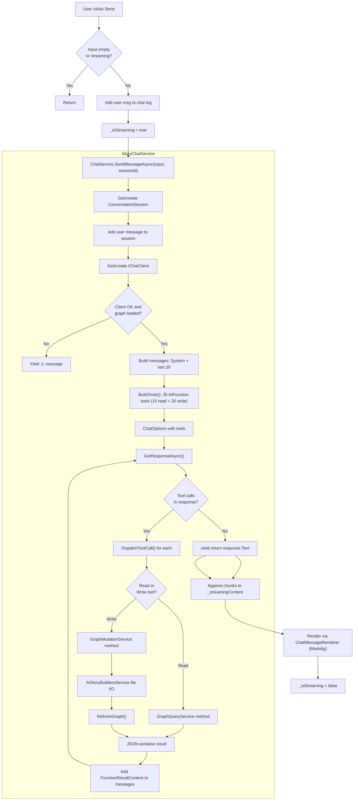

### 13.3 Tool-Calling Flow Diagram

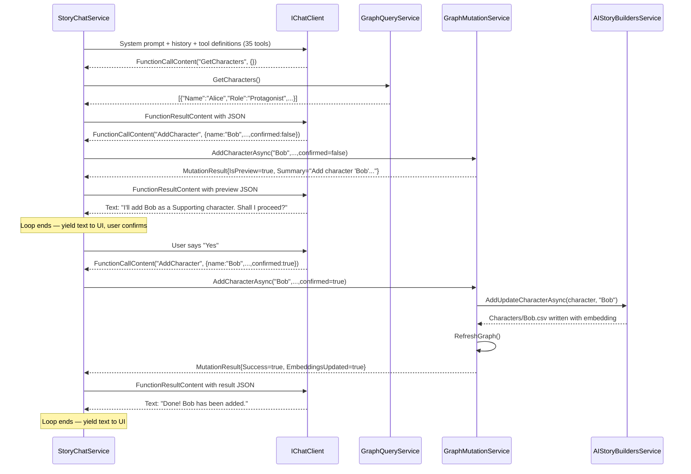

---

## 14. Prompt Engineering

### 14.1 Chat System Prompt (Implemented)

The system prompt is a constant in `StoryChatService` (not a template — the LLM uses tools instead of embedded context):

```
You are a professional story analyst and editor assistant. You have access to a
knowledge graph of a story with characters, locations, timelines,
chapters, and paragraphs connected by relationship edges.

You can help the user with:
- Critiquing the story for inconsistencies, plot holes, and orphaned entities
- Answering questions about characters, locations, timelines, and chapters
- Tracing character arcs across chapters
- Finding timeline conflicts or location mismatches
- Summarizing story structure and relationships
- Brainstorming improvements or alternatives
- Making changes to the story — adding, updating, renaming, or removing
  characters, locations, timelines, chapters, and paragraphs

Use the available tools to query the graph when you need specific data.
Do not guess — always verify with a tool call when facts are available
in the graph.

When modifying the story: Always call the mutation tool with
confirmed=false first to preview the change, then present the preview
to the user. Only call with confirmed=true after the user approves.
Explain what files will be affected and whether embeddings will be
regenerated.

Be conversational and helpful. When you find issues, explain them clearly
and suggest potential fixes.
```

### 14.2 Key Design Decision: Tools vs Embedded Context

The `AIStoryBuildersGraph` implementation does **not** embed story data into the system prompt. Instead:
- The system prompt only describes the assistant's role and capabilities.
- The LLM discovers story data by calling the 35 registered tools (15 read + 20 write).
- Each tool returns a focused JSON payload (e.g., just one character's arc, just one paragraph's text, or a mutation preview).
- This avoids context window limits and keeps prompts small.

### 14.3 Tool Descriptions (sent as JSON Schema to the LLM)

Each tool has a description and typed parameters that the LLM uses to decide when and how to call it:

#### Read Tools (15)

| Tool Name | Description | Parameters |
|---|---|---|
| `GetCharacters` | List all characters with name, role, and backstory | *none* |
| `GetLocations` | List all locations in the story | *none* |
| `GetTimelines` | List all timelines in the story | *none* |
| `GetChapters` | List all chapters with title, beats summary, and paragraph count | *none* |
| `GetParagraph` | Get a specific paragraph's full text, location, timeline, and characters | `chapterTitle: string`, `paragraphIndex: int` |
| `GetCharacterRelationships` | Get all graph edges for a character | `characterName: string` |
| `GetCharacterAppearances` | Get chapters and paragraphs where a character appears | `characterName: string` |
| `GetChapterCharacters` | Get all characters in a specific chapter | `chapterTitle: string` |
| `GetLocationUsage` | Get chapters where a location is used and which characters are there | `locationName: string` |
| `GetCharacterInteractions` | Get co-appearing characters and chapters of interactions | `characterName: string` |
| `GetTimelineChapters` | Get chapters covering a timeline | `timelineName: string` |
| `GetOrphanedNodes` | Get nodes with no edges | *none* |
| `GetCharacterArc` | Get chronological journey with locations, timelines, co-characters | `characterName: string` |
| `GetLocationTimeline` | Get sequence of events at a location over time | `locationName: string` |
| `GetGraphSummary` | Get node count, edge count, and counts by type | *none* |

#### Write / Mutation Tools (20)

| Tool Name | Description | Parameters |
|---|---|---|
| `AddCharacter` | Add a new character to the story | `name`, `type`, `description`, `timelineName?`, `confirmed` |
| `UpdateCharacter` | Update an existing character's description | `name`, `type`, `description`, `timelineName?`, `confirmed` |
| `RenameCharacter` | Rename a character (updates all paragraph refs) | `currentName`, `newName`, `confirmed` |
| `DeleteCharacter` | Delete a character and remove from all paragraphs | `name`, `confirmed` |
| `AddLocation` | Add a new location | `name`, `description`, `timelineName?`, `confirmed` |
| `UpdateLocation` | Update a location's description | `name`, `description`, `timelineName?`, `confirmed` |
| `RenameLocation` | Rename a location (updates all paragraph refs) | `currentName`, `newName`, `confirmed` |
| `DeleteLocation` | Delete a location and clear from all paragraphs | `name`, `confirmed` |
| `AddTimeline` | Add a new timeline | `name`, `description`, `startDate`, `stopDate?`, `confirmed` |
| `UpdateTimeline` | Update a timeline's details | `name`, `description`, `startDate`, `stopDate?`, `confirmed` |
| `RenameTimeline` | Rename a timeline (cascades to all entities) | `currentName`, `newName`, `description`, `startDate`, `stopDate?`, `confirmed` |
| `DeleteTimeline` | Delete a timeline and clear from all entities | `name`, `confirmed` |
| `AddChapter` | Add or insert a chapter | `synopsis`, `insertAtPosition?`, `confirmed` |
| `UpdateChapter` | Update a chapter's synopsis | `chapterNumber`, `synopsis`, `confirmed` |
| `DeleteChapter` | Delete a chapter and all paragraphs | `chapterNumber`, `confirmed` |
| `AddParagraph` | Insert an empty paragraph at a position | `chapterNumber`, `position`, `locationName`, `timelineName`, `characterNames`, `confirmed` |
| `UpdateParagraph` | Update a paragraph's content and metadata | `chapterNumber`, `paragraphNumber`, `content`, `locationName`, `timelineName`, `characterNames`, `confirmed` |
| `DeleteParagraph` | Delete a paragraph and renumber remaining | `chapterNumber`, `paragraphNumber`, `confirmed` |
| `UpdateStoryDetails` | Update story-level style, theme, or synopsis | `style?`, `theme?`, `synopsis?`, `confirmed` |
| `ReEmbedStory` | Regenerate all embeddings in the story | `confirmed` |

> **`confirmed` parameter:** All write tools accept `confirmed: bool`. When `false`, the tool returns a preview (`MutationResult` with `IsPreview=true`). When `true`, the tool performs the write and returns the result. The system prompt instructs the LLM to always call with `false` first, present the preview to the user, then call with `true` only after user approval.

### 14.4 Conversation Message Flow

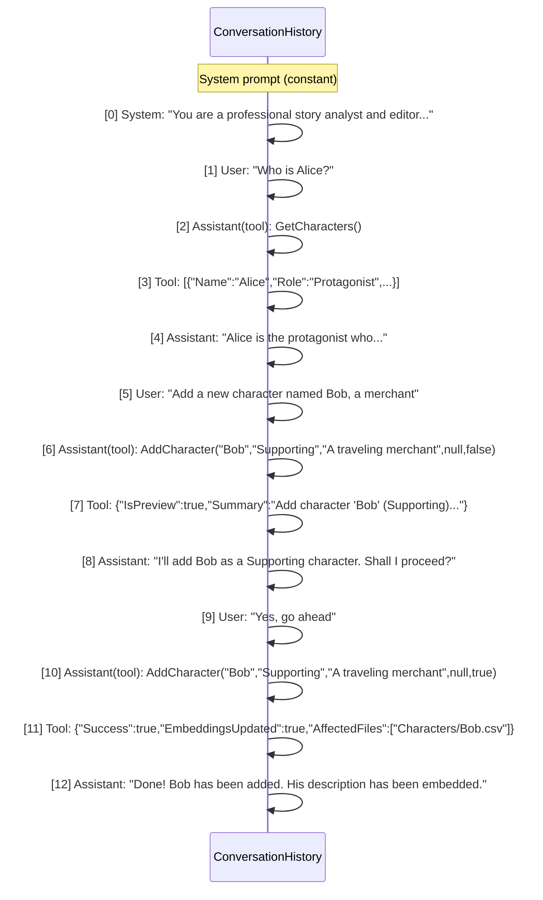

Only the last 20 messages from the session are sent to the LLM (plus the system prompt), preventing context overflow.

---

## 15. Data Model Changes

### 15.1 New Classes

| Class | Namespace | Location | Purpose |
|-------|-----------|----------|---------|
| `ChatDisplayMessage` | (nested in component) | `ChatControl.razor` or `Models/ChatModels.cs` | UI display model for chat messages |
| `ConversationSession` | `Models` | `Models/ChatModels.cs` | Multi-turn conversation session with message history |
| `GraphNode` | `Models` | `Models/GraphModels.cs` | Node in the knowledge graph |
| `GraphEdge` | `Models` | `Models/GraphModels.cs` | Edge in the knowledge graph |
| `StoryGraph` | `Models` | `Models/GraphModels.cs` | Container for nodes and edges |
| `NodeType` | `Models` | `Models/GraphModels.cs` | Enum: Character, Location, Timeline, Chapter, Paragraph |
| 13 DTO classes | `Models` | `Models/ChatModels.cs` | Read tool result DTOs (CharacterDto, LocationDto, etc.) |
| `MutationResult` | `Models` | `Models/ChatModels.cs` | Write tool result DTO with preview/confirm support |

### 15.2 `ChatDisplayMessage`

```csharp
public class ChatDisplayMessage
{
    public bool IsUser    { get; set; }
    public string Content { get; set; } = "";
}
```

### 15.3 `ConversationSession`

```csharp
public class ConversationSession
{
    public string Id         { get; set; } = string.Empty;
    public DateTime CreatedAt { get; set; }
    public List<ChatMessage> Messages { get; set; } = new();
}
```

### 15.4 Graph Models

```csharp
public enum NodeType { Character, Location, Timeline, Chapter, Paragraph }

public class GraphNode
{
    public string Id    { get; set; } = string.Empty;
    public string Label { get; set; } = string.Empty;
    public NodeType Type { get; set; }
    public Dictionary<string, string> Properties { get; set; } = new();
}

public class GraphEdge
{
    public string Id       { get; set; } = string.Empty;
    public string SourceId { get; set; } = string.Empty;
    public string TargetId { get; set; } = string.Empty;
    public string Label    { get; set; } = string.Empty;
    public Dictionary<string, string> Properties { get; set; } = new();
}

public class StoryGraph
{
    public string StoryTitle       { get; set; } = string.Empty;
    public List<GraphNode> Nodes   { get; set; } = new();
    public List<GraphEdge> Edges   { get; set; } = new();
}
```

### 15.5 Existing Models Used As-Is

| Model | Usage in Chat |
|-------|---------------|
| `Story` | Source data for graph building |
| `Chapter` / `Paragraph` / `Character` / `Location` / `Timeline` | Queried via GraphQueryService |

---

## 16. Dependency Injection Registration

### 16.1 Service Registration (from AIStoryBuildersGraph Program.cs)

```csharp
// Scoped services (per SignalR circuit / per request)
builder.Services.AddScoped<IStybldParser, StybldParser>();
builder.Services.AddScoped<IGraphBuilder, GraphBuilder>();
builder.Services.AddScoped<IGraphPackageExporter, GraphPackageExporter>();
builder.Services.AddScoped<IStybldGraphImporter, StybldGraphImporter>();
builder.Services.AddScoped<IManuscriptImportService, ManuscriptImportService>();
builder.Services.AddScoped<IPronounResolver, PronounResolver>();
builder.Services.AddScoped<IOrphanAnalyzer, OrphanAnalyzer>();

// Singleton services (shared instance)
builder.Services.AddSingleton<AISettingsService>();
builder.Services.AddSingleton<AIModelCacheService>();
builder.Services.AddSingleton<IGraphQueryService, GraphQueryService>();
builder.Services.AddSingleton<IStoryChatService, StoryChatService>();
builder.Services.AddSingleton<LocalEmbeddingGenerator>();
```

### 16.2 For AIStoryBuilders (MauiProgram.cs), add:

```csharp
builder.Services.AddSingleton<IGraphQueryService, GraphQueryService>();
builder.Services.AddSingleton<IGraphMutationService, GraphMutationService>();
builder.Services.AddSingleton<IStoryChatService, StoryChatService>();
builder.Services.AddSingleton<AISettingsService>();
builder.Services.AddSingleton<AIModelCacheService>();
// GraphBuilder can be scoped
builder.Services.AddScoped<IGraphBuilder, GraphBuilder>();
```

### 16.3 Service Dependency Graph

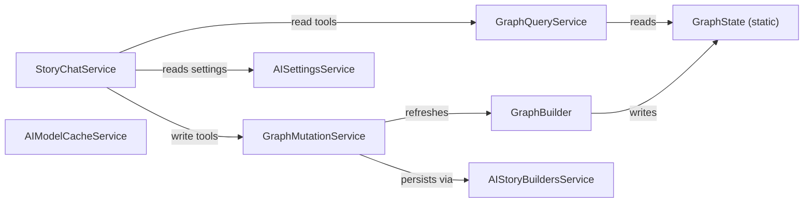

### 16.4 Thread Safety

| Component | Strategy |
|---|---|
| `StoryChatService` | `ConcurrentDictionary` for session storage |
| `GraphState` | Static properties (single-user assumption) |
| `AISettingsService` | File-based JSON (no write concurrency) |

### 16.5 Configuration Constants

| Constant | Value | Location |
|---|---|---|
| Tool-call loop limit | 10 rounds | `StoryChatService` |
| Chat history window | 20 messages | `StoryChatService` |
| LLM operation timeout | 10 minutes | `StoryChatService` |
| Max file upload size | 50 MB | `Home.razor` |
| SignalR max message size | 1 MB | `Program.cs` |
| Model cache TTL | 30 minutes | `AIModelCacheService` |

---

## 17. UI/UX Details

### 17.1 Message Styling (from Home.razor)

| Element | Style |
|---------|-------|
| User messages | Right-aligned (`justify-content-end`), `bg-primary text-white`, rounded-3 |
| AI messages | Left-aligned (`justify-content-start`), `bg-light border`, rounded-3 |
| Max width | `max-width: 80%; word-wrap: break-word;` |
| Message container | `flex-grow-1 overflow-auto`, parent: `height: 400px` |
| Empty state | Centered muted text with example questions |

### 17.2 Input Area

| Element | Detail |
|---------|--------|
| Text input | `<textarea class="form-control" rows="2">`, placeholder "Ask about your story..." |
| Send button | `<button class="btn btn-primary">Send</button>` |
| Clear button | `<button class="btn btn-sm btn-outline-secondary">🔄</button>` (in card header) |
| Settings button | `<button class="btn btn-sm btn-outline-secondary">⚙️</button>` (in card header) |
| Enter key | Submits message (Shift+Enter for newline) |
| Disabled state | Textarea and Send disabled while `_isStreaming` |

### 17.3 Streaming Indicator

While `_isStreaming == true`, a streaming message bubble is displayed:
- Shows "Thinking..." text when `_streamingContent` is empty
- Shows incrementally rendered Markdown via `ChatMessageRenderer` as chunks arrive

### 17.4 Markdown Rendering

AI responses are rendered through `ChatMessageRenderer` using the Markdig library with `AdvancedExtensions` (tables, strikethrough, task lists, pipe tables, etc.).

### 17.5 Wireframe

```
┌──────────────────────────────────────────────────────┐
│ Details │ Timelines │ Locations │ Characters │ Chapters │ Chat │
├──────────────────────────────────────────────────────┤
│  Story Chat Assistant              [⚙️] [🔄]        │
│ ┌────────────────────────────────────────────────┐   │
│ │  No messages yet. Ask a question about         │   │
│ │  your story!                                   │   │
│ │  Examples: "Are there any orphaned             │   │
│ │  characters?", "Tell me about the main         │   │
│ │  characters"                                   │   │
│ │                                                │   │
│ │                                     [You]      │   │
│ │  Tell me about Alice's character arc           │   │
│ │                                                │   │
│ │  [AI]                                          │   │
│ │  Alice is the protagonist introduced in        │   │
│ │  Chapter 1. Her arc spans 3 chapters...        │   │
│ │  | Chapter | Location | Co-Characters |        │   │
│ │  |---------|----------|---------------|        │   │
│ │  | Ch 1    | Forest   | Bob           |        │   │
│ │                                                │   │
│ └────────────────────────────────────────────────┘   │
│  ┌──────────────────────────────────────┐ [Send]     │
│  │ Ask about your story...              │            │
│  └──────────────────────────────────────┘            │
└──────────────────────────────────────────────────────┘
```

---

## 18. Implementation Checklist

### Phase 0 — Knowledge Graph Foundation

- [ ] Create `Models/GraphModels.cs` — `NodeType`, `GraphNode`, `GraphEdge`, `StoryGraph`
- [ ] Create `Models/ChatModels.cs` — `ConversationSession`, `ChatDisplayMessage`, all DTO classes (CharacterDto, LocationDto, TimelineDto, ChapterDto, ParagraphDto, RelationshipDto, AppearanceDto, LocationUsageDto, InteractionDto, OrphanDto, ArcStepDto, LocationEventDto, GraphSummaryDto), `MutationResult`
- [ ] Create `Models/AISettings.cs` — AI provider settings model
- [ ] Create `GraphState.cs` — static holder for `StoryGraph` and `Story`
- [ ] Create `Services/IGraphBuilder.cs` — interface
- [ ] Create `Services/GraphBuilder.cs` — builds `StoryGraph` from `Story` with fuzzy name matching and edge creation
- [ ] Create `Services/IGraphQueryService.cs` — interface with 15 query methods
- [ ] Create `Services/GraphQueryService.cs` — LINQ-based queries over `GraphState`

### Phase 1 — Chat Service (backend — read tools)

- [ ] Create `Services/AISettingsService.cs` — read/write `aisettings.json`
- [ ] Create `Services/AIModelCacheService.cs` — dynamic model discovery with 30-min cache
- [ ] Create `Services/IStoryChatService.cs` — interface (`SendMessageAsync`, `ClearSession`, `RefreshClient`)
- [ ] Create `Services/StoryChatService.cs` — tool-calling chat loop with `ConcurrentDictionary` sessions, 35 AIFunction tools (15 read + 20 write), max 10 rounds
- [ ] Create `Services/AnthropicChatClientAdapter.cs` — `IChatClient` for Claude (with tool call support)
- [ ] Create `Services/GoogleAIChatClientAdapter.cs` — `IChatClient` for Gemini
- [ ] Register all services in `MauiProgram.cs` / `Program.cs`

### Phase 1b — Mutation Service (backend — write tools)

- [ ] Create `Services/IGraphMutationService.cs` — interface with 20 mutation methods
- [ ] Create `Services/GraphMutationService.cs` — wraps `AIStoryBuildersService` CRUD methods, handles confirmation flow, embedding generation, and graph refresh
- [ ] Add `MutationResult` DTO to `Models/ChatModels.cs`
- [ ] Add 20 write-tool registrations to `StoryChatService.BuildTools()`
- [ ] Add 20 mutation dispatch cases to `StoryChatService.DispatchToolCall()`
- [ ] Update system prompt to include mutation tool instructions (preview→confirm flow)
- [ ] Add helper method `GetArgOrNull<T>()` to `StoryChatService` for nullable tool parameters
- [ ] Add `RefreshGraph()` method in `GraphMutationService` that reloads story from disk and rebuilds `GraphState`
- [ ] Verify pipe `|` characters are stripped from all text inputs before file writes
- [ ] Register `IGraphMutationService` / `GraphMutationService` in DI container

### Phase 2 — UI Component (frontend)

- [ ] Create `Components/ChatMessageRenderer.razor` — Markdig Markdown-to-HTML renderer
- [ ] Create directory `Components/Pages/Controls/Chat/`
- [ ] Create `Components/Pages/Controls/Chat/ChatControl.razor` — full chat UI with streaming, tool-calling display, Markdown rendering
- [ ] Add `<RadzenTabsItem Text="Chat">` to `StoryControl.razor`
- [ ] Wire up graph building: when chat tab is activated, build `StoryGraph` from current `Story` via `GraphBuilder` and set `GraphState`

### Phase 3 — Testing & Polish (read tools)

- [ ] Verify chat works with OpenAI provider (tool calling)
- [ ] Verify chat works with Azure OpenAI provider (tool calling)
- [ ] Verify chat works with Anthropic provider (tool calling via adapter)
- [ ] Verify chat works with Google AI provider (text-only, no tool support)
- [ ] Verify tool-calling loop terminates correctly (max 10 rounds)
- [ ] Verify conversation context is maintained across multiple turns (last 20 messages)
- [ ] Verify Clear Chat resets session properly
- [ ] Verify Markdown rendering of tables, code blocks, and lists
- [ ] Verify streaming display updates incrementally
- [ ] Review error handling for API failures and missing graph state
- [ ] Review UI scrolling and layout on different dialog sizes

### Phase 3b — Testing & Polish (write tools)

- [ ] Verify `AddCharacter` creates `.csv` file with correct pipe-delimited format and embedding
- [ ] Verify `UpdateCharacter` overwrites `.csv` file and regenerates embeddings
- [ ] Verify `RenameCharacter` renames file and updates all paragraph `[characters]` lists
- [ ] Verify `DeleteCharacter` removes file and prunes paragraph `[characters]` lists
- [ ] Verify `AddLocation` creates `.csv` file with description and embedding
- [ ] Verify `UpdateLocation` overwrites `.csv` and regenerates embeddings
- [ ] Verify `RenameLocation` renames file and updates paragraph `location` fields
- [ ] Verify `DeleteLocation` removes file and clears paragraph `location` fields
- [ ] Verify `AddTimeline` appends to `Timelines.csv`
- [ ] Verify `RenameTimeline` cascades to all character, location, and paragraph files with re-embedding
- [ ] Verify `DeleteTimeline` clears timeline references from all entity files
- [ ] Verify `AddChapter` creates folder and synopsis file with embedding
- [ ] Verify `InsertChapter` at a position renumbers subsequent chapters correctly
- [ ] Verify `DeleteChapter` removes folder and renumbers subsequent chapters
- [ ] Verify `AddParagraph` inserts at position and renumbers subsequent paragraphs
- [ ] Verify `UpdateParagraph` writes correct format: `{location}|{timeline}|[{chars}]|{text}|{embedding}`
- [ ] Verify `DeleteParagraph` removes file and renumbers subsequent paragraphs
- [ ] Verify `UpdateStoryDetails` updates `AIStoryBuildersStories.csv` correctly
- [ ] Verify `ReEmbedStory` regenerates all embeddings across all files
- [ ] Verify `confirmed=false` returns preview without modifying any files
- [ ] Verify `confirmed=true` modifies files and refreshes `GraphState`
- [ ] Verify subsequent read-tool calls reflect mutations (graph consistency)
- [ ] Verify pipe `|` characters in user input are sanitized before writes
- [ ] Verify error handling when deleting non-existent entities
