# AIStoryBuilders — Dynamic Model Retrieval from AI Providers

> **Date:** 2026-03-14  
> **Status:** Draft  
> **Scope:** Replace hard-coded model lists with live, per-provider model retrieval  
> **Reference:** [BlazorDataOrchestrator ConfigureAIDialog](https://github.com/Blazor-Data-Orchestrator/BlazorDataOrchestrator/blob/main/src/BlazorOrchestrator.Web/Components/Pages/Dialogs/ConfigureAIDialog.razor)

---

## Table of Contents

1. [Overview](#1-overview)
2. [Current State Analysis](#2-current-state-analysis)
3. [Reference Implementation Analysis (BlazorDataOrchestrator)](#3-reference-implementation-analysis-blazordataorchestrator)
4. [Architecture & Component Diagram](#4-architecture--component-diagram)
5. [New Service: `AIModelService`](#5-new-service-aimodelservice)
6. [Per-Provider Fetching Strategies](#6-per-provider-fetching-strategies)
7. [Local Caching Strategy](#7-local-caching-strategy)
8. [Settings UI Changes (`Settings.razor`)](#8-settings-ui-changes-settingsrazor)
9. [Sequence Diagrams](#9-sequence-diagrams)
10. [Data Models](#10-data-models)
11. [Settings Service Changes](#11-settings-service-changes)
12. [Error Handling & Fallback Strategy](#12-error-handling--fallback-strategy)
13. [Implementation Checklist](#13-implementation-checklist)
14. [File Change Inventory](#14-file-change-inventory)

---

## 1. Overview

Currently, the **Settings.razor** page presents hard-coded `List<string>` collections for each AI provider's models:

```csharp
List<string> colModels = new() { "gpt-4o", "gpt-4.1", "gpt-5-mini", "gpt-5" };
List<string> colAnthropicModels = new() { "claude-3-5-sonnet-20241022", "claude-3-5-haiku-20241022", "claude-4-sonnet" };
List<string> colGoogleModels = new() { "gemini-2.0-flash", "gemini-2.5-pro" };
```

This means every time a provider releases new models, a code change and rebuild are required.

**Goal:** Dynamically fetch the available model list from each provider's API when the user enters a valid API key, cache the results locally, and display them in a filterable dropdown — mirroring the pattern used by [BlazorDataOrchestrator's ConfigureAIDialog](https://github.com/Blazor-Data-Orchestrator/BlazorDataOrchestrator/blob/main/src/BlazorOrchestrator.Web/Components/Pages/Dialogs/ConfigureAIDialog.razor).

---

## 2. Current State Analysis

### 2.1 Existing Model Selection (Settings.razor)

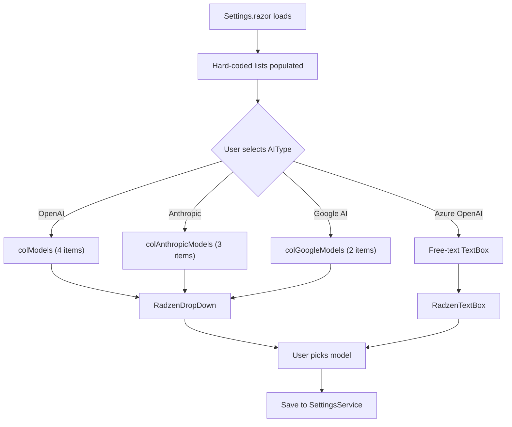

### 2.2 Existing Relevant Code

| File | Role |
|---|---|
| `Components/Pages/Settings.razor` | Settings UI — hard-coded model lists, provider dropdown |
| `Models/OpenAiModelFetcher.cs` | Existing (unused in UI) class that fetches `/v1/models` from OpenAI |
| `Services/SettingsService.cs` | Reads/writes `AIStoryBuildersSettings.config` JSON file |
| `AI/OrchestratorMethods.cs` | `CreateOpenAIClient()` — branches by `AIType` |
| `AI/AnthropicChatClient.cs` | IChatClient wrapper for Anthropic SDK |
| `AI/GoogleAIChatClient.cs` | IChatClient wrapper for Google Generative AI SDK |

### 2.3 NuGet Packages Already Available

| Package | Version | Model-Listing Capability |
|---|---|---|
| `OpenAI` (via `Azure.AI.OpenAI`) | 2.1.0 | `GetOpenAIModelClient().GetModelsAsync()` |
| `Azure.AI.OpenAI` | 2.1.0 | HTTP call to `/openai/models` or `/openai/deployments` |
| `Anthropic.SDK` | 5.10.0 | **No list-models API** — use a well-known list |
| `Mscc.GenerativeAI` | 3.1.0 | `GenerativeModel.ListModels()` |

### 2.4 Existing `OpenAiModelFetcher`

The file `Models/OpenAiModelFetcher.cs` already contains a raw `HttpClient` implementation that calls `GET /v1/models`. Under the new plan this class will be **retired** in favour of using the official `OpenAIClient` SDK which is already referenced. The new `AIModelService` will replace it entirely.

---

## 3. Reference Implementation Analysis (BlazorDataOrchestrator)

The BlazorDataOrchestrator's `ConfigureAIDialog.razor` and `AIModelCacheService.cs` demonstrate the target pattern:

### 3.1 Key Design Decisions in the Reference

| Decision | Detail |
|---|---|
| **Unified dropdown** | All four providers (OpenAI, Azure OpenAI, Anthropic, Google AI) use a `RadzenDropDown` with `AllowFiltering` + `AllowClear` |
| **Refresh button** | A small `RadzenButton` with a refresh icon sits next to the dropdown |
| **Loading indicator** | `isLoadingModels` flag drives a `RadzenText` with spinner |
| **Cache layer** | `AIModelCacheService` stores results in Azure Table Storage with 24-hour TTL |
| **Default fallback** | `GetDefaultModels(serviceType)` returns a static list if the API call fails |
| **Anthropic** | Returns a hard-coded `KnownAnthropicModels` list (no public list-models endpoint) |
| **Model filtering** | OpenAI results are filtered to `gpt-*`, `o1*`, `o3*`, `o4*`; Google results filtered to `gemini*` with `generateContent` support |
| **Current model preservation** | If the user's saved model isn't in the fetched list, it's inserted at position 0 |

### 3.2 Reference Architecture

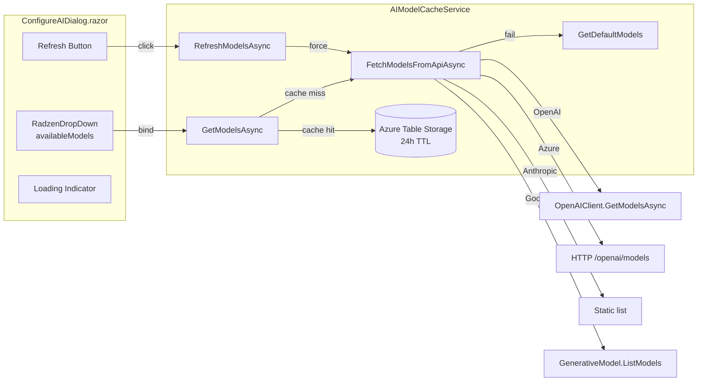

### 3.3 What We Adapt vs. Change

| Reference Pattern | AIStoryBuilders Adaptation |
|---|---|
| Azure Table Storage cache | **Local file-system cache** (MAUI desktop app — no cloud dependency for caching) |
| `AIModelCacheService` as injected service | `AIModelService` registered as singleton in DI |
| `ApiKeyCredential` for OpenAI | Same — already in use |
| HTTP client for Azure deployments | Same approach |
| `Mscc.GenerativeAI.ListModels()` | Same — package already referenced |
| Hard-coded Anthropic list | Same — Anthropic has no public list-models API |

---

## 4. Architecture & Component Diagram

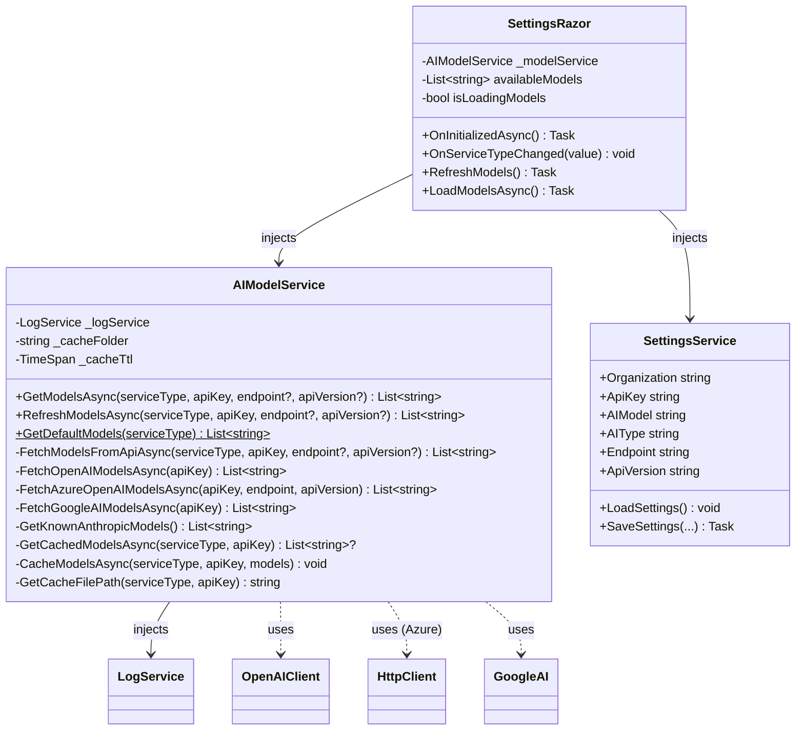

---

## 5. New Service: `AIModelService`

### 5.1 File Location

```
AI/AIModelService.cs
```

### 5.2 Responsibilities

1. **Fetch** model lists from each provider's API.
2. **Cache** results to the local file system with a configurable TTL.
3. **Fall back** to built-in default lists on any failure.
4. **Filter** results to chat-capable models only.
5. **Sort** results for a clean dropdown experience.

### 5.3 Public API

```csharp
public class AIModelService
{
    /// <summary>
    /// Returns models from cache if fresh, otherwise fetches from the API.
    /// Falls back to defaults on failure.
    /// </summary>
    public async Task<List<string>> GetModelsAsync(
        string serviceType,
        string apiKey,
        string? endpoint = null,
        string? apiVersion = null);

    /// <summary>
    /// Forces a fresh fetch from the provider API, ignoring cache.
    /// Falls back to defaults on failure.
    /// </summary>
    public async Task<List<string>> RefreshModelsAsync(
        string serviceType,
        string apiKey,
        string? endpoint = null,
        string? apiVersion = null);

    /// <summary>
    /// Returns a hard-coded fallback list for the given provider.
    /// </summary>
    public static List<string> GetDefaultModels(string serviceType);
}
```

### 5.4 DI Registration

In `MauiProgram.cs`, register alongside the existing singletons:

```csharp
builder.Services.AddSingleton<AIModelService>();
```

### 5.5 Constructor Dependencies

```csharp
public AIModelService(LogService logService)
{
    _logService = logService;
    _cacheFolder = Path.Combine(
        Environment.GetFolderPath(Environment.SpecialFolder.MyDocuments),
        "AIStoryBuilders", "ModelCache");
    _cacheTtl = TimeSpan.FromHours(24);
}
```

---

## 6. Per-Provider Fetching Strategies

### 6.1 OpenAI

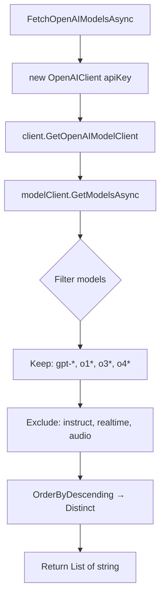

**SDK method:** `OpenAIClient.GetOpenAIModelClient().GetModelsAsync()`

**Filter logic** (matching BlazorDataOrchestrator):

```csharp
response.Value
    .Where(m => m.Id.StartsWith("gpt-") ||
                m.Id.StartsWith("o1")   ||
                m.Id.StartsWith("o3")   ||
                m.Id.StartsWith("o4"))
    .Where(m => !m.Id.Contains("instruct") &&
                !m.Id.Contains("realtime") &&
                !m.Id.Contains("audio"))
    .Select(m => m.Id)
    .OrderByDescending(m => m)
    .Distinct()
    .ToList();
```

### 6.2 Azure OpenAI

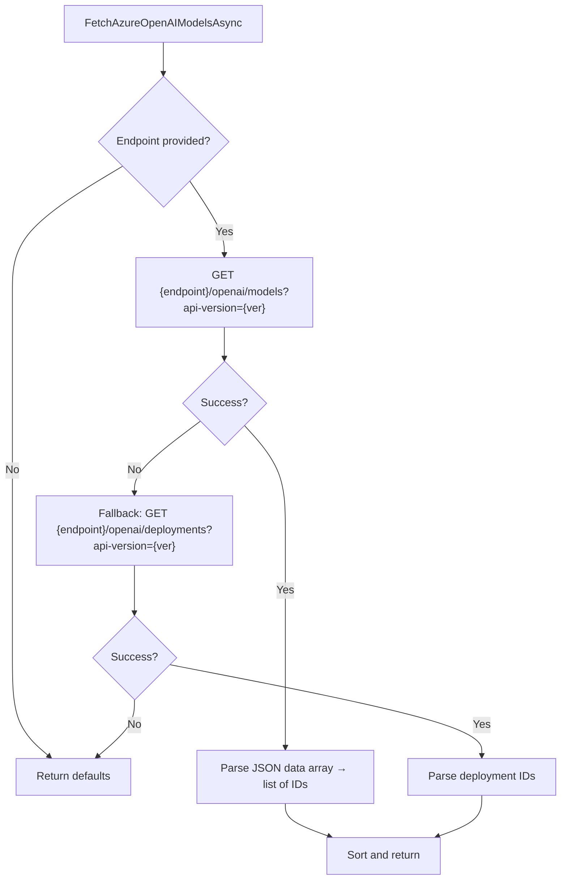

**Implementation:** Raw `HttpClient` with `api-key` header (same as reference). Two endpoints tried in order:

1. `/openai/models` — lists available models.
2. `/openai/deployments` — lists deployments (fallback for restricted subscriptions).

### 6.3 Anthropic

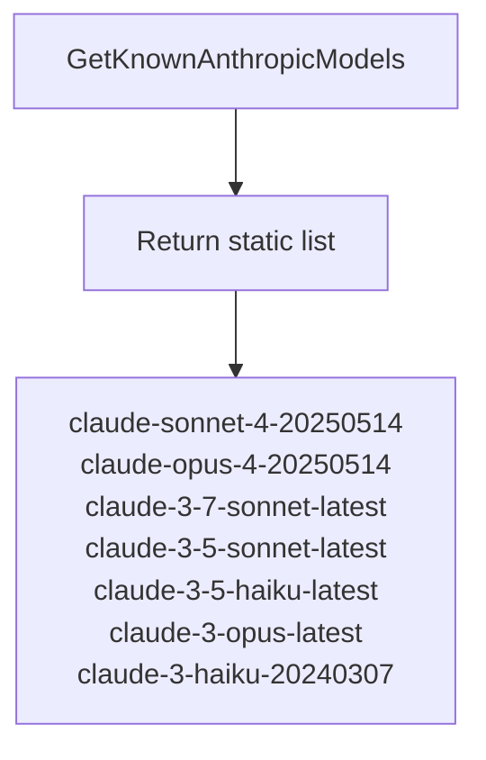

**Rationale:** Anthropic does not expose a public model-listing endpoint. The reference implementation (BlazorDataOrchestrator) also uses a static list. The Refresh button will simply return this list.

> **Future:** If Anthropic adds a `/v1/models` endpoint, the fetcher can be updated to call it.

### 6.4 Google AI (Gemini)

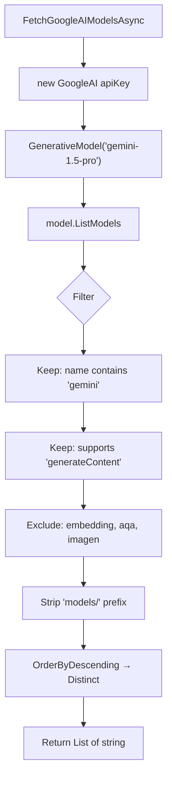

**SDK method:** `GenerativeModel.ListModels()` — returns model metadata including `SupportedGenerationMethods`.

### 6.5 Default Fallback Lists

These static lists are returned when the API key is missing or the fetch fails:

| Provider | Default Models |
|---|---|
| **OpenAI** | `gpt-5`, `gpt-5-mini`, `gpt-4.1`, `gpt-4.1-mini`, `gpt-4.1-nano`, `gpt-4o`, `gpt-4o-mini`, `o4-mini`, `o3`, `o3-mini` |
| **Azure OpenAI** | `gpt-4o`, `gpt-4o-mini`, `gpt-4-turbo`, `gpt-4`, `gpt-35-turbo` |
| **Anthropic** | *(same as static list above)* |
| **Google AI** | `gemini-2.5-pro-preview-06-05`, `gemini-2.5-flash-preview-05-20`, `gemini-2.0-flash`, `gemini-2.0-flash-lite`, `gemini-1.5-pro`, `gemini-1.5-flash` |

---

## 7. Local Caching Strategy

Since AIStoryBuilders is a **.NET MAUI desktop application** (not a web app with cloud storage), we cache to the local file system instead of Azure Table Storage.

### 7.1 Cache Location

```
%USERPROFILE%\Documents\AIStoryBuilders\ModelCache\
```

### 7.2 Cache File Format

One JSON file per provider, keyed by a hash of the API key:

```
ModelCache/
  openai_A3F8B2C1.json
  azure-openai_7D4E9A12.json
  anthropic_B1C2D3E4.json
  google-ai_9F8E7D6C.json
```

### 7.3 Cache File Schema

```json
{
  "serviceType": "OpenAI",
  "models": ["gpt-5", "gpt-5-mini", "gpt-4.1", "..."],
  "lastFetched": "2026-03-14T10:30:00Z"
}
```

### 7.4 Cache Data Model

```csharp
public class ModelCacheEntry
{
    public string ServiceType { get; set; }
    public List<string> Models { get; set; }
    public DateTimeOffset LastFetched { get; set; }
}
```

### 7.5 Cache Flow

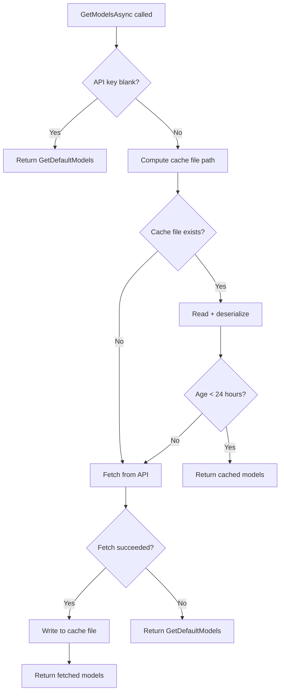

### 7.6 Cache Key Generation

Use a SHA-256 hash of the trimmed API key (first 16 hex chars), identical to the reference implementation:

```csharp
private static string GetCacheKey(string apiKey)
{
    using var sha = System.Security.Cryptography.SHA256.Create();
    var hash = sha.ComputeHash(
        System.Text.Encoding.UTF8.GetBytes(apiKey.Trim()));
    return Convert.ToHexString(hash)[..16];
}
```

This avoids storing raw API keys on disk while still differentiating between keys.

---

## 8. Settings UI Changes (`Settings.razor`)

### 8.1 Current vs. New Comparison

| Aspect | Current | New |
|---|---|---|
| Model data source | Hard-coded `List<string>` per provider | `AIModelService.GetModelsAsync()` |
| Dropdown type | `RadzenDropDown` (no filtering) | `RadzenDropDown` with `AllowFiltering` + `AllowClear` |
| Refresh capability | None | Refresh button next to dropdown |
| Loading state | None | Loading indicator text + button `IsBusy` |
| Azure model input | Free-text `RadzenTextBox` | `RadzenDropDown` (deployments fetched via API) + fallback text |

### 8.2 New UI Layout

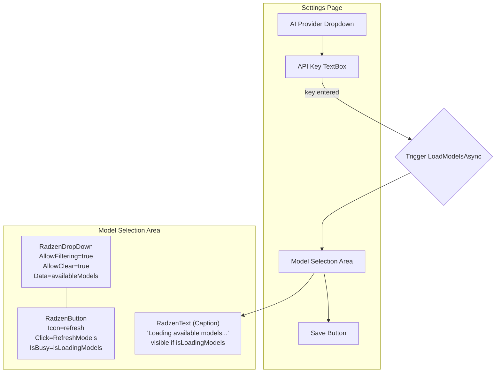

### 8.3 New Fields in `@code` Block

Replace the hard-coded lists with:

```csharp
// Replaces: colModels, colAnthropicModels, colGoogleModels
List<string> availableModels = new();
bool isLoadingModels = false;
```

### 8.4 New Razor Markup (All Providers)

The model dropdown section should be **unified** across all providers (including Azure OpenAI):

```razor
<RadzenFormField Text="@ModelFieldLabel" Variant="@variant">
    <RadzenStack Orientation="Orientation.Horizontal" Gap="4"
                 AlignItems="AlignItems.Center">
        <RadzenDropDown Data="@availableModels"
                        @bind-Value="@AIModel"
                        Style="width:350px;"
                        AllowFiltering="true"
                        FilterCaseSensitivity="FilterCaseSensitivity.CaseInsensitive"
                        AllowClear="true"
                        Placeholder="Select or type a model..." />
        <RadzenButton Icon="refresh"
                      ButtonStyle="ButtonStyle.Light"
                      Size="ButtonSize.Small"
                      Click="@RefreshModels"
                      IsBusy="@isLoadingModels"
                      title="Refresh models from API" />
    </RadzenStack>
</RadzenFormField>

@if (isLoadingModels)
{
    <RadzenText TextStyle="TextStyle.Caption" Style="color: #6b7280;">
        <RadzenIcon Icon="hourglass_empty" Style="font-size: 14px;" />
        Loading available models...
    </RadzenText>
}
```

Where `ModelFieldLabel` is a computed property:

```csharp
string ModelFieldLabel => AIType switch
{
    "Azure OpenAI" => "Azure OpenAI Model Deployment Name:",
    "Anthropic"    => "Anthropic Model:",
    "Google AI"    => "Google AI Model:",
    _              => "Default AI Model:"
};
```

### 8.5 New Methods in `@code` Block

```csharp
private async Task LoadModelsAsync()
{
    isLoadingModels = true;
    StateHasChanged();

    try
    {
        availableModels = await AIModelService.GetModelsAsync(
            AIType, ApiKey, Endpoint, ApiVersion);

        // Ensure the current model is in the list
        if (!string.IsNullOrWhiteSpace(AIModel) &&
            !availableModels.Contains(AIModel))
        {
            availableModels.Insert(0, AIModel);
        }
    }
    catch
    {
        availableModels = AIModelService.GetDefaultModels(AIType);
    }
    finally
    {
        isLoadingModels = false;
        StateHasChanged();
    }
}

private async Task RefreshModels()
{
    if (string.IsNullOrWhiteSpace(ApiKey))
    {
        NotificationService.Notify(new NotificationMessage
        {
            Severity = NotificationSeverity.Warning,
            Summary = "API Key Required",
            Detail = "Enter an API key first to fetch available models.",
            Duration = 3000
        });
        return;
    }

    isLoadingModels = true;
    StateHasChanged();

    try
    {
        availableModels = await AIModelService.RefreshModelsAsync(
            AIType, ApiKey, Endpoint, ApiVersion);

        if (!string.IsNullOrWhiteSpace(AIModel) &&
            !availableModels.Contains(AIModel))
        {
            availableModels.Insert(0, AIModel);
        }

        NotificationService.Notify(new NotificationMessage
        {
            Severity = NotificationSeverity.Success,
            Summary = "Models Refreshed",
            Detail = $"Found {availableModels.Count} available models.",
            Duration = 3000
        });
    }
    catch (Exception ex)
    {
        NotificationService.Notify(new NotificationMessage
        {
            Severity = NotificationSeverity.Error,
            Summary = "Refresh Failed",
            Detail = $"Could not fetch models: {ex.Message}",
            Duration = 4000
        });
        availableModels = AIModelService.GetDefaultModels(AIType);
    }
    finally
    {
        isLoadingModels = false;
        StateHasChanged();
    }
}
```

### 8.6 Lifecycle Hooks

```csharp
protected override async Task OnInitializedAsync()
{
    // ... existing settings loading ...

    // Load models (from cache or API)
    await LoadModelsAsync();
}

private async void OnServiceTypeChanged(object value)
{
    // ... existing default model assignment ...

    await LoadModelsAsync();
    StateHasChanged();
}
```

---

## 9. Sequence Diagrams

### 9.1 Initial Page Load

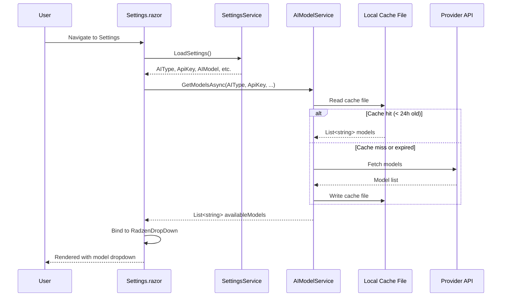

### 9.2 Refresh Button Click

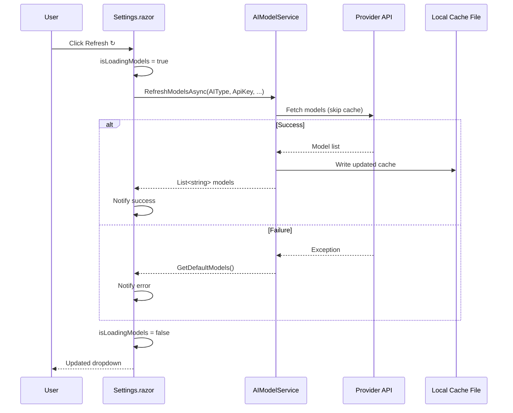

### 9.3 Provider Changed

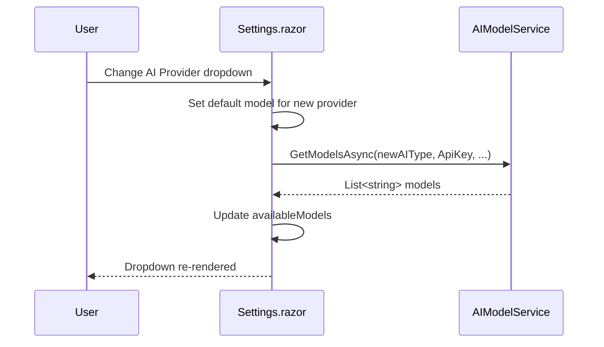

---

## 10. Data Models

### 10.1 New: `ModelCacheEntry`

**File:** `Models/ModelCacheEntry.cs`

```csharp
namespace AIStoryBuilders.Models;

/// <summary>
/// Represents a cached list of models for a specific AI provider.
/// Serialized to JSON on the local file system.
/// </summary>
public class ModelCacheEntry
{
    public string ServiceType { get; set; } = "";
    public List<string> Models { get; set; } = new();
    public DateTimeOffset LastFetched { get; set; }
}
```

### 10.2 Retire: `OpenAiModelFetcher`

The existing `Models/OpenAiModelFetcher.cs` should be **deleted** or marked `[Obsolete]`. Its functionality is fully replaced by `AIModelService.FetchOpenAIModelsAsync()`.

---

## 11. Settings Service Changes

### 11.1 No Schema Changes Required

The `SettingsService` already stores `AIType`, `ApiKey`, `AIModel`, `Endpoint`, and `ApiVersion`. No new fields are needed — the model list is not persisted in settings; only the **selected** model is saved.

### 11.2 Integration Point

`Settings.razor` continues to call `SettingsService.SaveSettings(...)` on save. The only change is that `AIModel` is now selected from a dynamically-populated dropdown rather than a static list.

---

## 12. Error Handling & Fallback Strategy

### 12.1 Graceful Degradation Flow

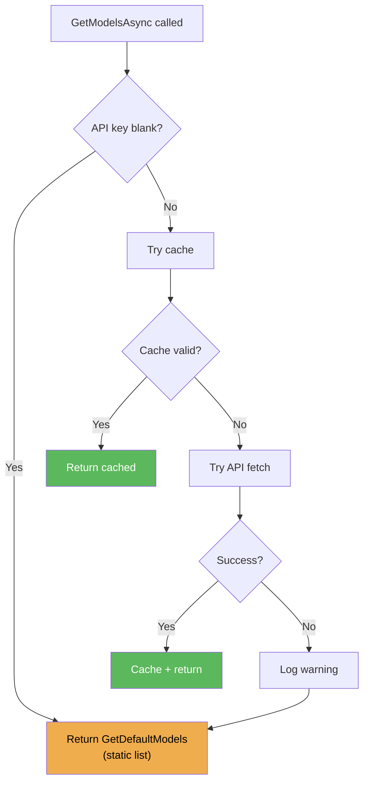

### 12.2 Error Scenarios

| Scenario | Behaviour |
|---|---|
| No API key entered | Show defaults immediately (no API call) |
| Invalid API key | API returns 401 → catch → log → return defaults |
| Network timeout | Catch `TaskCanceledException` → log → return defaults |
| Provider API changed | Catch parse exception → log → return defaults |
| Cache file corrupted | Catch deserialization error → delete cache file → fetch from API |
| Cache folder missing | Auto-create via `Directory.CreateDirectory` |

### 12.3 User Notifications

- **Refresh success:** Green toast — "Models Refreshed — Found {n} available models."
- **Refresh failure:** Red toast — "Refresh Failed — Could not fetch models: {message}"
- **No API key on refresh:** Yellow toast — "API Key Required — Enter an API key first."

---

## 13. Implementation Checklist

### Phase 1: Core Service

- [ ] Create `AI/AIModelService.cs` with full implementation
- [ ] Create `Models/ModelCacheEntry.cs`
- [ ] Register `AIModelService` as singleton in `MauiProgram.cs`
- [ ] Write unit/integration tests for each provider fetch method

### Phase 2: Settings UI

- [ ] Remove hard-coded `colModels`, `colAnthropicModels`, `colGoogleModels` from `Settings.razor`
- [ ] Add `@inject AIModelService AIModelService` to `Settings.razor`
- [ ] Replace all four model-selection blocks with the unified dropdown + refresh button
- [ ] Add `availableModels`, `isLoadingModels` fields
- [ ] Add `LoadModelsAsync()`, `RefreshModels()` methods
- [ ] Update `OnInitialized` → `OnInitializedAsync` with `await LoadModelsAsync()`
- [ ] Update `ChangeAIType` to call `LoadModelsAsync()`
- [ ] Add loading indicator markup

### Phase 3: Cleanup

- [ ] Delete or deprecate `Models/OpenAiModelFetcher.cs`
- [ ] Ensure `MauiProgram.cs` creates the `ModelCache` directory at startup
- [ ] Verify no other files reference `OpenAiModelFetcher`
- [ ] End-to-end test: each provider type → model dropdown populated

---

## 14. File Change Inventory

| File | Action | Description |
|---|---|---|
| `AI/AIModelService.cs` | **NEW** | Core model-fetching and caching service |
| `Models/ModelCacheEntry.cs` | **NEW** | Cache entry data model |
| `Components/Pages/Settings.razor` | **MODIFY** | Replace hard-coded lists with dynamic fetching UI |
| `MauiProgram.cs` | **MODIFY** | Register `AIModelService`; ensure `ModelCache` directory exists |
| `Models/OpenAiModelFetcher.cs` | **DELETE** | Superseded by `AIModelService` |

---

> **Next Steps:** After implementation, revisit this document to update the default model lists and confirm the exact filter predicates match each provider's current naming conventions.
