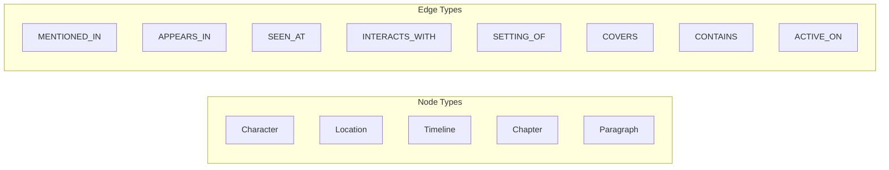
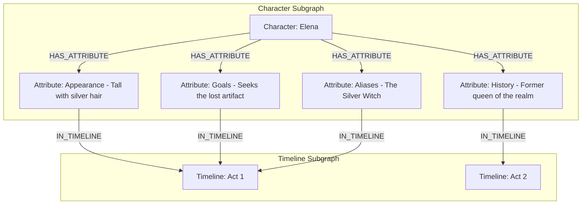
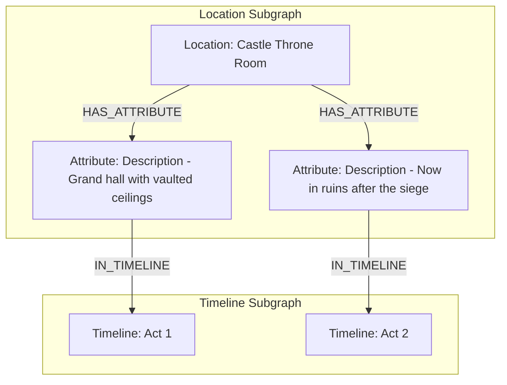
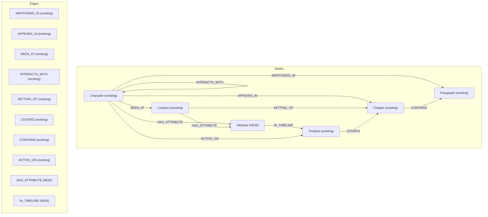
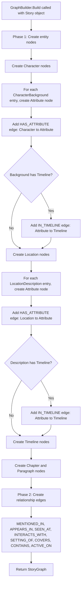
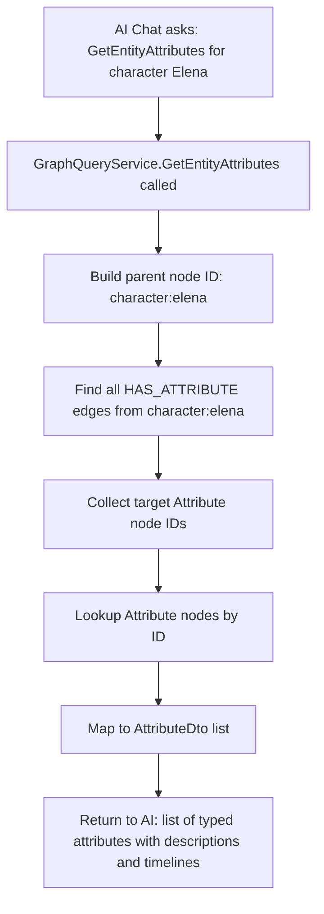
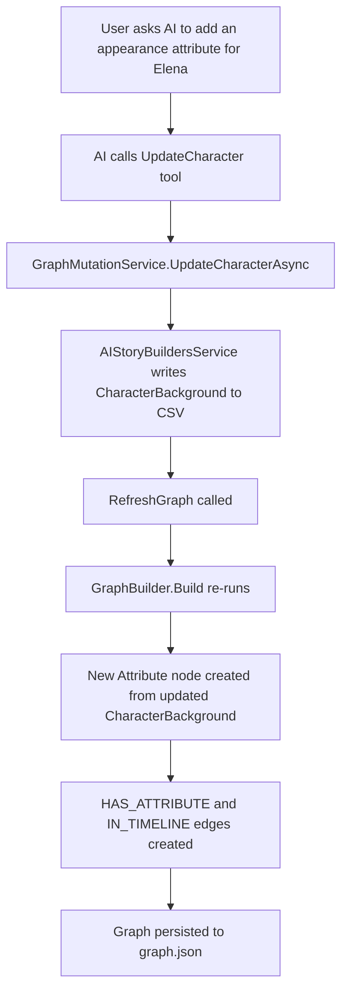

# Graph Attributes Integration Plan

## Overview

The current `GraphBuilder` collapses rich entity attributes into flat property strings on graph nodes. Character backgrounds (Appearance, Goals, History, Aliases, Facts) are merged into a single `backstory` string. Location descriptions across timelines are reduced to a single `description` string. This plan promotes **attributes to first-class graph nodes** connected by typed edges, enabling the AI chat tools to query, traverse, and mutate individual attributes within the knowledge graph.

---

## Current State Analysis

### What the GraphBuilder Does Today

The `GraphBuilder.Build()` method creates five node types and eight edge types:



### How Attributes Are Lost

| Entity | Source Data | What the Graph Stores | What Is Lost |
|--------|------------|----------------------|--------------|
| Character | Multiple `CharacterBackground` entries, each with `Type`, `Description`, `Timeline` | Single `role` + concatenated `backstory` string | Individual attribute types, per-timeline descriptions, attribute count |
| Location | Multiple `LocationDescription` entries, each with `Description`, `Timeline` | Single `description` from first entry | All but the first description, timeline-specific descriptions |
| Timeline | `TimelineDescription`, `StartDate`, `StopDate` | All three as properties | Nothing significant lost |

**Example of data collapse for a character "Elena":**

```
Source CharacterBackground entries:
  1. Type=Appearance,  Description="Tall with silver hair",      Timeline=Act1
  2. Type=Goals,       Description="Seeks the lost artifact",    Timeline=Act1
  3. Type=History,     Description="Former queen of the realm",  Timeline=Act2
  4. Type=Aliases,     Description="The Silver Witch",           Timeline=Act1

Current graph node properties:
  role = "Appearance"                     (only the FIRST entry's Type)
  backstory = "Tall with silver hair; Seeks the lost artifact; Former queen..."
              (all descriptions joined by "; " -- types and timelines discarded)
```

---

## Target Architecture

### New Node Type: Attribute

Add an `Attribute` value to the `NodeType` enum. Each `CharacterBackground` and `LocationDescription` entry becomes its own `Attribute` node in the graph, connected to its parent entity by a typed edge.





### Complete Graph Schema After Changes



### Attribute Node ID Convention

Attribute node IDs follow the pattern:

```
attribute:{parentType}:{parentName}:{attributeType}:{sequence}
```

Examples:
- `attribute:character:elena:appearance:1`
- `attribute:character:elena:goals:1`
- `attribute:location:castle throne room:description:1`
- `attribute:location:castle throne room:description:2`

### Attribute Node Properties

| Property | Description |
|----------|-------------|
| `parentType` | `character` or `location` |
| `parentName` | Name of the parent entity (original casing) |
| `attributeType` | One of: `Appearance`, `Goals`, `History`, `Aliases`, `Facts`, `Description` |
| `description` | The attribute text content |
| `timeline` | Timeline name (empty string if not timeline-specific) |
| `sequence` | Ordinal position among sibling attributes of the same parent |

---

## Implementation Steps

### Step 1: Extend the NodeType Enum

**File:** `Models/GraphModels.cs`

Add the `Attribute` member to the existing enum:

```csharp
public enum NodeType
{
    Character,
    Location,
    Timeline,
    Chapter,
    Paragraph,
    Attribute       // <-- NEW
}
```

No changes to `GraphNode`, `GraphEdge`, or `StoryGraph` classes are needed; they already use `Dictionary<string, string> Properties` which is flexible enough to hold all attribute metadata.

---

### Step 2: Update GraphBuilder to Emit Attribute Nodes

**File:** `Services/GraphBuilder.cs`

#### 2a. Character Attribute Nodes

Replace the current character node construction that collapses all backgrounds into `role`/`backstory` properties. Instead:

1. Keep the Character node with `role` set to the first `CharacterBackground.Type` and `backstory` set to a brief summary (for backward compatibility with existing query code).
2. After creating the Character node, iterate over each `CharacterBackground` entry and create a separate `Attribute` node.
3. Add a `HAS_ATTRIBUTE` edge from the Character node to each Attribute node.
4. If the `CharacterBackground.Timeline` is valid, add an `IN_TIMELINE` edge from the Attribute node to the Timeline node.

**Pseudocode for the new character block:**

```csharp
// After creating character node as before...
int attrSeq = 0;
foreach (var bg in c.CharacterBackground ?? new())
{
    attrSeq++;
    var attrType = bg.Type ?? "Facts";
    var attrDesc = bg.Description ?? "";
    if (string.IsNullOrWhiteSpace(attrDesc)) continue;

    var attrId = $"attribute:character:{name.ToLowerInvariant()}:{attrType.ToLowerInvariant()}:{attrSeq}";
    if (nodes.ContainsKey(attrId)) continue;

    nodes[attrId] = new GraphNode
    {
        Id = attrId,
        Label = $"{attrType}: {Truncate(attrDesc, 60)}",
        Type = NodeType.Attribute,
        Properties = new()
        {
            ["parentType"] = "character",
            ["parentName"] = name,
            ["attributeType"] = attrType,
            ["description"] = attrDesc,
            ["timeline"] = bg.Timeline?.TimelineName ?? "",
            ["sequence"] = attrSeq.ToString()
        }
    };

    // HAS_ATTRIBUTE edge
    AddEdge(graph, edgeIds, id, attrId, "HAS_ATTRIBUTE");

    // IN_TIMELINE edge (if timeline is set)
    var tlName = bg.Timeline?.TimelineName;
    if (IsValidEntity(tlName))
    {
        var tlId = $"timeline:{Normalize(tlName).ToLowerInvariant()}";
        AddEdge(graph, edgeIds, attrId, tlId, "IN_TIMELINE");
    }
}
```

#### 2b. Location Attribute Nodes

Similarly, replace the single-description extraction for locations:

```csharp
// After creating location node as before...
int locAttrSeq = 0;
foreach (var ld in loc.LocationDescription ?? new())
{
    locAttrSeq++;
    var ldDesc = ld.Description ?? "";
    if (string.IsNullOrWhiteSpace(ldDesc)) continue;

    var attrId = $"attribute:location:{name.ToLowerInvariant()}:description:{locAttrSeq}";
    if (nodes.ContainsKey(attrId)) continue;

    nodes[attrId] = new GraphNode
    {
        Id = attrId,
        Label = $"Description: {Truncate(ldDesc, 60)}",
        Type = NodeType.Attribute,
        Properties = new()
        {
            ["parentType"] = "location",
            ["parentName"] = name,
            ["attributeType"] = "Description",
            ["description"] = ldDesc,
            ["timeline"] = ld.Timeline?.TimelineName ?? "",
            ["sequence"] = locAttrSeq.ToString()
        }
    };

    AddEdge(graph, edgeIds, id, attrId, "HAS_ATTRIBUTE");

    var tlName = ld.Timeline?.TimelineName;
    if (IsValidEntity(tlName))
    {
        var tlId = $"timeline:{Normalize(tlName).ToLowerInvariant()}";
        AddEdge(graph, edgeIds, attrId, tlId, "IN_TIMELINE");
    }
}
```

A private `Truncate` helper is needed if not already present:

```csharp
private static string Truncate(string s, int maxLen)
    => s.Length <= maxLen ? s : s[..maxLen] + "...";
```

---

### Step 3: Add Attribute DTOs

**File:** `Models/ChatModels.cs`

Add a new DTO class alongside the existing ones:

```csharp
public class AttributeDto
{
    public string ParentType { get; set; } = "";
    public string ParentName { get; set; } = "";
    public string AttributeType { get; set; } = "";
    public string Description { get; set; } = "";
    public string Timeline { get; set; } = "";
    public int Sequence { get; set; }
}
```

---

### Step 4: Add Attribute Query Methods

**File:** `Services/GraphQueryService.cs`

Add three new methods to the `IGraphQueryService` interface and their implementations:

#### 4a. GetEntityAttributes

Returns all attributes for a given entity (character or location).

```csharp
// Interface
List<AttributeDto> GetEntityAttributes(string entityType, string entityName);

// Implementation
public List<AttributeDto> GetEntityAttributes(string entityType, string entityName)
{
    var graph = GraphState.Current;
    if (graph == null) return new();

    var parentId = $"{entityType.ToLowerInvariant()}:{entityName.ToLowerInvariant().Trim()}";

    var attrNodeIds = graph.Edges
        .Where(e => e.Label == "HAS_ATTRIBUTE" &&
                    e.SourceId.Equals(parentId, StringComparison.OrdinalIgnoreCase))
        .Select(e => e.TargetId)
        .ToHashSet(StringComparer.OrdinalIgnoreCase);

    return graph.Nodes
        .Where(n => n.Type == NodeType.Attribute && attrNodeIds.Contains(n.Id))
        .Select(n => new AttributeDto
        {
            ParentType = n.Properties.GetValueOrDefault("parentType", ""),
            ParentName = n.Properties.GetValueOrDefault("parentName", ""),
            AttributeType = n.Properties.GetValueOrDefault("attributeType", ""),
            Description = n.Properties.GetValueOrDefault("description", ""),
            Timeline = n.Properties.GetValueOrDefault("timeline", ""),
            Sequence = int.TryParse(
                n.Properties.GetValueOrDefault("sequence", "0"), out var s) ? s : 0
        })
        .OrderBy(a => a.Sequence)
        .ToList();
}
```

#### 4b. GetAttributesByType

Returns all attributes of a specific type across all entities (e.g., all "Appearance" attributes across every character).

```csharp
// Interface
List<AttributeDto> GetAttributesByType(string attributeType);

// Implementation
public List<AttributeDto> GetAttributesByType(string attributeType)
{
    var graph = GraphState.Current;
    if (graph == null) return new();

    return graph.Nodes
        .Where(n => n.Type == NodeType.Attribute &&
                    (n.Properties.GetValueOrDefault("attributeType", ""))
                        .Equals(attributeType, StringComparison.OrdinalIgnoreCase))
        .Select(n => new AttributeDto
        {
            ParentType = n.Properties.GetValueOrDefault("parentType", ""),
            ParentName = n.Properties.GetValueOrDefault("parentName", ""),
            AttributeType = n.Properties.GetValueOrDefault("attributeType", ""),
            Description = n.Properties.GetValueOrDefault("description", ""),
            Timeline = n.Properties.GetValueOrDefault("timeline", ""),
            Sequence = int.TryParse(
                n.Properties.GetValueOrDefault("sequence", "0"), out var s) ? s : 0
        })
        .OrderBy(a => a.ParentName)
        .ThenBy(a => a.Sequence)
        .ToList();
}
```

#### 4c. GetTimelineAttributes

Returns all attributes scoped to a specific timeline.

```csharp
// Interface
List<AttributeDto> GetTimelineAttributes(string timelineName);

// Implementation
public List<AttributeDto> GetTimelineAttributes(string timelineName)
{
    var graph = GraphState.Current;
    if (graph == null) return new();

    var tlId = $"timeline:{timelineName.ToLowerInvariant().Trim()}";

    var attrNodeIds = graph.Edges
        .Where(e => e.Label == "IN_TIMELINE" &&
                    e.TargetId.Equals(tlId, StringComparison.OrdinalIgnoreCase))
        .Select(e => e.SourceId)
        .ToHashSet(StringComparer.OrdinalIgnoreCase);

    return graph.Nodes
        .Where(n => n.Type == NodeType.Attribute && attrNodeIds.Contains(n.Id))
        .Select(n => new AttributeDto
        {
            ParentType = n.Properties.GetValueOrDefault("parentType", ""),
            ParentName = n.Properties.GetValueOrDefault("parentName", ""),
            AttributeType = n.Properties.GetValueOrDefault("attributeType", ""),
            Description = n.Properties.GetValueOrDefault("description", ""),
            Timeline = n.Properties.GetValueOrDefault("timeline", ""),
            Sequence = int.TryParse(
                n.Properties.GetValueOrDefault("sequence", "0"), out var s) ? s : 0
        })
        .OrderBy(a => a.ParentType)
        .ThenBy(a => a.ParentName)
        .ThenBy(a => a.Sequence)
        .ToList();
}
```

---

### Step 5: Update GraphSummary to Include Attribute Counts

**File:** `Services/GraphQueryService.cs`

The existing `GetGraphSummary()` already counts nodes `ByType` using `NodeType.ToString()`. Since `NodeType.Attribute` is a new enum value, the summary will automatically include `"Attribute": N` in the `ByType` dictionary once attribute nodes exist. No code change is needed here.

---

### Step 6: Register New Chat Tools

**File:** `Services/StoryChatService.cs`

Add three new read tools inside the `BuildTools()` method, in the read-tools section:

```csharp
AIFunctionFactory.Create(
    [Description("Get all attributes (Appearance, Goals, History, Aliases, Facts, Description) for a character or location")]
    ([Description("Entity type: 'character' or 'location'")] string entityType,
     [Description("Entity name")] string entityName)
        => _queryService.GetEntityAttributes(entityType, entityName),
    "GetEntityAttributes"),

AIFunctionFactory.Create(
    [Description("Get all attributes of a specific type across all entities (e.g., all Appearance attributes)")]
    ([Description("Attribute type: Appearance, Goals, History, Aliases, Facts, or Description")] string attributeType)
        => _queryService.GetAttributesByType(attributeType),
    "GetAttributesByType"),

AIFunctionFactory.Create(
    [Description("Get all attributes scoped to a specific timeline")]
    ([Description("Timeline name")] string timelineName)
        => _queryService.GetTimelineAttributes(timelineName),
    "GetTimelineAttributes"),
```

---

### Step 7: Update the System Prompt

**File:** `Services/StoryChatService.cs`

Extend the `SystemPrompt` constant to mention attribute awareness:

Add the following to the existing system prompt bullet list:

```
- Querying and analyzing entity attributes (Appearance, Goals, History,
  Aliases, Facts for characters; Description for locations) — each
  attribute is a separate graph node connected to its parent entity
  via HAS_ATTRIBUTE edges, and optionally scoped to a timeline via
  IN_TIMELINE edges
```

---

### Step 8: Update Graph Persistence

**File:** `Services/AIStoryBuildersService.cs` (graph save/load methods)

The graph is persisted as `graph.json` — a serialized `StoryGraph` object. Since `StoryGraph` contains `List<GraphNode>` and `List<GraphEdge>`, and both already use dictionaries for flexible properties, the new attribute nodes will be serialized and deserialized automatically via `System.Text.Json` without any schema changes.

The `manifest.json` `nodeCount` and `edgeCount` will naturally reflect the increased counts.

**Verify:** Confirm that the JSON serializer handles the `NodeType.Attribute` enum value. If the serializer uses numeric enum values, no change is needed. If it uses string names, `"Attribute"` will serialize automatically since it is a valid enum member.

---

## Process Flows

### Graph Build Flow (Updated)



### Attribute Query Flow



### Attribute Mutation Flow (via Existing Character/Location Tools)

Attribute mutations do **not** require new mutation tools. The existing `AddCharacter`, `UpdateCharacter`, `AddLocation`, and `UpdateLocation` mutation tools already accept description text and type parameters. When a mutation completes, `GraphMutationService.RefreshGraph()` rebuilds the entire graph, which will now include the updated attribute nodes automatically.



---

## Data Model Compatibility

### Backward Compatibility

The `role` and `backstory` properties on Character nodes are **preserved** alongside the new Attribute nodes. This ensures:

- Existing `GetCharacters()` and `GetChapterCharacters()` tools continue to return the same `CharacterDto` with `Role` and `Backstory` fields.
- Existing `GetCharacterRelationships()` returns edges for both old edge types and the new `HAS_ATTRIBUTE` edges.
- The `GetGraphSummary()` tool includes the new `Attribute` count automatically via the `ByType` dictionary.

### Graph JSON Size Impact

Each `CharacterBackground` entry adds:
- 1 Attribute node (~200-400 bytes in JSON)
- 1 HAS_ATTRIBUTE edge (~100 bytes)
- 0-1 IN_TIMELINE edge (~100 bytes)

For a story with 10 characters averaging 4 backgrounds each, this adds roughly 40 nodes and 40-80 edges — approximately 20-30 KB of additional JSON. This is well within acceptable limits.

---

## File Change Summary

| File | Change Type | Description |
|------|------------|-------------|
| `Models/GraphModels.cs` | Modify | Add `Attribute` to `NodeType` enum |
| `Models/ChatModels.cs` | Modify | Add `AttributeDto` class |
| `Services/GraphBuilder.cs` | Modify | Emit Attribute nodes + HAS_ATTRIBUTE / IN_TIMELINE edges for characters and locations |
| `Services/GraphQueryService.cs` | Modify | Add `GetEntityAttributes`, `GetAttributesByType`, `GetTimelineAttributes` to interface and implementation |
| `Services/StoryChatService.cs` | Modify | Register three new read tools in `BuildTools()`; update system prompt |

No new files are created. No changes to mutation services, file storage format, or UI components.

---

## Testing Checklist

- [ ] Build a graph from a story with multiple characters having varied `CharacterBackground` types — verify each background becomes an Attribute node with correct `HAS_ATTRIBUTE` edge
- [ ] Verify location descriptions produce Attribute nodes with `HAS_ATTRIBUTE` edges
- [ ] Verify `IN_TIMELINE` edges are created when backgrounds/descriptions have a non-empty timeline
- [ ] Verify `IN_TIMELINE` edges are **not** created when the timeline field is empty
- [ ] Call `GetEntityAttributes("character", "Elena")` and confirm all typed attributes are returned
- [ ] Call `GetAttributesByType("Appearance")` and confirm results span all characters
- [ ] Call `GetTimelineAttributes("Act 1")` and confirm only timeline-scoped attributes appear
- [ ] Call `GetGraphSummary()` and confirm `Attribute` count appears in `ByType`
- [ ] Verify `GetCharacters()` still returns `Role` and `Backstory` (backward compat)
- [ ] Verify `GetCharacterRelationships("Elena")` now includes `HAS_ATTRIBUTE` edges in results
- [ ] Use the chat to ask "What are Elena's attributes?" and confirm the AI uses `GetEntityAttributes`
- [ ] Update a character via chat, then re-query attributes to confirm the graph rebuild picks up changes
- [ ] Serialize graph to `graph.json`, reload it, and verify Attribute nodes and edges survive round-trip
- [ ] Verify Attribute node IDs do not collide when two characters share an attribute type
