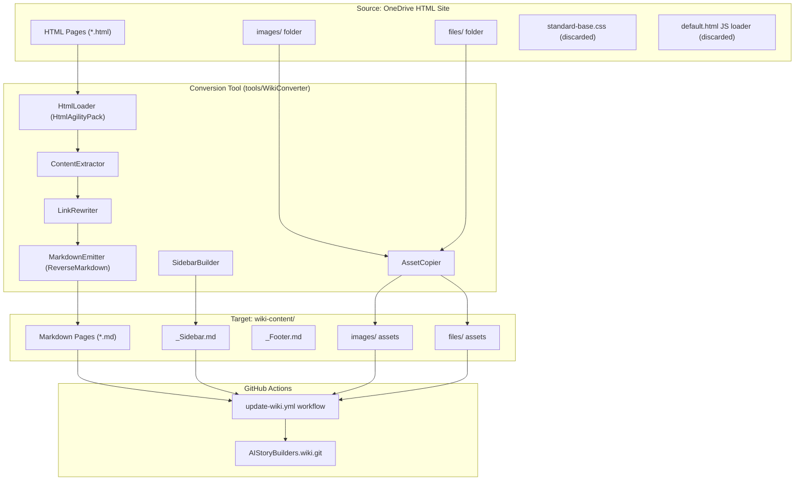
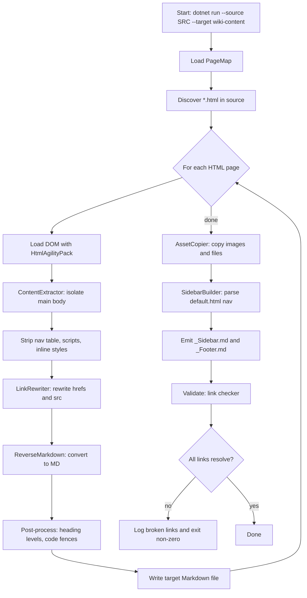
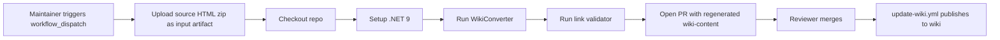

# HTML Documentation to GitHub Wiki Conversion Plan

## 1. Overview

This document describes a repeatable plan for converting the legacy AIStoryBuilders HTML documentation site located at:

```
C:\Users\webma\OneDrive\Documents\My Web Sites\AIStoryBuilders
```

into a set of Markdown pages that live in the [`wiki-content/`](../wiki-content) directory of this repository. Once committed, those pages are automatically published to the public GitHub wiki by the existing `Update Wiki` GitHub Actions workflow.

### 1.1 Goals

- Convert each top-level `*.html` documentation page into a corresponding `*.md` wiki page.
- Preserve all textual content, headings, lists, tables, code blocks, and inline formatting.
- Migrate referenced images from `images/` and binary attachments from `files/` into the wiki repo.
- Rewrite all intra-site links (`Chapters.html`, `populateDiv('Settings.html')`, etc.) to GitHub wiki page links.
- Strip the chrome of the legacy site (the left navigation table, the JavaScript page loader, inline CSS) and replace it with a single `_Sidebar.md` wiki sidebar.
- Produce output that round-trips cleanly through the existing `update-wiki.yml` workflow.

### 1.2 Non-Goals

- No styling fidelity with the original site (font sizes, colored boxes). Wiki uses GitHub's default Markdown rendering.
- No automatic translation of embedded JavaScript behavior (the legacy site's `populateDiv` AJAX loader becomes plain links).
- No conversion of `web.config`, `standard-base.css`, or `default.html` (these are site infrastructure, not content).

### 1.3 Source Inventory

The source folder contains the following content pages that must be converted:

| Source HTML | Target Wiki Page (Markdown) | Notes |
|-------------|------------------------------|-------|
| `default.html` | `Home.md` (already exists) | Used only to extract the navigation sidebar. Body content is the landing page. |
| `Installing.html` | `Installing.md` | Contains both online and Microsoft Store install instructions. |
| `QuickStart.html` | `Quick-Start.md` | |
| `Details.html` | `Details.md` | |
| `Chapters.html` | `Chapters.md` | |
| `Sections.html` | `Sections.md` | |
| `Characters.html` | `Characters.md` | |
| `Locations.html` | `Locations.md` | |
| `Timelines.html` | `Timelines.md` | |
| `WritingStyles.html` | `Writing-Styles.md` | |
| `StoryDatabase.html` | `Story-Database.md` | |
| `Settings.html` | `Settings.md` | |
| `Logs.html` | `Logs.md` | |
| `AnatomyOfAPrompt.html` | `Anatomy-Of-A-Prompt.md` | Title contains spaces; hyphenate. |
| `UtilityFineTuning.html` | `Utility-Fine-Tuning.md` | |

Supporting assets:

- `images/` — ~150 `.jpg`, `.gif`, `.png` files referenced inline.
- `files/FineTuned*` — downloadable sample assets linked from `UtilityFineTuning.html`.
- `favicon.png` — not migrated (wikis do not support favicons).

---

## 2. Architecture

### 2.1 Component Diagram



### 2.2 Project Layout

A new `tools/WikiConverter/` console project is added to the solution. It is excluded from the main MAUI build but committed alongside the source so the conversion is reproducible.

```
tools/
  WikiConverter/
    WikiConverter.csproj      (net9.0 console)
    Program.cs                (CLI entry point)
    HtmlLoader.cs
    ContentExtractor.cs
    LinkRewriter.cs
    AssetCopier.cs
    MarkdownEmitter.cs
    SidebarBuilder.cs
    PageMap.cs                (HTML to Markdown filename table)
    appsettings.json          (source/target paths)
```

NuGet dependencies:

- `HtmlAgilityPack` — robust HTML parsing tolerant of malformed legacy markup.
- `ReverseMarkdown` — HTML to Markdown conversion (handles tables, lists, inline styles).
- `Microsoft.Extensions.Logging.Console` — progress logging.
- `System.CommandLine` — CLI argument handling.

---

## 3. Conversion Pipeline

### 3.1 End-to-End Flow



### 3.2 Phase Details

#### Phase 1 — DOM Loading and Body Extraction

Every page in the legacy site shares the layout of `default.html`: a two-column table where the left `<td>` is navigation and the right `<td id="pageContent">` is the article body. Individual pages (`Chapters.html`, `Settings.html`, etc.) are *fragments* that get loaded into `pageContent` by JavaScript. They are usually wrapped in a single root element and have no `<html>`/`<body>` tags.

The extractor handles both cases:

- If the document contains `<table>` with the nav sidebar, take the second `<td>` as the body.
- Otherwise, treat the whole document as the body.
- Remove `<script>`, `<style>`, `<meta>`, and any element with class `auto-style1` (the legacy nav column class).

#### Phase 2 — Link Rewriting

The legacy pages mix several link styles. All of them must be rewritten:

| Legacy Pattern | Rewritten As |
|----------------|--------------|
| `href="Chapters.html"` | `[Chapters](Chapters)` (wiki page link) |
| `onclick="populateDiv('Settings.html')"` + `href="#anchor"` | `[Settings](Settings)` (drop onclick, use page link) |
| `href="https://AIStoryBuilders.com"` | unchanged (external) |
| `src="images/img10.jpg"` | `images/img10.jpg` (asset relative; wiki repo will contain an `images/` folder) |
| `href="files/FineTunedSample.zip"` | `files/FineTunedSample.zip` |
| `<a name="Installing">` (anchor) | dropped (Markdown headings auto-anchor) |

`LinkRewriter` uses a `PageMap` dictionary so a renamed file (e.g. `WritingStyles.html` to `Writing-Styles.md`) is resolved to the correct wiki slug.

#### Phase 3 — Asset Migration

`AssetCopier` mirrors the `images/` and `files/` directories from the source into `wiki-content/images/` and `wiki-content/files/`. It:

- Skips files not referenced by any rewritten page (logged as warnings).
- Lower-cases extensions (`.JPG` becomes `.jpg`) to avoid case-sensitivity bugs on Linux runners.
- Computes SHA-256 of each file and skips copying if the destination already has the same hash.

#### Phase 4 — Markdown Emission

`ReverseMarkdown` handles the bulk conversion. A custom post-processor then:

- Re-levels headings so each page starts at `#` (top-level). Most legacy pages use `<font size="6">` or bare bold text instead of headings — these are detected and promoted.
- Rewrites legacy `<font color>` and `<span style>` to plain text.
- Converts `<pre>` blocks to fenced code blocks with a guessed language (`csharp`, `json`, or none).
- Trims trailing whitespace and collapses runs of more than two blank lines.

#### Phase 5 — Sidebar and Footer Generation

`SidebarBuilder` parses the navigation column of `default.html` and produces `_Sidebar.md`. GitHub renders this on every wiki page. Example output:

```markdown
**Installing**

- [Online Web Browser Version](Installing#online-version)
- [Windows Desktop Version](Installing)

**Quick Start**

- [Quick Start Guide](Quick-Start)

**Story Elements**

- [Chapters](Chapters)
- [Sections](Sections)
- [Characters](Characters)
- [Locations](Locations)
- [Timelines](Timelines)
- [Writing Styles](Writing-Styles)

**Reference**

- [Story Database](Story-Database)
- [Settings](Settings)
- [Logs](Logs)
- [Anatomy Of A Prompt](Anatomy-Of-A-Prompt)
- [Utility Fine Tuning](Utility-Fine-Tuning)
```

A short `_Footer.md` adds a link back to the repository and the live website.

#### Phase 6 — Validation

After all files are written, a final pass reads every emitted `.md` file and:

- Resolves every relative link to a target file or anchor.
- Confirms every image `src` exists under `wiki-content/images/`.
- Reports duplicate page slugs (case-insensitive) — GitHub wiki treats `Chapters` and `chapters` as the same page.

The tool exits with code `1` if any validation error occurs, so it can be run in CI as a gate.

---

## 4. Page-Level Decisions

### 4.1 Heading Strategy

Every wiki page begins with exactly one `#` H1 that matches the page title. Subsections use `##` and below. The page title is taken from the `<title>` element when present, otherwise from `PageMap`.

### 4.2 Code Samples

The legacy site presents JSON examples and prompt templates inside `<pre>` or styled `<div>` blocks. These are emitted as fenced code blocks. A simple heuristic chooses the fence language:

- Starts with `{` or `[` — `json`
- Contains `using ` or `namespace ` — `csharp`
- Otherwise — no language

### 4.3 Tables

Legacy tables that are purely layout (the sidebar table, image-with-caption tables) are unwrapped into their content. Data tables are converted to GitHub-flavored Markdown tables.

### 4.4 Anchors

Inline `<a name="...">` anchors are removed; cross-page links that previously pointed to `Page.html#anchor` are rewritten to `[Page](Page#auto-anchor)` where `auto-anchor` is the GitHub-derived slug of the target heading. Where no obvious heading exists, the link is dropped to a plain page link and a warning is logged.

---

## 5. CLI and Configuration

### 5.1 Command Line

```
dotnet run --project tools/WikiConverter -- \
  --source "C:\Users\webma\OneDrive\Documents\My Web Sites\AIStoryBuilders" \
  --target "wiki-content" \
  --validate \
  --verbose
```

Flags:

- `--source` (required) — root of the legacy HTML site.
- `--target` (required) — target wiki folder (typically `wiki-content`).
- `--validate` — run the link checker after emission.
- `--verbose` — log every page and asset processed.
- `--dry-run` — perform conversion in memory and print a summary without writing files.

### 5.2 PageMap (`PageMap.cs`)

A static dictionary that drives both link rewriting and target file naming. Adding a new page to the legacy site is a one-line change here.

```csharp
public static readonly Dictionary<string, PageInfo> Pages = new(StringComparer.OrdinalIgnoreCase)
{
    ["default.html"]          = new("Home", "Home.md"),
    ["Installing.html"]       = new("Installing", "Installing.md"),
    ["QuickStart.html"]       = new("Quick Start", "Quick-Start.md"),
    ["Chapters.html"]         = new("Chapters", "Chapters.md"),
    ["Sections.html"]         = new("Sections", "Sections.md"),
    ["Characters.html"]       = new("Characters", "Characters.md"),
    ["Locations.html"]        = new("Locations", "Locations.md"),
    ["Timelines.html"]        = new("Timelines", "Timelines.md"),
    ["WritingStyles.html"]    = new("Writing Styles", "Writing-Styles.md"),
    ["StoryDatabase.html"]    = new("Story Database", "Story-Database.md"),
    ["Settings.html"]         = new("Settings", "Settings.md"),
    ["Logs.html"]             = new("Logs", "Logs.md"),
    ["AnatomyOfAPrompt.html"] = new("Anatomy Of A Prompt", "Anatomy-Of-A-Prompt.md"),
    ["UtilityFineTuning.html"]= new("Utility Fine Tuning", "Utility-Fine-Tuning.md"),
    ["Details.html"]          = new("Details", "Details.md"),
};
```

---

## 6. CI Integration

### 6.1 Existing Workflow

The repository already has `.github/workflows/update-wiki.yml`. It triggers on pushes to `main` that touch `wiki-content/**` and pushes those files to the wiki Git remote. No change is needed for the **publish** path.

### 6.2 New Workflow: `convert-docs.yml`

A new optional workflow runs the converter so contributors can regenerate `wiki-content/` from the HTML source. It is `workflow_dispatch` only — never automatic — because the source HTML lives in OneDrive and is not in the repository.



The artifact upload step keeps the source HTML out of the repo while still allowing CI-based regeneration.

---

## 7. Implementation Steps

A developer implementing this plan should proceed in this order:

1. **Bootstrap tool project**
   - Create `tools/WikiConverter/WikiConverter.csproj` targeting `net9.0`.
   - Add references to `HtmlAgilityPack`, `ReverseMarkdown`, `System.CommandLine`.
   - Add the project to `AIStoryBuilders.sln` under a new `tools` solution folder.
   - Exclude it from the MAUI build by giving it its own folder outside the MAUI project.

2. **Implement `PageMap.cs`** with the table from section 5.2.

3. **Implement `HtmlLoader` and `ContentExtractor`**
   - Unit-test against `Settings.html` and `default.html` to verify body isolation.

4. **Implement `LinkRewriter`**
   - Cover all five patterns from section 3.2.
   - Unit-test with a fixture that includes the `populateDiv(...)` onclick form.

5. **Implement `MarkdownEmitter`**
   - Wire up `ReverseMarkdown` with the post-processor.
   - Verify `Anatomy Of A Prompt` (a long, prose-heavy page) emits cleanly.

6. **Implement `AssetCopier`**
   - Walk references from emitted Markdown, then copy only referenced assets.

7. **Implement `SidebarBuilder`**
   - Parse `default.html`, group navigation by `<strong>` headers, emit `_Sidebar.md`.

8. **Implement validator**
   - Resolve every `[text](target)` and every `` against the target tree.

9. **Run conversion locally**
   - `dotnet run --project tools/WikiConverter -- --source "C:\...\AIStoryBuilders" --target wiki-content --validate`.
   - Spot-check 3-5 pages in the GitHub wiki preview.

10. **Add `convert-docs.yml` workflow** as described in 6.2.

11. **Open PR** containing:
    - The new `tools/WikiConverter/` project.
    - The newly generated `wiki-content/*.md` files (including `_Sidebar.md` and `_Footer.md`).
    - The new `wiki-content/images/` and `wiki-content/files/` assets.
    - The new `convert-docs.yml` workflow.
    - **No change** to `update-wiki.yml`.

12. **Verify post-merge** that the existing `Update Wiki` workflow publishes successfully and the live wiki renders the new pages.

---

## 8. Risks and Mitigations

| Risk | Mitigation |
|------|------------|
| Legacy HTML is malformed (unclosed tags, mixed encoding). | `HtmlAgilityPack` is tolerant; run with `OptionFixNestedTags = true` and force UTF-8 read. |
| Image filenames clash on case-insensitive vs case-sensitive filesystems. | `AssetCopier` lower-cases extensions and detects collisions. |
| Wiki page slug collisions (e.g. existing `Home.md`). | The converter never overwrites `Home.md` unless `--overwrite-home` is specified. |
| `populateDiv()` AJAX links lose their fragment identifiers. | `LinkRewriter` maps each known fragment to a Markdown heading where possible; otherwise emits a warning. |
| Source HTML location is not in version control. | `convert-docs.yml` accepts the source as an uploaded artifact; the conversion is reproducible from any maintainer's machine. |
| `ReverseMarkdown` output differs across versions. | Pin the package version in `WikiConverter.csproj`. |

---

## 9. Acceptance Criteria

- All 14 source HTML pages have a corresponding `*.md` file in `wiki-content/`.
- Every image referenced by an emitted page exists under `wiki-content/images/`.
- The link validator reports zero broken internal links.
- `_Sidebar.md` shows the same navigation structure as the legacy site.
- After PR merge, the GitHub wiki at `https://github.com/AIStoryBuilders/AIStoryBuilders/wiki` renders each migrated page with its images and inline links resolving correctly.
- The conversion is reproducible: running `dotnet run --project tools/WikiConverter` against the same source produces a byte-identical `wiki-content/` tree (excluding timestamps).
