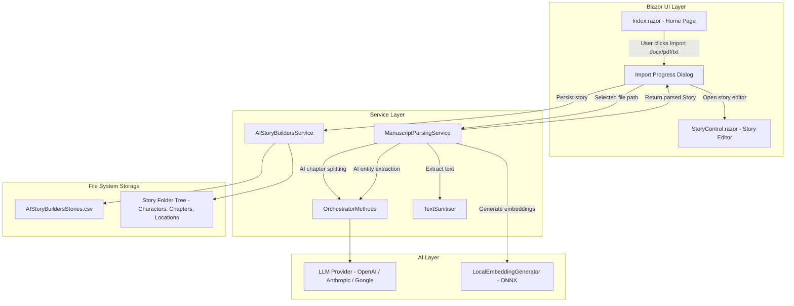
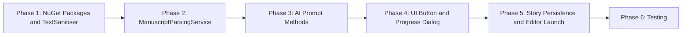
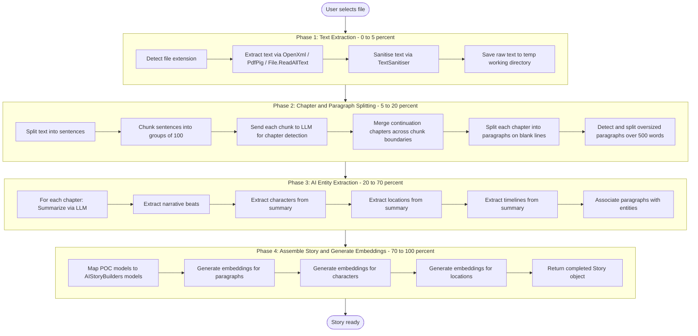
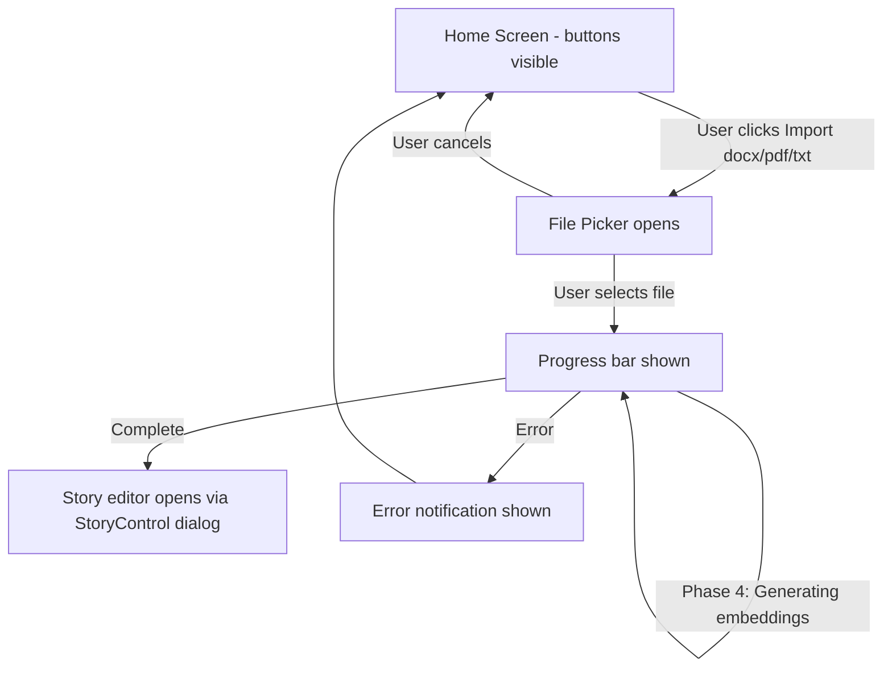
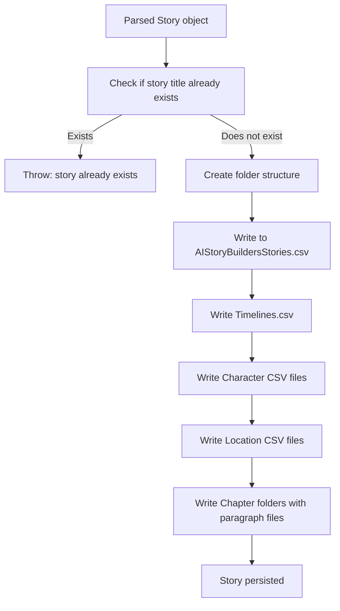
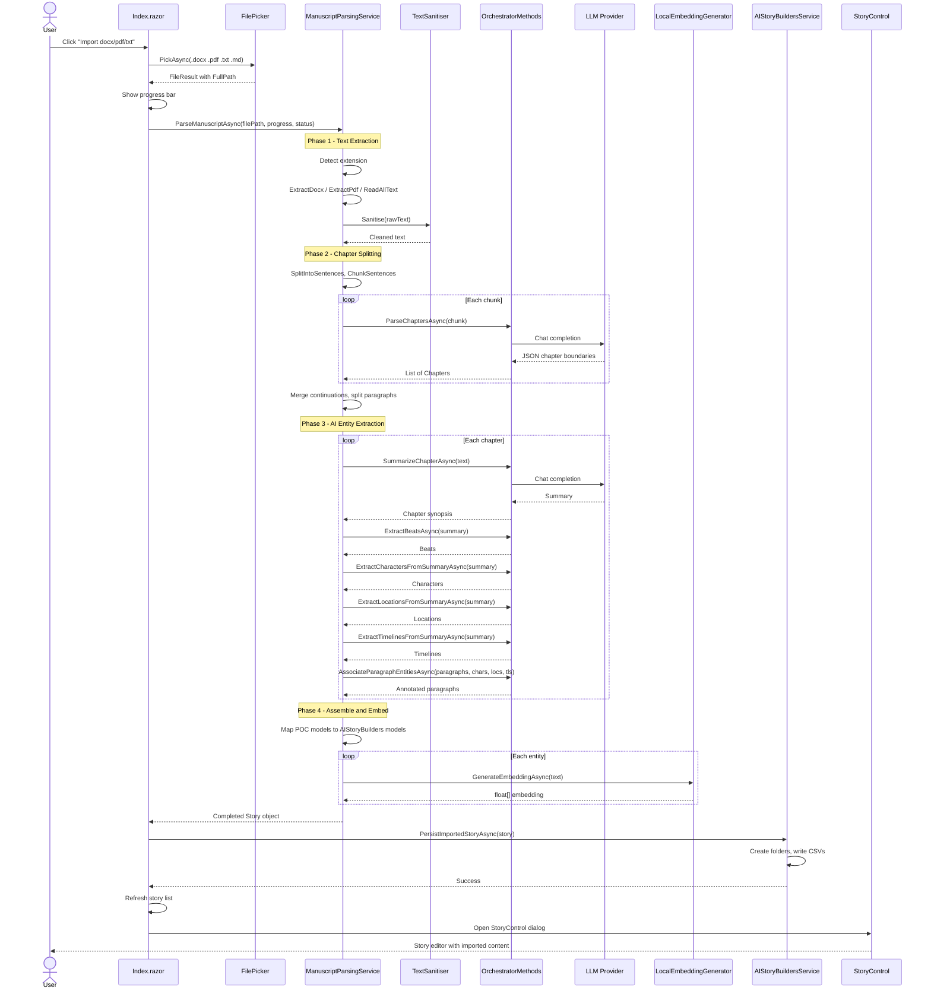

# Import docx/pdf/txt Manuscript Feature Plan

## 1. Overview

This document describes the plan for adding a **manuscript file import** capability to AIStoryBuilders. Users will be able to import `.docx`, `.pdf`, `.txt`, and `.md` files directly from the Home screen. The imported file will be parsed through a multi-phase AI pipeline (adapted from the StoryParserProofOfConcept project) that extracts chapters, paragraphs, characters, locations, and timelines, then opens the resulting story in the Story editor.

### 1.1 Goals

- Add an **"Import docx/pdf/txt"** button next to the existing "Import Story" button on the Home screen
- Accept `.docx`, `.pdf`, `.txt`, and `.md` files via the MAUI `FilePicker`
- Run a four-phase AI parsing pipeline to convert raw manuscript text into a fully structured `Story`
- Persist the parsed story to the AIStoryBuilders file system (CSV/folder layout)
- Open the newly imported story in the `StoryControl` editor immediately after import

### 1.2 Reference Implementation

The parsing pipeline is adapted from **StoryParserProofOfConcept** located at:

```
C:\Users\webma\Source\Repos\ADefWebserver\StoryParserProofOfConcept
```

Key source files in that project:

| File | Purpose |
|------|---------|
| `Services/ManuscriptParsingService.cs` | Four-phase parsing pipeline (extract text, split chapters, AI entity extraction, embeddings) |
| `Services/OrchestratorAIService.cs` | LLM prompt routing for chapter parsing, character/location/timeline extraction |
| `Services/TextSanitiser.cs` | Unicode cleanup and whitespace normalization |
| `Services/IParsingService.cs` | Interface: `ParseAsync(filePath, progress, statusProgress)` |
| `Services/IAIService.cs` | Interface for AI methods (ParseChaptersAsync, ExtractCharactersFromSummaryAsync, etc.) |
| `Models/Story.cs`, `Chapter.cs`, `Character.cs`, `Location.cs` | POC data models |

---

## 2. Architecture

### 2.1 System Component Diagram



### 2.2 Model Mapping: POC to AIStoryBuilders

The StoryParserProofOfConcept uses its own model classes. These must be mapped to AIStoryBuilders models during import.

| POC Model | AIStoryBuilders Model | Key Differences |
|-----------|-----------------------|-----------------|
| `Story { Title, Genre, Synopsis, Theme }` | `Story { Title, Style, Synopsis, Theme }` | `Genre` maps to `Style` |
| `Chapter { Index, Title, RawText, Paragraphs, Synopsis, BeatsSummary }` | `Chapter { Sequence, ChapterName, Synopsis, Paragraph[] }` | `Index` maps to `Sequence`, `Title` to `ChapterName` |
| `Paragraph { Index, Location, Timeline, Characters, Text }` | `Paragraph { Sequence, ParagraphContent, Location, Timeline, Characters }` | `Index` to `Sequence`, `Text` to `ParagraphContent` |
| `Character { Name, Backstory, Backgrounds[] }` | `Character { CharacterName, CharacterBackground[] }` | `Name` to `CharacterName`, background entries map 1:1 |
| `Location { Name, Description }` | `Location { LocationName, LocationDescription[] }` | Single description becomes one `LocationDescription` entry |
| `Timeline { Name, Description, StartDate, EndDate }` | `Timeline { TimelineName, TimelineDescription, StartDate, StopDate }` | `EndDate` to `StopDate` |

---

## 3. Implementation Plan

### 3.1 Phase Summary



---

### 3.2 Phase 1: Add NuGet Packages and TextSanitiser

#### 3.2.1 NuGet Packages

AIStoryBuilders already has most dependencies. Two new packages are needed for file extraction:

| Package | Version | Purpose |
|---------|---------|---------|
| `DocumentFormat.OpenXml` | 3.3.0+ | Extract text from `.docx` files |
| `PdfPig` | 0.1.13+ | Extract text from `.pdf` files |

Add to `AIStoryBuilders.csproj`:

```xml
<PackageReference Include="DocumentFormat.OpenXml" Version="3.3.0" />
<PackageReference Include="PdfPig" Version="0.1.13" />
```

#### 3.2.2 TextSanitiser Utility

Create `Services/TextSanitiser.cs` adapted from the POC. This static helper strips invisible Unicode characters, normalises whitespace, and removes control characters.

**Key methods to port:**

```csharp
public static class TextSanitiser
{
    public const int MaxEmbeddingChars = 1500;
    public static (string Cleaned, bool WasTruncated) Sanitise(string raw);
}
```

This is a direct copy with namespace change from `StoryParserProofOfConcept.Services` to `AIStoryBuilders.Services`.

---

### 3.3 Phase 2: ManuscriptParsingService

Create `Services/ManuscriptParsingService.cs` — the core parsing engine. This service orchestrates the four-phase pipeline.

#### 3.3.1 Interface

Create `Services/IManuscriptParsingService.cs`:

```csharp
public interface IManuscriptParsingService
{
    Task<Story> ParseManuscriptAsync(
        string filePath,
        IProgress<int> progress,
        IProgress<string> statusProgress);
}
```

#### 3.3.2 Pipeline Phases



#### 3.3.3 Text Extraction Methods

Port from `ManuscriptParsingService.cs` in the POC:

```csharp
private static string ExtractDocx(string path)
{
    using var doc = WordprocessingDocument.Open(path, false);
    var body = doc.MainDocumentPart?.Document.Body;
    if (body is null) return string.Empty;

    var sb = new StringBuilder();
    foreach (var para in body.Descendants<DocumentFormat.OpenXml.Wordprocessing.Paragraph>())
    {
        sb.AppendLine(para.InnerText);
    }
    return sb.ToString();
}

private static string ExtractPdf(string path)
{
    using var document = PdfDocument.Open(path);
    var sb = new StringBuilder();
    foreach (var page in document.GetPages())
    {
        sb.AppendLine(page.Text);
    }
    return sb.ToString();
}
```

For `.txt` and `.md` files, use `File.ReadAllTextAsync(filePath)`.

#### 3.3.4 Sentence Splitting and Chunking

Port the `SplitIntoSentences` and `ChunkSentences` methods directly from the POC. These split on sentence-ending punctuation followed by uppercase letters and group sentences into chunks of 100 for LLM consumption.

#### 3.3.5 Paragraph Splitting

Port the `SplitIntoParagraphs` method that splits on blank lines and collapses internal line breaks into single spaces. Also port the oversized paragraph detection (over 500 words) with LLM-based splitting and heuristic fallback.

#### 3.3.6 Chapter Heading Removal

Port `StripChapterHeading` which removes chapter title lines from the beginning of chapter text to prevent them from becoming content paragraphs.

#### 3.3.7 Working Directory

Use a temp directory under the system temp path:

```csharp
private static readonly string WorkingDir =
    Path.Combine(Path.GetTempPath(), "AIStoryBuilders", "_ManuscriptImport");
```

This avoids the hardcoded `c:\Temp\NarativeOS` path from the POC.

---

### 3.4 Phase 3: AI Prompt Methods for Manuscript Parsing

Add new methods to `OrchestratorMethods` (or a new partial class file `OrchestratorMethods.ManuscriptParsing.cs`) to handle the AI calls needed by the parsing pipeline.

#### 3.4.1 Required AI Methods

| Method | Input | Output | Purpose |
|--------|-------|--------|---------|
| `ParseChaptersAsync(string chunkText)` | Raw text chunk | `List<ChapterBoundary>` | LLM identifies chapter titles and boundaries |
| `SummarizeChapterAsync(string chapterText)` | Full chapter text | `string` summary | Comprehensive chapter summary |
| `ExtractBeatsAsync(string chapterSummary)` | Chapter summary | `string` beats | Narrative beats for .stybld format |
| `ExtractCharactersFromSummaryAsync(string summary, string chapterTitle)` | Chapter summary | `List<ParsedCharacter>` | Characters mentioned in this chapter |
| `ExtractLocationsFromSummaryAsync(string summary, string chapterTitle)` | Chapter summary | `List<ParsedLocation>` | Locations mentioned in this chapter |
| `ExtractTimelinesFromSummaryAsync(string summary, string title, int index)` | Chapter summary | `List<ParsedTimeline>` | Timeline events in this chapter |
| `AssociateParagraphEntitiesAsync(paragraphs, characters, locations, timelines)` | Paragraphs and entity lists | Annotated paragraphs | Tag each paragraph with its location, timeline, characters |
| `SplitLongParagraphAsync(string text)` | Oversized paragraph text | `List<string>` sub-paragraphs | Split at natural pause points |

#### 3.4.2 Prompt Design

Each method sends a system prompt and user prompt to the configured LLM via the existing `OrchestratorMethods` infrastructure. The AI returns JSON which is deserialized into structured results.

**Example: Chapter boundary detection prompt pattern:**

```
System: You are a manuscript analysis assistant. Given a chunk of text from a
novel, identify chapter boundaries. Return JSON with an array of chapters,
each containing "title" and "firstSentence" fields.

User: [chunk of 100 sentences]
```

All prompts should be defined as template strings within `OrchestratorMethods.ManuscriptParsing.cs` or loaded from a prompt template service if one exists.

#### 3.4.3 JSON Response Models

Create internal DTOs in `AI/OrchestratorMethods.ManuscriptParsing.cs` for deserializing LLM responses:

```csharp
private class ChapterBoundaryResult
{
    public List<ChapterBoundaryEntry> Chapters { get; set; }
}

private class ChapterBoundaryEntry
{
    public string Title { get; set; }
    public string FirstSentence { get; set; }
}

// Similar DTOs for CharacterFromSummaryResult, LocationFromSummaryResult, etc.
```

---

### 3.5 Phase 4: UI - Button and Progress Dialog

#### 3.5.1 Add Button to Home Screen

In `Components/Pages/Index.razor`, add a new button next to the existing "Import Story" button:

**Current layout:**

```
[New Story]  [Import Story]
```

**New layout:**

```
[New Story]  [Import Story]  [Import docx/pdf/txt]
```

```html
<RadzenButton Click=@(() => NewStory())
              Text="New Story" Icon="add"
              ButtonStyle="ButtonStyle.Success" />
<span>&nbsp; &nbsp;</span>
<RadzenButton Click=@(() => ImportStory())
              Text="Import Story" Icon="publish"
              ButtonStyle="ButtonStyle.Light" />
<span>&nbsp; &nbsp;</span>
<RadzenButton Click=@(() => ImportManuscript())
              Text="Import docx/pdf/txt" Icon="description"
              ButtonStyle="ButtonStyle.Info" />
```

#### 3.5.2 File Picker Configuration

The `ImportManuscript()` method configures the MAUI `FilePicker` to accept manuscript file types:

```csharp
private async Task ImportManuscript()
{
    var result = await FilePicker.PickAsync(new PickOptions
    {
        PickerTitle = "Select a manuscript file",
        FileTypes = new FilePickerFileType(new Dictionary<DevicePlatform, IEnumerable<string>>
        {
            { DevicePlatform.iOS, new[] { "public.content" } },
            { DevicePlatform.Android, new[] { "application/*", "text/*" } },
            { DevicePlatform.WinUI, new[] { ".docx", ".pdf", ".txt", ".md" } },
        })
    });

    if (result is null) return;

    // Launch parsing pipeline...
}
```

#### 3.5.3 Progress Dialog

Create a Radzen dialog or inline progress panel (matching the existing `InProgress` pattern) to show parsing status:



Implement using the existing `InProgress` bool and `RadzenProgressBar` pattern already in `Index.razor`, enhanced with a status message:

```csharp
@if (InProgress)
{
    <div class="rz-m-10">
        <RadzenProgressBar Value="@_parseProgress" Max="100"
                           ShowValue="true" />
        <RadzenText TextStyle="TextStyle.Body2" Style="color: #64748b;">
            @_parseStatus
        </RadzenText>
    </div>
}
```

Add fields to Index.razor `@code`:

```csharp
private int _parseProgress = 0;
private string _parseStatus = "";
```

#### 3.5.4 Full ImportManuscript Method

```csharp
private async Task ImportManuscript()
{
    try
    {
        var result = await FilePicker.PickAsync(new PickOptions
        {
            PickerTitle = "Select a manuscript file",
            FileTypes = new FilePickerFileType(
                new Dictionary<DevicePlatform, IEnumerable<string>>
            {
                { DevicePlatform.iOS, new[] { "public.content" } },
                { DevicePlatform.Android, new[] { "application/*", "text/*" } },
                { DevicePlatform.WinUI, new[] { ".docx", ".pdf", ".txt", ".md" } },
            })
        });

        if (result is null) return;

        InProgress = true;
        _parseProgress = 0;
        _parseStatus = "Starting import...";
        StateHasChanged();

        var progress = new Progress<int>(p =>
        {
            _parseProgress = p;
            InvokeAsync(StateHasChanged);
        });

        var statusProgress = new Progress<string>(s =>
        {
            _parseStatus = s;
            InvokeAsync(StateHasChanged);
        });

        // Run the parsing pipeline
        var parsedStory = await ManuscriptParsingService.ParseManuscriptAsync(
            result.FullPath, progress, statusProgress);

        // Persist to AIStoryBuilders file system
        await AIStoryBuildersService.PersistImportedStoryAsync(parsedStory);

        // Refresh story list
        colStorys = AIStoryBuildersService.GetStorys();
        StateHasChanged();

        // Open the story in the editor
        var storyToEdit = colStorys.First(s => s.Title == parsedStory.Title);
        await EditStory(storyToEdit);
    }
    catch (Exception ex)
    {
        NotificationService.Notify(new NotificationMessage
        {
            Severity = NotificationSeverity.Error,
            Summary = "Import Failed",
            Detail = ex.Message,
            Duration = 4000
        });

        LogService.WriteToLog("ImportManuscript: " + ex.Message);
    }
    finally
    {
        InProgress = false;
        _parseProgress = 0;
        _parseStatus = "";
        StateHasChanged();
    }
}
```

---

### 3.6 Phase 5: Story Persistence and Editor Launch

#### 3.6.1 PersistImportedStoryAsync

Add a new method to `AIStoryBuildersService` (in the existing `AIStoryBuildersService.ExportImport.cs` partial class or a new `AIStoryBuildersService.ManuscriptImport.cs`) that takes the parsed `Story` object and writes it to the file system in the standard AIStoryBuilders folder layout.



**Folder structure created:**

```
{MyDocuments}/AIStoryBuilders/
    AIStoryBuildersStories.csv        <-- append story row
    {StoryTitle}/
        Timelines.csv                 <-- pipe-delimited timeline entries
        Characters/
            {CharName}.csv            <-- Type|TimelineName|Description+Embedding
        Locations/
            {LocName}.csv             <-- LocationName||Embedding
        Chapters/
            Chapter1/
                Chapter1.txt          <-- Beats summary | Embedding
                Paragraph1.txt        <-- Location|Timeline|[Chars]|Text|Embedding
                Paragraph2.txt
            Chapter2/
                ...
```

This method must:

1. Validate the story title is not a duplicate
2. Create the directory tree
3. Write `AIStoryBuildersStories.csv` entry: `id|Title|Style|Theme|Synopsis|WorldFacts`
4. Write `Timelines.csv` with pipe-delimited rows
5. For each character, write a `.csv` file under `Characters/`
6. For each location, write a `.csv` file under `Locations/`
7. For each chapter, create a folder under `Chapters/` with:
   - `ChapterN.txt` containing beats and embedding
   - `ParagraphN.txt` files with `Location|Timeline|[Characters]|Text|Embedding`

#### 3.6.2 Embedding Generation During Persist

Each paragraph, character background, and location description needs an embedding vector. Use the existing `OrchestratorMethods.GetVectorEmbedding()` method to generate embeddings as data is written.

#### 3.6.3 Editor Launch

After persistence, the code calls the existing `EditStory(story)` method which opens `StoryControl` as a Radzen dialog:

```csharp
var parms = new Dictionary<string, object>();
parms.Add("objStory", storyToEdit);

var EditStoryResult = await dialogService.OpenAsync<StoryControl>(
    $"{storyToEdit.Title}", parms,
    new DialogOptions() { Height = "720px", Width = "950px" });
```

---

### 3.7 Phase 6: Testing

#### 3.7.1 Test Matrix

| Test Case | Input | Expected Result |
|-----------|-------|-----------------|
| Import `.docx` novel | Multi-chapter Word document | Chapters, characters, locations extracted and visible in editor |
| Import `.pdf` novel | PDF file with chapter headings | Same as above |
| Import `.txt` file | Plain text with chapter markers | Same as above |
| Import `.md` file | Markdown file | Same as above |
| Import single-chapter file | Short story with no chapter headings | Single chapter "Chapter 1" created |
| Duplicate story title | Import file with same name as existing story | Error notification shown |
| Cancel file picker | User dismisses file dialog | No action, returns to Home screen |
| Unsupported file type | File picker should prevent this | Only .docx/.pdf/.txt/.md selectable |
| Large file (100+ chapters) | Gutenberg novel | Progress bar updates per chapter, no timeouts |

---

## 4. Files to Create or Modify

### 4.1 New Files

| File | Description |
|------|-------------|
| `Services/IManuscriptParsingService.cs` | Interface for the parsing pipeline |
| `Services/ManuscriptParsingService.cs` | Four-phase parsing engine ported from POC |
| `Services/TextSanitiser.cs` | Unicode cleanup utility ported from POC |
| `AI/OrchestratorMethods.ManuscriptParsing.cs` | AI prompt methods for chapter splitting, entity extraction |

### 4.2 Modified Files

| File | Change |
|------|--------|
| `AIStoryBuilders.csproj` | Add `DocumentFormat.OpenXml` and `PdfPig` NuGet packages |
| `MauiProgram.cs` | Register `IManuscriptParsingService` / `ManuscriptParsingService` in DI |
| `Components/Pages/Index.razor` | Add "Import docx/pdf/txt" button, progress bar, `ImportManuscript()` method |
| `Services/AIStoryBuildersService.ExportImport.cs` (or new partial) | Add `PersistImportedStoryAsync()` method |

### 4.3 Dependency Registration

In `MauiProgram.cs`, add:

```csharp
builder.Services.AddSingleton<IManuscriptParsingService, ManuscriptParsingService>();
```

The `ManuscriptParsingService` constructor will take `OrchestratorMethods`, `LogService`, and `AIStoryBuildersService` as injected dependencies.

---

## 5. Sequence Diagram: Full Import Flow



---

## 6. Error Handling Strategy

| Scenario | Handling |
|----------|----------|
| Unsupported file extension | Throw `NotSupportedException` with message, caught at UI layer |
| File read failure (permissions, corrupt) | Catch in Phase 1, show error notification, log to `LogService` |
| LLM API failure during chapter splitting | Fallback: treat entire text as one chapter "Chapter 1" |
| LLM API failure during entity extraction | Skip that extraction step, continue with empty lists |
| LLM returns malformed JSON | Use `JsonRepairUtility` (already in AI folder) to attempt repair, then fallback |
| Oversized paragraph LLM split changes text | Fallback to `HeuristicSplit` with 250-word target |
| Duplicate story title during persist | Show notification: "Story already exists. Rename or delete first." |
| Temp directory cleanup | Always clean up in `finally` block |

---

## 7. Configuration Considerations

### 7.1 Working Directory

The parsing service uses a temp working directory for intermediate files. This prevents large manuscripts from being held entirely in memory.

```csharp
Path.Combine(Path.GetTempPath(), "AIStoryBuilders", "_ManuscriptImport")
```

The directory is created at the start of each import and deleted after completion.

### 7.2 LLM Token Limits

The POC chunks text into groups of 100 sentences before sending to the LLM. This same strategy should be used to stay within token limits. The `MaxEmbeddingChars = 1500` constant in `TextSanitiser` controls the maximum text length sent for embedding generation.

### 7.3 Large File Support

For novels with many chapters, the pipeline processes chapters sequentially with progress updates. Memory is managed by:

- Saving raw text to disk after extraction and freeing the string
- Processing one chapter at a time in Phase 3
- Yielding to the UI thread between chapters with `await Task.Delay(1)`

---

## 8. Summary of Key Decisions

1. **Adapt, not copy** - The POC code is adapted to work with AIStoryBuilders models and file storage, not used as-is
2. **Use existing AI infrastructure** - All LLM calls go through the existing `OrchestratorMethods` which already handles provider selection (OpenAI, Anthropic, Google)
3. **Use existing embedding infrastructure** - Embeddings use the existing `LocalEmbeddingGenerator` (ONNX-based)
4. **File system persistence** - Matches the existing CSV/folder pattern already used by AIStoryBuilders, not the POC .stybld ZIP format
5. **Progress feedback** - Real-time progress bar and status text keep users informed during long imports
6. **Graceful degradation** - LLM failures produce partial results rather than complete failure
