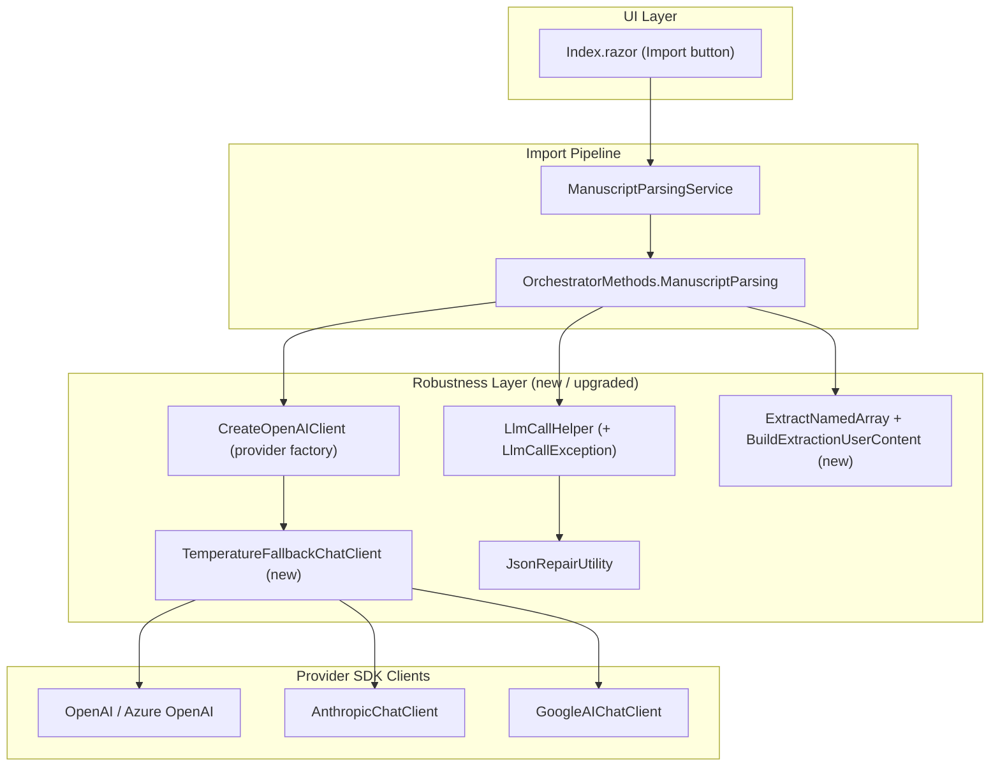
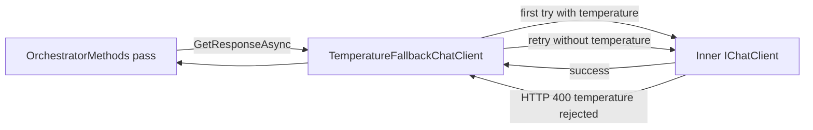
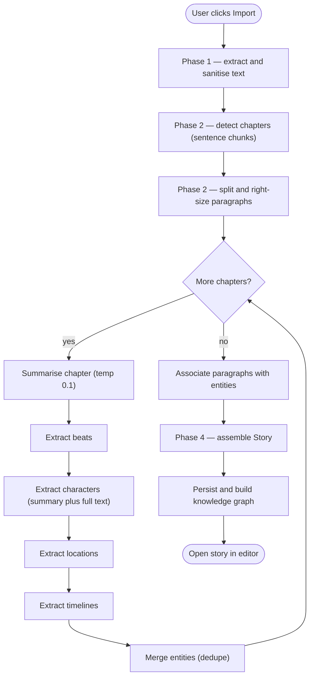
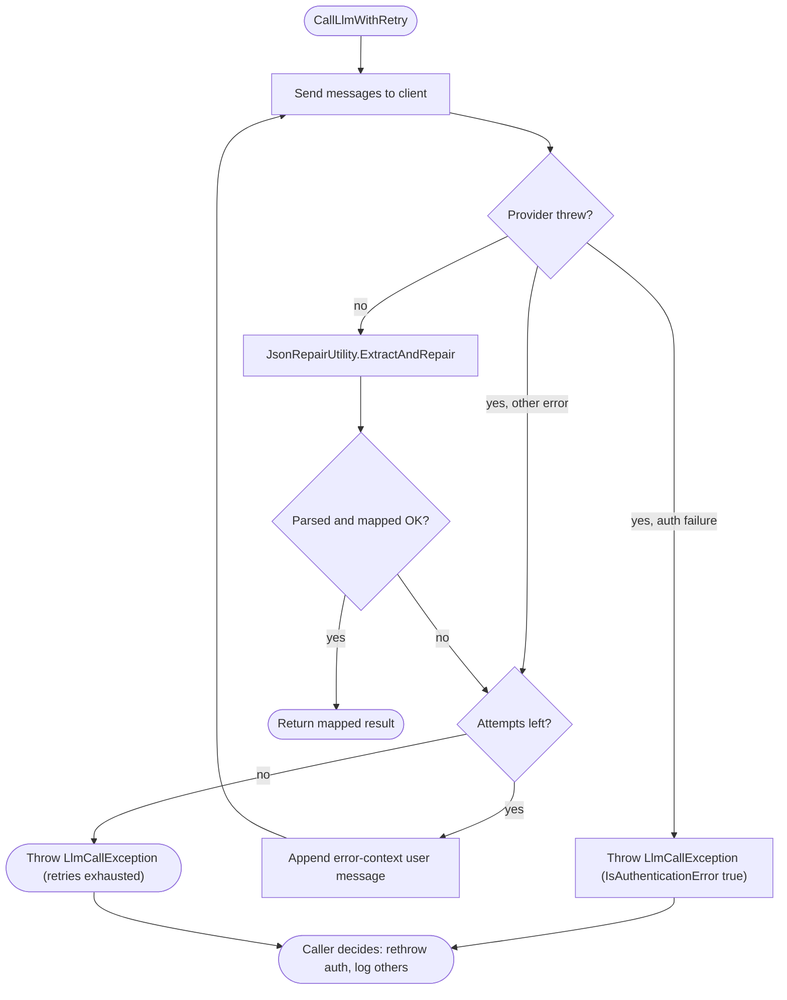

# Import Story — Lesser-Model Parity Plan

## 1. Purpose

The reference project `AIStoryBuildersGraph`
(`C:\Users\webma\Source\Repos\AIStoryBuilders\AIStoryBuildersGraph`) imports a
manuscript through the **same broad pipeline** that this project
(`ADefWebserver\AIStoryBuilders`) already uses, but it is markedly more reliable
when the configured provider is a **weaker / cheaper / newer model** (for
example `gemini-2.5-flash`, `gpt-4o-mini`, `gpt-5.x`, or `claude-opus-4-8`).

This document defines the work required to bring the **Import Story** pipeline
in this project to parity with the reference, focusing specifically on the
techniques the reference uses to let lesser models succeed.

The goal is **behavioral parity**, not a file-for-file copy: this project keeps
its `OrchestratorMethods` + `ManuscriptParsingService` structure, but adopts the
reference's robustness layer.

---

## 2. Background — How the Reference Enables Lesser Models

The reference relies on seven concrete techniques. Each one independently
protects a category of weak-model failure.

| # | Technique | Reference location | Weak-model failure it prevents |
|---|-----------|--------------------|--------------------------------|
| 1 | **Temperature fallback wrapper** | `TemperatureFallbackChatClient.cs` + `ChatClientFactory.cs` | Newer models reject a non-default temperature with HTTP 400 (`temperature ... unsupported / deprecated`). Without the wrapper *every* LLM pass fails and the import silently yields an empty story. |
| 2 | **Low deterministic temperature (0.1)** | Every narrow pass in `ManuscriptImportService.cs` sets `Temperature = 0.1f` | Weak models drift into prose/markdown when temperature is high; 0.1 makes structured JSON stable. |
| 3 | **Authentication-error surfacing** | `LlmCallException` + `IsAuthenticationFailure` in `LlmCallHelper.cs` | A bad key / 401 / 403 is rethrown instead of swallowed as an empty result, so the user sees a real error rather than a blank story. |
| 4 | **Bare-array tolerance** | `ExtractNamedArray(node, "characters")` in `ManuscriptImportService.cs` | Lesser models frequently return a top-level `[ ... ]` instead of `{ "characters": [ ... ] }`. Indexing a `JsonArray` by name otherwise throws. |
| 5 | **Full-text extraction fallback** | `BuildExtractionUserContent(summary, chapterText)` | Weak models write thin summaries; appending the chapter text lets single-mention entities still be found. |
| 6 | **High-recall prompts** | Character / location / timeline system prompts | Explicit "include minor characters, organisations, canonical location names, split composite places" instructions compensate for low recall. |
| 7 | **Tight, model-aware context** | `MaxChapterPreviewChars = 24000`, `ManuscriptBatcher.MapBatchCharCap = 16000` | A small, focused context is what makes a weak model reliable; large windows are deliberately *not* used to raise the cap. |

> The temperature bug already observed in this project
> (`claude-opus-4-8` → `temperature is deprecated for this model`) is exactly the
> failure category #1 eliminates automatically, for **every** provider and
> **every** pass, instead of one hand-maintained allow-list.

---

## 3. Current State vs. Target (Gap Analysis)

This project already has the structural pipeline:

- `Services/ManuscriptParsingService.cs` — phase orchestration (extract →
  chapters → paragraphs → entities → assemble).
- `AI/OrchestratorMethods.ManuscriptParsing.cs` — the narrow per-chapter LLM
  passes.
- `AI/LlmCallHelper.cs` — retry + JSON repair.
- `AI/JsonRepairUtility.cs` — deterministic JSON repair.
- `AI/ChatOptionsFactory.cs` — JSON options builder.
- `AI/OrchestratorMethods.cs::CreateOpenAIClient` — provider client factory.

The gaps are confined to the robustness layer:

| Capability | Reference | This project today | Action |
|------------|-----------|--------------------|--------|
| Temperature fallback | `TemperatureFallbackChatClient` wraps every client | **Missing** — `CreateOpenAIClient` returns a raw client | **Add** wrapper + apply in factory |
| Deterministic temperature | `Temperature = 0.1f` on each pass | Passes use no temperature (`CreateJsonOptions` / `ModelId` only) | **Add** `Temperature = 0.1f` |
| Auth-error surfacing | `LlmCallException(IsAuthenticationError)` rethrown | `CallLlmWithRetry` returns `null`, swallows everything | **Add** exception type + detection + rethrow |
| Bare-array tolerance | `ExtractNamedArray` | `jObj["characters"] as JArray` only | **Add** helper, use in every array map |
| Full-text fallback | extraction passes accept `chapterText` | passes accept only `chapterSummary` | **Add** optional `chapterText` parameter |
| High-recall prompts | detailed inclusion rules | basic prompts | **Upgrade** prompt text |
| Chapter preview size | `24000` | `8000` in `SummarizeChapterAsync` | **Raise** to cover a full chapter |
| Model-aware batch cap | `ManuscriptBatcher` (16k cap) | fixed `ChunkSentences(.,100)` | **Optional** — add cap by char budget |

---

## 4. Target Architecture

### 4.1 Component structure



### 4.2 Where the temperature fallback sits



---

## 5. Process Flows

### 5.1 End-to-end Import Story pipeline



### 5.2 LLM call with retry, repair, and auth-error surfacing



> Note on the diagrams above: edge labels avoid a leading `number + period`
> pattern (for example `1.`) because the Mermaid renderer treats that as a
> Markdown numbered list inside the label. Node labels contain no `\n`.

---

## 6. Detailed Implementation

Implement the changes in the order below. Each step is independently
compilable and testable.

### 6.1 Add `TemperatureFallbackChatClient`

**New file:** `AI/TemperatureFallbackChatClient.cs`

Port the reference's `DelegatingChatClient` wrapper. Responsibilities:

- Override `GetResponseAsync`: try once with the supplied options; on an
  exception that indicates the temperature is unsupported, clone the options
  with `Temperature = null` and retry once.
- Override `GetStreamingResponseAsync` with the same logic (restart the stream
  only if no tokens were emitted yet). Streaming is not used by the import
  pipeline today, but include it for completeness/parity.
- `IsTemperatureUnsupported(ex, options)`: only treat as temperature-related
  when `options.Temperature` was actually set, and the exception chain message
  contains `temperature` together with any of `unsupported`,
  `does not support`, `deprecated`, or `only the default`.
- `WithoutTemperature(options)`: `options.Clone()` then null the temperature.

Sketch:

```csharp
public sealed class TemperatureFallbackChatClient : DelegatingChatClient
{
    public TemperatureFallbackChatClient(IChatClient inner) : base(inner) { }

    public override async Task<ChatResponse> GetResponseAsync(
        IEnumerable<ChatMessage> messages,
        ChatOptions options = null,
        CancellationToken ct = default)
    {
        try
        {
            return await base.GetResponseAsync(messages, options, ct);
        }
        catch (Exception ex) when (IsTemperatureUnsupported(ex, options))
        {
            return await base.GetResponseAsync(messages, WithoutTemperature(options), ct);
        }
    }

    // GetStreamingResponseAsync, IsTemperatureUnsupported, WithoutTemperature
    // ported verbatim from the reference.
}
```

> This makes the existing `StoryChatService.SupportsCustomTemperature`
> allow-list redundant for correctness. Keep it (it still avoids one wasted
> round-trip), but the wrapper becomes the safety net of record.

### 6.2 Apply the wrapper in the client factory

**Edit:** `AI/OrchestratorMethods.cs` — `CreateOpenAIClient(string paramAIModel)`.

Wrap the provider client just before returning, so **every** import pass (and
every other orchestrator call) inherits the fallback:

```csharp
IChatClient client = SettingsService.AIType switch
{
    "OpenAI"       => /* existing OpenAI client */,
    "Azure OpenAI" => /* existing Azure client  */,
    "Anthropic"    => new AnthropicChatClient(ApiKey, AIModel),
    "Google AI"    => new GoogleAIChatClient(ApiKey, AIModel),
    _ => throw new NotSupportedException($"AI provider '{SettingsService.AIType}' is not supported.")
};

return new TemperatureFallbackChatClient(client);
```

### 6.3 Set a deterministic temperature on every structured pass

**Edit:** `AI/OrchestratorMethods.ManuscriptParsing.cs` and
`AI/ChatOptionsFactory.cs`.

- For JSON passes, set `Temperature = 0.1f` and `MaxOutputTokens` on the
  options returned by `ChatOptionsFactory.CreateJsonOptions`, or set it at the
  call site. Recommended: add an overload so intent is explicit:

```csharp
public static ChatOptions CreateJsonOptions(
    string aiServiceType, string modelId = null,
    float? temperature = 0.1f, int? maxOutputTokens = 4096)
{
    var options = new ChatOptions { Temperature = temperature, MaxOutputTokens = maxOutputTokens };
    if (modelId != null) options.ModelId = modelId;
    if (aiServiceType is "OpenAI" or "Azure OpenAI")
        options.ResponseFormat = ChatResponseFormat.Json;
    return options;
}
```

- For text passes (`SummarizeChapterAsync`, `ExtractBeatsAsync`) replace
  `new ChatOptions { ModelId = ... }` with
  `new ChatOptions { ModelId = ..., Temperature = 0.1f, MaxOutputTokens = ... }`.

Because of step 6.1, setting `0.1f` is now safe even on models that reject it —
the wrapper strips it transparently.

### 6.4 Add `LlmCallException` and auth-error surfacing

**Edit:** `AI/LlmCallHelper.cs`.

1. Add the exception type:

```csharp
public class LlmCallException : Exception
{
    public bool IsAuthenticationError { get; }
    public LlmCallException(string message, bool isAuthenticationError, Exception inner = null)
        : base(message, inner) => IsAuthenticationError = isAuthenticationError;
}
```

2. Add `IsAuthenticationFailure(Exception)` — walk the `InnerException` chain
   and return true for `HttpRequestException` with 401/403, for any exception
   exposing a `Status` property equal to 401/403, or for messages containing
   `invalid x-api-key`, `invalid_api_key`, `authentication_error`,
   `API key not valid`, `Incorrect API key`, `Unauthorized`, or `401`.

3. In `CallLlmWithRetry` and `CallLlmForText`:
   - Catch `OperationCanceledException` first and rethrow.
   - Add `catch (Exception ex) when (IsAuthenticationFailure(ex))` → throw
     `LlmCallException(..., isAuthenticationError: true, ex)`.
   - On exhausting retries, throw `LlmCallException(..., false)` instead of
     returning `null` (or keep `null` for text but log clearly — choose one and
     be consistent; the reference throws).

> Behavior change: callers that previously treated `null` as "skip this pass"
> must now catch `LlmCallException`. The reference pattern in
> `ManuscriptImportService` is the template:
>
> ```csharp
> try { chapter.Synopsis = await SummarizeChapterAsync(...); }
> catch (LlmCallException ex) when (ex.IsAuthenticationError) { throw; }
> catch (Exception ex) { _logService.WriteToLog($"...: {ex.Message}"); }
> ```
>
> Apply this `catch`/`catch` pair around each pass in
> `ManuscriptParsingService.ParseManuscriptAsync` so auth failures abort the
> import with a clear message while content failures degrade gracefully.

### 6.5 Add bare-array tolerance

**Edit:** `AI/OrchestratorMethods.ManuscriptParsing.cs`.

Add a helper (Newtonsoft variant, since this project parses with `JObject`):

```csharp
private static JArray ExtractNamedArray(JToken node, string propertyName)
{
    if (node is JArray topLevel) return topLevel;
    if (node is JObject obj && obj[propertyName] is JArray arr) return arr;
    return null;
}
```

> Caveat: `LlmCallHelper.CallLlmWithRetry` currently calls `JObject.Parse`,
> which **throws on a bare top-level array**. To benefit from
> `ExtractNamedArray`, change the helper to `JToken.Parse` and pass a `JToken`
> into the `mapResult` delegate (update the generic signature from
> `Func<JObject, T>` to `Func<JToken, T>`). Then every map lambda uses
> `ExtractNamedArray(token, "characters")` instead of `jObj["characters"] as JArray`.

Update each extraction map (characters, locations, timelines) accordingly.

### 6.6 Add the full-chapter-text extraction fallback

**Edit:** `AI/OrchestratorMethods.ManuscriptParsing.cs`.

- Add a private helper mirroring `BuildExtractionUserContent`:

```csharp
private const int MaxChapterPreviewChars = 24000;

private static string BuildExtractionUserContent(string chapterSummary, string chapterText)
{
    if (string.IsNullOrWhiteSpace(chapterText)) return chapterSummary;
    var preview = chapterText.Length > MaxChapterPreviewChars
        ? chapterText[..MaxChapterPreviewChars] + "..."
        : chapterText;
    var sb = new StringBuilder();
    sb.AppendLine("CHAPTER SUMMARY (use for structure):");
    sb.AppendLine(chapterSummary);
    sb.AppendLine();
    sb.AppendLine("FULL CHAPTER TEXT (scan for any additional named entities the summary omitted):");
    sb.AppendLine(preview);
    return sb.ToString();
}
```

- Add an optional `string chapterText = null` parameter to
  `ExtractCharactersFromSummaryAsync`, `ExtractLocationsFromSummaryAsync`, and
  `ExtractTimelinesFromSummaryAsync`, and feed the user message through
  `BuildExtractionUserContent`.
- In `ManuscriptParsingService`, pass `chapter.RawText` into each extraction
  call.

### 6.7 Upgrade the extraction prompts (high recall)

**Edit:** the system prompts in
`AI/OrchestratorMethods.ManuscriptParsing.cs`.

Replace the terse prompts with the reference's high-recall versions:

- **Characters:** include minor/secondary characters; include organisations,
  companies, firms, and groups that act as agents; use the fullest name form;
  record short forms as an `Aliases` background.
- **Locations:** be granular; split composite places (city vs. building vs.
  room); use canonical `"<owner or proper name>'s <place>"` naming; include
  single-mention places.
- **Summary:** state explicitly that the summary is the sole downstream
  evidence sheet and must enumerate every named character, place, and timeline
  thread even if mentioned once.

### 6.8 Raise the chapter preview window

**Edit:** `SummarizeChapterAsync` in
`AI/OrchestratorMethods.ManuscriptParsing.cs` — change the `8000` preview cap
to `MaxChapterPreviewChars` (`24000`) so a full chapter reaches the summariser.

### 6.9 (Optional) Model-aware batch cap

**Optional new file:** `Services/ManuscriptBatcher.cs` (port from reference) or
add a char-budget cap to `ChunkSentences`. Cap map-phase content at ~16k chars
regardless of the model's context window, since a tight context is what makes a
weak model reliable. Defer this if scope must be minimized; steps 6.1–6.8
deliver the bulk of the reliability gain.

---

## 7. Files Touched

| File | Change |
|------|--------|
| `AI/TemperatureFallbackChatClient.cs` | **New** — delegating wrapper |
| `AI/OrchestratorMethods.cs` | Wrap client in `CreateOpenAIClient` |
| `AI/LlmCallHelper.cs` | `LlmCallException`, auth detection, `JToken` map signature |
| `AI/ChatOptionsFactory.cs` | Temperature + max-tokens parameters |
| `AI/OrchestratorMethods.ManuscriptParsing.cs` | `ExtractNamedArray`, `BuildExtractionUserContent`, `chapterText` params, `Temperature = 0.1f`, larger preview, upgraded prompts |
| `Services/ManuscriptParsingService.cs` | Pass `chapter.RawText` to extraction; `catch (LlmCallException ... IsAuthenticationError) throw;` around each pass |
| `Services/ManuscriptBatcher.cs` | **New (optional)** — model-aware batch cap |

No changes are required to `Index.razor`, the `Story`/`Chapter`/`Paragraph`
models, or persistence — the contract of `ParseManuscriptAsync` is unchanged.

---

## 8. Testing & Validation

### 8.1 Build and static checks
- Solution compiles; `CallLlmWithRetry` callers updated for the `JToken`
  signature; no remaining `jObj["..."] as JArray` in the parsing passes.

### 8.2 Unit tests (recommended)
- `IsTemperatureUnsupported` returns true for representative messages
  (`temperature ... unsupported`, `... is deprecated for this model`,
  `only the default (1) value is supported`) and false when no temperature was
  set.
- `IsAuthenticationFailure` returns true for 401/403 and the listed message
  fragments; false for transient/content errors.
- `ExtractNamedArray` returns the array for both `{ "characters": [...] }` and
  a bare `[...]`, and `null` otherwise.
- `BuildExtractionUserContent` truncates at `MaxChapterPreviewChars` and falls
  back to summary-only when `chapterText` is empty.

### 8.3 Manual end-to-end matrix
Run the same short manuscript (`.docx`, `.pdf`, `.txt`) against:

| Provider / model | Expectation |
|------------------|-------------|
| `claude-opus-4-8` | Import succeeds; temperature stripped automatically; no `temperature is deprecated` error. |
| `gpt-5.x` / `o`-series | Import succeeds despite non-default temperature rejection. |
| `gpt-4o-mini` / `gemini-2.5-flash` | Characters/locations populated even with thin summaries (full-text fallback). |
| Invalid API key | Import aborts with a clear authentication error, **not** a blank story. |

### 8.4 Regression
- A strong model (e.g. `gpt-4o`) still imports with equal or better entity
  coverage; chapter/paragraph counts unchanged for a known manuscript.

---

## 9. Risks & Mitigations

| Risk | Mitigation |
|------|------------|
| Changing `CallLlmWithRetry` to throw breaks callers that relied on `null`. | Audit all `CallLlmWithRetry` call sites; wrap with the `catch (LlmCallException) { throw on auth, log otherwise }` pattern. Provide a compatibility window by logging at each call site. |
| `JObject` → `JToken` signature change ripples beyond parsing. | The generic delegate is internal to `LlmCallHelper`; update all map lambdas in one pass. Compiler enforces completeness. |
| Larger preview (`24000`) raises token cost. | Bounded by a single constant; acceptable for import accuracy. Tune per cost budget. |
| Streaming override is untested (import is non-streaming). | Port verbatim from the reference; covered by the chat path if/when streaming is enabled. |

---

## 10. Definition of Done

- `TemperatureFallbackChatClient` wraps every client from `CreateOpenAIClient`.
- Every structured import pass sets `Temperature = 0.1f` and succeeds on
  models that reject it.
- Authentication failures abort the import with a clear message; content
  failures degrade gracefully.
- Character/location/timeline extraction tolerates bare arrays and uses the
  full-chapter-text fallback with high-recall prompts.
- The provider matrix in §8.3 passes, including `claude-opus-4-8` and a
  deliberately invalid key.
