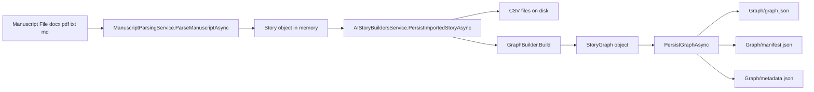
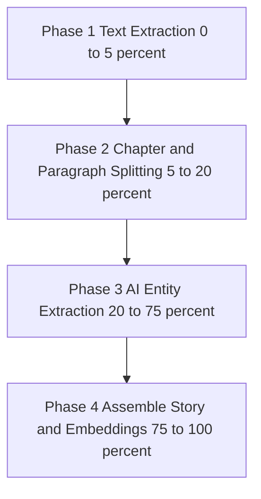
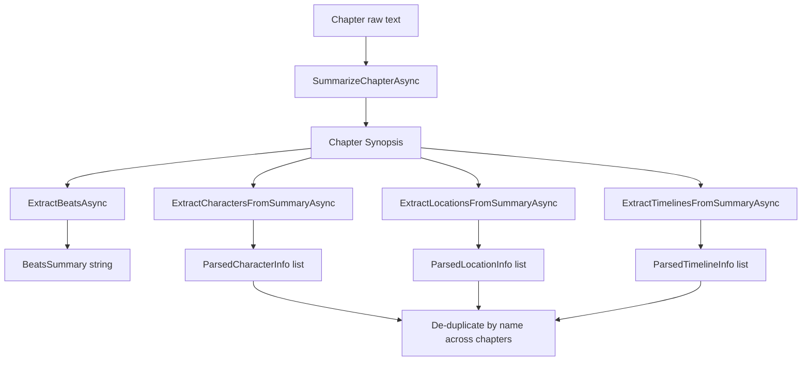
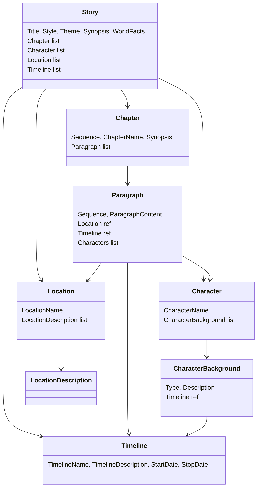
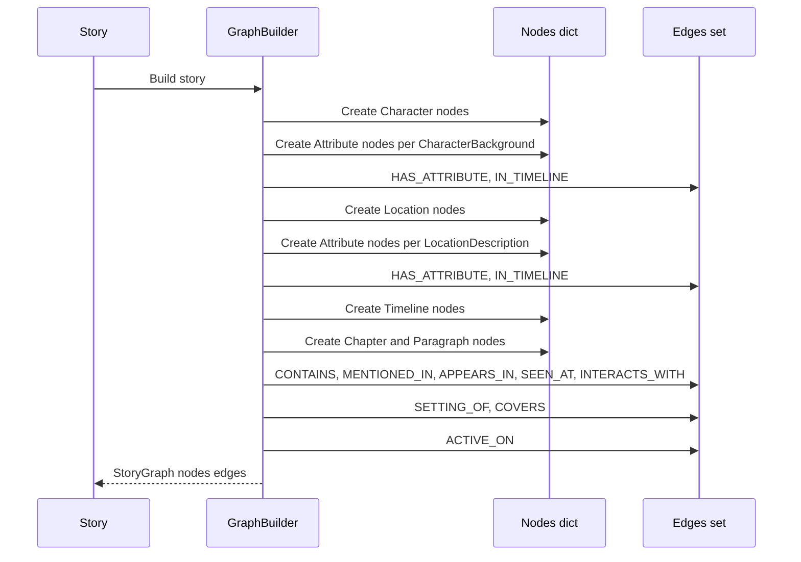
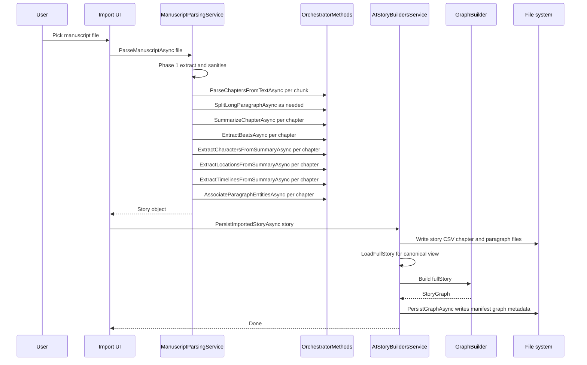

# Imported Story Parsing & `graph.json` Generation Plan

This document describes — in implementation-level detail — how AIStoryBuilders parses an imported manuscript (`.docx`, `.pdf`, `.txt`, `.md`) into a structured `Story` object and how that `Story` is converted into a persisted Knowledge Graph (`Graph/graph.json`).

It is intended as a self-contained reference: a developer should be able to read this document and (re)implement the entire pipeline, including detection of paragraphs, timelines, locations, characters, character attributes, chapters and the relationships between them.

---

## 1. High-level Pipeline

The end-to-end flow has two top-level stages:

1. **Manuscript Parsing** — turn a raw manuscript file into a `Story` object (in-memory).
2. **Graph Generation & Persistence** — turn the `Story` object into a `StoryGraph` and write it to `Graph/graph.json` on disk.



### Key components

| Component | File | Responsibility |
|---|---|---|
| `ManuscriptParsingService` | [Services/ManuscriptParsingService.cs](Services/ManuscriptParsingService.cs) | Orchestrates extraction, chunking, AI entity detection, story assembly |
| `OrchestratorMethods` (partial) | [AI/OrchestratorMethods.ManuscriptParsing.cs](AI/OrchestratorMethods.ManuscriptParsing.cs) | LLM prompts used by the parsing service |
| `OrchestratorMethods.DetectCharacters` | [AI/OrchestratorMethods.DetectCharacters.cs](AI/OrchestratorMethods.DetectCharacters.cs) | Paragraph-level character detection (used by editor + re-import) |
| `OrchestratorMethods.DetectCharacterAttributes` | [AI/OrchestratorMethods.DetectCharacterAttributes.cs](AI/OrchestratorMethods.DetectCharacterAttributes.cs) | Paragraph-level character attribute detection |
| `AIStoryBuildersService.PersistImportedStoryAsync` | [Services/AIStoryBuildersService.ManuscriptImport.cs](Services/AIStoryBuildersService.ManuscriptImport.cs) | Writes CSV story layout, kicks off graph build |
| `GraphBuilder` | [Services/GraphBuilder.cs](Services/GraphBuilder.cs) | Pure transform: `Story` -> `StoryGraph` |
| `AIStoryBuildersService.PersistGraphAsync` | [Services/AIStoryBuildersService.cs](Services/AIStoryBuildersService.cs) | Serialises graph + manifest + metadata to disk |
| Graph data model | [Models/GraphModels.cs](Models/GraphModels.cs) | `GraphNode`, `GraphEdge`, `StoryGraph`, `NodeType` |

---

## 2. Manuscript Parsing — Four Phases

`ManuscriptParsingService.ParseManuscriptAsync(filePath, progress, statusProgress)` is implemented as four progress-bracketed phases.



### Phase 1 — Text Extraction (0 → 5%)

Pure I/O. Dispatch on file extension:

| Extension | Extractor |
|---|---|
| `.docx` | `DocumentFormat.OpenXml` (`WordprocessingDocument`) |
| `.pdf`  | `UglyToad.PdfPig` (`PdfDocument`) |
| `.txt`, `.md` | `File.ReadAllTextAsync` |

After extraction the text is sanitised via `TextSanitiser.Sanitise()` — normalising whitespace, smart quotes, removing artefacts.

### Phase 2 — Chapter & Paragraph Splitting (5 → 20%)

This phase is sentence-aware and chunked so that very large manuscripts can be processed without exceeding LLM context windows.

1. Split the cleaned text into sentences (regex on `.!?` followed by whitespace).
2. Group sentences into chunks of ~100 sentences each.
3. For each chunk, call `OrchestratorMethods.ParseChaptersFromTextAsync(chunkText)` which returns a list of `ParsedChapter { Index, Title, HeadingText }`.
4. Merge chapter continuations across chunk boundaries (if the last chapter of chunk N has the same title as the first chapter of chunk N+1, concatenate `RawText`).
5. For each chapter, strip its heading from the front of `RawText` and split into paragraphs (blank-line boundaries).
6. Detect oversized paragraphs (>500 words) and split them via `OrchestratorMethods.SplitLongParagraphAsync`, falling back to `HeuristicSplit` (target ~250 words) if the LLM rejoin does not match the original text.

Chapter boundary alignment uses both an exact `IndexOf` on the LLM-supplied `headingText` and a whitespace-normalised fallback (`FindOriginalPosition`) so that the boundary maps back to the original character offsets.

### Phase 3 — AI Entity Extraction (20 → 75%)

Performed **per chapter**. Each step makes a separate LLM call so that prompts stay narrow and JSON-shaped, and retries can target a single concern.



Steps for each chapter, in order:

1. **Summarise** — `SummarizeChapterAsync` (free-form text, no JSON). Truncates input to 8000 chars.
2. **Beats** — `ExtractBeatsAsync` produces a single-line `#Beat 1 - ... #Beat 2 - ...` string.
3. **Characters** — `ExtractCharactersFromSummaryAsync(synopsis, chapterTitle)` returns characters with `backstory` and a list of `backgrounds` typed as `Appearance | Goals | History | Aliases | Facts`. Each background carries a `timelineName` (default = the chapter title).
4. **Locations** — `ExtractLocationsFromSummaryAsync` returns `{ name, description }`.
5. **Timelines** — `ExtractTimelinesFromSummaryAsync` returns `{ name, description }`.

Cross-chapter merging rules (in `ManuscriptParsingService`):

- Characters: dedupe by case-insensitive `Name`; on duplicate, **append** new `Backgrounds`.
- Locations: dedupe by `Name`; on duplicate, keep the **longer** description.
- Timelines: dedupe by `Name`; on duplicate, only fill `Description` if empty.

After all chapters are processed, `AssociateParagraphEntitiesAsync` is called per chapter. It receives the chapter's paragraphs plus the global character/location/timeline lists, and the LLM annotates each paragraph with:

- `location` — name of a known location (or `"Unknown"`)
- `timeline` — name of a known timeline (or `"Unknown"`)
- `characters` — array of known character names appearing in the paragraph

To keep token usage bounded, paragraphs longer than 500 chars are previewed (`text[..500] + "..."`).

### Phase 4 — Story Assembly & Embeddings (75 → 100%)

The merged AI output is mapped into the domain model in [Models/](Models):



Mapping rules:

- `story.Timeline[i].StartDate` is set to `DateTime.Now + 2*i days` (synthetic but ordered) since the LLM does not produce real dates.
- Character names are passed through `OrchestratorMethods.SanitizeFileName` so they are safe to use as filenames later.
- `Paragraph.Location` / `Paragraph.Timeline` are object references resolved by case-insensitive name lookup against the story's deduped lists.
- Each paragraph's `Characters` list is rebuilt as object references against `story.Character`.

Embeddings are generated by `AIStoryBuildersService.PersistImportedStoryAsync` (not by the parser) during the CSV write step via `orchestrator.GetVectorEmbedding(text, true|false)`.

---

## 3. Detection Deep-Dive (Per Feature)

This section addresses the user's enumerated detection items.

### 3.1 Paragraphs

Two layers of detection:

1. **Structural** (`SplitIntoParagraphs`) — blank-line separation on the chapter's `RawText` after the heading is stripped.
2. **Oversize remediation** (`SplitLongParagraphAsync`) — if a structural paragraph exceeds 500 words, the LLM is asked to split it while preserving every word; an integrity check normalises whitespace on both sides and compares them; on mismatch, the heuristic sentence-budget splitter (`HeuristicSplit` / `HeuristicSplitText`) is used.

After Phase 3's `AssociateParagraphEntitiesAsync`, each `ParsedParagraph` carries:

```
Index, Text, Location, Timeline, Characters[]
```

These map 1:1 to `Paragraph` in the domain model.

### 3.2 Timelines

- **Per-chapter detection**: `ExtractTimelinesFromSummaryAsync(synopsis, chapterTitle, chapterIndex)` returns `{ name, description }`.
- **Global deduplication**: by case-insensitive name; keep the first non-empty `description`.
- **Implicit timelines via character backgrounds**: `ExtractCharactersFromSummaryAsync` emits a `timelineName` for each background. Backgrounds whose `timelineName` does not appear in the dedicated timelines list still create the `IN_TIMELINE` edge once a matching `Timeline` node exists (otherwise the edge is skipped — see `IsValidEntity`).
- **Synthetic dates**: assigned monotonically by index since the LLM does not generate dates.

### 3.3 Locations

- **Per-chapter detection**: `ExtractLocationsFromSummaryAsync` returns `{ name, description }`. Pronouns and generic terms are excluded by prompt instruction.
- **Global deduplication**: by case-insensitive name; on duplicate, keep the longest description.
- **Paragraph linkage**: `AssociateParagraphEntitiesAsync` sets each paragraph's `location` to an exact known name (or `"Unknown"`).
- **Domain mapping**: each unique location becomes a `Location` with one `LocationDescription`. If the LLM gave no description, the name itself is used so embeddings still work.

### 3.4 Characters

Two distinct code paths, used in different contexts:

| Use case | Method | Granularity |
|---|---|---|
| Manuscript import (this document) | `ExtractCharactersFromSummaryAsync` | One call per chapter, on the synopsis |
| Interactive editing / re-detection | `DetectCharacters(Paragraph)` in [AI/OrchestratorMethods.DetectCharacters.cs](AI/OrchestratorMethods.DetectCharacters.cs) | One call per paragraph |

The summary-driven path is used during initial import because it captures the chapter's named cast in one pass. The paragraph-driven path is used later (story editor) when a single paragraph is added/edited.

Both paths produce a `Character` with `CharacterName` and an initially empty/seeded `CharacterBackground` list. Cross-chapter merge appends additional `Backgrounds`.

Name normalisation:

- `OrchestratorMethods.SanitizeFileName` for on-disk identifiers.
- `GraphBuilder.Normalize` (collapse whitespace, underscores, dashes) for the display label and ID slug.
- `GraphBuilder.ResolveCharacterName` performs fuzzy matching against the known cast in three tiers: exact, substring, then Levenshtein ≤ 2. This catches casing/punctuation drift in paragraph-level mentions.

### 3.5 Character Attributes

Five canonical attribute types (`Appearance`, `Goals`, `History`, `Aliases`, `Facts`) — enforced by both prompts and by the allow-list in `DetectCharacterAttributes`.

Two detection paths mirror the character paths:

| Use case | Method | Returns |
|---|---|---|
| Manuscript import | `ExtractCharactersFromSummaryAsync` (single call yields character + backgrounds) | `ParsedCharacterInfo.Backgrounds[]` |
| Interactive editing | `DetectCharacterAttributes(paragraph, knownCharacters, mode)` in [AI/OrchestratorMethods.DetectCharacterAttributes.cs](AI/OrchestratorMethods.DetectCharacterAttributes.cs) | `List<SimpleCharacterSelector>` |

In the interactive path, the prompt is given a serialised JSON of currently known characters via `CharacterJsonSerializer.Serialize(ProcessCharacters(...))`. The result is filtered against the known character names (unknown characters are dropped) and the allowed type list.

Each detected attribute carries:

- `Type` (one of the five canonical types)
- `Description` (free text)
- `Timeline` (object reference; `null` until the timeline node exists)

### 3.6 Other Detections

| Detection | Where | Notes |
|---|---|---|
| **Chapter boundaries** | `ParseChaptersFromTextAsync` | Returns `index`, `title`, `headingText`. Empty-chapter response falls back to a synthetic `"Chapter 1"`. |
| **Chapter synopsis** | `SummarizeChapterAsync` | Free-form text, capped at 8000-char input preview. |
| **Narrative beats** | `ExtractBeatsAsync` | Single-line `#Beat N - description` format. Stored in `Chapter.Synopsis` (the beat string takes precedence over the prose synopsis in the final mapping). |
| **Paragraph ↔ entity association** | `AssociateParagraphEntitiesAsync` | Single LLM call per chapter using the global entity lists. |

---

## 4. Graph Construction (`GraphBuilder.Build`)

`GraphBuilder.Build(Story)` is a pure function. It is invoked from `PersistImportedStoryAsync` after the `Story` has been written to disk and reloaded via `LoadFullStory` (so paragraph metadata is canonical).

### 4.1 Node Types

Defined by `NodeType` in [Models/GraphModels.cs](Models/GraphModels.cs):

`Character`, `Location`, `Timeline`, `Chapter`, `Paragraph`, `Attribute`

### 4.2 Node ID Scheme

All IDs are lower-case, slug-style:

| Type | ID format |
|---|---|
| Character | `character:{normalizedName}` |
| Location  | `location:{normalizedName}` |
| Timeline  | `timeline:{normalizedName}` |
| Chapter   | `chapter:{normalizedTitle}` |
| Paragraph | `paragraph:{chapterTitle}:p{sequence}` |
| Character attribute | `attribute:character:{name}:{type}:{seq}` |
| Location attribute  | `attribute:location:{name}:description:{seq}` |

### 4.3 Edge Catalogue

Edges are deduplicated via a `HashSet<string>` keyed by `"{source}--{label}--{target}"`.

| Label | From | To | Created by |
|---|---|---|---|
| `HAS_ATTRIBUTE` | Character / Location | Attribute | Per-background / per-description |
| `IN_TIMELINE` | Attribute | Timeline | When attribute references a timeline name |
| `CONTAINS` | Chapter | Paragraph | Per paragraph |
| `MENTIONED_IN` | Character | Paragraph | Per resolved character mention |
| `APPEARS_IN` | Character | Chapter | Aggregated from paragraph mentions |
| `SEEN_AT` | Character | Location | When paragraph has both a character and a location |
| `INTERACTS_WITH` | Character | Character | Pairs co-occurring in same paragraph (sorted for determinism) |
| `SETTING_OF` | Location | Chapter | Aggregated per chapter |
| `COVERS` | Timeline | Chapter | Aggregated per chapter |
| `ACTIVE_ON` | Character | Timeline | Via `CharacterBackground.Timeline` |

### 4.4 Build Sequence



### 4.5 Filtering & Resolution Rules

- `IsValidEntity` rejects null, empty, whitespace, and the literal string `"Unknown"` (case-insensitive). This is how paragraph annotations with `"Unknown"` are silently kept out of the graph.
- `Normalize` collapses internal whitespace, underscores, and dashes to single spaces and trims.
- `ResolveCharacterName` performs the three-tier fuzzy lookup described in §3.4 so that paragraph mentions reattach to the canonical character node.

---

## 5. Persistence — Writing `graph.json`

`AIStoryBuildersService.PersistGraphAsync(story, graph, storyPath)` writes a `Graph/` subdirectory beside the story:

```
{BasePath}/{StoryTitle}/
    Graph/
        manifest.json
        graph.json
        metadata.json
```

Serialiser options (`GraphJsonOptions`):

- `WriteIndented = true`
- `PropertyNamingPolicy = CamelCase`
- `JsonStringEnumConverter` with camel-case names (so `NodeType` round-trips as `"character"`, `"attribute"`, etc.)

### 5.1 `graph.json` Shape

```json
{
  "storyTitle": "...",
  "nodes": [
    {
      "id": "character:jane doe",
      "label": "Jane Doe",
      "type": "character",
      "properties": { "role": "...", "backstory": "..." }
    }
  ],
  "edges": [
    {
      "id": "character:jane doe--APPEARS_IN--chapter:1",
      "sourceId": "character:jane doe",
      "targetId": "chapter:1",
      "label": "APPEARS_IN",
      "properties": {}
    }
  ]
}
```

### 5.2 `manifest.json` Shape

```json
{
  "storyTitle": "...",
  "createdDate": "2026-05-26T12:34:56.789Z",
  "version": "<AppMetadata.Version>",
  "nodeCount": 0,
  "edgeCount": 0
}
```

### 5.3 `metadata.json` Shape

```json
{
  "title": "...",
  "genre": "...",
  "theme": "...",
  "synopsis": "...",
  "chapterCount": 0,
  "characterCount": 0,
  "locationCount": 0,
  "timelineCount": 0
}
```

### 5.4 Read-back

- `LoadGraphFromDisk(storyPath)` — deserialises `graph.json` into `StoryGraph`; returns `null` on missing file or deserialisation error (logged).
- `EnsureGraphExistsAsync(storyTitle, graphBuilder)` — used on app startup / story open: loads from disk if present, otherwise calls `LoadFullStory` + `GraphBuilder.Build` + `PersistGraphAsync` to materialise the file. Updates `GraphState.Current`, `GraphState.CurrentStory`, and sets `IsDirty = false`.

---

## 6. End-to-End Sequence



---

## 7. Error Handling & Edge Cases

| Situation | Behaviour |
|---|---|
| LLM returns invalid JSON | `LlmCallHelper.CallLlmWithRetry` retries with repair; final fallback is empty list / fallback object. |
| Chapter heading not found in source text | Whitespace-normalised search via `FindOriginalPosition`; if still not found, the heading is skipped. |
| All chapter detections fail | Single synthetic `"Chapter 1"` covering the entire text. |
| Oversize paragraph rejoin mismatch | Falls back to `HeuristicSplit` (~250 words / sentence-budget). |
| Duplicate story title | `PersistImportedStoryAsync` throws `InvalidOperationException` before any file is written. |
| Paragraph annotated `"Unknown"` | Node is created with `location` / `timeline` property = "Unknown" but no graph edge is created (`IsValidEntity` returns false). |
| Character mention with name drift | `ResolveCharacterName` reattaches via exact → substring → Levenshtein ≤ 2; otherwise a new `Character` node is created on-the-fly during paragraph processing. |
| `graph.json` missing on open | `EnsureGraphExistsAsync` rebuilds from disk CSVs and persists. |
| Graph deserialisation fails | `LoadGraphFromDisk` logs and returns `null`; subsequent `EnsureGraphExistsAsync` rebuilds. |

---

## 8. Implementation Checklist (for a fresh build)

1. **Models** — port `GraphNode`, `GraphEdge`, `StoryGraph`, `NodeType` from [Models/GraphModels.cs](Models/GraphModels.cs).
2. **Text extraction** — wire `DocumentFormat.OpenXml`, `UglyToad.PdfPig`, and plain-text readers behind an extension switch.
3. **Sanitiser** — implement `TextSanitiser.Sanitise` (smart-quote and whitespace normalisation).
4. **Chunking** — implement `SplitIntoSentences` (regex `(?<=[.!?])\s+`) and `ChunkSentences(sentences, 100)`.
5. **Prompts** — port the system prompts from [AI/OrchestratorMethods.ManuscriptParsing.cs](AI/OrchestratorMethods.ManuscriptParsing.cs). All structured prompts must use `ChatOptionsFactory.CreateJsonOptions(...)` so the model returns strict JSON.
6. **LLM call helper** — implement `LlmCallHelper.CallLlmWithRetry<T>(client, messages, options, parseFn, log)` with JSON repair (`JsonRepairUtility`) and bounded retries.
7. **Paragraph splitter** — implement `SplitLongParagraphAsync` plus `HeuristicSplit` fallback with normalised-whitespace integrity check.
8. **Per-chapter pipeline** — implement Phase 3 loop with progress reporting (`chapterPctBase + offset`).
9. **Entity merging** — case-insensitive `HashSet` for dedup; append/keep-longer/keep-first rules per §3.
10. **Paragraph association** — implement `AssociateParagraphEntitiesAsync` with paragraph text preview cap of 500 chars.
11. **Story assembly** — map parsed structs to `Story` / `Chapter` / `Paragraph` / `Character` / `Location` / `Timeline` with `SanitizeFileName` applied to names and synthetic timeline dates.
12. **CSV persistence** — port `PersistImportedStoryAsync` to write `AIStoryBuildersStories.csv`, `Timelines.csv`, per-character / per-location CSVs, per-chapter paragraph files. Vector embeddings via `GetVectorEmbedding`.
13. **Graph build** — port `GraphBuilder.Build` faithfully, including the fuzzy character-name resolver and the dedup edge set.
14. **Graph persistence** — implement `PersistGraphAsync` (manifest + graph + metadata) using `JsonStringEnumConverter` with camel-case.
15. **Graph load / ensure** — implement `LoadGraphFromDisk` and `EnsureGraphExistsAsync` for app startup / story open.
16. **GraphState** — singleton holding `Current`, `CurrentStory`, `IsDirty`.

When all steps above are complete, importing a manuscript will produce both the AIStoryBuilders CSV layout **and** a fully populated `Graph/graph.json` ready for downstream queries (`GraphQueryService`) and mutations (`GraphMutationService`).
