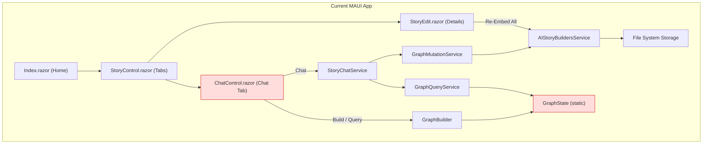
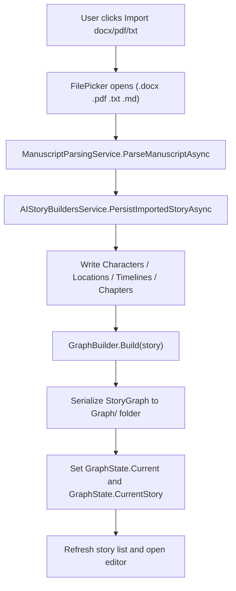
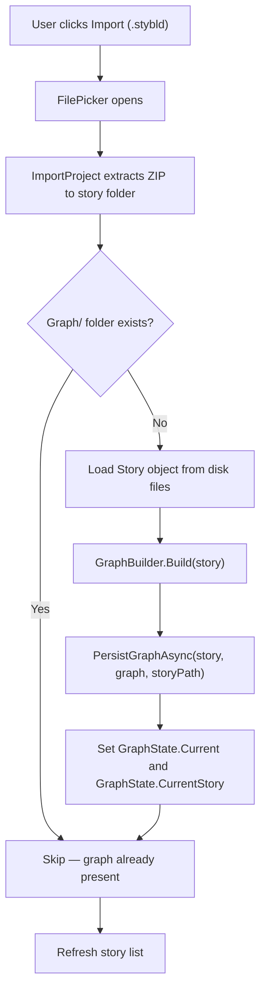
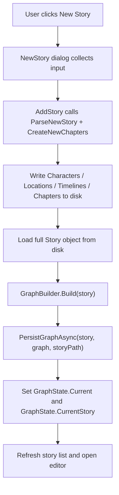
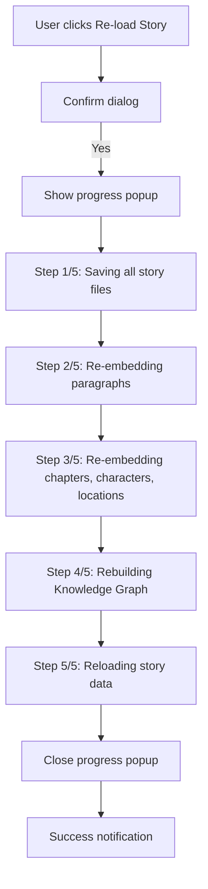
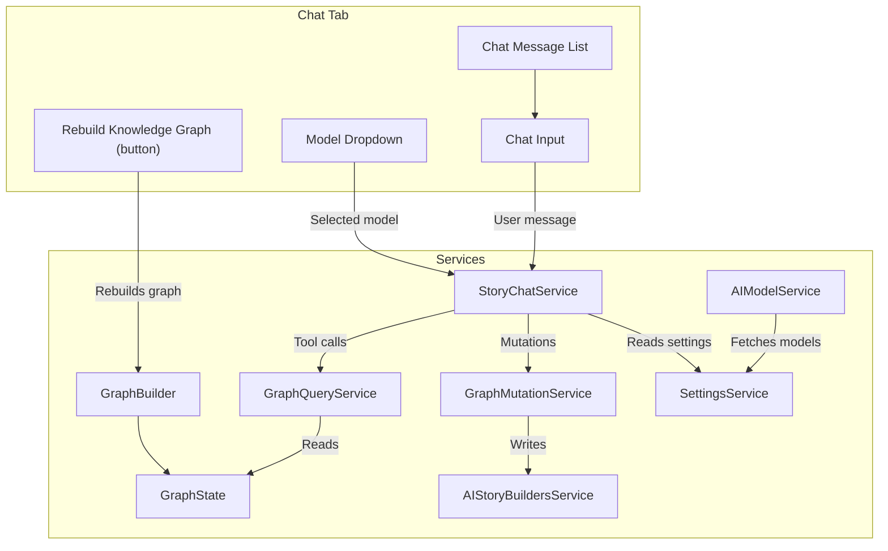
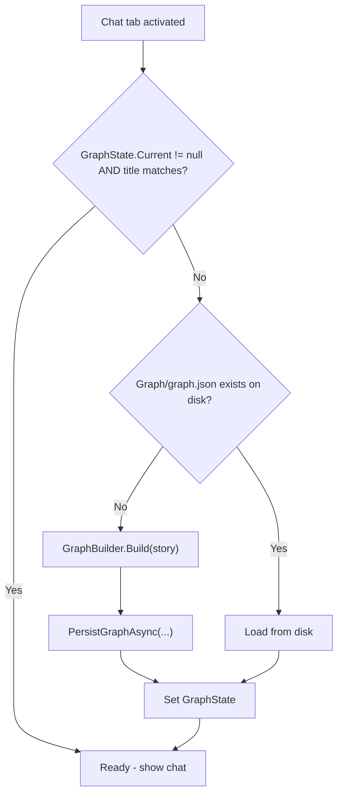
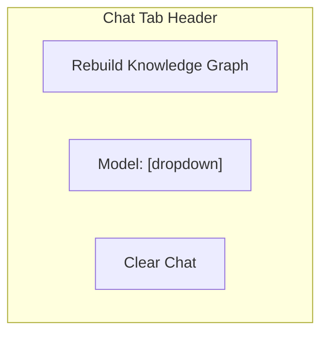
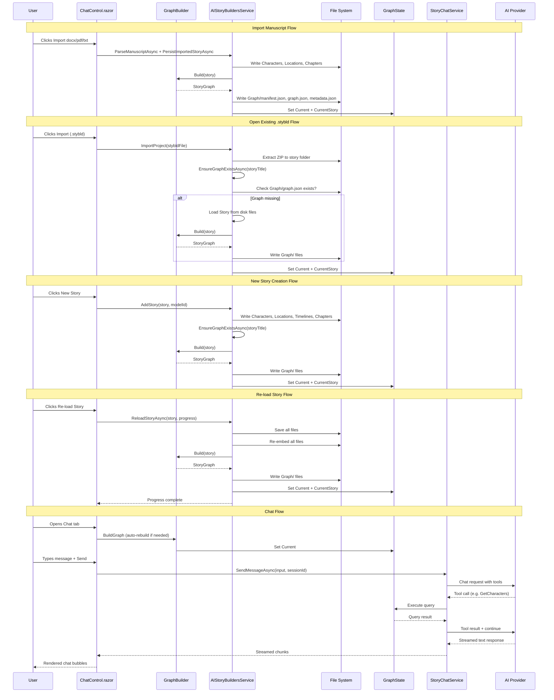
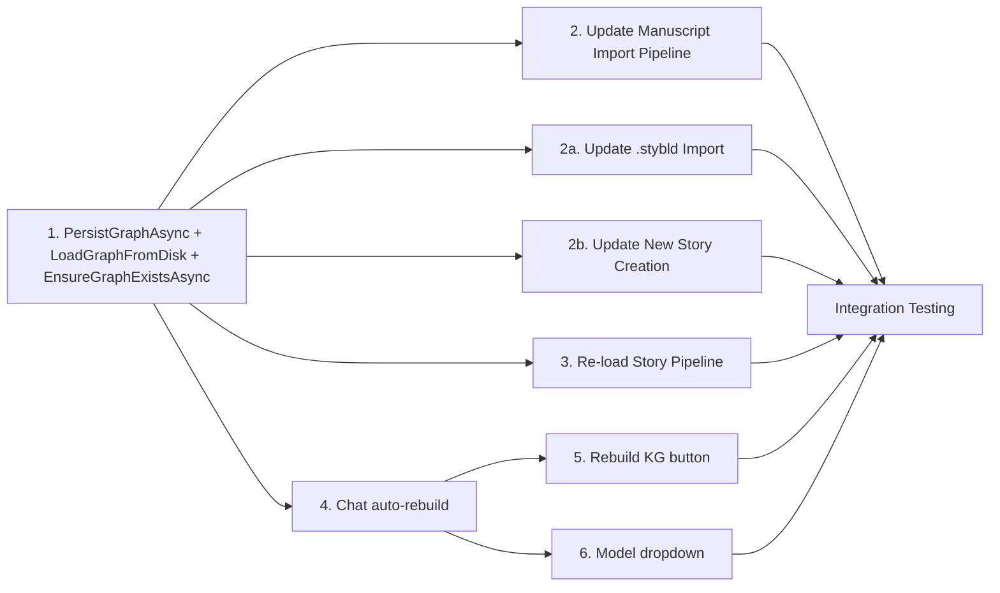

# Knowledge Graph Integration and Feature Enhancement Plan

## Overview

This document describes the implementation plan for integrating Knowledge Graph support into the AIStoryBuilders MAUI application, modeled after the reference implementation in `AIStoryBuildersGraph`. The work spans three feature areas:

1. **Import Enhancement** — Update the "Import docx/pdf/txt" flow to create Knowledge Graph folders and files
1a. **Open Existing .stybld** — When opening an existing `.stybld` file, create Knowledge Graph files if the `Graph/` folder does not exist
1b. **New Story Creation** — When creating a new story via the New Story dialog, create Knowledge Graph files after the story folder structure is built
2. **Re-load Story** — Rename and expand the "Re-Embed All" button into a full story reload pipeline
3. **Chat Page Activation** — Make the Chat tab fully operational with graph-backed AI conversations and a model selector

---

## Current Architecture Snapshot



> Nodes highlighted in red are currently incomplete or returning empty results because no Knowledge Graph files exist on disk after import.

---

## Feature 1 — Update Import to Create Knowledge Graph Files

### 1.1 Goal

When a user clicks **Import docx/pdf/txt**, the pipeline should parse the manuscript, persist the standard story folder structure (Characters, Locations, Timelines, Chapters), **and** create the Knowledge Graph artifacts alongside the story.

### 1.2 Reference Implementation

The `AIStoryBuildersGraph` project uses:

| Service | File | Purpose |
|---------|------|---------|
| `ManuscriptImportService` | `Services/ManuscriptImportService.cs` | LLM-driven 4-pass parsing (metadata, chapters, entities, backgrounds) |
| `GraphBuilder` | `Services/GraphBuilder.cs` | Converts a `Story` object into a `StoryGraph` (nodes + edges) |
| `GraphPackageExporter` | `Services/GraphPackageExporter.cs` | Persists graph to a `.stybldgraph` ZIP (`manifest.json`, `graph.json`, `metadata.json`) |

### 1.3 Knowledge Graph Folder Structure

After import, each story folder gains a `Graph/` subdirectory:

```
{MyDocuments}/AIStoryBuilders/{StoryTitle}/
├── Characters/
│   └── {Name}.csv
├── Locations/
│   └── {Name}.csv
├── Timelines.csv
├── Chapters/
│   ├── Chapter1/
│   │   ├── Chapter1.txt
│   │   └── Paragraph1.txt
│   └── ...
└── Graph/                         <-- NEW
    ├── manifest.json
    ├── graph.json
    └── metadata.json
```

**File contents:**

| File | Schema |
|------|--------|
| `manifest.json` | `{ "storyTitle", "createdDate", "version", "nodeCount", "edgeCount" }` |
| `graph.json` | Serialized `StoryGraph` object (nodes array + edges array) |
| `metadata.json` | `{ "title", "genre", "theme", "synopsis", "chapterCount", "characterCount", "locationCount", "timelineCount" }` |

### 1.4 Implementation Steps



#### Step-by-step

| Step | Action | Files to modify |
|------|--------|-----------------|
| 1 | Add a `PersistGraphAsync(Story, StoryGraph, string storyPath)` method to `AIStoryBuildersService` | `Services/AIStoryBuildersService.cs` |
| 2 | Inside `PersistGraphAsync`, create `Graph/` subdirectory and write `manifest.json`, `graph.json`, `metadata.json` using `System.Text.Json` | Same file |
| 3 | At the end of `PersistImportedStoryAsync`, call `GraphBuilder.Build(story)` to produce a `StoryGraph` | `Services/AIStoryBuildersService.ManuscriptImport.cs` |
| 4 | Call `PersistGraphAsync(story, graph, storyPath)` to write files | Same file |
| 5 | Set `GraphState.Current = graph` and `GraphState.CurrentStory = story` so the Chat tab can use it immediately | Same file |
| 6 | Add a `LoadGraphFromDisk(string storyPath)` method that reads `Graph/graph.json` and deserializes it, returning a `StoryGraph` (or `null` if missing) | `Services/AIStoryBuildersService.cs` |

### 1.5 JSON Serialization Details

Use `System.Text.Json` with these options:

```csharp
private static readonly JsonSerializerOptions GraphJsonOptions = new()
{
    WriteIndented = true,
    PropertyNamingPolicy = JsonNamingPolicy.CamelCase
};
```

The `GraphNode.Type` enum should serialize as a string using `JsonStringEnumConverter`.

---

## Feature 1a — Create Knowledge Graph When Opening an Existing .stybld File

### 1a.1 Goal

When a user opens an existing `.stybld` file via the **Import** button on the home page, the import pipeline extracts the ZIP contents into the story folder. If the extracted story does not already contain a `Graph/` subdirectory (i.e., it was exported before Knowledge Graph support was added), automatically build and persist the Knowledge Graph files.

### 1a.2 Current Flow

1. User clicks **Import** on `Index.razor`
2. `FilePicker` opens for `.stybld` files
3. `AIStoryBuildersService.ImportProject(byte[] stybldFile)` extracts the ZIP to `{MyDocuments}/AIStoryBuilders/{StoryTitle}/`
4. The story is registered in `AIStoryBuildersStories.csv`
5. The story list refreshes — **no graph is created**

### 1a.3 Updated Flow



### 1a.4 Implementation Steps

| Step | Action | Files to modify |
|------|--------|-----------------|
| 1 | At the end of `ImportProject()`, after files are extracted and the story is registered, check if `{storyPath}/Graph/graph.json` exists | `Services/AIStoryBuildersService.ExportImport.cs` |
| 2 | If the `Graph/` folder is missing, load the `Story` object from disk using `GetStorys()` + `GetCharacters()` + `GetLocations()` + `GetTimelines()` + `GetChapters()` + `GetParagraphs()` | Same file |
| 3 | Call `GraphBuilder.Build(story)` to produce a `StoryGraph` | Same file |
| 4 | Call `PersistGraphAsync(story, graph, storyPath)` to write `Graph/manifest.json`, `graph.json`, `metadata.json` | Same file |
| 5 | Set `GraphState.Current = graph` and `GraphState.CurrentStory = story` | Same file |

### 1a.5 Notes

- `ImportProject()` currently returns a `string` (status message). It will need to become `async Task<string>` (or a new async wrapper) since `GraphBuilder.Build()` is synchronous but `PersistGraphAsync()` is async.
- Alternatively, the graph creation can be done in `Index.razor` after `ImportProject()` returns, calling into `AIStoryBuildersService.EnsureGraphExistsAsync(string storyTitle)` — a new convenience method that encapsulates the "check, load, build, persist" logic.
- The `EnsureGraphExistsAsync` method is reusable by both this feature and Feature 1b.

### 1a.6 EnsureGraphExistsAsync Method

```
EnsureGraphExistsAsync(string storyTitle):
  1. storyPath = BasePath / storyTitle
  2. graphPath = storyPath / "Graph" / "graph.json"
  3. if File.Exists(graphPath):
       - Load graph from disk via LoadGraphFromDisk(storyPath)
       - Set GraphState.Current and GraphState.CurrentStory
       - return
  4. Load full Story object from disk files
  5. GraphBuilder.Build(story) → StoryGraph
  6. PersistGraphAsync(story, graph, storyPath)
  7. Set GraphState.Current = graph, GraphState.CurrentStory = story
```

---

## Feature 1b — Create Knowledge Graph When Creating a New Story

### 1b.1 Goal

When a user creates a new story via the **New Story** dialog, the Knowledge Graph files should be created automatically after the story folder structure (Characters, Locations, Timelines, Chapters) is fully built.

### 1b.2 Current Flow

1. User clicks **New Story** on `Index.razor`
2. `NewStory.razor` dialog collects title, synopsis, style, theme, chapter count
3. `AIStoryBuildersService.AddStory(story, modelId)` is called:
   - Calls `OrchestratorMethods.ParseNewStory()` for AI-generated story structure
   - Creates folder structure and files (Characters, Locations, Timelines)
   - Calls `OrchestratorMethods.CreateNewChapters()` for chapter/paragraph files
   - Writes all files to disk
4. Story list refreshes and editor opens — **no graph is created**

### 1b.3 Updated Flow



### 1b.4 Implementation Steps

| Step | Action | Files to modify |
|------|--------|-----------------|
| 1 | At the end of `AddStory()`, after all character, location, timeline, and chapter files are written, call `EnsureGraphExistsAsync(story.Title)` | `Services/AIStoryBuildersService.Story.cs` |
| 2 | `EnsureGraphExistsAsync` (defined in Feature 1a.6) loads the story from disk, builds the graph, persists it, and sets `GraphState` | `Services/AIStoryBuildersService.cs` |

### 1b.5 Notes

- `AddStory()` is already `async Task`, so calling `EnsureGraphExistsAsync` at the end is straightforward.
- The graph is built from the files on disk (not from in-memory objects) to ensure consistency — the same paragraph and character CSV files that were just written are used as the source of truth.
- The `TextEvent` handler can report progress: `TextEvent?.Invoke(this, new TextEventArgs("Building Knowledge Graph...", 5))` before the graph build call.

---

## Feature 2 — Rename "Re-Embed All" to "Re-load Story" with Expanded Pipeline

### 2.1 Goal

Replace the existing **Re-Embed All** button (in `StoryEdit.razor`) with a **Re-load Story** button that performs a comprehensive reload:

1. Save all in-memory story files to disk
2. Re-embed every file (paragraphs, chapters, characters, locations)
3. Rebuild the Knowledge Graph from the updated story data
4. Reload all files into memory
5. Show a progress popup for each step

### 2.2 Progress Dialog Flow



### 2.3 Implementation Steps

| Step | Action | Files to modify |
|------|--------|-----------------|
| 1 | In `StoryEdit.razor`, rename the button text from `"Re-Embed All"` to `"Re-load Story"` and change the icon to `"sync"` | `Components/Pages/Controls/Story/StoryEdit.razor` |
| 2 | Create `ReloadStoryAsync(Story story, IProgress<string> progress)` in `AIStoryBuildersService` | `Services/AIStoryBuildersService.ReEmbed.cs` (rename file to `AIStoryBuildersService.ReloadStory.cs`) |
| 3 | In `ReloadStoryAsync`, implement 5-phase pipeline with progress reporting | Same file |
| 4 | Update the `ReEmbedAll()` handler in `StoryEdit.razor` to open a Radzen dialog showing progress messages | `Components/Pages/Controls/Story/StoryEdit.razor` |
| 5 | After the pipeline completes, refresh `GraphState.Current` and `GraphState.CurrentStory` | `Services/AIStoryBuildersService.ReEmbed.cs` |

### 2.4 ReloadStoryAsync Method Outline

```
ReloadStoryAsync(Story story, IProgress<string> progress):
  1. progress.Report("Saving all story files...")
     - Call UpdateStory(story) to write metadata
     - Flush any in-memory paragraph changes to disk

  2. progress.Report("Re-embedding paragraphs (N files)...")
     - Iterate paragraph files, regenerate embeddings
     - Report per-file progress

  3. progress.Report("Re-embedding chapters, characters, locations...")
     - Same as existing ReEmbedStory logic for these file types

  4. progress.Report("Rebuilding Knowledge Graph...")
     - Reload Story object from disk files
     - Call GraphBuilder.Build(story)
     - Call PersistGraphAsync(story, graph, storyPath)
     - Update GraphState

  5. progress.Report("Reloading story data into editor...")
     - Re-read all files into memory
     - Refresh the Story object used by the UI
```

### 2.5 Progress Popup UI

Use `DialogService.OpenAsync` with a custom Razor component (e.g., `ProgressDialog.razor`) that accepts an `IProgress<string>` and displays each message as it arrives. The dialog should:

- Show a `RadzenProgressBar` in indeterminate mode
- Display the current step message below the bar
- Auto-close when the pipeline completes
- Show an error alert if any step fails

---

## Feature 3 — Make the Chat Page Fully Functional

### 3.1 Current State

The `ChatControl.razor` component and supporting services (`StoryChatService`, `GraphQueryService`, `GraphMutationService`, `GraphBuilder`, `GraphState`) already exist in the MAUI codebase. However:

- The Chat tab calls `chatControl.BuildGraph()` when activated, which builds a graph from the current `Story` object
- If the Knowledge Graph files do not exist on disk, `GraphState.Current` may be stale or empty
- There is no "Rebuild Knowledge Graph" button
- There is no AI model dropdown on the Chat page
- The chat service reads the model from `SettingsService.AIModel` (global setting) with no per-page override

### 3.2 Architecture After Changes



### 3.3 Sub-Feature 3.a — "Rebuild Knowledge Graph" Button

#### Goal

Add a button at the top of the Chat tab labeled **Rebuild Knowledge Graph**. Clicking it re-runs `GraphBuilder.Build(story)`, writes the graph files to disk, and updates `GraphState`.

#### Implementation

| Step | Action | File |
|------|--------|------|
| 1 | Add a `<button>` or `<RadzenButton>` labeled "Rebuild Knowledge Graph" at the top of `ChatControl.razor`, before the chat card | `Components/Pages/Controls/Chat/ChatControl.razor` |
| 2 | Wire the button to a `RebuildGraph()` method | Same file |
| 3 | `RebuildGraph()` calls `GraphBuilder.Build(objStory)`, then calls `AIStoryBuildersService.PersistGraphAsync(...)`, updates `GraphState`, and shows a success notification | Same file |
| 4 | Inject `AIStoryBuildersService` and `NotificationService` into `ChatControl.razor` | Same file |

#### Auto-Rebuild Logic

When the Chat tab activates (via `BuildGraph()`), if `GraphState.Current` is null or its `StoryTitle` does not match `objStory.Title`:

1. Attempt to load `Graph/graph.json` from disk via `LoadGraphFromDisk(storyPath)`
2. If that returns `null`, automatically rebuild the graph from the `Story` object
3. Persist the newly built graph to disk



### 3.4 Sub-Feature 3.b — Make the Chat Page Work Like AIStoryBuildersGraph

#### Goal

Ensure the chat pipeline (user message, tool-call loop, streaming response) works end-to-end, matching the behavior of the Graph project.

#### Current vs. Required State

| Aspect | Current (MAUI) | Required |
|--------|----------------|----------|
| `StoryChatService` | Exists, has system prompt, tool-call loop, streaming | Verify it works end-to-end; fix any null-reference issues when graph is empty |
| `GraphQueryService` | All 15 read methods implemented | Working, reads from `GraphState` |
| `GraphMutationService` | All 20 write methods implemented | Working, writes to disk and refreshes graph |
| `ChatControl.razor` | Has chat UI, input, streaming display | Needs graph-null guard, rebuild button, model dropdown |
| `ChatMessageRenderer.razor` | Exists | Verify Markdown rendering works |
| Auto-build on tab switch | Calls `BuildGraph()` | Enhance with disk-load and auto-rebuild (see 3.3) |
| Error handling | Basic try/catch | Add user-friendly messages for missing API key, missing graph, LLM timeout |

#### Key Fixes Needed

1. **Null graph guard in `SendMessage()`**: The `StoryChatService` already checks `if (GraphState.Current == null)` and returns a warning. Verify this message surfaces in the UI.

2. **Auto-rebuild on missing graph**: Update `ChatControl.BuildGraph()` to use the fallback logic from section 3.3 (load from disk or rebuild).

3. **Refresh client on settings change**: The `StoryChatService.RefreshClient()` method exists. Call it when the user changes the model dropdown (see 3.5).

4. **Chat session isolation**: Each `ChatControl` instance creates its own `_sessionId` via `Guid.NewGuid()`. This is correct for multi-story isolation.

### 3.5 Sub-Feature 3.c — AI Model Dropdown on Chat Page

#### Goal

Add a dropdown at the top of the Chat page that lists all available models from the currently configured AI provider. When the user selects a different model, the chat service switches to it for subsequent messages.

#### UI Layout



The header row should contain (left to right):

1. **Rebuild Knowledge Graph** button (outlined, warning style)
2. **Model dropdown** (`RadzenDropDown`) bound to a selected model string
3. **Clear Chat** button (existing, right-aligned)

#### Implementation

| Step | Action | File |
|------|--------|------|
| 1 | Inject `OrchestratorMethods` (or `AIModelService` directly) into `ChatControl.razor` | `Components/Pages/Controls/Chat/ChatControl.razor` |
| 2 | Add a `List<AIStoryBuilderModel> _models` field and a `string _selectedModel` field | Same file |
| 3 | On component initialization (or when `BuildGraph()` is called), fetch models via `OrchestratorMethods.ListAllModelsAsync()` | Same file |
| 4 | Default `_selectedModel` to `SettingsService.AIModel` | Same file |
| 5 | Add a `RadzenDropDown` bound to `_selectedModel` with `Data="_models"`, `TextProperty="ModelName"`, `ValueProperty="ModelId"` | Same file |
| 6 | On dropdown change, update `SettingsService.AIModel` and call `ChatService.RefreshClient()` | Same file |
| 7 | The `StoryChatService.GetOrCreateChatClient()` already re-creates the client when the settings key changes, so no service changes are needed | N/A |

#### Model Loading Logic

Use the existing `AIModelService` / `OrchestratorMethods.ListAllModelsAsync()` which:

- **OpenAI**: Fetches from `api.openai.com/v1/models`, filters chat models
- **Azure OpenAI**: Returns the configured deployment name
- **Anthropic**: Returns hard-coded model list
- **Google AI**: Fetches from `generativelanguage.googleapis.com/v1/models`
- **Caching**: 24-hour cache by API key hash (via `SettingsService` / localStorage)

---

## Data Flow Summary



---

## Files to Create or Modify

### New Files

| File | Purpose |
|------|---------|
| `Components/Pages/Controls/UtilityControls/ProgressDialog.razor` | Reusable progress popup for Re-load Story and other long operations |

### Modified Files

| File | Changes |
|------|---------|
| `Services/AIStoryBuildersService.cs` | Add `PersistGraphAsync()`, `LoadGraphFromDisk()`, and `EnsureGraphExistsAsync()` methods |
| `Services/AIStoryBuildersService.ManuscriptImport.cs` | After `PersistImportedStoryAsync`, call `GraphBuilder.Build()` and `PersistGraphAsync()` |
| `Services/AIStoryBuildersService.ExportImport.cs` | After `ImportProject()` extracts .stybld ZIP, call `EnsureGraphExistsAsync()` to create Knowledge Graph if `Graph/` folder is missing |
| `Services/AIStoryBuildersService.Story.cs` | At end of `AddStory()`, call `EnsureGraphExistsAsync()` to create Knowledge Graph for newly created stories |
| `Services/AIStoryBuildersService.ReEmbed.cs` | Rename `ReEmbedStory()` to `ReloadStoryAsync()`, add 5-phase pipeline with progress, add graph rebuild step |
| `Components/Pages/Controls/Story/StoryEdit.razor` | Rename button from "Re-Embed All" to "Re-load Story", update handler to show progress dialog |
| `Components/Pages/Controls/Chat/ChatControl.razor` | Add "Rebuild Knowledge Graph" button, add model dropdown, enhance `BuildGraph()` with disk-load and auto-rebuild logic |

### Existing Files Already Working (Verify Only)

| File | Status |
|------|--------|
| `Services/GraphBuilder.cs` | Working, builds `StoryGraph` from `Story` |
| `Services/GraphQueryService.cs` | Working, 15 read methods querying `GraphState` |
| `Services/GraphMutationService.cs` | Working, 20 write methods modifying disk and graph |
| `Services/StoryChatService.cs` | Working, tool-call loop with streaming |
| `Services/GraphState.cs` | Working, static holder for `Current` and `CurrentStory` |
| `Models/GraphModels.cs` | Working, `GraphNode`, `GraphEdge`, `StoryGraph`, `NodeType` |
| `Models/ChatModels.cs` | Working, DTOs for chat and graph queries |
| `Components/Pages/Controls/Chat/ChatMessageRenderer.razor` | Working, Markdown rendering |

---

## Testing Checklist

### Feature 1 (Import)
- [ ] Import a `.docx` file and verify `Graph/` folder is created under the story directory
- [ ] Verify `graph.json` contains nodes for all characters, locations, timelines, chapters, paragraphs
- [ ] Verify `graph.json` contains edges (APPEARS_IN, MENTIONED_IN, SEEN_AT, INTERACTS_WITH, etc.)
- [ ] Verify `manifest.json` has correct counts
- [ ] Import a `.pdf` and `.txt` file and verify same behavior

### Feature 1a (Open Existing .stybld)
- [ ] Import a `.stybld` file that was exported before Knowledge Graph support — verify `Graph/` folder is created
- [ ] Import a `.stybld` file that already has a `Graph/` folder — verify existing graph is preserved (not overwritten)
- [ ] Verify `graph.json` contains correct nodes and edges for the imported story
- [ ] Verify `GraphState` is set after import so the Chat tab works immediately

### Feature 1b (New Story Creation)
- [ ] Create a new story via the New Story dialog and verify `Graph/` folder is created under the story directory
- [ ] Verify `graph.json` contains nodes for all AI-generated characters, locations, timelines, chapters, and paragraphs
- [ ] Verify `manifest.json` has correct counts
- [ ] Verify `GraphState` is set after creation so the Chat tab works immediately

### Feature 2 (Re-load Story)
- [ ] Button label reads "Re-load Story" with sync icon
- [ ] Progress popup appears showing each of the 5 steps
- [ ] After completion, verify embeddings are regenerated (check vector arrays in files)
- [ ] Verify `Graph/` folder is updated with fresh graph data
- [ ] Verify `GraphState` is refreshed (Chat tab works immediately after)

### Feature 3 (Chat)
- [ ] Opening Chat tab auto-builds graph if `GraphState.Current` is null
- [ ] Opening Chat tab loads graph from disk if `Graph/graph.json` exists
- [ ] "Rebuild Knowledge Graph" button rebuilds and persists the graph
- [ ] Model dropdown shows all models from the configured provider
- [ ] Selecting a different model updates the chat client for subsequent messages
- [ ] Sending a message returns a streamed AI response
- [ ] AI uses tool calls to query the graph (e.g., "Who are the main characters?" triggers `GetCharacters`)
- [ ] Mutation tool calls work (e.g., "Add a character named X" triggers `AddCharacter` with preview/confirm flow)
- [ ] Clear Chat button resets the conversation

---

## Dependency Order



Implement in order:

1. **`PersistGraphAsync`, `LoadGraphFromDisk`, and `EnsureGraphExistsAsync`** — Core helpers used by everything else
2. **Manuscript import pipeline update** — End of `PersistImportedStoryAsync` calls graph builder + persist
2a. **`.stybld` import update** — After `ImportProject()` extracts ZIP, call `EnsureGraphExistsAsync` to create graph if missing
2b. **New story creation update** — At end of `AddStory()`, call `EnsureGraphExistsAsync` to create graph for new stories
3. **Re-load Story pipeline** — New 5-phase method with progress
4. **Chat auto-rebuild** — Enhanced `BuildGraph()` in `ChatControl.razor`
5. **Rebuild Knowledge Graph button** — Simple button wired to rebuild + persist
6. **Model dropdown** — Fetch models, bind dropdown, wire change handler
