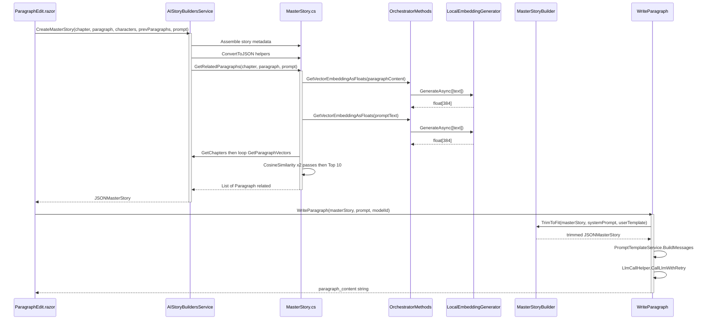
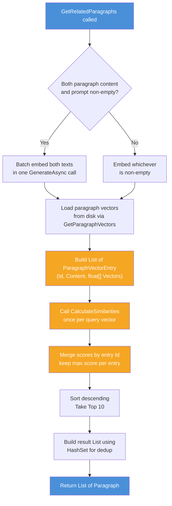
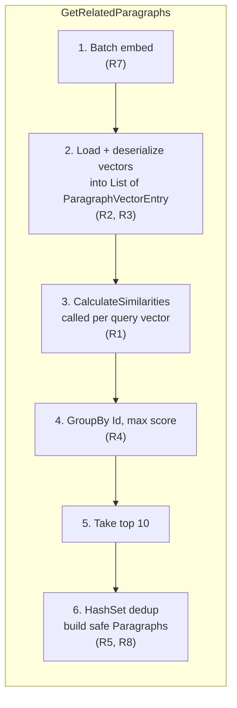
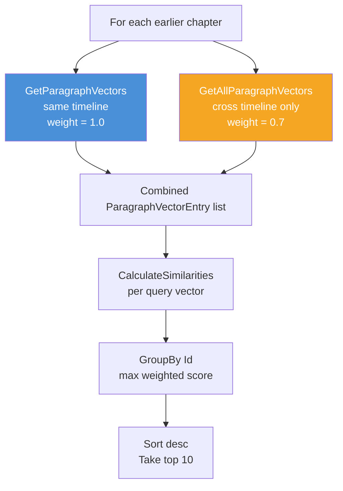
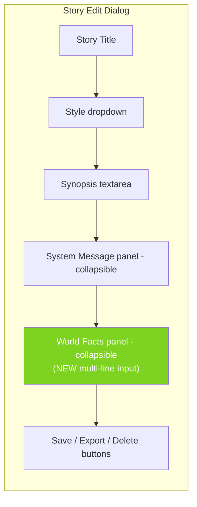
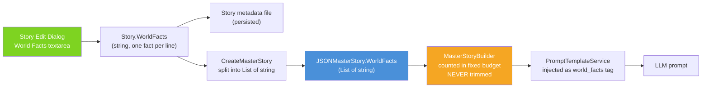
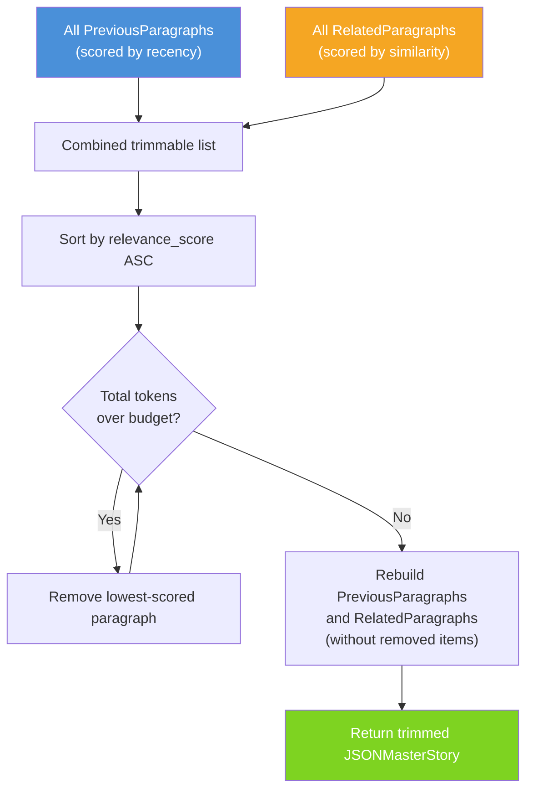
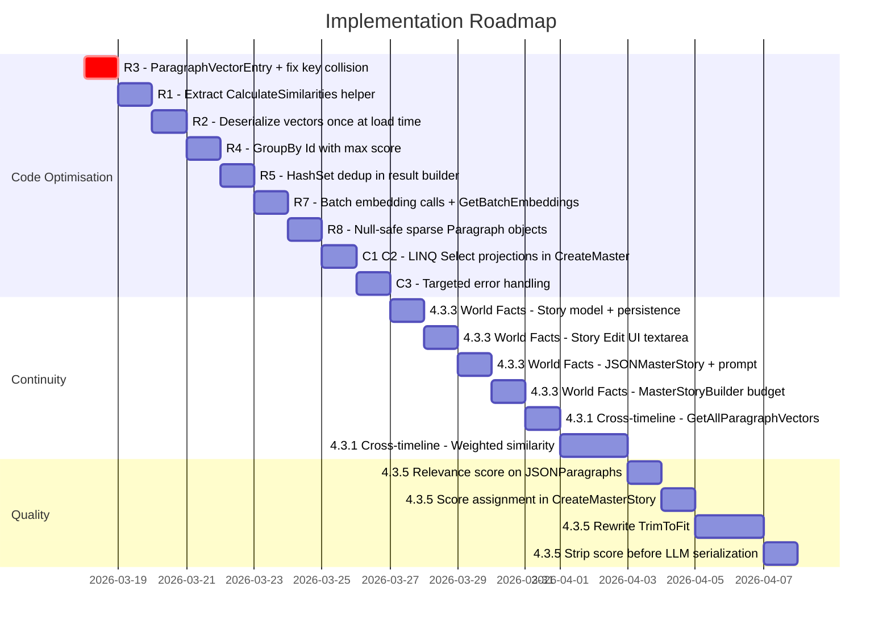
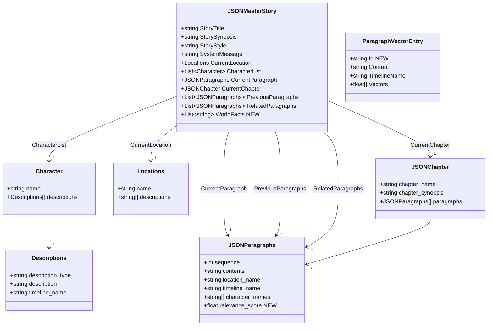
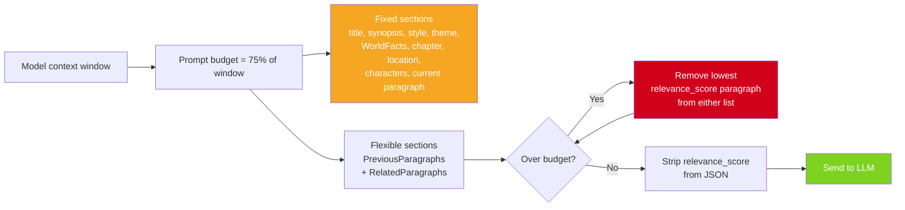

# CreateMasterStory & GetRelatedParagraphs — Implementation Plan

> **Document location:** `docs/master-story-and-related-paragraphs-review.md`  
> **Date:** 2026-03-15  
> **Scope:** Concrete implementation plan for optimising `CreateMasterStory` and `GetRelatedParagraphs` in `AIStoryBuildersService.MasterStory.cs`, and for closing the identified gaps against the two core program objectives.

---

## Table of Contents

1. [Executive Summary](#1-executive-summary)  
2. [System Context](#2-system-context)  
3. [Implementation #1 — Code Optimisation](#3-implementation-1--code-optimisation)  
   3.1 [CreateMasterStory Refactors (C1, C2, C3)](#31-createmasterstory-refactors-c1-c2-c3)  
   3.2 [GetRelatedParagraphs Refactors (R1–R5, R7, R8)](#32-getrelatedparagraphs-refactors-r1r5-r7-r8)  
4. [Implementation #2 — Program Objectives](#4-implementation-2--program-objectives)  
   4.1 [Objective 2a — Story Continuity](#41-objective-2a--story-continuity)  
   4.2 [Objective 2b — Quality Writing](#42-objective-2b--quality-writing)  
5. [Implementation Roadmap](#5-implementation-roadmap)  
6. [Appendix — Key Data Structures](#6-appendix--key-data-structures)

---

## 1. Executive Summary

This document is an **actionable implementation plan**. Every section below describes what to change, which files to touch, and in what order. The work is grouped into two tracks:

| Track | Items included | Items excluded (deferred) |
|-------|---------------|---------------------------|
| **Code Optimisation** | C1, C2, C3, R1, R2, R3, R4, R5, R7, R8 | R6 (paragraph-vector file cache — deferred; adds caching complexity with invalidation concerns that are not justified until profiling shows file I/O is a bottleneck) |
| **Program Objectives** | §4.3.1 Cross-timeline search, §4.3.3 World Facts (with UI), §4.3.5 Relevance-ranked trimming | §4.3.2 Character relationship graph (deferred; requires significant model/UI design), §4.3.4 Beat-to-paragraph mapping (deferred; current chapter synopsis already provides beat context) |

---

## 2. System Context

The following diagram shows how a user's paragraph-edit action flows through the system to produce new content.



---

## 3. Implementation #1 — Code Optimisation

### 3.1 CreateMasterStory Refactors (C1, C2, C3)

**File:** `Services/AIStoryBuildersService.MasterStory.cs` — `CreateMasterStory` method (lines 16–56)

#### C1 — Replace foreach loops with LINQ projections

**What to change:**  
Replace the two `foreach` loops that build `PreviousParagraphs` and `RelatedParagraphs` with single-line `Select` projections.

**Before (current):**
```
objMasterStory.PreviousParagraphs = new List<JSONParagraphs>();
foreach (var paragraph in colParagraphs)
{
    objMasterStory.PreviousParagraphs.Add(ConvertToJSONParagraph(paragraph));
}
```

**After (target):**
```
objMasterStory.PreviousParagraphs = colParagraphs
    .Select(ConvertToJSONParagraph).ToList();

objMasterStory.RelatedParagraphs = (await GetRelatedParagraphs(objChapter, objParagraph, AIPromptResult))
    .Select(ConvertToJSONParagraph).ToList();
```

**Rationale:** Eliminates boilerplate, makes intent clearer, and naturally pre-sizes the internal list via `ToList()`.

#### C2 — Pre-sized lists (absorbed into C1)

Using `.ToList()` on the `Select` projection inherently allocates the correct capacity. No additional change needed beyond C1.

#### C3 — Replace generic catch with specific error handling

**What to change:**  
1. Replace `catch (Exception ex)` with targeted catches.  
2. Propagate the error so `ParagraphEdit.razor` can display a notification instead of silently sending an empty payload to the LLM.

**Implementation steps:**

| Step | Detail |
|------|--------|
| 1 | Remove the catch-all. Let the `InvalidOperationException`, `KeyNotFoundException`, etc. propagate. |
| 2 | Wrap only the embedding/similarity calls in a targeted `catch (HttpRequestException)` for transient network errors. |
| 3 | In `ParagraphEdit.razor` (line ~661), wrap the `CreateMasterStory` call in a try/catch that shows a `NotificationService.Notify` error and aborts the LLM call. |

**Files touched:**

| File | Change |
|------|--------|
| `Services/AIStoryBuildersService.MasterStory.cs` | Remove generic catch; add targeted catches around embedding calls only. |
| `Components/Pages/Controls/Paragraphs/ParagraphEdit.razor` | Add try/catch around `CreateMasterStory` call (~line 661) with user-facing error notification. |

---

### 3.2 GetRelatedParagraphs Refactors (R1–R5, R7, R8)

**File:** `Services/AIStoryBuildersService.MasterStory.cs` — `GetRelatedParagraphs` method (lines 61–176)

The following diagram shows the refactored internal flow:



#### R3 — Replace Dictionary with ParagraphVectorEntry list

**Problem:** `Dictionary<string, string>` keyed by paragraph content throws `DuplicateKeyException` if two paragraphs have identical text.

**What to change:**

1. **Create a new record struct** in `Models/`:

```csharp
// Models/ParagraphVectorEntry.cs
namespace AIStoryBuilders.Models;

public readonly record struct ParagraphVectorEntry(
    string Id,        // e.g. "Ch3_P7"
    string Content,
    float[] Vectors);
```

2. **Replace the Dictionary** in `GetRelatedParagraphs`:

**Before:**
```
Dictionary<string, string> AIStoryBuildersMemory = new Dictionary<string, string>();
...
AIStoryBuildersMemory.Add(paragraph.contents, paragraph.vectors);
```

**After:**
```
var memoryEntries = new List<ParagraphVectorEntry>();
...
memoryEntries.Add(new ParagraphVectorEntry(
    Id: $"Ch{chapter.Sequence}_P{paragraph.sequence}",
    Content: paragraph.contents,
    Vectors: JsonConvert.DeserializeObject<float[]>(paragraph.vectors)));
```

This simultaneously addresses **R2** (deserialize once at load time, store as `float[]`) and **R3** (no key collision).

**Files touched:**

| File | Change |
|------|--------|
| `Models/ParagraphVectorEntry.cs` | **Create** — new record struct. |
| `Services/AIStoryBuildersService.MasterStory.cs` | Replace `Dictionary<string, string>` with `List<ParagraphVectorEntry>`. Deserialize vectors at load time. |

#### R1 — Extract CalculateSimilarities helper

**Problem:** The similarity loop is copy-pasted for paragraph-content vectors and prompt-text vectors.

**What to change:**

Add a private helper method to `AIStoryBuildersService.MasterStory.cs`:

```csharp
private static List<(string Id, string Content, float Score)> CalculateSimilarities(
    float[] queryVector,
    List<ParagraphVectorEntry> corpus)
{
    var results = new List<(string, string, float)>(corpus.Count);
    foreach (var entry in corpus)
    {
        if (entry.Vectors != null && entry.Vectors.Length > 0)
        {
            float score = OrchestratorMethods.CosineSimilarity(queryVector, entry.Vectors);
            results.Add((entry.Id, entry.Content, score));
        }
    }
    return results;
}
```

**Calling code becomes:**
```
var similarities = new List<(string Id, string Content, float Score)>();

if (paragraphVectors != null)
    similarities.AddRange(CalculateSimilarities(paragraphVectors, memoryEntries));

if (promptVectors != null)
    similarities.AddRange(CalculateSimilarities(promptVectors, memoryEntries));
```

#### R4 — Merge scores by Id, keep max

**Problem:** `Distinct()` on `(string, float)` tuples does not meaningfully de-duplicate.

**What to change:**

Replace the `Distinct().Take(10)` with a proper group-by-max:

```csharp
var top10 = similarities
    .GroupBy(s => s.Id)
    .Select(g => g.OrderByDescending(x => x.Score).First())
    .OrderByDescending(x => x.Score)
    .Take(10)
    .ToList();
```

#### R5 — HashSet for result de-duplication

**Problem:** `colParagraphContent.Contains(...)` is O(n) per call.

**What to change:**

Replace the inner de-duplication with a `HashSet<string>`:

```csharp
var seen = new HashSet<string>();
var resultList = new List<Paragraph>(10);

foreach (var entry in top10)
{
    if (seen.Add(entry.Content))  // returns false if already present
    {
        resultList.Add(new Paragraph
        {
            Sequence = resultList.Count,
            Location = new Models.Location(),
            Timeline = new Timeline { TimelineName = ParagraphTimelineName },
            Characters = new List<Models.Character>(),
            ParagraphContent = entry.Content
        });
    }
}
```

#### R7 — Batch embedding calls

**Problem:** Two sequential calls to `GetVectorEmbeddingAsFloats`.

**What to change:**

1. Collect all non-empty texts into one array.
2. Call `LocalEmbeddingGenerator.GenerateAsync` once.
3. Map results back.

```csharp
var textsToEmbed = new List<string>();
int paragraphIdx = -1, promptIdx = -1;

if (!string.IsNullOrWhiteSpace(objParagraph.ParagraphContent))
{
    paragraphIdx = textsToEmbed.Count;
    textsToEmbed.Add(objParagraph.ParagraphContent);
}
if (!string.IsNullOrWhiteSpace(AIPromptResult.AIPromptText))
{
    promptIdx = textsToEmbed.Count;
    textsToEmbed.Add(AIPromptResult.AIPromptText);
}

float[][] embeddingResults = null;
if (textsToEmbed.Count > 0)
{
    var embeddings = await OrchestratorMethods.GetBatchEmbeddings(textsToEmbed.ToArray());
    embeddingResults = embeddings;
}

float[] paragraphVectors = paragraphIdx >= 0 ? embeddingResults[paragraphIdx] : null;
float[] promptVectors    = promptIdx >= 0    ? embeddingResults[promptIdx]    : null;
```

**Additional change required in `AI/OrchestratorMethods.cs`** — add a batch method:

```csharp
public async Task<float[][]> GetBatchEmbeddings(string[] texts)
{
    var embeddings = await _embeddingGenerator.GenerateAsync(texts);
    return embeddings.Select(e => e.Vector.ToArray()).ToArray();
}
```

**Files touched:**

| File | Change |
|------|--------|
| `AI/OrchestratorMethods.cs` | **Add** `GetBatchEmbeddings(string[])` method. |
| `Services/AIStoryBuildersService.MasterStory.cs` | Replace two sequential `GetVectorEmbeddingAsFloats` calls with one `GetBatchEmbeddings` call. |

#### R8 — Safer sparse Paragraph objects

**Problem:** Returned `Paragraph` objects have null-prone `Location` and `Characters` fields.

**What to change:**

Ensure the `Location` property is initialized with a non-null `LocationName`, and ensure `ConvertToJSONParagraph` guards against null `Location.LocationName`:

```csharp
// In the result-building loop (R5 section above):
Location = new Models.Location { LocationName = "" },
```

Also add a null guard in `ConvertToJSONParagraph` in `AIStoryBuildersService.cs` (~line 241):

```csharp
objParagraphs.location_name = objParagraph.Location?.LocationName?.Replace("\n", " ") ?? "";
```

**Files touched:**

| File | Change |
|------|--------|
| `Services/AIStoryBuildersService.MasterStory.cs` | Initialize `Location` with empty `LocationName` in result objects. |
| `Services/AIStoryBuildersService.cs` | Add null-safe access in `ConvertToJSONParagraph`. |

#### Complete refactored method — structural overview



---

## 4. Implementation #2 — Program Objectives

### 4.1 Objective 2a — Story Continuity

Two items are in scope: **Cross-timeline search (§4.3.1)** and **World Facts (§4.3.3)**.

---

#### 4.3.1 — Cross-timeline related-paragraph search

**Problem:** `GetRelatedParagraphs` filters strictly by `TimelineName`. A character appearing in a flashback timeline and the main timeline will have no cross-timeline recall.

**Implementation plan:**

| Step | Detail |
|------|--------|
| 1 | In the chapter-loop inside `GetRelatedParagraphs`, change `GetParagraphVectors(chapter, ParagraphTimelineName)` to call **twice**: once for the current timeline (same as today), and once for **all other timelines**. |
| 2 | Tag each `ParagraphVectorEntry` with a `bool IsSameTimeline` flag. |
| 3 | In `CalculateSimilarities`, apply a weighting factor: same-timeline scores use `1.0×`, cross-timeline scores use `0.7×`. |
| 4 | The rest of the pipeline (merge, sort, top-10) remains unchanged — cross-timeline paragraphs simply compete with same-timeline ones at a lower weight. |

**Change to `GetParagraphVectors`:**

Add an overload or an optional parameter to return paragraphs for *all* timelines:

```csharp
// Existing signature (unchanged):
public List<AIParagraph> GetParagraphVectors(Chapter chapter, string TimelineName)

// New overload:
public List<AIParagraph> GetAllParagraphVectors(Chapter chapter)
```

The new overload removes the `if (TimelineName == ParagraphTimeline)` filter.

**Updated CalculateSimilarities signature:**

```csharp
private static List<(string Id, string Content, float Score)> CalculateSimilarities(
    float[] queryVector,
    List<ParagraphVectorEntry> corpus,
    float weight = 1.0f)
```

Multiply the raw cosine similarity by `weight` before adding to results.

**Calling code:**

```csharp
// Same-timeline entries (weight 1.0)
var sameTimelineEntries = LoadEntries(chapter, ParagraphTimelineName);
// Cross-timeline entries (weight 0.7)
var crossTimelineEntries = LoadAllEntries(chapter)
    .Where(e => e.TimelineName != ParagraphTimelineName);

similarities.AddRange(CalculateSimilarities(queryVec, sameTimelineEntries, 1.0f));
similarities.AddRange(CalculateSimilarities(queryVec, crossTimelineEntries, 0.7f));
```

**Files touched:**

| File | Change |
|------|--------|
| `Models/ParagraphVectorEntry.cs` | Add `string TimelineName` field to the record struct. |
| `Services/AIStoryBuildersService.Story.cs` | Add `GetAllParagraphVectors(Chapter)` overload. |
| `Services/AIStoryBuildersService.MasterStory.cs` | Load both same-timeline and cross-timeline entries; pass weight to `CalculateSimilarities`. |



---

#### 4.3.3 — Persistent world-building facts (World Facts)

**Problem:** No mechanism for the author to inject persistent world-building facts (e.g., "Magic is illegal in the Northern Kingdom", "The year is 1342") that should always be present in the LLM context.

**Implementation plan — four layers:**

##### Layer 1: Story model

**File:** `Models/Story.cs`

Add a new property:

```csharp
public string WorldFacts { get; set; } = "";
```

A single string where each fact is on its own line. This keeps file-persistence simple (the story is already serialized as pipe-delimited text).

##### Layer 2: Story Edit dialog — UI

**File:** `Components/Pages/Controls/Story/StoryEdit.razor`

Add a new collapsible panel **after** the existing "System Message" panel in the "Existing Story" section (~line 68, after the closing `</RadzenPanel>` of System Message):

```razor
<RadzenPanel AllowCollapse="true" Collapsed="true" Style="width: 100%;">
    <HeaderTemplate>
        <RadzenText TextStyle="TextStyle.Subtitle1">
            &nbsp;&nbsp;World Facts
        </RadzenText>
    </HeaderTemplate>
    <ChildContent>
        <RadzenRow Gap="1rem">
            <RadzenColumn Size="12" SizeSM="12">
                <RadzenStack>
                    <RadzenFormField Text="One fact per line. These facts are always included in every LLM prompt and are never trimmed."
                                     Variant="@variant">
                        <RadzenTextArea Style="width: 100%;"
                                        @bind-Value="@objStory.WorldFacts"
                                        MaxLength="2000"
                                        Rows="6"
                                        Placeholder="e.g. Magic is illegal in the Northern Kingdom" />
                    </RadzenFormField>
                </RadzenStack>
            </RadzenColumn>
        </RadzenRow>
    </ChildContent>
</RadzenPanel>
```

This gives the author a **multi-line input box labeled "World Facts"** inside the Story Edit dialog, matching the collapsible-panel pattern already used for "System Message".



##### Layer 3: JSONMasterStory and CreateMasterStory

**File:** `Models/JSON/JSONMasterStory.cs`

Add:

```csharp
public List<string> WorldFacts { get; set; }
```

**File:** `Services/AIStoryBuildersService.MasterStory.cs`

In `CreateMasterStory`, after setting `SystemMessage`, add:

```csharp
objMasterStory.WorldFacts = (objChapter.Story.WorldFacts ?? "")
    .Split('\n', StringSplitOptions.RemoveEmptyEntries | StringSplitOptions.TrimEntries)
    .ToList();
```

##### Layer 4: Prompt template and MasterStoryBuilder

**File:** `AI/PromptTemplateService.cs`

Add a `{WorldFacts}` placeholder to `WriteParagraph_User`, after `<system_directions>`:

```
<world_facts>{WorldFacts}</world_facts>
```

**File:** `AI/OrchestratorMethods.WriteParagraph.cs`

Add the placeholder value in the `BuildMessages` dictionary:

```csharp
["WorldFacts"] = System.Text.Json.JsonSerializer.Serialize(objJSONMasterStory.WorldFacts),
```

**File:** `Services/MasterStoryBuilder.cs`

In `EstimateBaseTokens`, include `WorldFacts` in the fixed-content string so it is counted but **never trimmed**:

```csharp
var fixedContent = string.Join("\n",
    systemPrompt,
    story.StoryTitle ?? "",
    story.StoryStyle ?? "",
    story.StorySynopsis ?? "",
    story.SystemMessage ?? "",
    JsonConvert.SerializeObject(story.WorldFacts),      // ← ADD
    JsonConvert.SerializeObject(story.CurrentChapter),
    ...
```

**Files touched — complete list:**

| File | Change |
|------|--------|
| `Models/Story.cs` | Add `string WorldFacts` property. |
| `Models/JSON/JSONMasterStory.cs` | Add `List<string> WorldFacts` property. |
| `Components/Pages/Controls/Story/StoryEdit.razor` | Add collapsible "World Facts" panel with multi-line `RadzenTextArea`. |
| `Services/AIStoryBuildersService.MasterStory.cs` | Populate `WorldFacts` from `Story.WorldFacts` in `CreateMasterStory`. |
| `AI/PromptTemplateService.cs` | Add `<world_facts>{WorldFacts}</world_facts>` to `WriteParagraph_User`. |
| `AI/OrchestratorMethods.WriteParagraph.cs` | Pass `WorldFacts` in the `BuildMessages` dictionary. |
| `Services/MasterStoryBuilder.cs` | Include `WorldFacts` in `EstimateBaseTokens` fixed-content calculation. |
| `Services/AIStoryBuildersService.Story.cs` | Persist/load `WorldFacts` field when saving/reading story metadata files (same pattern as `Theme`). |

##### World Facts data flow



---

### 4.2 Objective 2b — Quality Writing

One item is in scope: **Relevance-ranked trimming (§4.3.5)**.

---

#### 4.3.5 — Relevance-ranked trimming

**Problem:** `MasterStoryBuilder.TrimToFit` currently trims by position — `RelatedParagraphs` are dropped wholesale first, then `PreviousParagraphs` are trimmed oldest-first. This means a highly relevant old paragraph may be discarded while a low-relevance recent paragraph is kept.

**Implementation plan:**

##### Step 1: Add a relevance score to JSONParagraphs

**File:** `Models/JSON/JSONChapters.cs`

Add a field to `JSONParagraphs`:

```csharp
public float relevance_score { get; set; }
```

This field is populated during `CreateMasterStory` and used only by `MasterStoryBuilder` — it is **not** sent to the LLM prompt (stripped before serialization).

##### Step 2: Score PreviousParagraphs by recency

**File:** `Services/AIStoryBuildersService.MasterStory.cs`

When building `PreviousParagraphs`, assign a recency-based score:

```csharp
int totalPrev = colParagraphs.Count;
objMasterStory.PreviousParagraphs = colParagraphs.Select((p, idx) =>
{
    var json = ConvertToJSONParagraph(p);
    json.relevance_score = (float)(idx + 1) / totalPrev;  // 0.0→1.0, newest = highest
    return json;
}).ToList();
```

##### Step 3: Score RelatedParagraphs by similarity

The cosine-similarity score from `GetRelatedParagraphs` is not currently propagated. To enable this:

1. Change `GetRelatedParagraphs` return type to `List<(Paragraph Paragraph, float Score)>`.
2. In `CreateMasterStory`, use the score:

```csharp
var relatedWithScores = await GetRelatedParagraphs(objChapter, objParagraph, AIPromptResult);
objMasterStory.RelatedParagraphs = relatedWithScores.Select(r =>
{
    var json = ConvertToJSONParagraph(r.Paragraph);
    json.relevance_score = r.Score;
    return json;
}).ToList();
```

##### Step 4: Rewrite TrimToFit to use relevance ranking

**File:** `Services/MasterStoryBuilder.cs`

Replace the current two-phase trim with a single unified trim:

```csharp
public JSONMasterStory TrimToFit(JSONMasterStory story, string systemPrompt, string userTemplate)
{
    int baseTokens = EstimateBaseTokens(story, systemPrompt, userTemplate);
    int remainingBudget = _maxPromptTokens - baseTokens;

    // Combine all trimmable paragraphs with a source tag
    var allTrimmable = new List<(JSONParagraphs Para, string Source, int Index)>();

    for (int i = 0; i < (story.PreviousParagraphs?.Count ?? 0); i++)
        allTrimmable.Add((story.PreviousParagraphs[i], "Prev", i));

    for (int i = 0; i < (story.RelatedParagraphs?.Count ?? 0); i++)
        allTrimmable.Add((story.RelatedParagraphs[i], "Rel", i));

    // Sort by relevance ascending (lowest relevance first = trim first)
    allTrimmable.Sort((a, b) => a.Para.relevance_score.CompareTo(b.Para.relevance_score));

    // Calculate total trimmable tokens
    int totalTrimmableTokens = allTrimmable.Sum(t =>
        TokenEstimator.EstimateTokens(JsonConvert.SerializeObject(t.Para)));

    // Remove lowest-relevance paragraphs until within budget
    var removed = new HashSet<(string Source, int Index)>();
    int currentTokens = totalTrimmableTokens;

    foreach (var item in allTrimmable)
    {
        if (currentTokens <= remainingBudget) break;
        int cost = TokenEstimator.EstimateTokens(JsonConvert.SerializeObject(item.Para));
        currentTokens -= cost;
        removed.Add((item.Source, item.Index));
    }

    // Rebuild lists excluding removed items
    story.PreviousParagraphs = story.PreviousParagraphs?
        .Where((_, i) => !removed.Contains(("Prev", i))).ToList()
        ?? new List<JSONParagraphs>();

    story.RelatedParagraphs = story.RelatedParagraphs?
        .Where((_, i) => !removed.Contains(("Rel", i))).ToList()
        ?? new List<JSONParagraphs>();

    return story;
}
```

##### Step 5: Strip relevance_score before sending to LLM

**File:** `AI/OrchestratorMethods.WriteParagraph.cs`

When serializing paragraphs for the prompt template, use a custom serializer setting or project to an anonymous type that excludes `relevance_score`:

```csharp
["PreviousParagraphs"] = System.Text.Json.JsonSerializer.Serialize(
    objJSONMasterStory.PreviousParagraphs.Select(p => new {
        p.sequence, p.contents, p.location_name, p.timeline_name, p.character_names })),
```

**Files touched:**

| File | Change |
|------|--------|
| `Models/JSON/JSONChapters.cs` | Add `float relevance_score` to `JSONParagraphs`. |
| `Services/AIStoryBuildersService.MasterStory.cs` | Assign recency scores to `PreviousParagraphs`; change `GetRelatedParagraphs` to return scores; assign similarity scores to `RelatedParagraphs`. |
| `Services/MasterStoryBuilder.cs` | Rewrite `TrimToFit` to use unified relevance-ranked trimming. |
| `AI/OrchestratorMethods.WriteParagraph.cs` | Strip `relevance_score` when serializing paragraphs for the prompt. |



---

## 5. Implementation Roadmap



### Priority matrix

| Priority | Item | Effort | Impact |
|----------|------|--------|--------|
| 🔴 P0 | R3 — Fix dictionary key collision | Small | Prevents crash on duplicate paragraph text |
| 🔴 P0 | R1, R2 — Extract helper + deserialize once | Medium | ~2x faster similarity search |
| 🟡 P1 | R4 — GroupBy max score | Small | Correct de-duplication semantics |
| 🟡 P1 | R5 — HashSet dedup | Small | O(1) lookups |
| 🟡 P1 | R7 — Batch embeddings | Small | Halves embedding round-trips |
| 🟡 P1 | R8 — Null-safe Paragraph objects | Small | Prevents silent null-ref in ConvertToJSONParagraph |
| 🟡 P1 | C1/C2 — LINQ projections | Small | Cleaner code |
| 🟡 P1 | C3 — Error handling | Small | User sees errors instead of empty LLM output |
| 🟡 P1 | §4.3.3 — World Facts (model + UI + prompt) | Medium | Always-on continuity anchor; author control |
| 🟢 P2 | §4.3.1 — Cross-timeline search | Medium | Multi-timeline story continuity |
| 🟢 P2 | §4.3.5 — Relevance-ranked trimming | Medium | Smarter context retention under token pressure |

### Complete file change matrix

| File | R3 | R1 | R2 | R4 | R5 | R7 | R8 | C1 | C3 | 4.3.1 | 4.3.3 | 4.3.5 |
|------|----|----|----|----|----|----|----|----|----|----|----|----|
| `Models/ParagraphVectorEntry.cs` | ✅ | | | | | | | | | ✅ | | |
| `Models/Story.cs` | | | | | | | | | | | ✅ | |
| `Models/JSON/JSONMasterStory.cs` | | | | | | | | | | | ✅ | |
| `Models/JSON/JSONChapters.cs` | | | | | | | | | | | | ✅ |
| `Services/AIStoryBuildersService.MasterStory.cs` | ✅ | ✅ | ✅ | ✅ | ✅ | ✅ | ✅ | ✅ | ✅ | ✅ | ✅ | ✅ |
| `Services/AIStoryBuildersService.cs` | | | | | | | ✅ | | | | | |
| `Services/AIStoryBuildersService.Story.cs` | | | | | | | | | | ✅ | ✅ | |
| `Services/MasterStoryBuilder.cs` | | | | | | | | | | | ✅ | ✅ |
| `AI/OrchestratorMethods.cs` | | | | | | ✅ | | | | | | |
| `AI/OrchestratorMethods.WriteParagraph.cs` | | | | | | | | | | | ✅ | ✅ |
| `AI/PromptTemplateService.cs` | | | | | | | | | | | ✅ | |
| `Components/.../StoryEdit.razor` | | | | | | | | | | | ✅ | |
| `Components/.../ParagraphEdit.razor` | | | | | | | | | ✅ | | | |

---

## 6. Appendix — Key Data Structures

### JSONMasterStory — current + planned additions



### Token budget flow — updated with World Facts



---

*End of document.*
