# AIStoryBuilders — Multi-Provider AI & Structured Story Creation Plan

> **Date:** 2026-03-14  
> **Status:** Draft  
> **Scope:** Features #1 – #4 (provider expansion, settings refactor, structured story pipeline)

---

## Table of Contents

1. [Feature #1 — Current AI/LLM Settings & NuGet Landscape](#feature-1--current-aillm-settings--nuget-landscape)
2. [Feature #2 — Analysis of the BlazorDataOrchestrator ConfigureAIDialog](#feature-2--analysis-of-the-blazordataorchestrator-configureaidialog)
3. [Feature #3 — Change Plan to Implement Multi-Provider Support](#feature-3--change-plan-to-implement-multi-provider-support)
4. [Feature #4 — Structured Story-Creation Pipeline & Prompt Reliability](#feature-4--structured-story-creation-pipeline--prompt-reliability)
5. [Appendix — File Inventory & Quick Reference](#appendix--file-inventory--quick-reference)

---

## Feature #1 — Current AI/LLM Settings & NuGet Landscape

### 1.1 Current NuGet Packages (AI-Related)

| Package | Version | Purpose |
|---|---|---|
| `OpenAI` | *(transitive via Azure.AI.OpenAI)* | Direct OpenAI REST client — `OpenAIClient`, `ChatClient` |
| `Azure.AI.OpenAI` | 2.1.0 | Azure-hosted OpenAI — `AzureOpenAIClient` |
| `Microsoft.Extensions.AI` | 9.1.0-preview.1.25064.3 | Abstraction layer — `IChatClient`, `IEmbeddingGenerator` |
| `Microsoft.Extensions.AI.Abstractions` | 9.1.0-preview.1.25064.3 | Interfaces for the above |
| `Microsoft.Extensions.AI.OpenAI` | 9.1.0-preview.1.25064.3 | `.AsChatClient()` / `.AsEmbeddingGenerator()` bridge |
| `Azure.Identity` | 1.18.0-beta.2 | Azure credential helpers (not yet used in AI path) |
| `Newtonsoft.Json` | 13.0.3 | JSON serialisation of settings & AI responses |

### 1.2 Current Settings Model

`SettingsService` (in `AIStoryBuilders.Model` namespace) persists to a local JSON file at:

```
%USERPROFILE%\Documents\AIStoryBuilders\AIStoryBuildersSettings.config
```

**Properties stored:**

| Property | Usage |
|---|---|
| `Organization` | OpenAI org header |
| `ApiKey` | Shared key for both OpenAI and Azure OpenAI |
| `AIModel` | Chat model name / Azure deployment name |
| `AIType` | `"OpenAI"` or `"Azure OpenAI"` — the **only** discriminator |
| `Endpoint` | Azure OpenAI endpoint URL |
| `AIEmbeddingModel` | Azure OpenAI embedding deployment name |
| `ApiVersion` | Azure OpenAI API version string |

### 1.3 Current Client Creation Flow

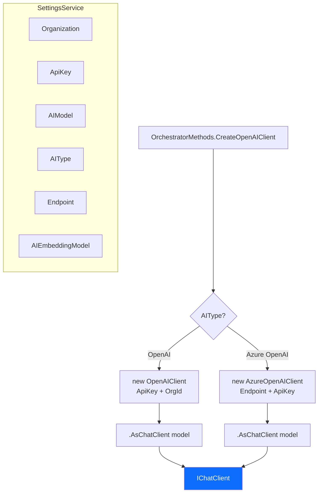

### 1.4 Current Settings UI Flow

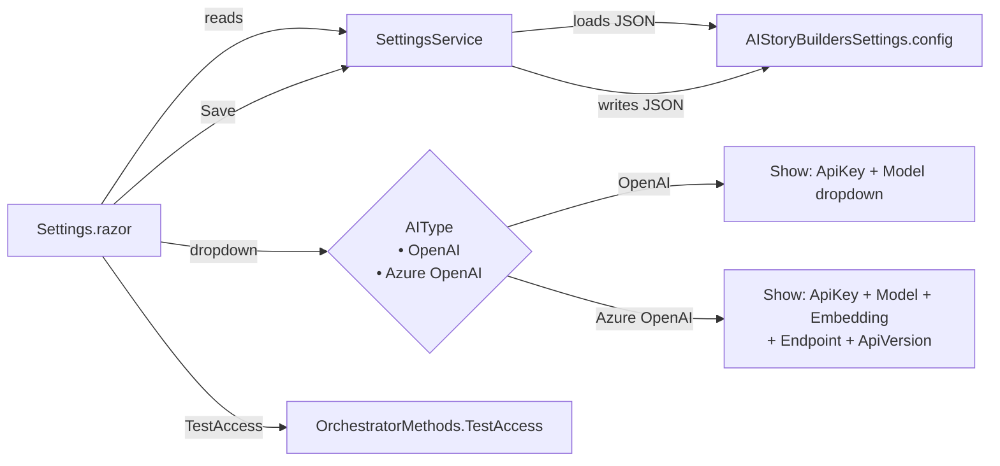

### 1.5 How AI Calls Branch Today

Every method in `OrchestratorMethods` (e.g., `WriteParagraph`, `ParseNewStory`, `CreateNewChapters`, `DetectCharacters`, `DetectCharacterAttributes`, `GetStoryBeats`, `CleanJSON`, `TestAccess`) follows the same pattern:

1. Call `CreateOpenAIClient()` → returns `IChatClient`.
2. Build a prompt string.
3. `await api.CompleteAsync(prompt)`.
4. Parse the JSON or text result.

Embedding calls (`GetVectorEmbedding`, `GetVectorEmbeddingAsFloats`) currently follow a parallel branch that directly instantiates `OpenAIClient` or `AzureOpenAIClient` and calls `.AsEmbeddingGenerator()`. Under the new plan, embeddings will be handled entirely by a local `all-MiniLM-L6-v2` ONNX model via the injected `LocalEmbeddingGenerator` singleton — no cloud API required.

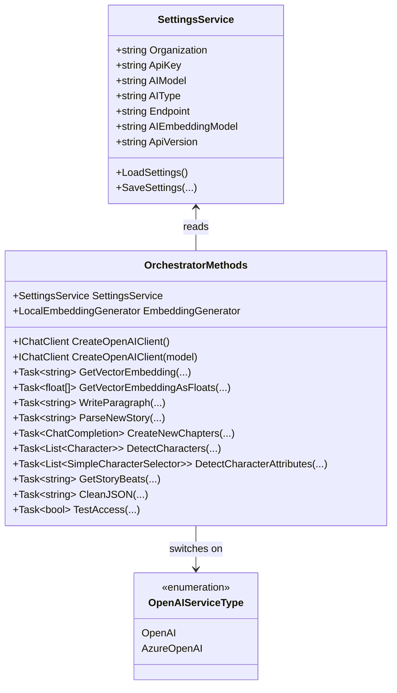

---

## Feature #2 — Analysis of the BlazorDataOrchestrator ConfigureAIDialog

The reference implementation in [BlazorDataOrchestrator](https://github.com/Blazor-Data-Orchestrator/BlazorDataOrchestrator/blob/main/src/BlazorOrchestrator.Web/Components/Pages/Dialogs/ConfigureAIDialog.razor) extends the same Radzen-based settings pattern to **four** AI providers.

### 2.1 Providers Supported

| Provider | NuGet Package(s) | Key Config Fields |
|---|---|---|
| **OpenAI** | `OpenAI` | ApiKey, Model (dropdown w/ live refresh) |
| **Azure OpenAI** | `Azure.AI.OpenAI` | ApiKey, Model (dropdown), Embedding Model, Endpoint, API Version |
| **Anthropic** | `Anthropic.SDK` | ApiKey, Model (dropdown w/ live refresh) |
| **Google AI (Gemini)** | `Mscc.GenerativeAI` | ApiKey, Model (dropdown w/ live refresh) |

### 2.2 Architecture Highlights

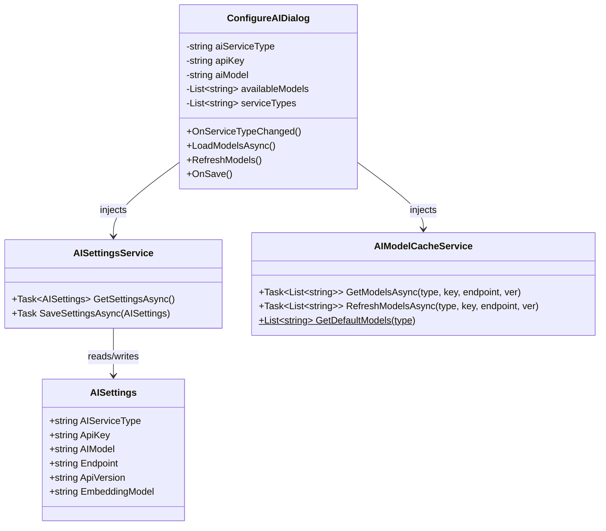

### 2.3 Key Design Patterns from the Reference

1. **Unified `AISettings` model** — a single flat POCO replaces scattered properties. The `AIServiceType` field is the discriminator.
2. **`AIModelCacheService`** — fetches real model lists from each provider's API, caches them, and exposes per-provider defaults as a fallback.
3. **Live model refresh** — each provider section has a 🔄 *Refresh* button that calls the provider SDK to enumerate available models/deployments.
4. **Per-provider connection test** — `OnSave()` branches to the correct SDK to send a test `"Hello"` message before persisting.
5. **Provider-specific API-key help links** — dedicated buttons redirect to each provider's key-management page.
6. **NuGet references required:**
   - `Anthropic.SDK` (Anthropic Claude)
   - `Mscc.GenerativeAI` (Google Gemini)

---

## Feature #3 — Change Plan to Implement Multi-Provider Support

### 3.1 High-Level Migration Overview

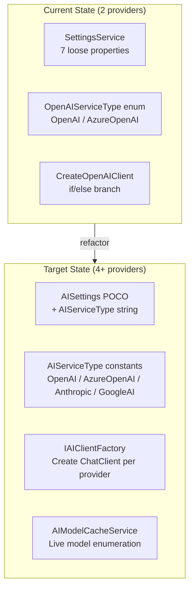

### 3.2 Detailed Change List

#### 3.2.1 New NuGet Packages

Add to `AIStoryBuilders.csproj`:

| Package | Purpose |
|---|---|
| `Anthropic.SDK` | Anthropic Claude models |
| `Mscc.GenerativeAI` | Google Gemini models |
| `Microsoft.ML.OnnxRuntime` | Local ONNX inference for `all-MiniLM-L6-v2` embeddings |
| `Microsoft.ML.Tokenizers` | WordPiece tokenizer for BERT-family models |

#### 3.2.2 New / Modified Models

| File | Action | Details |
|---|---|---|
| `Models/AISettings.cs` | **Create** | Unified settings POCO: `AIServiceType`, `ApiKey`, `AIModel`, `Endpoint`, `ApiVersion`, `Organization` (embedding fields removed — embeddings are now local) |
| `Models/Enums.cs` | **Modify** | *(Optional)* Add `AIProviderType` enum or keep string-based discriminator to match reference |

**Proposed `AISettings` class:**

```
AISettings
├── AIServiceType        : string   ("OpenAI" | "Azure OpenAI" | "Anthropic" | "Google AI")
├── Organization         : string
├── ApiKey               : string
├── AIModel              : string
├── Endpoint             : string
└── ApiVersion           : string

(Embedding is handled locally by all-MiniLM-L6-v2 — no embedding settings required)
```

#### 3.2.3 Service Layer Changes

| File | Action | Details |
|---|---|---|
| `Services/SettingsService.cs` | **Rewrite** | Replace 7 loose properties with a single `AISettings` field. Implement `GetSettingsAsync()` / `SaveSettingsAsync(AISettings)`. Backward-compatible JSON deserialization for existing config files. |
| `Services/AIModelCacheService.cs` | **Create** | Port from reference. Enumerate models per provider, cache results, expose `GetDefaultModels(type)`. |

#### 3.2.4 AI Layer Changes

| File | Action | Details |
|---|---|---|
| `AI/OrchestratorMethods.cs` | **Modify** | Refactor `CreateOpenAIClient()` / `CreateOpenAIClient(model)` from `if/else` to `switch` with 4 branches. Add `case "Anthropic"` → `new AnthropicChatClient(...)` and `case "Google AI"` → `new GoogleAIChatClient(...)`. Remove all cloud-embedding client code from `GetVectorEmbedding*` methods — delegate to injected `LocalEmbeddingGenerator` (see §3.4). Full factory code in §3.6.5. |
| `AI/OrchestratorMethods.cs` | **Modify** | Replace `OpenAIServiceType` enum with string constants or an expanded enum: `OpenAI`, `AzureOpenAI`, `Anthropic`, `GoogleAI`. |
| `AI/OrchestratorMethods.cs` | **Modify** | Delete `CreateEmbeddingOpenAIClient()` — no longer needed. |
| `AI/AnthropicChatClient.cs` | **Create** | Thin `IChatClient` wrapper around `Anthropic.SDK`. Maps `ChatMessage` roles → Anthropic `Message`/`SystemMessage`, maps response → `ChatCompletion`. ~90 lines. See §3.6.3. |
| `AI/GoogleAIChatClient.cs` | **Create** | Thin `IChatClient` wrapper around `Mscc.GenerativeAI`. Maps prompt → `GenerativeModel.GenerateContent()`, maps response → `ChatCompletion`. ~80 lines. See §3.6.4. |
| `AI/LocalEmbeddingGenerator.cs` | **Create** | ONNX-based local embedding using `all-MiniLM-L6-v2`. Implements `IEmbeddingGenerator<string, Embedding<float>>`. Registered as singleton (see §3.4.4). |
| `AI/OrchestratorMethods.TestAccess.cs` | **Modify** | Remove provider-specific embedding test. Replace cloud embedding test with local embedding smoke test. Chat test works unchanged via `IChatClient` — the wrappers handle all provider differences. |

#### 3.2.5 UI Changes

| File | Action | Details |
|---|---|---|
| `Components/Pages/Settings.razor` | **Major rewrite** | Expand `colAITypes` list to include `"Anthropic"` and `"Google AI"`. Add conditional form sections for each. Add model refresh button. Port validation logic from the reference `ConfigureAIDialog`. |

#### 3.2.6 Startup / DI Changes

| File | Action | Details |
|---|---|---|
| `MauiProgram.cs` | **Modify** | Register `AIModelCacheService` as singleton. No other DI changes needed if `SettingsService` retains its singleton lifetime. |
| Default config template | **Modify** | Update the default `AIStoryBuildersSettings.config` JSON written in `MauiProgram.cs` to include the new `AIServiceType` field defaulting to `"OpenAI"`. |

### 3.3 Proposed `CreateOpenAIClient` Refactor

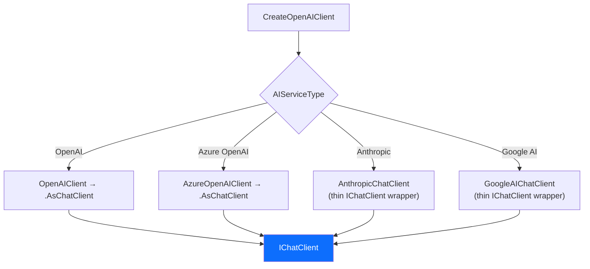

> **Implementation strategy — thin `IChatClient` wrappers:**
>
> `Microsoft.Extensions.AI.OpenAI` provides `.AsChatClient()` for OpenAI/Azure. For Anthropic and Google AI, we write **thin `IChatClient` wrappers** that delegate to each provider's native SDK. This keeps all downstream code (`WriteParagraph`, `ParseNewStory`, `DetectCharacters`, etc.) **completely unchanged** — they continue to call `IChatClient.CompleteAsync()` and read `.Choices.FirstOrDefault().Text` exactly as they do today.
>
> See **§3.6** for the full wrapper design, code, and `IChatClient` surface-area analysis.

### 3.4 Embedding Strategy — Local `all-MiniLM-L6-v2` for All Providers

Embedding vectors power the **Related Paragraphs** feature — the semantic search that finds the top-10 earlier paragraphs most relevant to the current section. Today this is hard-wired to OpenAI / Azure OpenAI cloud APIs, which creates several problems:

- Anthropic has **no** embedding endpoint; Google uses different dimensions (768-d vs 1536-d).
- Every embedding call costs money and requires a network round-trip.
- Switching chat providers can break existing story vector indexes due to dimension mismatches.

**Decision: Use `all-MiniLM-L6-v2` locally for all embeddings, regardless of which AI chat provider is active.** This is a sentence-transformer model that produces 384-dimensional vectors and runs entirely on-device via ONNX Runtime — no API keys, no cloud calls, no per-provider branching.

#### 3.4.1 Why `all-MiniLM-L6-v2`

| Criterion | `all-MiniLM-L6-v2` | Cloud Embeddings (status quo) |
|---|---|---|
| **Cost** | Free — runs locally | Per-token API charges |
| **Latency** | ~5–15 ms per embedding (CPU) | 200–500 ms per call (network) |
| **Offline support** | ✅ Works without internet | ❌ Requires active connection |
| **Dimensions** | 384 | 1536 (OpenAI) / 768 (Google) |
| **Quality** | Excellent for semantic similarity at paragraph scale | Slightly higher ceiling for very long texts |
| **Model size** | ~80 MB ONNX file | N/A (server-side) |
| **Provider coupling** | None — works with any chat provider | Tied to specific provider SDKs |
| **Consistency** | Same vectors everywhere, always | Risk of dimension mismatch when switching providers |

The 384-d vectors are more than sufficient for the cosine-similarity paragraph search that AIStoryBuilders performs. The top-10 ranking quality is comparable to OpenAI `text-embedding-ada-002` for short-to-medium text chunks.

#### 3.4.2 Required NuGet Packages

| Package | Purpose |
|---|---|
| `Microsoft.ML.OnnxRuntime` | ONNX inference engine (CPU) |
| `Microsoft.ML.Tokenizers` | WordPiece tokenizer for BERT-family models |

> **Alternative:** Use `SmartComponents.LocalEmbeddings` if available, which bundles the model + tokenizer. Either way the end result is the same — a local `IEmbeddingGenerator` that returns `float[384]`.

#### 3.4.3 Proposed Architecture

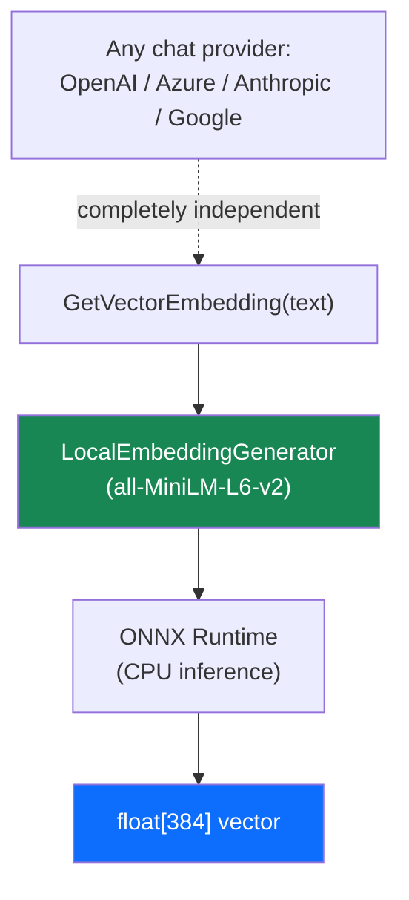

The embedding path is now **entirely decoupled** from the chat provider. There is no `EmbeddingProvider` dropdown, no `EmbeddingApiKey`, no per-provider branching in the embedding code.

#### 3.4.4 `LocalEmbeddingGenerator` Implementation

```csharp
// Pseudocode — AI/LocalEmbeddingGenerator.cs
public class LocalEmbeddingGenerator : IEmbeddingGenerator<string, Embedding<float>>, IDisposable
{
    private readonly InferenceSession _session;
    private readonly Tokenizer _tokenizer;
    private const int MaxTokens = 256;
    private const int EmbeddingDimensions = 384;

    public LocalEmbeddingGenerator()
    {
        // MAUI asset files are copied to AppDataDirectory on first use (see §3.4.5).
        var dataDir = FileSystem.AppDataDirectory;
        var modelPath = Path.Combine(dataDir, "all-MiniLM-L6-v2.onnx");
        var vocabPath = Path.Combine(dataDir, "vocab.txt");

        CopyAssetIfMissing("all-MiniLM-L6-v2.onnx", modelPath);
        CopyAssetIfMissing("vocab.txt", vocabPath);

        _session = new InferenceSession(modelPath);
        _tokenizer = new WordPieceTokenizer(vocabPath);
    }

    private static void CopyAssetIfMissing(string assetName, string destPath)
    {
        if (File.Exists(destPath)) return;
        using var stream = FileSystem.OpenAppPackageFileAsync(assetName).Result;
        using var dest = File.Create(destPath);
        stream.CopyTo(dest);
    }

    public async Task<GeneratedEmbeddings<Embedding<float>>> GenerateAsync(
        IEnumerable<string> values,
        EmbeddingGenerationOptions options = null,
        CancellationToken ct = default)
    {
        var results = new List<Embedding<float>>();

        foreach (var text in values)
        {
            // 1. Tokenize
            var encoded = _tokenizer.Encode(text, MaxTokens);

            // 2. Build ONNX input tensors (input_ids, attention_mask, token_type_ids)
            var inputIds      = new DenseTensor<long>(encoded.InputIds, new[] { 1, encoded.Length });
            var attentionMask = new DenseTensor<long>(encoded.AttentionMask, new[] { 1, encoded.Length });
            var tokenTypeIds  = new DenseTensor<long>(encoded.TokenTypeIds, new[] { 1, encoded.Length });

            var inputs = new List<NamedOnnxValue>
            {
                NamedOnnxValue.CreateFromTensor("input_ids", inputIds),
                NamedOnnxValue.CreateFromTensor("attention_mask", attentionMask),
                NamedOnnxValue.CreateFromTensor("token_type_ids", tokenTypeIds)
            };

            // 3. Run inference
            using var output = _session.Run(inputs);

            // 4. Mean-pool the token embeddings → single 384-d vector
            var tokenEmbeddings = output.First().AsEnumerable<float>().ToArray();
            var pooled = MeanPool(tokenEmbeddings, encoded.Length, EmbeddingDimensions);

            // 5. L2-normalize
            var normalized = L2Normalize(pooled);

            results.Add(new Embedding<float>(normalized));
        }

        return new GeneratedEmbeddings<Embedding<float>>(results);
    }

    private static float[] MeanPool(float[] tokenEmbeddings, int seqLen, int dim)
    {
        var pooled = new float[dim];
        for (int t = 0; t < seqLen; t++)
            for (int d = 0; d < dim; d++)
                pooled[d] += tokenEmbeddings[t * dim + d];
        for (int d = 0; d < dim; d++)
            pooled[d] /= seqLen;
        return pooled;
    }

    private static float[] L2Normalize(float[] vector)
    {
        var norm = (float)Math.Sqrt(vector.Sum(v => v * v));
        return norm == 0 ? vector : vector.Select(v => v / norm).ToArray();
    }

    public void Dispose() => _session?.Dispose();
}
```

#### 3.4.5 Model Distribution

The ONNX model file (~80 MB) must be bundled with the application.

**Decision: Ship as `MauiAsset` in `Resources/Raw/`.** An 80 MB increase is acceptable for a desktop application and guarantees offline functionality from the first launch. No lazy-download UI is needed.

The existing wildcard in `AIStoryBuilders.csproj` already covers this — no additional `<MauiAsset>` entries are required:

```xml
<!-- Already present at line 82 of AIStoryBuilders.csproj -->
<MauiAsset Include="Resources\Raw\**" LogicalName="%(RecursiveDir)%(Filename)%(Extension)" />
```

**Files to add:**

| File | Size | Source |
|---|---|---|
| `Resources/Raw/all-MiniLM-L6-v2.onnx` | ~80 MB | [Hugging Face — sentence-transformers/all-MiniLM-L6-v2](https://huggingface.co/sentence-transformers/all-MiniLM-L6-v2) (export to ONNX via `optimum`) |
| `Resources/Raw/vocab.txt` | ~230 KB | Same Hugging Face repo — `tokenizer/vocab.txt` |

**Loading at runtime** (updated `LocalEmbeddingGenerator` constructor):

```csharp
public LocalEmbeddingGenerator()
{
    // MAUI copies Resources/Raw/* to the app bundle.
    // On Windows, FileSystem.AppDataDirectory points to the app's local data folder,
    // but MauiAsset files are accessible via FileSystem.OpenAppPackageFileAsync().
    // Copy to a writable path on first use so OnnxRuntime can open them by path.

    var dataDir = FileSystem.AppDataDirectory;
    var modelPath = Path.Combine(dataDir, "all-MiniLM-L6-v2.onnx");
    var vocabPath = Path.Combine(dataDir, "vocab.txt");

    if (!File.Exists(modelPath))
    {
        using var stream = FileSystem.OpenAppPackageFileAsync("all-MiniLM-L6-v2.onnx").Result;
        using var dest = File.Create(modelPath);
        stream.CopyTo(dest);
    }

    if (!File.Exists(vocabPath))
    {
        using var stream = FileSystem.OpenAppPackageFileAsync("vocab.txt").Result;
        using var dest = File.Create(vocabPath);
        stream.CopyTo(dest);
    }

    _session = new InferenceSession(modelPath);
    _tokenizer = new WordPieceTokenizer(vocabPath);
}
```

> **Why copy?** `InferenceSession` requires a file system path. MAUI asset streams are read-only app-package resources, so we copy once to `AppDataDirectory` on first launch.

#### 3.4.6 Migration — Re-indexing Existing Stories

Existing stories have vectors with 1536 dimensions (OpenAI). The new model produces 384-d vectors. These are **incompatible** — all existing vectors must be re-generated.

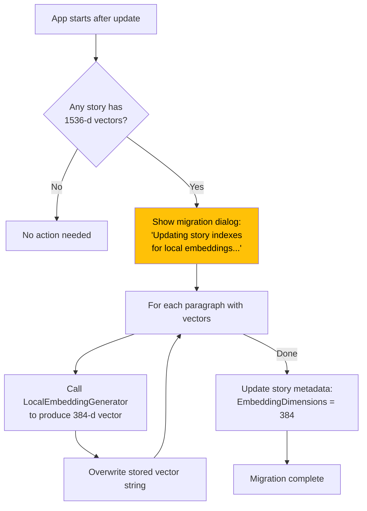

**Implementation details:**

| Concern | Strategy |
|---|---|
| **Detection** | On story load, read the first non-empty vector; if `float[].Length != 384`, flag for re-index. |
| **Performance** | ~5–15 ms per embedding on CPU. A story with 500 paragraphs re-indexes in ~5–8 seconds. |
| **Progress** | Use `ReadTextEvent` to push status updates to the UI. |
| **One-time cost** | Re-indexing only happens once per story after the update. New paragraphs use local embeddings automatically. |
| **Backward compatibility** | If a user downgrades, old vectors will be gone. Warn in the migration dialog. |

#### 3.4.7 Refactored `GetVectorEmbedding*` Methods

Both methods now delegate to a single `LocalEmbeddingGenerator` instance (singleton, injected via DI):

```csharp
// In OrchestratorMethods.cs — after refactor
private readonly LocalEmbeddingGenerator _embeddingGenerator;

public OrchestratorMethods(
    SettingsService settingsService,
    LogService logService,
    DatabaseService databaseService,
    LocalEmbeddingGenerator embeddingGenerator)
{
    SettingsService = settingsService;
    LogService = logService;
    DatabaseService = databaseService;
    _embeddingGenerator = embeddingGenerator;
}

public async Task<string> GetVectorEmbedding(string content, bool combine)
{
    var embeddings = await _embeddingGenerator.GenerateAsync(new[] { content });
    var vector = embeddings[0].Vector.ToArray();
    var vectorString = "[" + string.Join(",", vector) + "]";
    return combine ? content + "|" + vectorString : vectorString;
}

public async Task<float[]> GetVectorEmbeddingAsFloats(string content)
{
    var embeddings = await _embeddingGenerator.GenerateAsync(new[] { content });
    return embeddings[0].Vector.ToArray();
}
```

No `if/else` branching. No API keys. No provider awareness. The embedding path is the same regardless of whether the user is writing with GPT-5, Claude, or Gemini.

#### 3.4.8 Settings UI — Embedding Section

Since embeddings are now fully local, the Settings UI **no longer needs** an embedding configuration panel. Remove:

- ~~Embedding Provider dropdown~~
- ~~Embedding API Key field~~
- ~~Embedding Model field~~
- ~~Embedding Endpoint field~~
- ~~Anthropic warning banner~~

Replace with a simple read-only info line:

> **Embedding Model:** `all-MiniLM-L6-v2` (local, 384 dimensions) — no configuration required.

For Azure OpenAI users who previously configured an `AIEmbeddingModel` deployment name, this field is **no longer used** for embeddings. It can be removed from the settings UI and config file (with backward-compatible deserialization that ignores the old field).

#### 3.4.9 Files Affected by Embedding Change

| File | Action | Details |
|---|---|---|
| `AI/LocalEmbeddingGenerator.cs` | **Create** | ONNX-based local embedding generator implementing `IEmbeddingGenerator<string, Embedding<float>>`. Loads `all-MiniLM-L6-v2.onnx` + `vocab.txt`. |
| `AI/OrchestratorMethods.cs` | **Modify** | Remove all `OpenAIClient` / `AzureOpenAIClient` instantiation from embedding methods. Inject `LocalEmbeddingGenerator` via constructor. Simplify `GetVectorEmbedding` and `GetVectorEmbeddingAsFloats` to single-path delegation. Delete `CreateEmbeddingGenerator()` factory and `CreateEmbeddingOpenAIClient()`. |
| `AI/OrchestratorMethods.TestAccess.cs` | **Modify** | Remove Azure embedding connectivity test. Replace with a local embedding smoke test (`_embeddingGenerator.GenerateAsync("test")`). |
| `AI/GoogleAIEmbeddingAdapter.cs` | **Delete** | No longer needed — all embeddings are local. |
| `Services/SettingsService.cs` | **Modify** | Remove `AIEmbeddingModel` property. Ignore the field on deserialization for backward compatibility. |
| `Services/AIStoryBuildersService.MasterStory.cs` | **Modify** | Add one-time migration check: detect old 1536-d vectors and trigger re-indexing with `LocalEmbeddingGenerator`. |
| `Components/Pages/Settings.razor` | **Modify** | Remove all embedding-related form fields. Add read-only label for local embedding info. |
| `MauiProgram.cs` | **Modify** | Register `LocalEmbeddingGenerator` as singleton in DI. Remove embedding-model default from config template. |
| `AIStoryBuilders.csproj` | **Modify** | Add `Microsoft.ML.OnnxRuntime` and `Microsoft.ML.Tokenizers` NuGet packages. No new `<MauiAsset>` entries needed — the existing wildcard `Resources\Raw\**` (line 82) auto-includes the ONNX model and vocab file. |
| `Resources/Raw/all-MiniLM-L6-v2.onnx` | **Add** | ONNX model file (~80 MB). Download from [Hugging Face](https://huggingface.co/sentence-transformers/all-MiniLM-L6-v2). |
| `Resources/Raw/vocab.txt` | **Add** | WordPiece vocabulary file for the tokenizer. |
| `Services/AIStoryBuildersService.ReEmbed.cs` | **Create** | `ReEmbedStory(Story)` method + `ReEmbedCsvDescriptionFile` helper. Iterates all paragraph, chapter, character, and location files in the loaded story and regenerates vectors via `LocalEmbeddingGenerator`. Reports progress via `TextEvent`. See §3.4.10. |
| `Components/Pages/Controls/Story/StoryEdit.razor` | **Modify** | Add "Re-Embed All" button with Radzen confirmation dialog. Calls `AIStoryBuildersService.ReEmbedStory(objStory)`. See §3.4.10. |

#### 3.4.10 "Re-Embed Story" Button — Manual Re-Indexing

In addition to the automatic migration on first launch (§3.4.6), users need an **on-demand** button to re-generate all embeddings for the currently loaded story. Use cases:

| Scenario | Why Manual Re-Embed Is Needed |
|---|---|
| User imported a story from another machine with different-dimension vectors | Automatic detection may not trigger if dimensions happen to match but the model was different. |
| Embeddings were created by a previous version of `all-MiniLM-L6-v2` or a different local model | Vector quality may differ even at the same dimension. |
| Story data was manually edited outside the app | Paragraph text changed but stored vectors are stale. |
| User simply wants to refresh similarity search quality | A "rebuild index" affordance is standard in apps that use vector search. |

##### UI Placement

Add a **"Re-Embed All"** button to the **Story edit panel** (`Components/Pages/Controls/Story/StoryEdit.razor`). It should only be enabled when a story is loaded.

```
┌────────────────────────────────────────────────────┐
│  Story: "The Lost Kingdom"                         │
│  Style:  Epic Fantasy                              │
│  Theme:  ...                                       │
│  Synopsis: ...                                     │
│                                                    │
│  [Save]  [Delete]  [Export]   [🔄 Re-Embed All]   │
└────────────────────────────────────────────────────┘
```

The button shows a Radzen confirmation dialog before proceeding:

> **Re-embed all vectors?**
> This will regenerate embeddings for every paragraph, chapter, character, and location in this story using the local `all-MiniLM-L6-v2` model. This may take a few seconds for large stories. Existing similarity-search vectors will be overwritten.
>
> \[Cancel\]  \[**Re-Embed**\]

##### What Gets Re-Embedded

All file types that store vector data in the current story:

| File Pattern | Location on Disk | Embedding Format |
|---|---|---|
| **Paragraph files** | `{StoryTitle}/Chapters/Chapter{N}/Paragraph{N}.txt` | `Location\|Timeline\|[Characters]\|Content\|[vector]` — the 5th pipe-delimited field |
| **Chapter synopsis files** | `{StoryTitle}/Chapters/Chapter{N}/Chapter{N}.txt` | `Synopsis\|[vector]` — content + vector via `GetVectorEmbedding(text, true)` |
| **Character description files** | `{StoryTitle}/Characters/{Name}.csv` | `type\|timeline\|Description\|[vector]` — per-line, vector is the embedded description |
| **Location description files** | `{StoryTitle}/Locations/{Name}.csv` | `Description\|timeline\|[vector]` — per-line, vector is the embedded description |

##### Service Method

Add a new method to `AIStoryBuildersService` (partial class in a new file `AIStoryBuildersService.ReEmbed.cs`):

```csharp
// Services/AIStoryBuildersService.ReEmbed.cs
public partial class AIStoryBuildersService
{
    public async Task ReEmbedStory(Story story)
    {
        var storyPath = $"{BasePath}/{story.Title}";
        int totalFiles = 0;
        int processedFiles = 0;

        // 1. Count total files to re-embed (for progress reporting)
        var paragraphFiles = Directory.GetFiles($"{storyPath}/Chapters", "Paragraph*.txt", SearchOption.AllDirectories);
        var chapterFiles   = Directory.GetFiles($"{storyPath}/Chapters", "Chapter*.txt", SearchOption.AllDirectories);
        var characterFiles = Directory.GetFiles($"{storyPath}/Characters", "*.csv", SearchOption.TopDirectoryOnly);
        var locationFiles  = Directory.GetFiles($"{storyPath}/Locations", "*.csv", SearchOption.TopDirectoryOnly);

        totalFiles = paragraphFiles.Length + chapterFiles.Length + characterFiles.Length + locationFiles.Length;

        // 2. Re-embed Paragraph files
        foreach (var file in paragraphFiles)
        {
            processedFiles++;
            TextEvent?.Invoke(this, new TextEventArgs(
                $"Re-embedding paragraph {processedFiles}/{totalFiles}...", 1));

            var lines = File.ReadAllLines(file)
                            .Where(l => l.Trim() != "").ToArray();
            if (lines.Length == 0) continue;

            var parts = lines[0].Split('|');
            if (parts.Length < 4) continue;

            // parts: [0]=Location, [1]=Timeline, [2]=Characters, [3]=Content, [4]=OldVector
            var content = parts[3];
            if (string.IsNullOrWhiteSpace(content)) continue;

            string newEmbedding = await OrchestratorMethods.GetVectorEmbedding(content, true);
            // newEmbedding = "content|[vector]"
            string rebuilt = $"{parts[0]}|{parts[1]}|{parts[2]}|{newEmbedding}";
            File.WriteAllText(file, rebuilt);
        }

        // 3. Re-embed Chapter synopsis files
        foreach (var file in chapterFiles)
        {
            processedFiles++;
            TextEvent?.Invoke(this, new TextEventArgs(
                $"Re-embedding chapter {processedFiles}/{totalFiles}...", 1));

            var text = File.ReadAllText(file).Trim();
            if (string.IsNullOrWhiteSpace(text)) continue;

            // Format: "synopsis|[vector]"  — split on first pipe-bracket boundary
            var synopsisEnd = text.IndexOf("|[");
            string synopsis = synopsisEnd > 0 ? text.Substring(0, synopsisEnd) : text;

            string newEmbedding = await OrchestratorMethods.GetVectorEmbedding(synopsis, true);
            File.WriteAllText(file, newEmbedding);
        }

        // 4. Re-embed Character description files
        foreach (var file in characterFiles)
        {
            processedFiles++;
            TextEvent?.Invoke(this, new TextEventArgs(
                $"Re-embedding character {processedFiles}/{totalFiles}...", 1));

            await ReEmbedCsvDescriptionFile(file, hasTypeAndTimeline: true);
        }

        // 5. Re-embed Location description files
        foreach (var file in locationFiles)
        {
            processedFiles++;
            TextEvent?.Invoke(this, new TextEventArgs(
                $"Re-embedding location {processedFiles}/{totalFiles}...", 1));

            await ReEmbedCsvDescriptionFile(file, hasTypeAndTimeline: false);
        }

        TextEvent?.Invoke(this, new TextEventArgs(
            $"Re-embedding complete — {totalFiles} files processed.", 5));
    }

    /// <summary>
    /// Re-embeds each line in a CSV file that stores description + vector.
    /// Character files: "type|timeline|description|[vector]"
    /// Location files:  "description|timeline|[vector]"
    /// </summary>
    private async Task ReEmbedCsvDescriptionFile(string filePath, bool hasTypeAndTimeline)
    {
        var lines = File.ReadAllLines(filePath)
                        .Where(l => l.Trim() != "").ToList();
        var rebuilt = new List<string>();

        foreach (var line in lines)
        {
            var parts = line.Split('|');
            string description;
            string prefix;

            if (hasTypeAndTimeline && parts.Length >= 3)
            {
                // Character: type|timeline|description|[vector]
                description = parts[2];
                prefix = $"{parts[0]}|{parts[1]}";
            }
            else if (parts.Length >= 2)
            {
                // Location: description|timeline|[vector]
                description = parts[0];
                prefix = $"{parts[0]}|{parts[1]}";
            }
            else continue;

            string newVector = await OrchestratorMethods.GetVectorEmbedding(description, false);
            rebuilt.Add($"{prefix}|{newVector}");
        }

        File.WriteAllLines(filePath, rebuilt);
    }
}
```

##### Razor Button Handler (StoryEdit.razor)

```razor
<RadzenButton Text="Re-Embed All" Icon="refresh"
              ButtonStyle="ButtonStyle.Warning"
              Click="@OnReEmbedClick"
              Disabled="@(objStory == null || isReEmbedding)" />

@code {
    bool isReEmbedding = false;

    async Task OnReEmbedClick()
    {
        var confirmed = await DialogService.Confirm(
            "This will regenerate embeddings for every paragraph, chapter, " +
            "character, and location in this story. Continue?",
            "Re-embed all vectors?",
            new ConfirmOptions { OkButtonText = "Re-Embed", CancelButtonText = "Cancel" });

        if (confirmed != true) return;

        isReEmbedding = true;
        StateHasChanged();

        try
        {
            await AIStoryBuildersService.ReEmbedStory(objStory);
        }
        finally
        {
            isReEmbedding = false;
            StateHasChanged();
        }
    }
}
```

##### Performance Estimate

| Story Size | Paragraph Files | Character + Location + Chapter Files | Estimated Time |
|---|---|---|---|
| Small (5 chapters, 25 paragraphs) | 25 | ~15 | < 1 second |
| Medium (20 chapters, 200 paragraphs) | 200 | ~40 | ~2–4 seconds |
| Large (50 chapters, 500+ paragraphs) | 500+ | ~80 | ~5–10 seconds |

All embeddings are local (CPU, ~5–15 ms each), so the operation is fast and requires no API keys or network connectivity.

##### Files Affected

| File | Action | Details |
|---|---|---|
| `Services/AIStoryBuildersService.ReEmbed.cs` | **Create** | `ReEmbedStory(Story)` and `ReEmbedCsvDescriptionFile(...)` helper |
| `Components/Pages/Controls/Story/StoryEdit.razor` | **Modify** | Add "Re-Embed All" button + confirmation dialog + `OnReEmbedClick` handler |

### 3.5 Migration Compatibility Matrix

| Concern | Strategy |
|---|---|
| Existing `AIStoryBuildersSettings.config` files | `SettingsService.LoadSettings()` should detect missing `AIServiceType` key and default to `"OpenAI"`. |
| `OpenAIServiceType` enum references in `OrchestratorMethods` | Replace with string comparison against `AISettings.AIServiceType`. |
| `OpenAI` NuGet already present | Keep — still needed for OpenAI and as a transitive dep for Azure.AI.OpenAI. |
| JSON response parsing (Newtonsoft) | No change — provider-agnostic since we work with `IChatClient`. |
| Existing 1536-dimension paragraph vectors | On first launch after upgrade, detect that stored vectors are 1536-d while `LocalEmbeddingGenerator` produces 384-d. Prompt the user to re-index (background task iterates all paragraphs, regenerates embeddings via local model, and writes back). Until re-indexed, cosine-similarity results will be inaccurate — show a warning banner. See §3.4.5 for details. |

### 3.6 Thin `IChatClient` Wrappers for Anthropic & Google AI

#### 3.6.1 Design Rationale

The single most important architectural constraint of the multi-provider expansion is:

> **Every existing `OrchestratorMethods` partial-class file (`WriteParagraph`, `ParseNewStory`, `CreateNewChapters`, `DetectCharacters`, `DetectCharacterAttributes`, `GetStoryBeats`, `CleanJSON`, `TestAccess`) must remain untouched.**

Today these methods follow an identical pattern:

```csharp
IChatClient api = CreateOpenAIClient();
var result = await api.CompleteAsync(promptString);
string text = result.Choices.FirstOrDefault().Text;
int? tokens = result.Usage.TotalTokenCount;
```

Because they program against the `Microsoft.Extensions.AI.IChatClient` abstraction, adding new providers is a pure **factory-level** change: the `CreateOpenAIClient` method returns a different `IChatClient` implementation and everything downstream just works.

For **OpenAI** and **Azure OpenAI** we already get `IChatClient` for free via the `.AsChatClient()` extension from `Microsoft.Extensions.AI.OpenAI`. For **Anthropic** and **Google AI** there is no first-party bridge, so we write **thin wrapper classes** — one per provider — that implement `IChatClient` and delegate to the native SDK.

#### 3.6.2 `IChatClient` Surface-Area Analysis

Before writing the wrappers we need to know exactly which members of `IChatClient` the app actually uses. A grep of all `OrchestratorMethods.*.cs` files reveals:

| `IChatClient` member used | Where | Needed in wrapper? |
|---|---|---|
| `CompleteAsync(string)` | Every method (`WriteParagraph`, `TestAccess`, etc.) | ✅ Yes — the primary call |
| `ChatCompletion.Choices[0].Text` | Every method — read the generated text | ✅ Yes — map to wrapper result |
| `ChatCompletion.Usage.TotalTokenCount` | Every method — logged for diagnostics | ✅ Yes — map from SDK usage |
| `CompleteAsync(IList<ChatMessage>, ChatOptions, CancellationToken)` | Not currently used; will be used in Feature #4 prompt-pipeline refactor | ✅ Yes — implement now for forward-compatibility |
| `CompleteStreamingAsync(...)` | Not used | ❌ Not needed — throw `NotSupportedException` |
| `GetService<T>(...)` | Not used | ❌ Return `null` |
| `Dispose()` | Not explicitly called | ✅ Implement — dispose underlying SDK client if needed |

This is a very small surface. Each wrapper only needs to implement two methods meaningfully: the string-based `CompleteAsync` (which is an extension that calls the `IList<ChatMessage>` overload) and the message-list `CompleteAsync`.

#### 3.6.3 `AnthropicChatClient` Wrapper

```csharp
// AI/AnthropicChatClient.cs
using Anthropic.SDK;
using Anthropic.SDK.Messaging;
using Microsoft.Extensions.AI;

namespace AIStoryBuilders.AI;

/// <summary>
/// Thin IChatClient wrapper around Anthropic.SDK.
/// Translates Microsoft.Extensions.AI calls into Anthropic MessageClient calls.
/// </summary>
public sealed class AnthropicChatClient : IChatClient
{
    private readonly AnthropicClient _client;
    private readonly string _model;

    public AnthropicChatClient(string apiKey, string model)
    {
        _client = new AnthropicClient(apiKey);
        _model = model;
    }

    public ChatClientMetadata Metadata =>
        new(nameof(AnthropicChatClient), modelId: _model);

    public async Task<ChatCompletion> CompleteAsync(
        IList<ChatMessage> chatMessages,
        ChatOptions? options = null,
        CancellationToken cancellationToken = default)
    {
        // ── 1. Separate system message from conversation messages ──
        string? systemPrompt = null;
        var messages = new List<Anthropic.SDK.Messaging.Message>();

        foreach (var msg in chatMessages)
        {
            if (msg.Role == ChatRole.System)
            {
                systemPrompt = msg.Text;
            }
            else
            {
                var role = msg.Role == ChatRole.Assistant
                    ? RoleType.Assistant
                    : RoleType.User;
                messages.Add(new Anthropic.SDK.Messaging.Message(role, msg.Text));
            }
        }

        // ── 2. Build Anthropic request ──
        var request = new MessageParameters
        {
            Model = options?.ModelId ?? _model,
            MaxTokens = options?.MaxOutputTokens ?? 4096,
            System = new List<SystemMessage>
            {
                new SystemMessage(systemPrompt ?? "You are a helpful assistant.")
            },
            Messages = messages
        };

        // ── 3. Call Anthropic SDK ──
        var response = await _client.Messages.GetClaudeMessageAsync(
            request, cancellationToken);

        // ── 4. Map response → Microsoft.Extensions.AI.ChatCompletion ──
        var text = string.Join("", response.Content
            .Where(c => c.Type == "text")
            .Select(c => c.Text));

        return new ChatCompletion(new ChatMessage(ChatRole.Assistant, text))
        {
            Usage = new UsageDetails
            {
                InputTokenCount = response.Usage?.InputTokens,
                OutputTokenCount = response.Usage?.OutputTokens,
                TotalTokenCount = (response.Usage?.InputTokens ?? 0)
                                + (response.Usage?.OutputTokens ?? 0)
            }
        };
    }

    public IAsyncEnumerable<StreamingChatCompletionUpdate> CompleteStreamingAsync(
        IList<ChatMessage> chatMessages,
        ChatOptions? options = null,
        CancellationToken cancellationToken = default)
        => throw new NotSupportedException(
            "Streaming is not used by AIStoryBuilders.");

    public TService? GetService<TService>(object? key = null)
        where TService : class
        => this as TService;

    public void Dispose() { /* AnthropicClient has no Dispose */ }
}
```

**Key mapping details:**

| `IChatClient` concept | Anthropic SDK equivalent |
|---|---|
| `ChatRole.System` message | `MessageParameters.System` (extracted from message list) |
| `ChatRole.User` message | `Message(RoleType.User, text)` |
| `ChatRole.Assistant` message | `Message(RoleType.Assistant, text)` |
| `ChatOptions.MaxOutputTokens` | `MessageParameters.MaxTokens` |
| `ChatOptions.ModelId` | `MessageParameters.Model` |
| Response text | `response.Content[].Text` (concatenated) |
| Token usage | `response.Usage.InputTokens` + `OutputTokens` |

#### 3.6.4 `GoogleAIChatClient` Wrapper

```csharp
// AI/GoogleAIChatClient.cs
using Mscc.GenerativeAI;
using Microsoft.Extensions.AI;

namespace AIStoryBuilders.AI;

/// <summary>
/// Thin IChatClient wrapper around Mscc.GenerativeAI (Google Gemini).
/// Translates Microsoft.Extensions.AI calls into GenerativeModel calls.
/// </summary>
public sealed class GoogleAIChatClient : IChatClient
{
    private readonly GenerativeModel _model;
    private readonly string _modelId;

    public GoogleAIChatClient(string apiKey, string model)
    {
        _modelId = model;
        var googleAI = new GoogleAI(apiKey: apiKey);
        _model = googleAI.GenerativeModel(model: model);
    }

    public ChatClientMetadata Metadata =>
        new(nameof(GoogleAIChatClient), modelId: _modelId);

    public async Task<ChatCompletion> CompleteAsync(
        IList<ChatMessage> chatMessages,
        ChatOptions? options = null,
        CancellationToken cancellationToken = default)
    {
        // ── 1. Extract system instruction and build content list ──
        string? systemInstruction = null;
        var parts = new List<string>();

        foreach (var msg in chatMessages)
        {
            if (msg.Role == ChatRole.System)
            {
                systemInstruction = msg.Text;
            }
            else
            {
                // Gemini API is single-turn for simple calls — concatenate
                // user + assistant messages into the prompt.
                parts.Add(msg.Text);
            }
        }

        // Prepend system instruction to the first user turn if present
        var prompt = systemInstruction != null
            ? $"{systemInstruction}\n\n{string.Join("\n", parts)}"
            : string.Join("\n", parts);

        // ── 2. Call Gemini SDK ──
        var response = await _model.GenerateContent(prompt);

        // ── 3. Map response → Microsoft.Extensions.AI.ChatCompletion ──
        var text = response?.Text ?? "";

        var usage = response?.UsageMetadata;

        return new ChatCompletion(new ChatMessage(ChatRole.Assistant, text))
        {
            Usage = new UsageDetails
            {
                InputTokenCount = usage?.PromptTokenCount,
                OutputTokenCount = usage?.CandidatesTokenCount,
                TotalTokenCount = usage?.TotalTokenCount
                                ?? (usage?.PromptTokenCount ?? 0)
                                 + (usage?.CandidatesTokenCount ?? 0)
            }
        };
    }

    public IAsyncEnumerable<StreamingChatCompletionUpdate> CompleteStreamingAsync(
        IList<ChatMessage> chatMessages,
        ChatOptions? options = null,
        CancellationToken cancellationToken = default)
        => throw new NotSupportedException(
            "Streaming is not used by AIStoryBuilders.");

    public TService? GetService<TService>(object? key = null)
        where TService : class
        => this as TService;

    public void Dispose() { /* GoogleAI client has no Dispose */ }
}
```

**Key mapping details:**

| `IChatClient` concept | Mscc.GenerativeAI equivalent |
|---|---|
| System message | Prepended to prompt (Gemini 1.5+ supports `systemInstruction` param — use when SDK exposes it) |
| User/Assistant messages | Concatenated into prompt string for `GenerateContent(string)` |
| Response text | `response.Text` |
| Token usage | `response.UsageMetadata.PromptTokenCount`, `.CandidatesTokenCount`, `.TotalTokenCount` |

#### 3.6.5 Updated `CreateOpenAIClient` Factory Method

The existing `CreateOpenAIClient(string paramAIModel)` method in `OrchestratorMethods.cs` gains two new branches. The method signature and return type (`IChatClient`) stay identical:

```csharp
// AI/OrchestratorMethods.cs — updated factory
public IChatClient CreateOpenAIClient(string paramAIModel)
{
    string ApiKey  = SettingsService.ApiKey;
    string AIModel = paramAIModel;

    switch (SettingsService.AIType)   // was: if/else on "OpenAI" vs "Azure OpenAI"
    {
        case "OpenAI":
        {
            var options = new OpenAIClientOptions
            {
                OrganizationId = SettingsService.Organization,
                NetworkTimeout = TimeSpan.FromSeconds(520)
            };
            return new OpenAIClient(new ApiKeyCredential(ApiKey), options)
                       .AsChatClient(AIModel);
        }

        case "Azure OpenAI":
        {
            var options = new AzureOpenAIClientOptions
            {
                NetworkTimeout = TimeSpan.FromSeconds(520)
            };
            return new AzureOpenAIClient(
                       new Uri(SettingsService.Endpoint),
                       new AzureKeyCredential(ApiKey), options)
                       .AsChatClient(AIModel);
        }

        case "Anthropic":
            return new AnthropicChatClient(ApiKey, AIModel);

        case "Google AI":
            return new GoogleAIChatClient(ApiKey, AIModel);

        default:
            throw new NotSupportedException(
                $"AI provider '{SettingsService.AIType}' is not supported.");
    }
}
```

**That's it.** No other code changes are needed for the chat path. `WriteParagraph`, `ParseNewStory`, `CreateNewChapters`, `DetectCharacters`, `DetectCharacterAttributes`, `GetStoryBeats`, `CleanJSON`, and `TestAccess` all call `CreateOpenAIClient()` and receive an `IChatClient` — they never know or care which provider is behind it.

#### 3.6.6 Zero Downstream Changes — Proof

Here is every downstream method's call pattern, unchanged:

```csharp
// WriteParagraph.cs — NO CHANGES
IChatClient api = CreateOpenAIClient();
var ChatResponseResult = await api.CompleteAsync(SystemMessage);
string text = ChatResponseResult.Choices.FirstOrDefault().Text;

// ParseNewStory.cs — NO CHANGES
IChatClient api = CreateOpenAIClient();
var ChatResponseResult = await api.CompleteAsync(SystemMessage);
// ...same pattern

// CreateNewChapters.cs — NO CHANGES
IChatClient api = CreateOpenAIClient(GPTModel);
var ChatResponseResult = await api.CompleteAsync(SystemMessage);

// DetectCharacters.cs — NO CHANGES
IChatClient api = CreateOpenAIClient();
var ChatResponseResult = await api.CompleteAsync(SystemMessage);

// DetectCharacterAttributes.cs — NO CHANGES
IChatClient api = CreateOpenAIClient();
var ChatResponseResult = await api.CompleteAsync(SystemMessage);

// GetStoryBeats.cs — NO CHANGES
IChatClient api = CreateOpenAIClient();
var ChatResponseResult = await api.CompleteAsync(SystemMessage);

// CleanJSON.cs — NO CHANGES
IChatClient api = CreateOpenAIClient();
var ChatResponseResult = await api.CompleteAsync(SystemMessage);

// TestAccess.cs — NO CHANGES (chat portion)
IChatClient api = CreateOpenAIClient();
var ChatResponseResult = await api.CompleteAsync(SystemMessage);
```

Every one of these files continues to compile and run without modification.

#### 3.6.7 Architecture Diagram

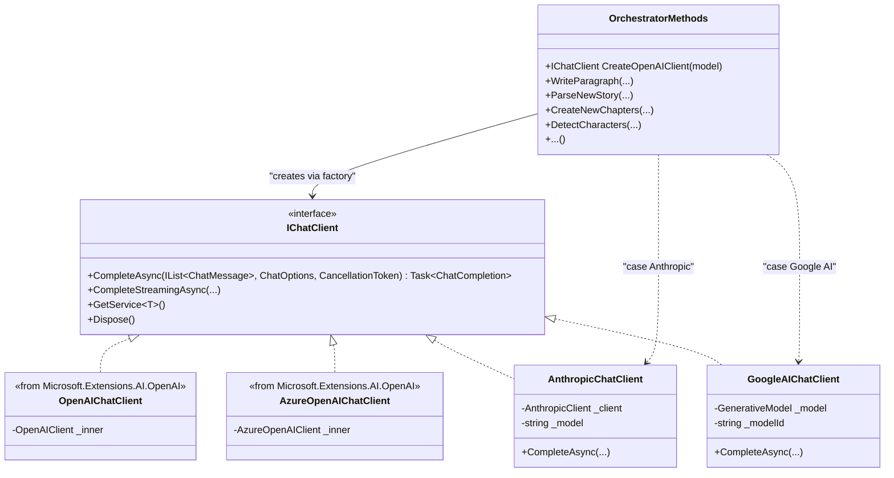

#### 3.6.8 Provider-Specific Quirks & Mitigations

| Provider | Quirk | Mitigation in Wrapper |
|---|---|---|
| **Anthropic** | System message must be separate from conversation messages | Extract `ChatRole.System` messages and pass via `MessageParameters.System` |
| **Anthropic** | `MaxTokens` is required (no default) | Default to `4096` if `ChatOptions.MaxOutputTokens` is null |
| **Anthropic** | No `response_format: json_object` support | Handled by Feature #4 retry loop (§4.3.1) — not the wrapper's concern |
| **Google AI** | Single-turn `GenerateContent(string)` doesn't natively separate system/user roles | Prepend system instruction to the prompt text; upgrade to multi-turn `StartChat()` if future needs arise |
| **Google AI** | Token counts may be null for some model versions | Default to 0 if null |
| **Both** | `NetworkTimeout` not directly configurable in the same way as OpenAI | Use `HttpClient` timeout configuration if needed; acceptable for initial implementation |

#### 3.6.9 Testing Strategy

| Test | Method | Expected Result |
|---|---|---|
| **Unit: `AnthropicChatClient` mapping** | Mock `AnthropicClient`, call `CompleteAsync` with system + user messages, verify Anthropic SDK receives correct `MessageParameters` | System extracted, roles mapped, `MaxTokens` set |
| **Unit: `GoogleAIChatClient` mapping** | Mock `GenerativeModel`, call `CompleteAsync`, verify prompt concatenation and usage mapping | System prepended, text extracted, token counts mapped |
| **Integration: `CreateOpenAIClient` factory** | Set `SettingsService.AIType` to each provider, call `CreateOpenAIClient()`, verify correct `IChatClient` type returned | `OpenAI` → `OpenAIChatClient`, `Anthropic` → `AnthropicChatClient`, etc. |
| **Integration: round-trip per provider** | Call `TestAccess()` with each provider configured, verify `true` returned | Chat completes, tokens logged |
| **Regression: `WriteParagraph` unchanged** | No code change — call `WriteParagraph` with OpenAI, then swap to Anthropic, same prompt | Both return valid paragraph JSON |

#### 3.6.10 Files Affected by Wrapper Change

| File | Action | Details |
|---|---|---|
| `AI/AnthropicChatClient.cs` | **Create** | Thin `IChatClient` → `Anthropic.SDK` wrapper. ~90 lines. |
| `AI/GoogleAIChatClient.cs` | **Create** | Thin `IChatClient` → `Mscc.GenerativeAI` wrapper. ~80 lines. |
| `AI/OrchestratorMethods.cs` | **Modify** | Add `case "Anthropic"` and `case "Google AI"` to `CreateOpenAIClient(string)`. Change `if/else` to `switch`. ~20 lines changed. |
| `AI/OrchestratorMethods.cs` | **Modify** | Replace `OpenAIServiceType` enum with string constants or expanded enum including `Anthropic` and `GoogleAI`. |

> **Files NOT modified:** `WriteParagraph.cs`, `ParseNewStory.cs`, `CreateNewChapters.cs`, `DetectCharacters.cs`, `DetectCharacterAttributes.cs`, `GetStoryBeats.cs`, `CleanJSON.cs`. These continue to work unchanged.

---

## Feature #4 — Structured Story-Creation Pipeline & Prompt Reliability

### 4.1 Current Pain Points

Based on analysis of the code and the [AIStoryBuilders wiki](https://github.com/AIStoryBuilders/AIStoryBuilders/wiki) / [Anatomy of a Prompt](https://github.com/AIStoryBuilders/AIStoryBuilders/wiki/Anatomy-Of-A-Prompt):

| # | Issue | Root Cause | Planned Fix |
|---|---|---|---|
| 1 | **Inconsistent JSON from LLM** | Prompts request JSON but don't use structured-output / `response_format`. The `ExtractJson` regex fallback is fragile. | §4.3.1 — `response_format: json_object` + `JsonRepairUtility` |
| 2 | **Monolithic prompt strings** | `CreateWriteParagraph`, `CreateSystemMessageParseNewStory`, `CreateSystemMessageCreateNewChapters` etc. build prompts via concatenation — hard to test, version, or reuse. | §4.3.2 — `PromptTemplateService` with system/user/schema separation |
| 3 | **No retry / fallback on parse failure** | If `JObject.Parse` fails the method simply logs and returns empty. The user sees a blank paragraph with no explanation. | §4.3.4 — Retry loop with error context injection |
| 4 | **Token budget not managed** | `TrimToMaxWords(10000)` is a rough guard. There is no awareness of the model's context window or the token count of the assembled Master Story. | §4.3.3 — `TokenEstimator` + `MasterStoryBuilder` budget trimming |
| 5 | **Single-shot generation** | Each call is fire-and-forget. There is no multi-step validation (e.g., generate → validate → retry). | §4.3.4 — `CallLlmWithRetry<T>()` helper |
| 6 | **No schema enforcement** | The AI is told *"Provide the results in the following JSON format"* but there is no JSON-Schema or `response_format: json_object` enforcement. Different models may ignore instructions differently. | §4.3.1 — Per-provider `ChatOptions` + schema hint in prompt |
| 7 | **`CleanJSON` as a band-aid** | A second LLM call to "fix" broken JSON is expensive and unreliable — it can itself return invalid JSON. | §4.3.5 — Deterministic `JsonRepairUtility` replaces LLM-based `CleanJSON` |

### 4.2 Proposed Structured Story Pipeline

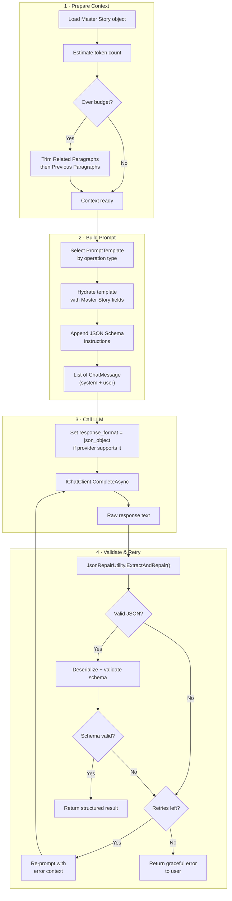

### 4.3 Implementation Details

#### 4.3.1 Structured Output / `response_format`

**Problem:** LLMs sometimes return Markdown-wrapped JSON, extraneous commentary, or malformed JSON.

**Solution — per-provider `ChatOptions`:**

```csharp
// AI/ChatOptionsFactory.cs
public static class ChatOptionsFactory
{
    /// <summary>
    /// Build ChatOptions with response_format: json_object for providers that support it.
    /// For Anthropic/Google AI, returns options without response_format — the prompt-level
    /// schema hint + retry loop handles enforcement.
    /// </summary>
    public static ChatOptions CreateJsonOptions(string aiServiceType, string? modelId = null)
    {
        var options = new ChatOptions();

        if (modelId != null)
            options.ModelId = modelId;

        // OpenAI and Azure OpenAI support response_format natively
        if (aiServiceType is "OpenAI" or "Azure OpenAI")
        {
            options.ResponseFormat = ChatResponseFormat.Json;
        }

        // Anthropic and Google AI: no response_format equivalent.
        // JSON enforcement relies on the system prompt + retry loop (§4.3.4).

        return options;
    }
}
```

**How each provider handles JSON:**

| Provider | `response_format` Support | Strategy |
|---|---|---|
| **OpenAI** | ✅ `json_object` | Set via `ChatOptions.ResponseFormat`; model guarantees valid JSON |
| **Azure OpenAI** | ✅ `json_object` | Same as OpenAI |
| **Anthropic** | ❌ Not supported | System prompt says "Output only valid JSON, no commentary"; retry loop catches failures |
| **Google AI** | ❌ Not natively via `Mscc.GenerativeAI` | Same prompt-level enforcement + retry |

#### 4.3.2 Prompt Template System

**Problem:** Prompts are built via inline string concatenation (e.g., `CreateWriteParagraph` is 60+ lines of `strPrompt = strPrompt + ...`), making them hard to maintain, test, and version.

**Solution:** Introduce a `PromptTemplateService` that separates system instruction, user context, and JSON schema hint.

```csharp
// AI/PromptTemplateService.cs
using Microsoft.Extensions.AI;

namespace AIStoryBuilders.AI;

/// <summary>
/// Central service that builds typed ChatMessage lists for each AI operation.
/// Replaces the inline string-concatenation pattern in each OrchestratorMethods partial class.
/// </summary>
public class PromptTemplateService
{
    // ── Template definitions as constants (Decision: §A.3 — constants in code) ──

    public static class Templates
    {
        // ── WriteParagraph ──────────────────────────────────────────
        public const string WriteParagraph_System =
            """
            You are a function that produces JSON containing the contents of a single paragraph for a novel.
            Output ONLY a valid JSON object. No commentary, no markdown fences.
            The JSON must match this exact schema:
            { "paragraph_content": "<string>" }
            """;

        public const string WriteParagraph_User =
            """
            <story_title>{StoryTitle}</story_title>
            <story_style>{StoryStyle}</story_style>
            <story_synopsis>{StorySynopsis}</story_synopsis>
            <system_directions>{SystemMessage}</system_directions>
            <current_chapter>{CurrentChapter}</current_chapter>
            <previous_paragraphs>{PreviousParagraphs}</previous_paragraphs>
            <current_location>{CurrentLocation}</current_location>
            <characters>{CharacterList}</characters>
            <related_paragraphs>{RelatedParagraphs}</related_paragraphs>
            <current_paragraph>{CurrentParagraph}</current_paragraph>
            <instructions>{Instructions}</instructions>
            <constraints>
            - Only use information provided. Do not use any information not provided.
            - Write in the writing style of the provided content.
            - Insert a line break before dialogue when a character speaks for the first time.
            - Produce a single paragraph of {NumberOfWords} words maximum.
            </constraints>
            """;

        // ── ParseNewStory ───────────────────────────────────────────
        public const string ParseNewStory_System =
            """
            You are a function that analyzes story text and extracts structured data as JSON.
            Output ONLY a valid JSON object. No commentary, no markdown fences.
            The JSON must match this exact schema:
            {
              "locations": [{ "name": "<string>", "description": "<string>" }],
              "timelines": [{ "name": "<string>", "description": "<string>" }],
              "characters": [{
                "name": "<string>",
                "descriptions": [{
                  "description_type": "Appearance|Goals|History|Aliases|Facts",
                  "description": "<string>",
                  "timeline_name": "<string>"
                }]
              }]
            }
            """;

        public const string ParseNewStory_User =
            """
            Given a story titled:
            <story_title>{StoryTitle}</story_title>

            With the story text:
            <story_text>{StoryText}</story_text>

            Using only this information, identify:
            1. Locations mentioned in the story with a short description of each.
            2. A short timeline name and description for each chronological event.
            3. Characters present and their descriptions (Appearance, Goals, History, Aliases, Facts)
               with the timeline_name from timelines.
            """;

        // ── CreateNewChapters ───────────────────────────────────────
        public const string CreateNewChapters_System =
            """
            You are a function that creates chapter outlines for a novel as JSON.
            Output ONLY a valid JSON object. No commentary, no markdown fences.
            The JSON must match this exact schema:
            {
              "chapter": [{
                "chapter_name": "<string>",
                "chapter_synopsis": "<string with #Beat N markers>",
                "paragraphs": [{
                  "contents": "<string>",
                  "location_name": "<string>",
                  "timeline_name": "<string>",
                  "character_names": ["<string>"]
                }]
              }]
            }
            """;

        public const string CreateNewChapters_User =
            """
            Given a story with the following structure:
            <story_json>{StoryJSON}</story_json>

            Using only this information:
            1. Create {ChapterCount} chapters named Chapter1, Chapter2, etc.
            2. Each chapter gets a chapter_synopsis formatted as story beats: #Beat 1 - ..., #Beat 2 - ..., etc.
            3. Each chapter gets a short (~200 word) first paragraph.
            4. Each paragraph has a single timeline_name and a list of character_names.
            """;

        // ── DetectCharacters ────────────────────────────────────────
        public const string DetectCharacters_System =
            """
            You are a function that identifies character names in a paragraph of text.
            Output ONLY a valid JSON object. No commentary, no markdown fences.
            The JSON must match this exact schema:
            { "characters": [{ "name": "<string>" }] }
            """;

        public const string DetectCharacters_User =
            """
            Identify all characters, by name, mentioned in the following paragraph:
            <paragraph>{ParagraphContent}</paragraph>
            """;

        // ── DetectCharacterAttributes ───────────────────────────────
        public const string DetectCharacterAttributes_System =
            """
            You are a function that detects NEW character descriptions not already present.
            Output ONLY a valid JSON object. No commentary, no markdown fences.
            The JSON must match this exact schema:
            {
              "characters": [{
                "name": "<string>",
                "descriptions": [{
                  "description_type": "Appearance|Goals|History|Aliases|Facts",
                  "description": "<string>"
                }]
              }]
            }
            Rules:
            - Only output characters present in the provided character list.
            - Only output descriptions NOT already present for that character.
            - Output each character at most once.
            """;

        public const string DetectCharacterAttributes_User =
            """
            <paragraph>{ParagraphContent}</paragraph>
            <existing_characters>{CharacterJSON}</existing_characters>

            Identify any NEW descriptions for the characters above that appear in the paragraph
            but are not already listed in their existing descriptions.
            """;

        // ── GetStoryBeats ───────────────────────────────────────────
        public const string GetStoryBeats_System =
            """
            You are a function that extracts story beats from a paragraph.
            Output ONLY the story beats as plain text, one per line.
            Do not wrap in JSON. Do not add commentary.
            """;

        public const string GetStoryBeats_User =
            """
            Create story beats for the following paragraph:
            <paragraph>{ParagraphContent}</paragraph>
            """;
    }

    /// <summary>
    /// Build a ChatMessage list from a template, hydrating placeholders with values.
    /// </summary>
    public List<ChatMessage> BuildMessages(
        string systemTemplate,
        string userTemplate,
        Dictionary<string, string> values)
    {
        var system = HydratePlaceholders(systemTemplate, values);
        var user = HydratePlaceholders(userTemplate, values);

        return new List<ChatMessage>
        {
            new(ChatRole.System, system),
            new(ChatRole.User, user)
        };
    }

    private static string HydratePlaceholders(string template, Dictionary<string, string> values)
    {
        var result = template;
        foreach (var (key, value) in values)
        {
            result = result.Replace($"{{{key}}}", value ?? "");
        }
        return result;
    }
}
```

**Key design decisions:**

| Decision | Choice | Rationale |
|---|---|---|
| Template storage | Constants in code (`Templates` static class) | Simplest for desktop app; no file I/O; refactor to embedded resources later if template count grows |
| Placeholder syntax | `{PlaceholderName}` | Familiar, grep-able; no dependency on a template engine |
| Delimiters in prompts | XML-style tags (`<story_title>`, `<characters>`) | LLMs parse structural XML tags more reliably than `####` Markdown headers (see [Anthropic prompt docs](https://docs.anthropic.com/en/docs/build-with-claude/prompt-engineering/use-xml-tags)) |
| System vs. User separation | Always two messages minimum | Models trained with RLHF respond better with distinct roles; enables `response_format` to apply correctly |

#### 4.3.3 Token Budget Management

**Problem:** The assembled prompt can exceed a model's context window (`TrimToMaxWords(10000)` is a rough guard with no per-model awareness).

**Implementation — `TokenEstimator`:**

```csharp
// AI/TokenEstimator.cs
namespace AIStoryBuilders.AI;

/// <summary>
/// Estimates token count using a character-count heuristic.
/// Upgrade path: swap heuristic body with SharpToken NuGet for exact counts.
/// </summary>
public static class TokenEstimator
{
    /// <summary>Average characters per token across GPT-family models.</summary>
    private const double CharsPerToken = 4.0;

    /// <summary>Known context-window sizes (tokens). Add new models as needed.</summary>
    private static readonly Dictionary<string, int> ModelContextWindows = new()
    {
        // OpenAI
        ["gpt-3.5-turbo"]     = 16_385,
        ["gpt-4o"]            = 128_000,
        ["gpt-4o-mini"]       = 128_000,
        ["GPT-4.1"]           = 1_047_576,
        ["gpt-5-mini"]        = 1_047_576,
        ["gpt-5"]             = 1_047_576,
        // Anthropic
        ["claude-3-5-sonnet-20241022"] = 200_000,
        ["claude-3-5-haiku-20241022"]  = 200_000,
        ["claude-4-sonnet"]   = 200_000,
        // Google
        ["gemini-2.0-flash"]  = 1_048_576,
        ["gemini-2.5-pro"]    = 1_048_576,
    };

    /// <summary>Default context window if model is unknown.</summary>
    private const int DefaultContextWindow = 128_000;

    /// <summary>
    /// Reserve 25% of context window for the model's response.
    /// The prompt may use at most 75% of the window.
    /// </summary>
    private const double PromptBudgetRatio = 0.75;

    public static int EstimateTokens(string text)
        => (int)Math.Ceiling(text.Length / CharsPerToken);

    public static int EstimateTokens(IEnumerable<ChatMessage> messages)
        => messages.Sum(m => EstimateTokens(m.Text ?? ""));

    public static int GetMaxPromptTokens(string modelId)
    {
        var window = ModelContextWindows.GetValueOrDefault(modelId, DefaultContextWindow);
        return (int)(window * PromptBudgetRatio);
    }
}
```

**Implementation — `MasterStoryBuilder` (token-aware assembly):**

```csharp
// Services/MasterStoryBuilder.cs
namespace AIStoryBuilders.Services;

/// <summary>
/// Assembles a JSONMasterStory and trims context sections to fit within
/// the model's token budget. Replaces the ad-hoc assembly in CreateMasterStory().
/// </summary>
public class MasterStoryBuilder
{
    private readonly string _modelId;
    private readonly int _maxPromptTokens;

    public MasterStoryBuilder(string modelId)
    {
        _modelId = modelId;
        _maxPromptTokens = TokenEstimator.GetMaxPromptTokens(modelId);
    }

    /// <summary>
    /// Trim the Master Story's context sections to fit within the token budget.
    /// Priority order (trim first → last):
    ///   1. RelatedParagraphs  (supplemental — can be reduced or removed entirely)
    ///   2. PreviousParagraphs (keep most recent; trim oldest first)
    ///   3. CharacterList      (never trimmed — essential for coherence)
    ///   4. System/Title/Style/Synopsis/Chapter (never trimmed)
    /// </summary>
    public JSONMasterStory TrimToFit(JSONMasterStory story, string systemPrompt, string userTemplate)
    {
        // 1. Estimate baseline token count (everything except Related + Previous)
        int baseTokens = EstimateBaseTokens(story, systemPrompt, userTemplate);

        // 2. Calculate remaining budget for Related + Previous
        int remainingBudget = _maxPromptTokens - baseTokens;
        if (remainingBudget < 0) remainingBudget = 0;

        // 3. Trim RelatedParagraphs first
        story.RelatedParagraphs = TrimParagraphList(
            story.RelatedParagraphs, ref remainingBudget);

        // 4. Trim PreviousParagraphs (keep most recent)
        story.PreviousParagraphs = TrimParagraphList(
            story.PreviousParagraphs, ref remainingBudget, keepNewest: true);

        return story;
    }

    private int EstimateBaseTokens(JSONMasterStory story, string systemPrompt, string userTemplate)
    {
        // Serialize all non-trimmable sections
        var fixedContent = string.Join("\n",
            systemPrompt,
            story.StoryTitle ?? "",
            story.StoryStyle ?? "",
            story.StorySynopsis ?? "",
            story.SystemMessage ?? "",
            JsonConvert.SerializeObject(story.CurrentChapter),
            JsonConvert.SerializeObject(story.CurrentLocation),
            JsonConvert.SerializeObject(story.CharacterList),
            JsonConvert.SerializeObject(story.CurrentParagraph));

        return TokenEstimator.EstimateTokens(fixedContent);
    }

    private static List<JSONParagraphs> TrimParagraphList(
        List<JSONParagraphs>? paragraphs,
        ref int remainingBudget,
        bool keepNewest = false)
    {
        if (paragraphs == null || paragraphs.Count == 0)
            return new List<JSONParagraphs>();

        var result = new List<JSONParagraphs>();
        // If keepNewest, iterate from end; otherwise from start
        var ordered = keepNewest
            ? paragraphs.AsEnumerable().Reverse()
            : paragraphs.AsEnumerable();

        foreach (var p in ordered)
        {
            var tokenCost = TokenEstimator.EstimateTokens(
                JsonConvert.SerializeObject(p));
            if (tokenCost <= remainingBudget)
            {
                result.Add(p);
                remainingBudget -= tokenCost;
            }
            else break; // No room for more
        }

        // Restore original order if we reversed
        if (keepNewest) result.Reverse();
        return result;
    }
}
```

**Trimming priority visualized:**

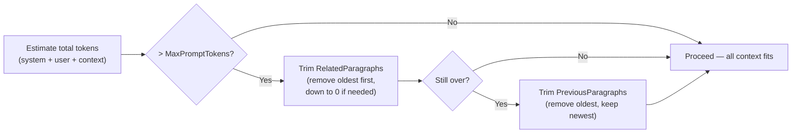

#### 4.3.4 Retry with Error Context

**Problem:** A single parse failure silently produces empty output. The user sees nothing.

**Implementation — `CallLlmWithRetry<T>()` helper:**

```csharp
// AI/LlmCallHelper.cs
using Microsoft.Extensions.AI;
using Newtonsoft.Json;
using Newtonsoft.Json.Linq;

namespace AIStoryBuilders.AI;

/// <summary>
/// Wraps IChatClient calls with retry logic and JSON validation.
/// Used by all OrchestratorMethods that expect structured JSON output.
/// </summary>
public static class LlmCallHelper
{
    private const int MaxRetries = 2;

    /// <summary>
    /// Call the LLM and parse/validate the JSON response.
    /// On failure, appends an error-context message and retries.
    /// </summary>
    /// <typeparam name="T">The expected deserialization type.</typeparam>
    public static async Task<T?> CallLlmWithRetry<T>(
        IChatClient client,
        List<ChatMessage> messages,
        ChatOptions? options,
        Func<JObject, T> mapResult,
        LogService logService) where T : class
    {
        string? lastError = null;

        for (int attempt = 0; attempt <= MaxRetries; attempt++)
        {
            try
            {
                var response = await client.CompleteAsync(messages, options);

                logService.WriteToLog(
                    $"TotalTokens: {response.Usage?.TotalTokenCount} " +
                    $"- Attempt {attempt + 1} - {response.Choices.FirstOrDefault()?.Text}");

                var rawText = response.Choices.FirstOrDefault()?.Text ?? "";

                // Step 1: Deterministic repair (strip fences, fix commas, etc.)
                var repairedJson = JsonRepairUtility.ExtractAndRepair(rawText);

                // Step 2: Parse JSON
                var jObj = JObject.Parse(repairedJson);

                // Step 3: Map to result type (caller validates schema)
                return mapResult(jObj);
            }
            catch (Exception ex)
            {
                lastError = ex.Message;
                logService.WriteToLog(
                    $"LLM retry {attempt + 1}/{MaxRetries + 1}: {ex.Message}");

                if (attempt < MaxRetries)
                {
                    // Append error context to help the LLM self-correct
                    messages.Add(new ChatMessage(ChatRole.User,
                        $"Your previous response was not valid JSON. " +
                        $"Error: {ex.Message}. " +
                        $"Please output ONLY the JSON object with no commentary."));
                }
            }
        }

        logService.WriteToLog($"LLM call failed after {MaxRetries + 1} attempts: {lastError}");
        return null;
    }

    /// <summary>
    /// Simplified overload for text-only responses (e.g., GetStoryBeats).
    /// No JSON parsing — just returns the raw text with retry on empty response.
    /// </summary>
    public static async Task<string> CallLlmForText(
        IChatClient client,
        List<ChatMessage> messages,
        ChatOptions? options,
        LogService logService)
    {
        for (int attempt = 0; attempt <= MaxRetries; attempt++)
        {
            var response = await client.CompleteAsync(messages, options);
            var text = response.Choices.FirstOrDefault()?.Text ?? "";

            logService.WriteToLog(
                $"TotalTokens: {response.Usage?.TotalTokenCount} - Text response");

            if (!string.IsNullOrWhiteSpace(text))
                return text;

            messages.Add(new ChatMessage(ChatRole.User,
                "Your previous response was empty. Please provide the requested output."));
        }

        return "";
    }
}
```

**Retry flow visualized:**

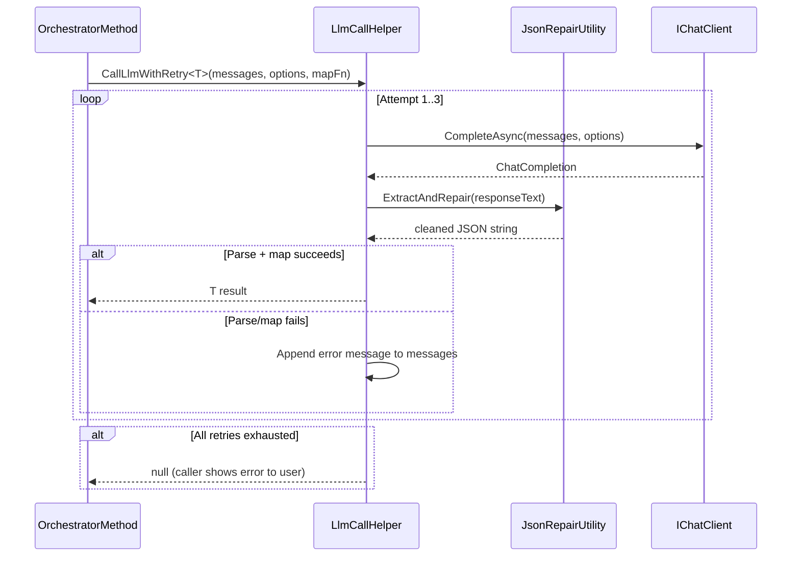

#### 4.3.5 Deterministic JSON Repair — `JsonRepairUtility`

**Problem:** `CleanJSON.cs` sends broken JSON to the LLM for repair — this is expensive (~$0.01+ per call), slow (~1-3s), and itself unreliable (the LLM may return invalid JSON again).

**Solution:** Replace with a **deterministic, zero-cost** repair utility that handles the most common LLM output problems:

```csharp
// AI/JsonRepairUtility.cs
using System.Text.RegularExpressions;

namespace AIStoryBuilders.AI;

/// <summary>
/// Deterministic JSON repair for common LLM output problems.
/// Replaces the LLM-based CleanJSON approach entirely.
/// </summary>
public static class JsonRepairUtility
{
    /// <summary>
    /// Extract JSON from LLM response text and repair common issues.
    /// Processing order:
    ///   1. Strip markdown fences (```json ... ```)
    ///   2. Strip leading/trailing non-JSON text
    ///   3. Fix trailing commas before } or ]
    ///   4. Fix unescaped newlines inside string values
    ///   5. Fix single quotes → double quotes (if no double quotes present)
    /// </summary>
    public static string ExtractAndRepair(string raw)
    {
        if (string.IsNullOrWhiteSpace(raw))
            return "{}";

        var json = raw;

        // 1. Strip Markdown fences: ```json\n{...}\n``` or ```{...}```
        json = StripMarkdownFences(json);

        // 2. Strip leading/trailing non-JSON text (find first { or [)
        json = IsolateJsonBlock(json);

        // 3. Fix trailing commas: {a:1,} → {a:1}
        json = FixTrailingCommas(json);

        // 4. Fix unescaped newlines inside strings
        json = FixUnescapedNewlines(json);

        return json;
    }

    private static string StripMarkdownFences(string input)
    {
        // Match ```json ... ``` or ``` ... ```
        var match = Regex.Match(input, @"```(?:json)?\s*([\s\S]*?)\s*```", RegexOptions.Singleline);
        return match.Success ? match.Groups[1].Value : input;
    }

    private static string IsolateJsonBlock(string input)
    {
        // Find the first { or [ and the last matching } or ]
        int start = -1;
        char openChar = '{';
        char closeChar = '}';

        int braceStart = input.IndexOf('{');
        int bracketStart = input.IndexOf('[');

        if (braceStart >= 0 && (bracketStart < 0 || braceStart < bracketStart))
        {
            start = braceStart;
            openChar = '{';
            closeChar = '}';
        }
        else if (bracketStart >= 0)
        {
            start = bracketStart;
            openChar = '[';
            closeChar = ']';
        }

        if (start < 0) return input;

        // Find matching closing bracket/brace (handle nesting)
        int depth = 0;
        bool inString = false;
        int end = start;
        for (int i = start; i < input.Length; i++)
        {
            char c = input[i];
            if (c == '"' && (i == 0 || input[i - 1] != '\\'))
                inString = !inString;
            if (!inString)
            {
                if (c == openChar) depth++;
                if (c == closeChar) depth--;
                if (depth == 0) { end = i; break; }
            }
        }

        return input.Substring(start, end - start + 1);
    }

    private static string FixTrailingCommas(string json)
    {
        // Remove commas before } or ] (with optional whitespace between)
        return Regex.Replace(json, @",\s*([}\]])", "$1");
    }

    private static string FixUnescapedNewlines(string json)
    {
        // Replace literal newlines inside JSON string values with \n
        // This is a heuristic — works for simple cases
        return Regex.Replace(json, @"(?<=:[ ]*""[^""]*)\n(?=[^""]*"")", "\\n");
    }
}
```

**What this replaces:**

| Before (LLM-based) | After (Deterministic) |
|---|---|
| `CleanJSON.cs` — sends broken JSON to LLM, ~1-3s, ~$0.01/call | `JsonRepairUtility.cs` — deterministic string processing, <1ms, free |
| Can itself return invalid JSON | Always returns the best possible repair; if still invalid, the retry loop re-prompts |
| Existing `ExtractJson()` regex in `OrchestratorMethods.cs` | Superseded by `ExtractAndRepair()` which handles more cases |

#### 4.3.6 Separate System and User Messages

**Problem:** All current prompts are a single concatenated string passed to `CompleteAsync(string)`. This conflates the system instruction with user content.

**Solution:** Every refactored method uses the `ChatMessage`-based overload via `PromptTemplateService.BuildMessages()`:

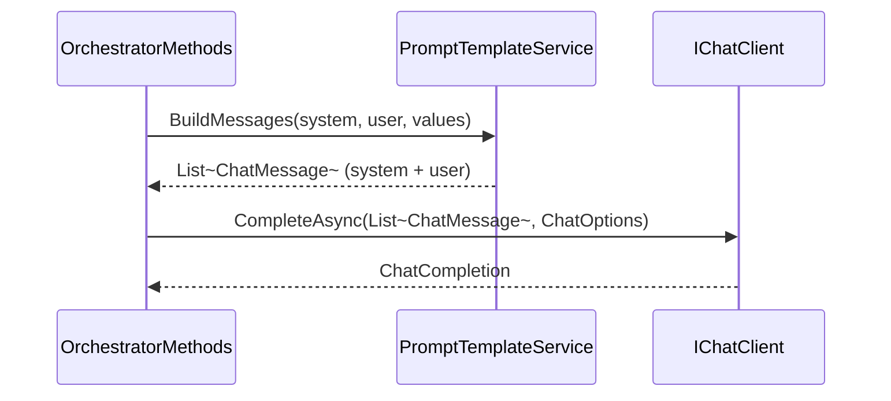

**Benefits:**
- Models trained with RLHF respond better when system vs. user roles are distinct.
- `response_format` settings apply to the full conversation, not an embedded instruction.
- The retry loop can append `ChatRole.User` error-context messages naturally.
- Easier to add few-shot examples as `ChatRole.Assistant` messages in the future.

#### 4.3.7 Master Story Assembly — Defensive Construction

**Problem:** Each section is appended with `if != ""` checks but there is no overall validation.

**Implementation — `JSONMasterStory.Validate()`:**

```csharp
// Models/JSON/JSONMasterStory.cs — add Validate() method
public class JSONMasterStory
{
    public string StoryTitle { get; init; }          // ← changed to init
    public string StorySynopsis { get; init; }
    public string StoryStyle { get; init; }
    public string SystemMessage { get; init; }
    public List<Character> CharacterList { get; init; }
    public List<JSONParagraphs> PreviousParagraphs { get; set; }  // set: trimming allowed
    public List<JSONParagraphs> RelatedParagraphs { get; set; }   // set: trimming allowed
    public Locations CurrentLocation { get; init; }
    public JSONChapter CurrentChapter { get; init; }
    public JSONParagraphs CurrentParagraph { get; init; }

    /// <summary>
    /// Validate the assembled Master Story before sending to the LLM.
    /// Returns a list of warnings (non-fatal) and throws on critical errors.
    /// </summary>
    public List<string> Validate()
    {
        var warnings = new List<string>();

        // Critical — must have at minimum
        if (string.IsNullOrWhiteSpace(StoryTitle))
            throw new InvalidOperationException("MasterStory: StoryTitle is required.");

        if (CurrentChapter == null)
            throw new InvalidOperationException("MasterStory: CurrentChapter is required.");

        // Warnings — log but don't block
        if (string.IsNullOrWhiteSpace(StorySynopsis))
            warnings.Add("MasterStory: StorySynopsis is empty — LLM may produce less coherent output.");

        if (string.IsNullOrWhiteSpace(StoryStyle))
            warnings.Add("MasterStory: StoryStyle is empty.");

        if (CharacterList == null || CharacterList.Count == 0)
            warnings.Add("MasterStory: No characters provided.");

        if (CurrentLocation == null)
            warnings.Add("MasterStory: No current location set.");

        if (PreviousParagraphs == null || PreviousParagraphs.Count == 0)
            warnings.Add("MasterStory: No previous paragraphs (first paragraph in chapter).");

        if (RelatedParagraphs == null || RelatedParagraphs.Count == 0)
            warnings.Add("MasterStory: No related paragraphs found by vector search.");

        // Verify PreviousParagraphs are ordered by sequence
        if (PreviousParagraphs is { Count: > 1 })
        {
            for (int i = 1; i < PreviousParagraphs.Count; i++)
            {
                if (PreviousParagraphs[i].sequence < PreviousParagraphs[i - 1].sequence)
                {
                    warnings.Add("MasterStory: PreviousParagraphs are not in sequence order.");
                    break;
                }
            }
        }

        return warnings;
    }
}
```

**Updated `CreateMasterStory` in `AIStoryBuildersService.MasterStory.cs`:**

```csharp
// After assembling the master story, validate it:
var warnings = objMasterStory.Validate();
foreach (var warning in warnings)
{
    LogService.WriteToLog(warning);
}
```

### 4.4 Per-Method Refactor Specifications

Each existing `OrchestratorMethods` partial class is refactored to the same pattern. The **old** method signature is preserved for backward compatibility; internally it delegates to the new pipeline.

#### 4.4.1 `WriteParagraph` — Before vs. After

**Before** (current):
```csharp
IChatClient api = CreateOpenAIClient();
SystemMessage = CreateWriteParagraph(objJSONMasterStory, paramAIPrompt);  // 60+ lines of concatenation
var ChatResponseResult = await api.CompleteAsync(SystemMessage);          // single string, no retry
var JSONResult = ExtractJson(ChatResponseResult.Choices.FirstOrDefault().Text);
dynamic data = JObject.Parse(JSONResult);                                // throws on bad JSON → empty output
```

**After** (refactored):
```csharp
public async Task<string> WriteParagraph(JSONMasterStory objJSONMasterStory, AIPrompt paramAIPrompt, string GPTModel)
{
    LogService.WriteToLog($"WriteParagraph using {GPTModel} - Start");

    // 1. Validate + trim context to fit token budget
    var builder = new MasterStoryBuilder(GPTModel);
    objJSONMasterStory = builder.TrimToFit(
        objJSONMasterStory,
        PromptTemplateService.Templates.WriteParagraph_System,
        PromptTemplateService.Templates.WriteParagraph_User);

    // 2. Build structured messages
    var templateService = new PromptTemplateService();
    var values = new Dictionary<string, string>
    {
        ["StoryTitle"]          = objJSONMasterStory.StoryTitle ?? "",
        ["StoryStyle"]          = objJSONMasterStory.StoryStyle ?? "",
        ["StorySynopsis"]       = objJSONMasterStory.StorySynopsis ?? "",
        ["SystemMessage"]       = objJSONMasterStory.SystemMessage ?? "",
        ["CurrentChapter"]      = JsonConvert.SerializeObject(objJSONMasterStory.CurrentChapter),
        ["PreviousParagraphs"]  = JsonConvert.SerializeObject(objJSONMasterStory.PreviousParagraphs),
        ["CurrentLocation"]     = JsonConvert.SerializeObject(objJSONMasterStory.CurrentLocation),
        ["CharacterList"]       = JsonConvert.SerializeObject(objJSONMasterStory.CharacterList),
        ["RelatedParagraphs"]   = JsonConvert.SerializeObject(objJSONMasterStory.RelatedParagraphs),
        ["CurrentParagraph"]    = objJSONMasterStory.CurrentParagraph?.contents ?? "",
        ["Instructions"]        = paramAIPrompt.AIPromptText?.Trim() != ""
                                    ? paramAIPrompt.AIPromptText
                                    : "Continue from the last paragraph.",
        ["NumberOfWords"]       = paramAIPrompt.NumberOfWords.ToString(),
    };

    var messages = templateService.BuildMessages(
        PromptTemplateService.Templates.WriteParagraph_System,
        PromptTemplateService.Templates.WriteParagraph_User,
        values);

    // 3. Call LLM with retry + JSON enforcement
    IChatClient api = CreateOpenAIClient(GPTModel);
    var options = ChatOptionsFactory.CreateJsonOptions(SettingsService.AIType, GPTModel);

    var result = await LlmCallHelper.CallLlmWithRetry<string>(
        api, messages, options,
        jObj => jObj["paragraph_content"]?.ToString(),
        LogService);

    return result ?? "";
}
```

#### 4.4.2 `ParseNewStory` — Refactored

```csharp
public async Task<string> ParseNewStory(string paramStoryTitle, string paramStoryText, string GPTModel)
{
    LogService.WriteToLog($"ParseNewStory using {GPTModel} - Start");

    // Token-budget guard: trim story text if too long
    var maxPromptTokens = TokenEstimator.GetMaxPromptTokens(GPTModel);
    var storyTokens = TokenEstimator.EstimateTokens(paramStoryText);
    if (storyTokens > maxPromptTokens * 0.6)  // leave 40% for system prompt + response
    {
        int maxChars = (int)(maxPromptTokens * 0.6 * 4); // reverse the 4-chars-per-token heuristic
        paramStoryText = paramStoryText.Substring(0, Math.Min(paramStoryText.Length, maxChars));
    }

    var templateService = new PromptTemplateService();
    var messages = templateService.BuildMessages(
        PromptTemplateService.Templates.ParseNewStory_System,
        PromptTemplateService.Templates.ParseNewStory_User,
        new Dictionary<string, string>
        {
            ["StoryTitle"] = paramStoryTitle,
            ["StoryText"]  = paramStoryText,
        });

    IChatClient api = CreateOpenAIClient(GPTModel);
    var options = ChatOptionsFactory.CreateJsonOptions(SettingsService.AIType, GPTModel);

    // Return raw JSON string (caller deserializes into JSONStory)
    var result = await LlmCallHelper.CallLlmWithRetry<string>(
        api, messages, options,
        jObj => jObj.ToString(),
        LogService);

    return result ?? "{}";
}
```

#### 4.4.3 `CreateNewChapters` — Refactored

```csharp
public async Task<ChatCompletion> CreateNewChapters(string JSONNewStory, string ChapterCount, string GPTModel)
{
    LogService.WriteToLog($"CreateNewChapters using {GPTModel} - Start");

    var templateService = new PromptTemplateService();
    var messages = templateService.BuildMessages(
        PromptTemplateService.Templates.CreateNewChapters_System,
        PromptTemplateService.Templates.CreateNewChapters_User,
        new Dictionary<string, string>
        {
            ["StoryJSON"]     = JSONNewStory,
            ["ChapterCount"]  = ChapterCount,
        });

    ReadTextEvent?.Invoke(this, new ReadTextEventArgs("Calling AI...", 70));

    IChatClient api = CreateOpenAIClient(GPTModel);
    var options = ChatOptionsFactory.CreateJsonOptions(SettingsService.AIType, GPTModel);

    // Use retry helper but return the full ChatCompletion for backward compatibility
    var response = await api.CompleteAsync(messages, options);
    LogService.WriteToLog($"TotalTokens: {response.Usage?.TotalTokenCount}");

    // Attempt repair on the response text so callers get cleaner JSON
    var text = response.Choices.FirstOrDefault()?.Text ?? "";
    var repaired = JsonRepairUtility.ExtractAndRepair(text);

    // Return a ChatCompletion with the repaired text
    return new ChatCompletion(new ChatMessage(ChatRole.Assistant, repaired))
    {
        Usage = response.Usage
    };
}
```

#### 4.4.4 `DetectCharacters` — Refactored

```csharp
public async Task<List<Models.Character>> DetectCharacters(Paragraph objParagraph)
{
    LogService.WriteToLog($"DetectCharacters - Start");

    var templateService = new PromptTemplateService();
    var messages = templateService.BuildMessages(
        PromptTemplateService.Templates.DetectCharacters_System,
        PromptTemplateService.Templates.DetectCharacters_User,
        new Dictionary<string, string>
        {
            ["ParagraphContent"] = objParagraph.ParagraphContent,
        });

    IChatClient api = CreateOpenAIClient();
    var options = ChatOptionsFactory.CreateJsonOptions(SettingsService.AIType);

    var result = await LlmCallHelper.CallLlmWithRetry<List<Models.Character>>(
        api, messages, options,
        jObj =>
        {
            var characters = new List<Models.Character>();
            foreach (var character in jObj["characters"] ?? new JArray())
            {
                characters.Add(new Models.Character
                {
                    CharacterName = character["name"]?.ToString() ?? "",
                    CharacterBackground = new List<CharacterBackground>()
                });
            }
            return characters;
        },
        LogService);

    return result ?? new List<Models.Character>();
}
```

#### 4.4.5 `DetectCharacterAttributes` — Refactored

Same pattern as `DetectCharacters` but with `DetectCharacterAttributes_System/User` templates and the existing `colAllowedTypes` filter logic inside the `mapResult` lambda. The 50+ lines of `try/catch` JSON parsing are replaced by `LlmCallHelper.CallLlmWithRetry<List<SimpleCharacterSelector>>`.

#### 4.4.6 `GetStoryBeats` — Refactored (Text Output)

```csharp
public async Task<string> GetStoryBeats(string paramParagraph)
{
    LogService.WriteToLog($"GetStoryBeats - Start");

    var templateService = new PromptTemplateService();
    var messages = templateService.BuildMessages(
        PromptTemplateService.Templates.GetStoryBeats_System,
        PromptTemplateService.Templates.GetStoryBeats_User,
        new Dictionary<string, string>
        {
            ["ParagraphContent"] = paramParagraph,
        });

    IChatClient api = CreateOpenAIClient();
    // No JSON options — this is plain text output
    return await LlmCallHelper.CallLlmForText(api, messages, options: null, LogService);
}
```

#### 4.4.7 `CleanJSON` — Deleted

`CleanJSON.cs` is **deleted entirely**. All callers that previously used it now use `JsonRepairUtility.ExtractAndRepair()` deterministically, or the retry loop re-prompts the LLM.

The file `AI/OrchestratorMethods.CleanJSON.cs` will be removed from the project.

### 4.5 End-to-End Story Creation Flow (Implemented)

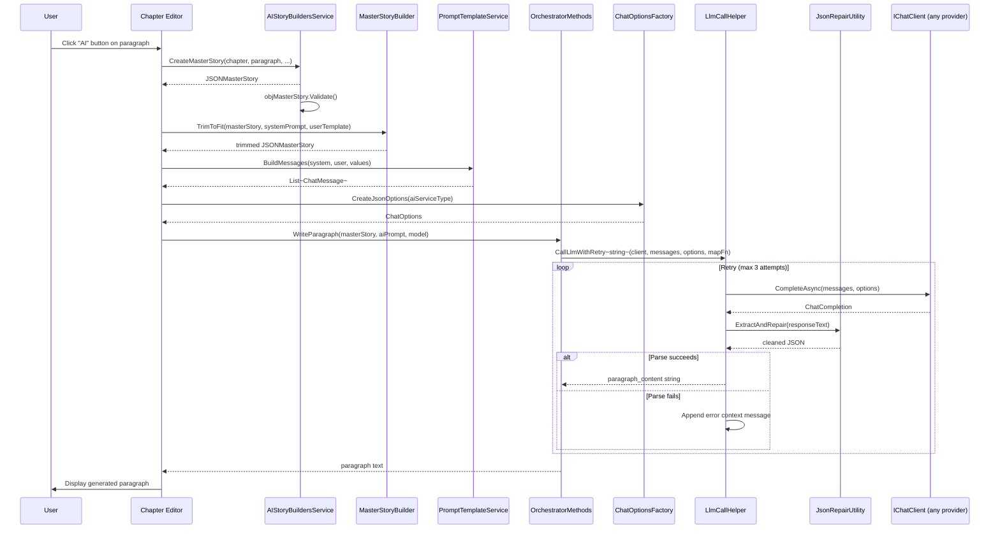

### 4.6 Summary of New/Modified Files for Feature #4

| File | Action | Details |
|---|---|---|
| `AI/PromptTemplateService.cs` | **Create** | `Templates` static class with system/user constants for all 6 operation types. `BuildMessages()` method hydrates placeholders → `List<ChatMessage>`. |
| `AI/ChatOptionsFactory.cs` | **Create** | `CreateJsonOptions(aiServiceType, modelId?)` — sets `ResponseFormat = Json` for OpenAI/Azure, returns plain options for Anthropic/Google. |
| `AI/LlmCallHelper.cs` | **Create** | `CallLlmWithRetry<T>()` — retry loop with `JsonRepairUtility` + error-context injection. `CallLlmForText()` for plain-text responses. |
| `AI/JsonRepairUtility.cs` | **Create** | `ExtractAndRepair()` — strip Markdown fences, isolate JSON block, fix trailing commas, fix unescaped newlines. Replaces `ExtractJson()` and `CleanJSON`. |
| `AI/TokenEstimator.cs` | **Create** | `EstimateTokens(string)`, `GetMaxPromptTokens(modelId)`, per-model context-window lookup. |
| `Services/MasterStoryBuilder.cs` | **Create** | `TrimToFit(JSONMasterStory, systemPrompt, userTemplate)` — trims RelatedParagraphs then PreviousParagraphs to fit token budget. |
| `AI/OrchestratorMethods.WriteParagraph.cs` | **Rewrite** | Delete `CreateWriteParagraph()`. Use `PromptTemplateService` + `MasterStoryBuilder` + `LlmCallHelper`. Same public signature. |
| `AI/OrchestratorMethods.ParseNewStory.cs` | **Rewrite** | Delete `CreateSystemMessageParseNewStory()`. Use templates + token-budget guard + retry helper. Same public signature. |
| `AI/OrchestratorMethods.CreateNewChapters.cs` | **Rewrite** | Delete `CreateSystemMessageCreateNewChapters()`. Use templates + `ChatOptionsFactory` + `JsonRepairUtility`. Same public signature. |
| `AI/OrchestratorMethods.DetectCharacters.cs` | **Rewrite** | Delete `CreateDetectCharacters()`. Use templates + `LlmCallHelper.CallLlmWithRetry<List<Character>>`. Same public signature. |
| `AI/OrchestratorMethods.DetectCharacterAttributes.cs` | **Rewrite** | Delete `CreateDetectCharacterAttributes()`. Use templates + retry helper. Same public signature. |
| `AI/OrchestratorMethods.GetStoryBeats.cs` | **Rewrite** | Delete `CreateStoryBeats()`. Use templates + `LlmCallHelper.CallLlmForText()`. Same public signature. |
| `AI/OrchestratorMethods.CleanJSON.cs` | **Delete** | Entirely replaced by `JsonRepairUtility`. All callers updated. |
| `AI/OrchestratorMethods.cs` | **Modify** | Delete the old `ExtractJson()` method (superseded by `JsonRepairUtility.ExtractAndRepair()`). |
| `Models/JSON/JSONMasterStory.cs` | **Modify** | Change most setters to `init`. Add `Validate()` method with critical checks + warnings. |
| `Services/AIStoryBuildersService.MasterStory.cs` | **Modify** | Call `objMasterStory.Validate()` after assembly. Log warnings. |

---

## Appendix — File Inventory & Quick Reference

### A.1 Current AI-Related File Map

```
AIStoryBuilders/
├── AI/
│   ├── OrchestratorMethods.cs                  ← Client factory, embedding factory, utilities, enum
│   ├── OrchestratorMethods.WriteParagraph.cs    ← Paragraph generation (REWRITE: uses PromptTemplateService + LlmCallHelper)
│   ├── OrchestratorMethods.ParseNewStory.cs     ← Story-import parsing (REWRITE: templates + token budget)
│   ├── OrchestratorMethods.CreateNewChapters.cs ← Chapter generation (REWRITE: templates + ChatOptionsFactory)
│   ├── OrchestratorMethods.DetectCharacters.cs  ← Character detection (REWRITE: templates + retry)
│   ├── OrchestratorMethods.DetectCharacterAttributes.cs ← Attribute detection (REWRITE: templates + retry)
│   ├── OrchestratorMethods.GetStoryBeats.cs     ← Story beat extraction (REWRITE: templates + CallLlmForText)
│   ├── OrchestratorMethods.CleanJSON.cs         ← DELETE — replaced by JsonRepairUtility
│   ├── OrchestratorMethods.TestAccess.cs        ← Connection test (chat + embeddings)
│   ├── OrchestratorMethods.Models.cs            ← Model enumeration + fine-tune management
│   ├── PromptTemplateService.cs                 ← Templates.* constants + BuildMessages() (NEW, §4.3.2)
│   ├── ChatOptionsFactory.cs                    ← Per-provider ChatOptions with response_format (NEW, §4.3.1)
│   ├── LlmCallHelper.cs                        ← CallLlmWithRetry<T> + CallLlmForText (NEW, §4.3.4)
│   ├── JsonRepairUtility.cs                     ← Deterministic JSON extraction + repair (NEW, §4.3.5)
│   ├── TokenEstimator.cs                        ← Heuristic token counting + model limits (NEW, §4.3.3)
│   ├── LocalEmbeddingGenerator.cs               ← IEmbeddingGenerator backed by all-MiniLM-L6-v2 ONNX (NEW, §3.4)
│   ├── AnthropicChatClient.cs                   ← Thin IChatClient wrapper → Anthropic.SDK (NEW, §3.6.3)
│   └── GoogleAIChatClient.cs                    ← Thin IChatClient wrapper → Mscc.GenerativeAI (NEW, §3.6.4)
├── Models/
│   ├── JSON/
│   │   └── JSONMasterStory.cs                   ← Master Story data structure (MODIFY: init setters + Validate())
│   ├── AIPrompt.cs                              ← User prompt + word count + model ID
│   └── Enums.cs                                 ← ControlType, CharacterBackgroundType, etc.
├── Services/
│   ├── SettingsService.cs                       ← Settings persistence (JSON file)
│   ├── MasterStoryBuilder.cs                    ← Token-budget-aware context trimming (NEW, §4.3.3)
│   ├── AIStoryBuildersService.MasterStory.cs    ← Master Story assembly + Validate() call (MODIFY)
│   └── AIStoryBuildersService.ReEmbed.cs        ← Re-embed all story vectors on demand (NEW, §3.4.10)
└── Components/Pages/
    ├── Settings.razor                           ← Settings UI (Radzen)
    └── Controls/Story/StoryEdit.razor           ← Story editing panel (Re-Embed All button added)
```

### A.2 Implementation Priority Order

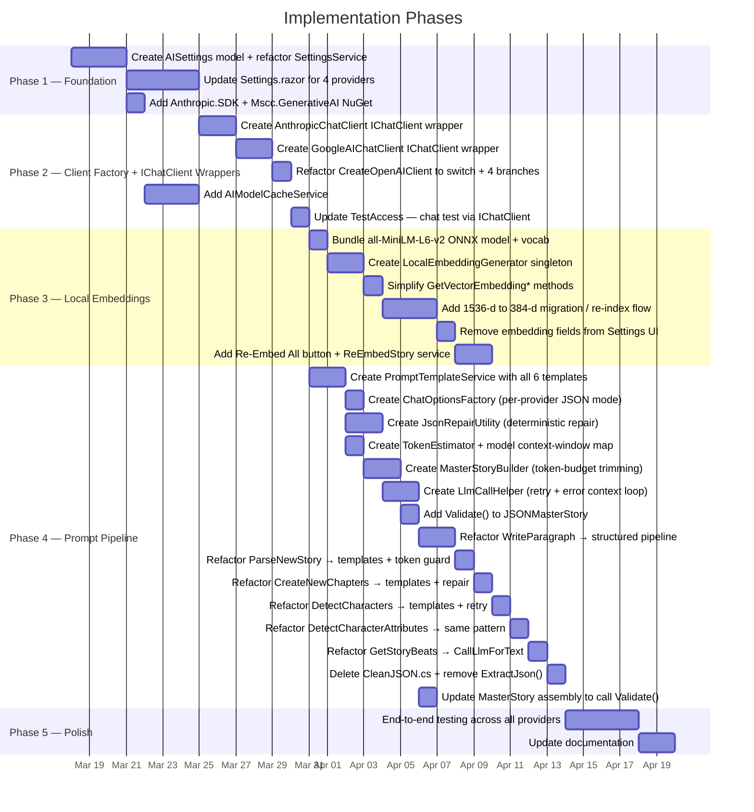

### A.3 Key Decision Points

| Decision | Options | Chosen |
|---|---|---|
| `IChatClient` adapter approach for Anthropic/Google | A) Write thin custom `IChatClient` wrappers B) Use community NuGet adapters C) Call SDKs directly in each Orchestrator method | **A** — thin wrappers (`AnthropicChatClient`, `GoogleAIChatClient`) delegate to native SDKs while exposing the standard `IChatClient` interface. This means **zero changes** to any downstream `OrchestratorMethods` partial class. See §3.6. |
| Embedding strategy | A) Per-provider cloud embeddings B) Local model for all providers | **B** — use `all-MiniLM-L6-v2` locally via ONNX; zero cloud cost, uniform 384-d vectors, no provider lock-in |
| Existing 1536-d vector migration | A) Block until re-indexed B) Warn and offer re-index C) Ignore | **B** — on first launch after upgrade, detect dimension mismatch and prompt user to re-index all paragraph vectors to 384-d |
| ONNX model distribution | A) NuGet package B) First-run download C) Ship as MauiAsset in Resources/Raw/ | **C** — existing csproj wildcard `<MauiAsset Include="Resources\Raw\**">` already includes the files. Use `FileSystem.OpenAppPackageFileAsync` + copy to `AppDataDirectory` for OnnxRuntime path access. See §3.4.5. |
| Prompt template storage | A) Embedded resource files B) Constants in code C) External JSON | **B** — `Templates` static class inside `PromptTemplateService.cs`. Simplest for desktop app; grep-able; refactor to **A** if template count grows. |
| Prompt delimiter style | A) `####` Markdown headers B) XML-style tags (`<story_title>`) C) JSON structure | **B** — XML tags are parsed more reliably by all LLM families as structural markers (Anthropic docs explicitly recommend this). |
| Token counting | A) Character heuristic (len/4) B) `SharpToken` NuGet | **A** initially via `TokenEstimator.EstimateTokens()`, upgrade to **B** if precision issues observed. |
| JSON schema enforcement | A) `response_format: json_object` B) Prompt-only enforcement | **A** where supported (OpenAI/Azure) + **B** as fallback for Anthropic/Google, both backed by `LlmCallHelper` retry loop. |
| LLM-based JSON repair (`CleanJSON`) | A) Keep as fallback B) Replace entirely with deterministic repair | **B** — `JsonRepairUtility.ExtractAndRepair()` handles strip-fences, isolate-block, fix-commas, fix-newlines. Zero cost, <1ms, deterministic. If still invalid, retry loop re-prompts. |
| Retry strategy | A) Silent fail (current) B) Retry with error context C) Retry without context | **B** — `LlmCallHelper.CallLlmWithRetry<T>()` appends error message to conversation, max 2 retries (3 attempts total). Returns `null` on exhaustion for caller to handle. |
| Master Story immutability | A) Fully immutable (`init` all) B) Partially mutable (context sections settable) | **B** — `StoryTitle`, `StorySynopsis`, `StoryStyle`, `SystemMessage`, `CharacterList`, `CurrentLocation`, `CurrentChapter`, `CurrentParagraph` use `init`; `PreviousParagraphs` and `RelatedParagraphs` use `set` (token-budget trimming needs to modify these). |
| System/User message separation | A) Single concatenated string B) Separate `ChatMessage` roles | **B** — `PromptTemplateService.BuildMessages()` always returns `List<ChatMessage>` with `System` + `User`. All `OrchestratorMethods` use the `CompleteAsync(List<ChatMessage>, ChatOptions)` overload. |

---

*End of planning document.*
