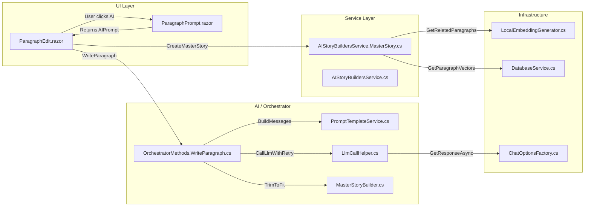
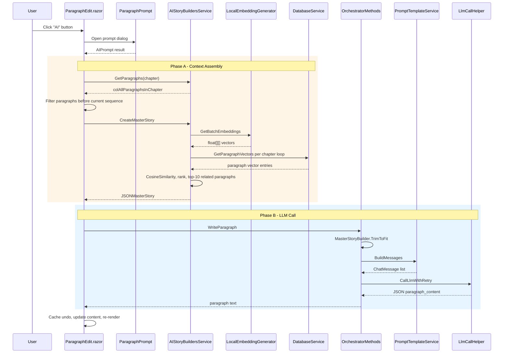
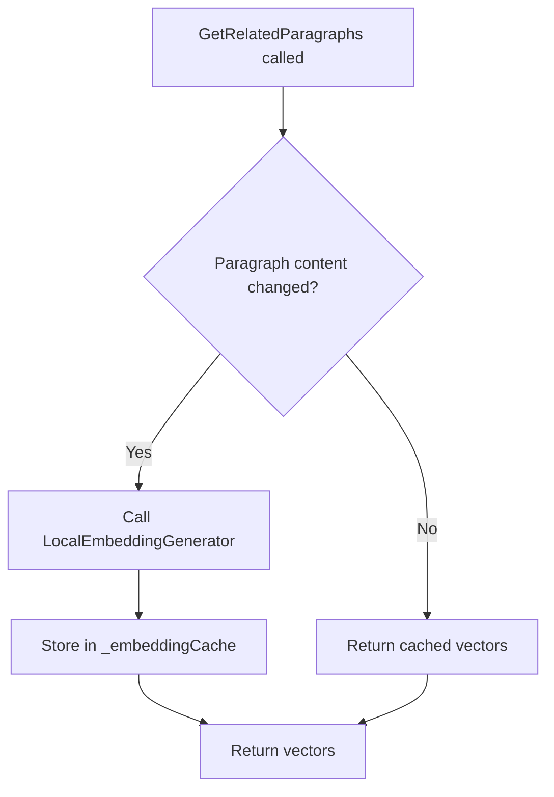
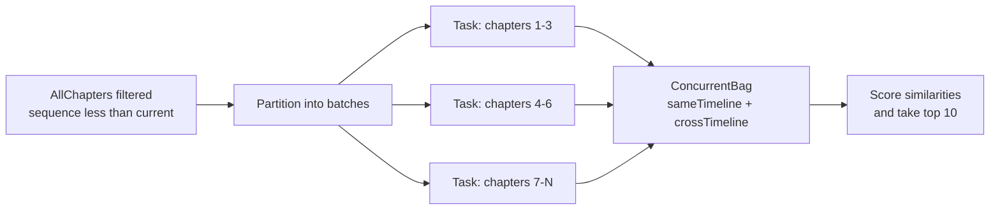
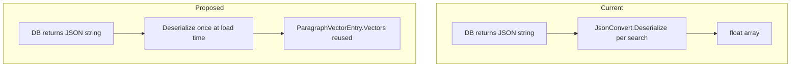
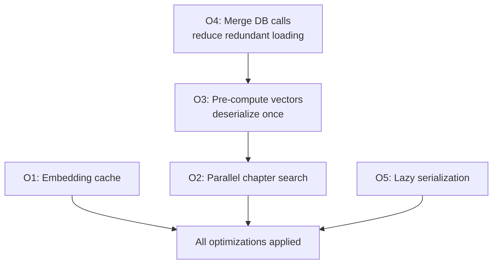
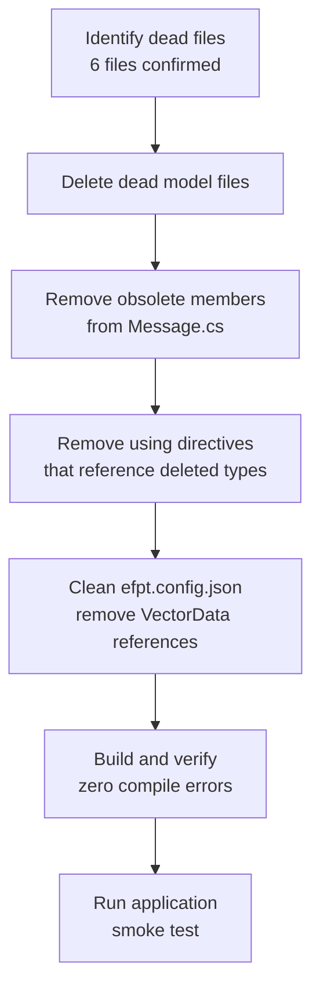

# Paragraph Creation Optimization & Unused Code Removal

> **Scope:** Detailed implementation plan covering two features: (1) optimizing the paragraph-creation pipeline for performance and resource efficiency, and (2) identifying and removing unused code from the codebase.

---

## Table of Contents

1. [Current Architecture Overview](#1-current-architecture-overview)
2. [Feature 1 — Optimize Paragraph Creation](#2-feature-1--optimize-paragraph-creation)
   - 2.1 [Current Flow & Identified Bottlenecks](#21-current-flow--identified-bottlenecks)
   - 2.2 [Optimization O1 — Embedding Cache](#22-optimization-o1--embedding-cache)
   - 2.3 [Optimization O2 — Parallel Chapter Search](#23-optimization-o2--parallel-chapter-search)
   - 2.4 [Optimization O3 — Pre-computed Paragraph Vectors](#24-optimization-o3--pre-computed-paragraph-vectors)
   - 2.5 [Optimization O4 — Reduce Redundant Data Loading](#25-optimization-o4--reduce-redundant-data-loading)
   - 2.6 [Optimization O5 — Streamline JSON Serialization in Prompt Building](#26-optimization-o5--streamline-json-serialization-in-prompt-building)
   - 2.7 [Implementation Order & Task Checklist](#27-implementation-order--task-checklist)
3. [Feature 2 — Remove Unused Code](#3-feature-2--remove-unused-code)
   - 3.1 [Dead Code Inventory](#31-dead-code-inventory)
   - 3.2 [Legacy Models Retained by Fine-Tune Feature](#32-legacy-models-retained-by-fine-tune-feature)
   - 3.3 [Removal Steps](#33-removal-steps)
   - 3.4 [Task Checklist](#34-task-checklist)
4. [Risk & Rollback](#4-risk--rollback)
5. [Files Changed Summary](#5-files-changed-summary)

---

## 1. Current Architecture Overview

The paragraph-creation pipeline spans four layers: **UI → Service → Orchestrator → LLM**.



### End-to-End Sequence for Paragraph Generation



---

## 2. Feature 1 — Optimize Paragraph Creation

### 2.1 Current Flow & Identified Bottlenecks

| # | Bottleneck | Location | Impact |
|---|-----------|----------|--------|
| **O1** | Embeddings re-computed on every call, even for unchanged paragraphs | `GetRelatedParagraphs()` in `AIStoryBuildersService.MasterStory.cs` | Adds ~200–500 ms per call for ONNX inference |
| **O2** | Chapter iteration is sequential; each chapter's vectors loaded one-by-one | `foreach (var chapter in AllChapters)` loop in `GetRelatedParagraphs()` | Scales linearly with chapter count |
| **O3** | Paragraph vectors deserialized from JSON string on every similarity search | `JsonConvert.DeserializeObject<float[]>(paragraph.vectors)` inside the loop | Allocation-heavy for large stories |
| **O4** | `GetParagraphVectors()` and `GetAllParagraphVectors()` called separately — both hit the database for overlapping data | Same chapter loop | Double database reads per chapter |
| **O5** | Prompt placeholder map re-serializes `PreviousParagraphs` and `RelatedParagraphs` into JSON strings that may exceed token budget before trimming | `WriteParagraph()` in `OrchestratorMethods.WriteParagraph.cs` | Unnecessary serialization of data that will be trimmed |

### 2.2 Optimization O1 — Embedding Cache

**Goal:** Avoid regenerating embeddings for paragraphs whose content has not changed since the last call.



**Implementation Details:**

| Step | Description |
|------|-------------|
| 1 | Add a `ConcurrentDictionary<string, float[]> _embeddingCache` field on `AIStoryBuildersService`. The key is a stable hash of the paragraph content (e.g. SHA-256 truncated to 16 hex chars). |
| 2 | Before calling `OrchestratorMethods.GetBatchEmbeddings()`, check the cache for each input text. Only send uncached texts to the embedding model. |
| 3 | After embedding, store results back in the cache. |
| 4 | Add a `ClearEmbeddingCache()` method callable when a story is closed or re-loaded, to prevent unbounded growth. |

**File:** `Services/AIStoryBuildersService.MasterStory.cs`

```csharp
// New field
private readonly ConcurrentDictionary<string, float[]> _embeddingCache = new();

// In GetRelatedParagraphs, replace:
//   var embeddingResults = await OrchestratorMethods.GetBatchEmbeddings(textsToEmbed.ToArray());
// With cache-aware logic:
var uncachedTexts = new List<(int Index, string Text)>();
var cachedResults = new float[textsToEmbed.Count][];

for (int i = 0; i < textsToEmbed.Count; i++)
{
    var key = ComputeContentHash(textsToEmbed[i]);
    if (_embeddingCache.TryGetValue(key, out var cached))
        cachedResults[i] = cached;
    else
        uncachedTexts.Add((i, textsToEmbed[i]));
}

if (uncachedTexts.Count > 0)
{
    var freshEmbeddings = await OrchestratorMethods
        .GetBatchEmbeddings(uncachedTexts.Select(u => u.Text).ToArray());

    for (int j = 0; j < uncachedTexts.Count; j++)
    {
        var key = ComputeContentHash(uncachedTexts[j].Text);
        _embeddingCache[key] = freshEmbeddings[j];
        cachedResults[uncachedTexts[j].Index] = freshEmbeddings[j];
    }
}
```

---

### 2.3 Optimization O2 — Parallel Chapter Search

**Goal:** Load and score vectors from multiple earlier chapters concurrently instead of sequentially.

**Implementation Details:**

| Step | Description |
|------|-------------|
| 1 | Replace the `foreach (var chapter in AllChapters)` loop with `Parallel.ForEachAsync` (or `Task.WhenAll` with batched tasks). |
| 2 | Collect results into thread-safe `ConcurrentBag<ParagraphVectorEntry>` for same-timeline and cross-timeline entries. |
| 3 | Continue with the existing similarity scoring and top-10 selection after all chapters are processed. |



**File:** `Services/AIStoryBuildersService.MasterStory.cs` — `GetRelatedParagraphs()`

```csharp
// Replace sequential foreach with parallel processing
var sameTimelineBag = new ConcurrentBag<ParagraphVectorEntry>();
var crossTimelineBag = new ConcurrentBag<ParagraphVectorEntry>();

var earlierChapters = AllChapters.Where(c => c.Sequence < objChapter.Sequence).ToList();

await Parallel.ForEachAsync(earlierChapters, async (chapter, ct) =>
{
    var sameParagraphs = GetParagraphVectors(chapter, ParagraphTimelineName);
    foreach (var p in sameParagraphs)
    {
        if (!string.IsNullOrEmpty(p.vectors))
        {
            var vectors = JsonConvert.DeserializeObject<float[]>(p.vectors);
            sameTimelineBag.Add(new ParagraphVectorEntry(
                Id: $"Ch{chapter.Sequence}_P{p.sequence}",
                Content: p.contents, Vectors: vectors,
                TimelineName: p.timeline_name));
        }
    }

    var allParagraphs = GetAllParagraphVectors(chapter);
    foreach (var p in allParagraphs)
    {
        if (!string.IsNullOrEmpty(p.vectors) && p.timeline_name != ParagraphTimelineName)
        {
            var vectors = JsonConvert.DeserializeObject<float[]>(p.vectors);
            crossTimelineBag.Add(new ParagraphVectorEntry(
                Id: $"Ch{chapter.Sequence}_P{p.sequence}_X",
                Content: p.contents, Vectors: vectors,
                TimelineName: p.timeline_name));
        }
    }
});

var sameTimelineEntries = sameTimelineBag.ToList();
var crossTimelineEntries = crossTimelineBag.ToList();
```

---

### 2.4 Optimization O3 — Pre-computed Paragraph Vectors

**Goal:** Deserialize `float[]` vectors once when paragraphs are loaded from the database, not on every similarity search.

**Implementation Details:**

| Step | Description |
|------|-------------|
| 1 | Modify `GetParagraphVectors()` and `GetAllParagraphVectors()` to return `ParagraphVectorEntry` records with pre-deserialized `float[]` arrays instead of raw JSON strings. |
| 2 | The `ParagraphVectorEntry` record already exists with the right shape — ensure the database layer populates `Vectors` at load time. |
| 3 | Remove the `JsonConvert.DeserializeObject<float[]>()` calls from the similarity loop in `GetRelatedParagraphs()`. |



**Files:**
- `Services/AIStoryBuildersService.cs` (or the partial containing `GetParagraphVectors`)
- `Services/AIStoryBuildersService.MasterStory.cs`

---

### 2.5 Optimization O4 — Reduce Redundant Data Loading

**Goal:** Eliminate the double database read per chapter where both `GetParagraphVectors()` (same-timeline) and `GetAllParagraphVectors()` (all timelines) are called separately.

**Implementation Details:**

| Step | Description |
|------|-------------|
| 1 | Create a single method `GetAllParagraphVectorsForChapter(chapter)` that returns all paragraphs with vectors for a chapter in one database call. |
| 2 | In the caller, partition results into same-timeline and cross-timeline entries using a LINQ `GroupBy` on `timeline_name`. |
| 3 | Remove the separate `GetParagraphVectors()` call from the loop. |

```csharp
// Single database call per chapter
var allEntries = GetAllParagraphVectorsForChapter(chapter);

var sameTimeline = allEntries.Where(e => e.TimelineName == ParagraphTimelineName);
var crossTimeline = allEntries.Where(e => e.TimelineName != ParagraphTimelineName);
```

**Files:**
- `Services/AIStoryBuildersService.cs` — add `GetAllParagraphVectorsForChapter()`
- `Services/AIStoryBuildersService.MasterStory.cs` — update loop

---

### 2.6 Optimization O5 — Streamline JSON Serialization in Prompt Building

**Goal:** Avoid serializing the full `PreviousParagraphs` and `RelatedParagraphs` collections before `TrimToFit()` discards most of them.

**Implementation Details:**

| Step | Description |
|------|-------------|
| 1 | Move the `TrimToFit()` step from `WriteParagraph()` to run **before** the prompt placeholder dictionary is built, so only the trimmed data is serialized. |
| 2 | Alternatively, pass the `JSONMasterStory` object directly to `BuildMessages()` and let it serialize lazily after trimming. |

**File:** `AI/OrchestratorMethods.WriteParagraph.cs`

---

### 2.7 Implementation Order & Task Checklist

Optimizations should be applied in dependency order. O4 and O3 are prerequisites for O2.



| Order | ID | Task | File(s) |
|-------|----|------|---------|
| 1 | O4 | Merge `GetParagraphVectors` + `GetAllParagraphVectors` into single method | `AIStoryBuildersService.cs`, `AIStoryBuildersService.MasterStory.cs` |
| 2 | O3 | Return `ParagraphVectorEntry` with pre-deserialized vectors from DB layer | `AIStoryBuildersService.cs` |
| 3 | O2 | Parallelize chapter loop using `Parallel.ForEachAsync` | `AIStoryBuildersService.MasterStory.cs` |
| 4 | O1 | Add `ConcurrentDictionary` embedding cache | `AIStoryBuildersService.MasterStory.cs` |
| 5 | O5 | Move `TrimToFit` before prompt serialization | `OrchestratorMethods.WriteParagraph.cs` |

---

## 3. Feature 2 — Remove Unused Code

### 3.1 Dead Code Inventory

The following model files are **not referenced** by any functional code path in the application. They are remnants of the original OpenAI SDK direct-call architecture that was replaced by the `Microsoft.Extensions.AI` abstraction layer.

| File | Type | Evidence | Verdict |
|------|------|----------|---------|
| `Models/Tool.cs` | Class (OpenAI function-calling) | Only self-references in static initializers. No consumer code. | **DELETE** |
| `Models/Function.cs` | Class (OpenAI function definition) | Only referenced by `Tool.cs` and deprecated `Message` constructor. | **DELETE** |
| `Models/Choice.cs` | Class (OpenAI response choice) | Zero usage outside its own definition. | **DELETE** |
| `Models/ChatResponse.cs` | Class (custom OpenAI response wrapper) | Codebase uses `Microsoft.Extensions.AI.ChatResponse` exclusively. The custom class has zero active consumers. | **DELETE** |
| `Models/ChatResponseFormat.cs` | Enum (custom response format) | `ChatOptionsFactory.cs` uses `Microsoft.Extensions.AI.ChatResponseFormat`, not this enum. Zero active consumers. | **DELETE** |
| `Models/VectorData.cs` | Class (single `VectorValue` property) | Only appears in `efpt.config.json` Entity Framework scaffolding config; never instantiated or queried. | **DELETE** |

### 3.2 Legacy Models Retained by Fine-Tune Feature

The following models appear legacy but are **actively used** by the fine-tuning export feature in `UtilityClass.razor`. They should be kept (or migrated in a separate effort):

| File | Used By | Purpose |
|------|---------|---------|
| `Models/Role.cs` | `UtilityClass.razor` (lines 256-258, 334-336) | Enum for `Message` constructor (`Role.System`, `Role.User`, `Role.Assistant`) |
| `Models/Message.cs` | `UtilityClass.razor`, `Conversation.cs` | Fine-tune JSONL message formatting |
| `Models/Conversation.cs` | `UtilityClass.razor` (lines 230, 254, 266, 328) | Wraps messages for JSONL serialization |
| `Models/TrainingData.cs` | `UtilityClass.razor` (lines 121, 195, 330) | Data structure for fine-tune training rows |

> **Note:** `Message.cs` contains two members marked `[Obsolete]`:
> - The `Function` property (replaced by `ToolCalls`)
> - The `Message(Role, string, string, Function)` constructor
>
> Once `Tool.cs` and `Function.cs` are deleted, these obsolete members should also be removed since they reference the deleted types.

### 3.3 Removal Steps



**Detailed steps:**

| Step | Action | Details |
|------|--------|---------|
| 1 | Delete `Models/Tool.cs` | Entire file. |
| 2 | Delete `Models/Function.cs` | Entire file. |
| 3 | Delete `Models/Choice.cs` | Entire file. |
| 4 | Delete `Models/ChatResponse.cs` | Entire file. |
| 5 | Delete `Models/ChatResponseFormat.cs` | Entire file. |
| 6 | Delete `Models/VectorData.cs` | Entire file. |
| 7 | Edit `Models/Message.cs` | Remove `Function` property (line 45-48), remove obsolete constructor (lines 59-64), remove `Tool`-based constructor (lines 73-76), remove `toolCalls` field and `ToolCalls` property (lines 13, 28-37), remove `ToolCallId` property (lines 39-42). These all reference deleted types. |
| 8 | Edit `Models/Message.cs` | Remove `using` for any namespaces that only served the deleted types. |
| 9 | Edit `efpt.config.json` | Remove `VectorData` table entries if present. |
| 10 | Build solution | `dotnet build` — confirm zero errors. |

### 3.4 Task Checklist

| Order | Task | File(s) |
|-------|------|---------|
| 1 | Delete 6 dead model files | `Models/Tool.cs`, `Function.cs`, `Choice.cs`, `ChatResponse.cs`, `ChatResponseFormat.cs`, `VectorData.cs` |
| 2 | Remove obsolete members from `Message.cs` referencing `Tool` / `Function` | `Models/Message.cs` |
| 3 | Clean up `efpt.config.json` VectorData references | `efpt.config.json` |
| 4 | Build and verify | Solution-wide |

---

## 4. Risk & Rollback

| Risk | Mitigation |
|------|------------|
| Deleting a model that is indirectly referenced via reflection or late-bound code | Verified via full-text search across `.cs`, `.razor`, `.json`, and `.csproj` files; no reflection-based usage found. |
| Parallel chapter search introduces race conditions | `ConcurrentBag<T>` is thread-safe; similarity scoring runs after all tasks complete. No shared mutable state in the loop body. |
| Embedding cache grows unbounded for very large stories | `ClearEmbeddingCache()` called on story close; optionally enforce a max size with LRU eviction. |
| Fine-tune export breaks after `Message.cs` cleanup | Only obsolete members referencing `Tool`/`Function` are removed. The constructors used by `UtilityClass.razor` (`Message(Role, string, string)`) remain intact. |

**Rollback:** All changes are local file edits. A single `git revert` of the implementation commit(s) restores prior behavior.

---

## 5. Files Changed Summary

| File | Feature | Change Type |
|------|---------|-------------|
| `Services/AIStoryBuildersService.MasterStory.cs` | F1 (O1, O2, O4) | Modified — cache, parallel loop, merged DB call |
| `Services/AIStoryBuildersService.cs` | F1 (O3, O4) | Modified — new combined vector method, pre-deserialized vectors |
| `AI/OrchestratorMethods.WriteParagraph.cs` | F1 (O5) | Modified — reorder TrimToFit before serialization |
| `Models/Tool.cs` | F2 | **Deleted** |
| `Models/Function.cs` | F2 | **Deleted** |
| `Models/Choice.cs` | F2 | **Deleted** |
| `Models/ChatResponse.cs` | F2 | **Deleted** |
| `Models/ChatResponseFormat.cs` | F2 | **Deleted** |
| `Models/VectorData.cs` | F2 | **Deleted** |
| `Models/Message.cs` | F2 | Modified — remove obsolete `Tool`/`Function` members |
| `efpt.config.json` | F2 | Modified — remove VectorData entries |
