# Timeline-Aware Knowledge Graph Retrieval for Paragraph Writing

## Overview

When writing a new paragraph, the system currently assembles a `JSONMasterStory` payload containing vector-similarity-based `RelatedParagraphs` and recency-scored `PreviousParagraphs`. This plan adds a **knowledge-graph query step** that:

1. Updates the knowledge graph to reflect the latest story state before retrieval.
2. Queries the graph to extract only entities, relationships, and attributes that belong to (or overlap with) the **current paragraph's timeline**.
3. Generates a short, **timeline-accurate narrative summary** from that graph data.
4. Injects the summary into the LLM prompt alongside the existing vector-based context.

The result is a paragraph-writing pipeline that combines semantic similarity (vectors) with structured factual accuracy (graph), scoped precisely to the timeline the author is writing in.

---

## Current Architecture

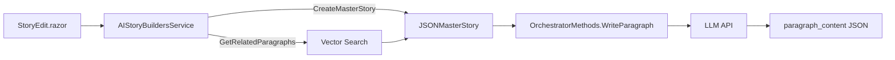

### Key data flow today

| Step | Component | What it produces |
|------|-----------|------------------|
| 1 | `AIStoryBuildersService.CreateMasterStory` | Assembles story metadata, characters, locations, previous paragraphs |
| 2 | `GetRelatedParagraphs` | Vector cosine similarity search across earlier chapters, weighted by timeline match (1.0 same, 0.7 cross) |
| 3 | `OrchestratorMethods.WriteParagraph` | Builds prompt from `JSONMasterStory`, calls LLM, returns paragraph text |

### What is missing

- The knowledge graph (`GraphState.Current`) is **not consulted** during paragraph writing.
- The graph is not updated before retrieval, so newly written paragraphs may not be reflected.
- No timeline-scoped summary is produced; the LLM only sees raw paragraph text and character descriptions.

---

## Proposed Architecture

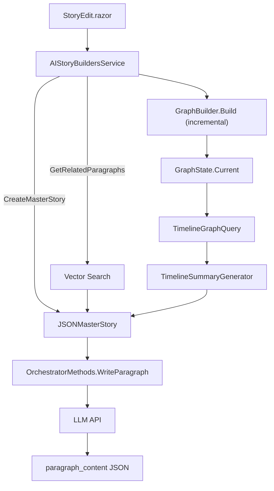

---

## Feature Design

### Component Inventory

| New/Modified | Component | Purpose |
|--------------|-----------|---------|
| **Modified** | `AIStoryBuildersService.CreateMasterStory` | Orchestrates graph update, timeline query, summary generation |
| **New** | `GraphQueryService.GetTimelineContext` | Extracts all graph data scoped to a single timeline |
| **New** | `TimelineSummaryGenerator` | Converts structured graph data into a prose summary |
| **Modified** | `JSONMasterStory` | Gains a `TimelineSummary` property |
| **Modified** | `PromptTemplateService.Templates.WriteParagraph_User` | Gains a `{TimelineSummary}` placeholder |
| **Modified** | `OrchestratorMethods.WriteParagraph` | Passes the new field into the prompt dictionary |
| **Modified** | `GraphBuilder.Build` | Called before retrieval to ensure the graph is current |
| **Modified** | `AIStoryBuildersService.PersistGraphAsync` | Called after rebuild to save updated graph to disk |

---

## Detailed Design

### 1. Incremental Graph Refresh Before Retrieval

Before querying the graph for timeline context, the graph must reflect the latest story data (including any paragraphs written during the current session).

#### Trigger point

Inside `CreateMasterStory`, immediately before the timeline query:

```
CreateMasterStory(...)
  -> Rebuild graph from in-memory Story object
  -> Persist updated graph to disk
  -> Query timeline context
  -> Generate summary
  -> Attach to JSONMasterStory
```

#### Implementation

```csharp
// In AIStoryBuildersService.CreateMasterStory, before timeline query:
var fullStory = LoadFullStoryObject(objChapter.Story);
var graphBuilder = new GraphBuilder();
var updatedGraph = graphBuilder.Build(fullStory);
GraphState.Current = updatedGraph;
GraphState.CurrentStory = fullStory;
await PersistGraphAsync(fullStory, updatedGraph, GetStoryPath(fullStory.Title));
```

`LoadFullStoryObject` assembles a `Story` with all Characters, Locations, Timelines, Chapters, and Paragraphs from disk — the same data that `EnsureGraphExistsAsync` uses.

#### Process flow

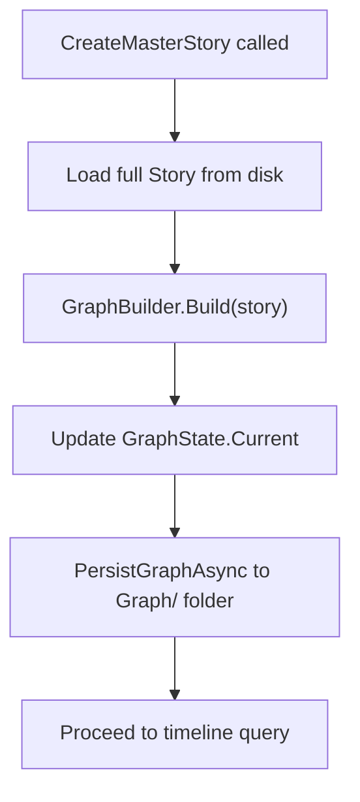

---

### 2. Timeline-Scoped Graph Query

A new method on `GraphQueryService` collects all entities and relationships relevant to a specific timeline, bounded by the point in the story the user is currently writing.

#### Interface addition

```csharp
TimelineContextDto GetTimelineContext(string timelineName, int upToChapterSequence = int.MaxValue, int upToParagraphSequence = int.MaxValue);
```

#### TimelineContextDto model

```csharp
public class TimelineContextDto
{
    public string TimelineName { get; set; } = "";
    public string TimelineDescription { get; set; } = "";
    public DateTime? StartDate { get; set; }
    public DateTime? EndDate { get; set; }
    public List<TimelineCharacterDto> Characters { get; set; } = new();
    public List<TimelineLocationDto> Locations { get; set; } = new();
    public List<TimelineEventDto> Events { get; set; } = new();
}

public class TimelineCharacterDto
{
    public string Name { get; set; } = "";
    public string Role { get; set; } = "";
    public List<string> Attributes { get; set; } = new();
}

public class TimelineLocationDto
{
    public string Name { get; set; } = "";
    public string Description { get; set; } = "";
}

public class TimelineEventDto
{
    public string Chapter { get; set; } = "";
    public int ParagraphIndex { get; set; }
    public List<string> Characters { get; set; } = new();
    public string Location { get; set; } = "";
}
```

#### Query algorithm

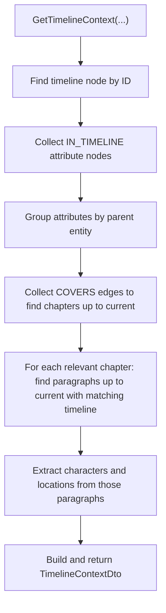

#### Detailed steps

| Step | Graph traversal | Data collected |
|------|----------------|----------------|
| 1 | Find node `timeline:{name}` | Timeline description, start/end dates |
| 2 | Follow `IN_TIMELINE` edges **inward** to attribute nodes | Character and location attributes scoped to this timeline |
| 3 | Follow `COVERS` edges from the timeline node to chapter nodes | Chapter names covered by this timeline |
| 4 | For each covered chapter (up to current sequence), find paragraph nodes (up to current sequence) | Relevant paragraph nodes |
| 5 | Filter paragraphs whose `timeline` property matches | Only paragraphs in the target timeline |
| 6 | Follow `MENTIONED_IN` edges inward from character nodes to those paragraphs | Characters active in this timeline |
| 7 | Read `location` property from each paragraph node | Locations used in this timeline |

#### Edge types used

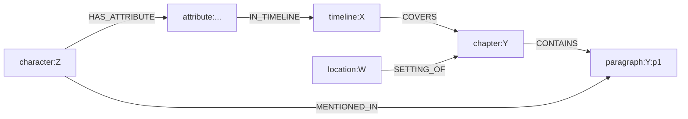

---

### 3. Timeline Summary Generation

A new service converts the structured `TimelineContextDto` into a concise prose summary suitable for LLM consumption.

#### Service signature

```csharp
public interface ITimelineSummaryGenerator
{
    string GenerateSummary(TimelineContextDto context);
}
```

#### Summary structure

The generator produces a deterministic (non-LLM) summary with these sections:

```
Timeline: {TimelineName} ({StartDate} to {EndDate})
{TimelineDescription}

Characters active in this timeline:
- {Name} ({Role}): {Attribute1}; {Attribute2}
- {Name} ({Role}): {Attribute1}

Locations in this timeline:
- {Name}: {Description}

Events (chronological):
- {Chapter}, P{Index}: {Character1}, {Character2} at {Location}
- {Chapter}, P{Index}: {Character1} at {Location}
```

#### Design decisions

| Decision | Rationale |
|----------|-----------|
| Deterministic (no LLM call) | Avoids extra latency and token cost; the LLM that writes the paragraph synthesises the summary |
| Capped at 800 words | Prevents the summary from consuming excessive prompt budget; long stories may have many events |
| Events listed chronologically by chapter sequence then paragraph sequence | Gives the LLM a clear temporal ordering |
| Only attributes tagged `IN_TIMELINE` for the target timeline are included | Prevents future-timeline spoilers leaking into the prompt |

#### Truncation strategy

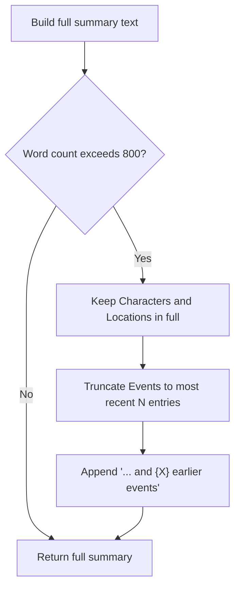

---

### 4. JSONMasterStory Extension

#### New property

```csharp
public class JSONMasterStory
{
    // ... existing properties ...
    public string TimelineSummary { get; set; }
}
```

This field carries the generated summary text from `CreateMasterStory` through to the prompt builder.

---

### 5. Prompt Template Update

#### Current `WriteParagraph_User` (relevant fragment)

```
<system_directions>{SystemMessage}</system_directions>
<world_facts>{WorldFacts}</world_facts>
<current_chapter>{CurrentChapter}</current_chapter>
```

#### Updated `WriteParagraph_User`

```
<system_directions>{SystemMessage}</system_directions>
<world_facts>{WorldFacts}</world_facts>
<timeline_summary>{TimelineSummary}</timeline_summary>
<current_chapter>{CurrentChapter}</current_chapter>
```

The `<timeline_summary>` block is placed after `<world_facts>` and before `<current_chapter>` so the LLM sees global context first, then timeline-specific context, then the chapter it is writing in.

#### Constraint addition

Add to the `<constraints>` block:

```
- The <timeline_summary> describes what has happened so far in the
  current timeline. Do not contradict these facts.
- Do not reference events from other timelines unless they are
  explicitly mentioned in the provided context.
```

---

### 6. WriteParagraph Integration

#### Modified dictionary entry in `OrchestratorMethods.WriteParagraph`

```csharp
var messages = promptService.BuildMessages(
    PromptTemplateService.Templates.WriteParagraph_System,
    PromptTemplateService.Templates.WriteParagraph_User,
    new Dictionary<string, string>
    {
        // ... existing entries ...
        ["TimelineSummary"] = objJSONMasterStory.TimelineSummary ?? "",
        // ... existing entries ...
    });
```

No other changes needed in `WriteParagraph`; the prompt template handles placement.

---

### 7. Updated CreateMasterStory Flow

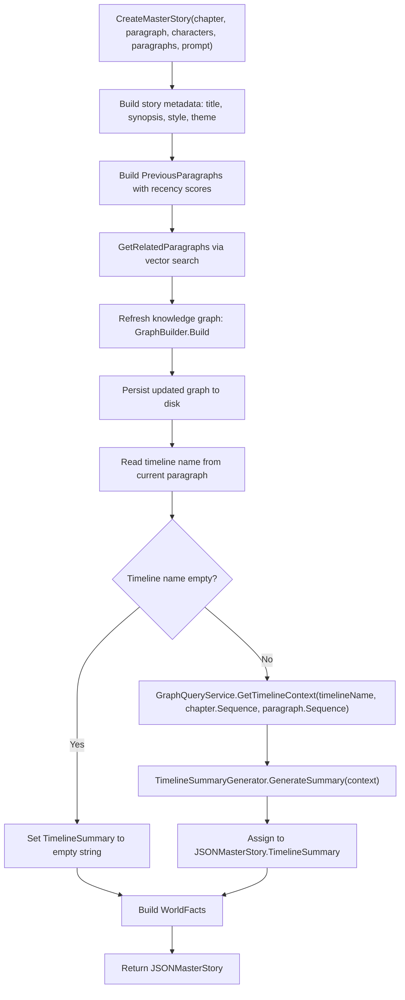

---

## Data Flow Summary

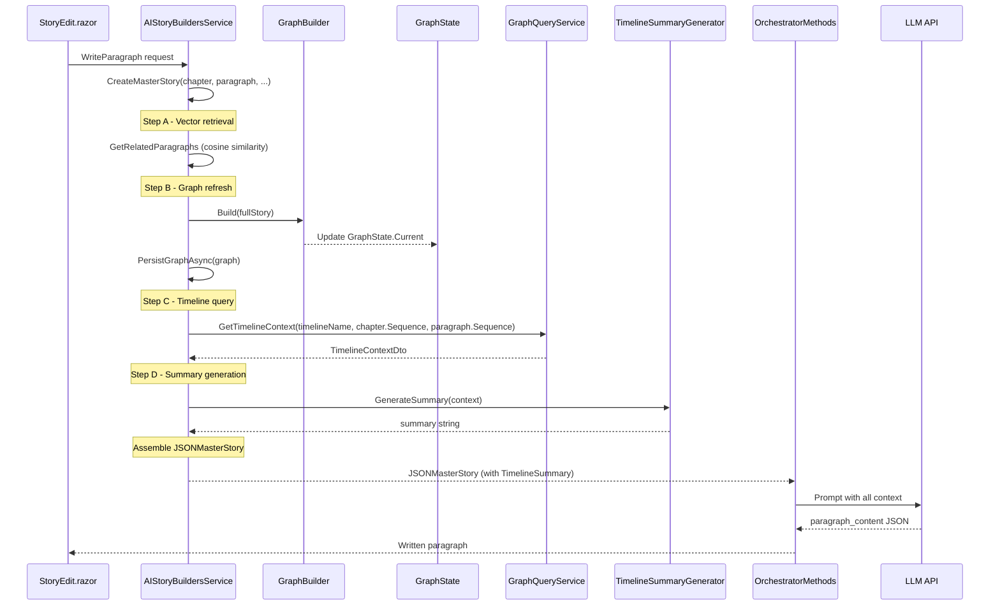

---

## Files to Create or Modify

| File | Action | Description |
|------|--------|-------------|
| `Services/GraphQueryService.cs` | **Modify** | Add `GetTimelineContext` method and supporting DTOs to the interface and implementation |
| `Services/TimelineSummaryGenerator.cs` | **Create** | New service: converts `TimelineContextDto` to capped prose summary |
| `Models/JSON/JSONMasterStory.cs` | **Modify** | Add `string TimelineSummary` property |
| `AI/PromptTemplateService.cs` | **Modify** | Add `{TimelineSummary}` placeholder and timeline constraints to `WriteParagraph_User` |
| `AI/OrchestratorMethods.WriteParagraph.cs` | **Modify** | Pass `TimelineSummary` in the prompt dictionary |
| `Services/AIStoryBuildersService.MasterStory.cs` | **Modify** | Add graph refresh, timeline query, and summary generation to `CreateMasterStory` |
| `MauiProgram.cs` | **Modify** | Register `ITimelineSummaryGenerator` / `TimelineSummaryGenerator` in DI (if using DI) |

---

## Implementation Order

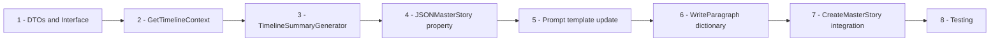

### Step 1 — DTOs and Interface

Add `TimelineContextDto`, `TimelineCharacterDto`, `TimelineLocationDto`, and `TimelineEventDto` classes. Add `GetTimelineContext(string timelineName, int upToChapterSequence = int.MaxValue, int upToParagraphSequence = int.MaxValue)` to `IGraphQueryService`.

### Step 2 — GetTimelineContext Implementation

Implement the graph traversal in `GraphQueryService`:

```csharp
public TimelineContextDto GetTimelineContext(string timelineName, int upToChapterSequence = int.MaxValue, int upToParagraphSequence = int.MaxValue)
{
    var graph = GraphState.Current;
    var story = GraphState.CurrentStory;
    if (graph == null || story == null) return new();

    var tlId = $"timeline:{timelineName.ToLowerInvariant().Trim()}";
    var tlNode = graph.Nodes.FirstOrDefault(
        n => n.Id.Equals(tlId, StringComparison.OrdinalIgnoreCase));
    if (tlNode == null) return new();

    var dto = new TimelineContextDto
    {
        TimelineName = tlNode.Label,
        TimelineDescription = tlNode.Properties.GetValueOrDefault("description", ""),
        StartDate = DateTime.TryParse(
            tlNode.Properties.GetValueOrDefault("startDate", ""), out var sd) ? sd : null,
        EndDate = DateTime.TryParse(
            tlNode.Properties.GetValueOrDefault("endDate", ""), out var ed) ? ed : null
    };

    // Attributes scoped to this timeline
    var attrNodeIds = graph.Edges
        .Where(e => e.Label == "IN_TIMELINE" &&
                    e.TargetId.Equals(tlId, StringComparison.OrdinalIgnoreCase))
        .Select(e => e.SourceId)
        .ToHashSet(StringComparer.OrdinalIgnoreCase);

    var attrNodes = graph.Nodes
        .Where(n => n.Type == NodeType.Attribute && attrNodeIds.Contains(n.Id))
        .ToList();

    // Group character attributes
    var charAttrs = attrNodes
        .Where(n => n.Properties.GetValueOrDefault("parentType", "") == "character")
        .GroupBy(n => n.Properties.GetValueOrDefault("parentName", ""));

    foreach (var group in charAttrs)
    {
        var charNode = graph.Nodes.FirstOrDefault(
            n => n.Type == NodeType.Character &&
                 n.Label.Equals(group.Key, StringComparison.OrdinalIgnoreCase));
        dto.Characters.Add(new TimelineCharacterDto
        {
            Name = group.Key,
            Role = charNode?.Properties.GetValueOrDefault("role", "") ?? "",
            Attributes = group.Select(
                a => a.Properties.GetValueOrDefault("description", "")).ToList()
        });
    }

    // Group location attributes
    var locAttrs = attrNodes
        .Where(n => n.Properties.GetValueOrDefault("parentType", "") == "location")
        .GroupBy(n => n.Properties.GetValueOrDefault("parentName", ""));

    foreach (var group in locAttrs)
    {
        dto.Locations.Add(new TimelineLocationDto
        {
            Name = group.Key,
            Description = string.Join("; ",
                group.Select(a => a.Properties.GetValueOrDefault("description", "")))
        });
    }

    // Events: paragraphs in chapters covered by this timeline
    var coveredChapterIds = graph.Edges
        .Where(e => e.Label == "COVERS" &&
                    e.SourceId.Equals(tlId, StringComparison.OrdinalIgnoreCase))
        .Select(e => e.TargetId)
        .ToHashSet(StringComparer.OrdinalIgnoreCase);

    foreach (var ch in (story.Chapter ?? new()).OrderBy(c => c.Sequence))
    {
        if (ch.Sequence > upToChapterSequence) continue;

        var chId = $"chapter:{(ch.ChapterName ?? "").ToLowerInvariant().Trim()}";
        if (!coveredChapterIds.Contains(chId)) continue;

        foreach (var p in (ch.Paragraph ?? new()).OrderBy(p => p.Sequence))
        {
            if (ch.Sequence == upToChapterSequence && p.Sequence >= upToParagraphSequence) continue;

            if (!(p.Timeline?.TimelineName ?? "")
                .Equals(timelineName, StringComparison.OrdinalIgnoreCase))
                continue;

            dto.Events.Add(new TimelineEventDto
            {
                Chapter = ch.ChapterName ?? "",
                ParagraphIndex = p.Sequence,
                Characters = (p.Characters ?? new())
                    .Select(c => c.CharacterName ?? "")
                    .Where(n => n.Length > 0).ToList(),
                Location = p.Location?.LocationName ?? ""
            });
        }
    }

    return dto;
}
```

### Step 3 — TimelineSummaryGenerator

Create `Services/TimelineSummaryGenerator.cs`:

```csharp
public class TimelineSummaryGenerator : ITimelineSummaryGenerator
{
    private const int MaxWords = 800;

    public string GenerateSummary(TimelineContextDto context)
    {
        if (string.IsNullOrWhiteSpace(context.TimelineName))
            return "";

        var sb = new StringBuilder();

        // Header
        var dateRange = FormatDateRange(context.StartDate, context.EndDate);
        sb.AppendLine($"Timeline: {context.TimelineName}{dateRange}");
        if (!string.IsNullOrWhiteSpace(context.TimelineDescription))
            sb.AppendLine(context.TimelineDescription);
        sb.AppendLine();

        // Characters
        if (context.Characters.Count > 0)
        {
            sb.AppendLine("Characters active in this timeline:");
            foreach (var c in context.Characters)
            {
                var attrs = string.Join("; ", c.Attributes.Where(a => a.Length > 0));
                var rolePart = string.IsNullOrWhiteSpace(c.Role) ? "" : $" ({c.Role})";
                var attrPart = string.IsNullOrWhiteSpace(attrs) ? "" : $": {attrs}";
                sb.AppendLine($"- {c.Name}{rolePart}{attrPart}");
            }
            sb.AppendLine();
        }

        // Locations
        if (context.Locations.Count > 0)
        {
            sb.AppendLine("Locations in this timeline:");
            foreach (var loc in context.Locations)
            {
                var desc = string.IsNullOrWhiteSpace(loc.Description)
                    ? "" : $": {loc.Description}";
                sb.AppendLine($"- {loc.Name}{desc}");
            }
            sb.AppendLine();
        }

        // Events
        if (context.Events.Count > 0)
        {
            sb.AppendLine("Events (chronological):");
            var eventLines = context.Events.Select(e =>
            {
                var chars = string.Join(", ", e.Characters);
                var loc = string.IsNullOrWhiteSpace(e.Location) ? "" : $" at {e.Location}";
                return $"- {e.Chapter}, P{e.ParagraphIndex}: {chars}{loc}";
            }).ToList();

            // Truncate if total exceeds word budget
            var currentWords = WordCount(sb.ToString());
            var kept = new List<string>();
            foreach (var line in Enumerable.Reverse(eventLines))
            {
                if (currentWords + WordCount(line) > MaxWords && kept.Count > 0)
                {
                    var omitted = eventLines.Count - kept.Count;
                    kept.Insert(0, $"- ... and {omitted} earlier events");
                    break;
                }
                kept.Insert(0, line);
                currentWords += WordCount(line);
            }
            foreach (var line in kept)
                sb.AppendLine(line);
        }

        return sb.ToString().TrimEnd();
    }

    private static string FormatDateRange(DateTime? start, DateTime? end)
    {
        if (start == null && end == null) return "";
        var s = start?.ToString("yyyy-MM-dd") ?? "?";
        var e = end?.ToString("yyyy-MM-dd") ?? "?";
        return $" ({s} to {e})";
    }

    private static int WordCount(string text)
        => text.Split(' ', StringSplitOptions.RemoveEmptyEntries).Length;
}
```

### Step 4 — JSONMasterStory property

Add to `Models/JSON/JSONMasterStory.cs`:

```csharp
public string TimelineSummary { get; set; }
```

### Step 5 — Prompt template update

In `AI/PromptTemplateService.cs`, update `WriteParagraph_User` to include the new placeholder and constraint lines as described in Section 5 above.

### Step 6 — WriteParagraph dictionary entry

In `AI/OrchestratorMethods.WriteParagraph.cs`, add to the dictionary:

```csharp
["TimelineSummary"] = objJSONMasterStory.TimelineSummary ?? "",
```

### Step 7 — CreateMasterStory integration

In `Services/AIStoryBuildersService.MasterStory.cs`, after `RelatedParagraphs` are populated and before `WorldFacts`:

```csharp
// --- Timeline-aware graph retrieval ---
var fullStory = LoadFullStoryObject(objChapter.Story.Title);
var graphBuilder = new GraphBuilder();
GraphState.Current = graphBuilder.Build(fullStory);
GraphState.CurrentStory = fullStory;
await PersistGraphAsync(fullStory, GraphState.Current, GetStoryPath(fullStory.Title));

var currentTimeline = objParagraph.Timeline?.TimelineName ?? "";
if (!string.IsNullOrWhiteSpace(currentTimeline))
{
    var gqs = new GraphQueryService();
    var tlContext = gqs.GetTimelineContext(currentTimeline, objChapter.Sequence, objParagraph.Sequence);
    var summaryGen = new TimelineSummaryGenerator();
    objMasterStory.TimelineSummary = summaryGen.GenerateSummary(tlContext);
}
else
{
    objMasterStory.TimelineSummary = "";
}
```

### Step 8 — Testing

| Test case | Expected outcome |
|-----------|-----------------|
| Paragraph with a timeline assigned | `TimelineSummary` is non-empty; contains only characters, locations, and events from that timeline |
| Paragraph with no timeline | `TimelineSummary` is empty string; prompt `<timeline_summary>` block is blank |
| Story with no graph on disk | Graph is built on-the-fly, persisted, then queried successfully |
| Large story with 50+ events in one timeline | Summary is capped at approximately 800 words; earlier events are truncated with count |
| Two timelines with overlapping characters | Each timeline's summary includes only attributes tagged `IN_TIMELINE` for that specific timeline |
| Newly written paragraph appears in graph | After writing paragraph N, writing paragraph N+1 triggers a graph rebuild that includes paragraph N |

---

## Token Budget Considerations

The `MasterStoryBuilder.TrimToFit` method already trims `JSONMasterStory` fields to stay within the model's context window. The new `TimelineSummary` field must participate in this trimming.

### Trimming priority (lowest priority trimmed first)

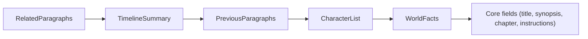

`TimelineSummary` should be trimmed **after** `RelatedParagraphs` but **before** `PreviousParagraphs`. Rationale: the summary is a compressed, high-signal representation of the timeline; it is more valuable per token than raw related paragraphs, but less critical than the immediate preceding context.

### MasterStoryBuilder changes

In `Services/MasterStoryBuilder.cs`, add `TimelineSummary` to the list of trimmable fields. When the token budget is exceeded:

1. Remove `RelatedParagraphs` entries from lowest-scoring first.
2. If still over budget, truncate `TimelineSummary` to 400 words, then 200, then remove entirely.
3. Continue with existing trim logic for `PreviousParagraphs`, etc.

---

## Edge Cases and Failure Modes

| Scenario | Handling |
|----------|----------|
| `GraphState.Current` is `null` (no graph built yet) | `CreateMasterStory` calls `GraphBuilder.Build` which creates it; no special handling needed |
| Timeline name in paragraph does not match any graph node | `GetTimelineContext` returns an empty `TimelineContextDto`; summary is empty string |
| `PersistGraphAsync` fails (disk full, permissions) | Log the error; continue with whatever graph is in memory; paragraph writing is not blocked |
| Story has zero timelines defined | All paragraphs have empty timeline; `TimelineSummary` is always empty; no graph query overhead |
| Graph rebuild is slow on very large stories | Consider a dirty-flag (`GraphState.IsDirty`) set when paragraphs are written; only rebuild when dirty |

---

## Performance Optimization: Dirty-Flag Graph Rebuild

To avoid rebuilding the full graph on every paragraph write, introduce a lightweight dirty flag.

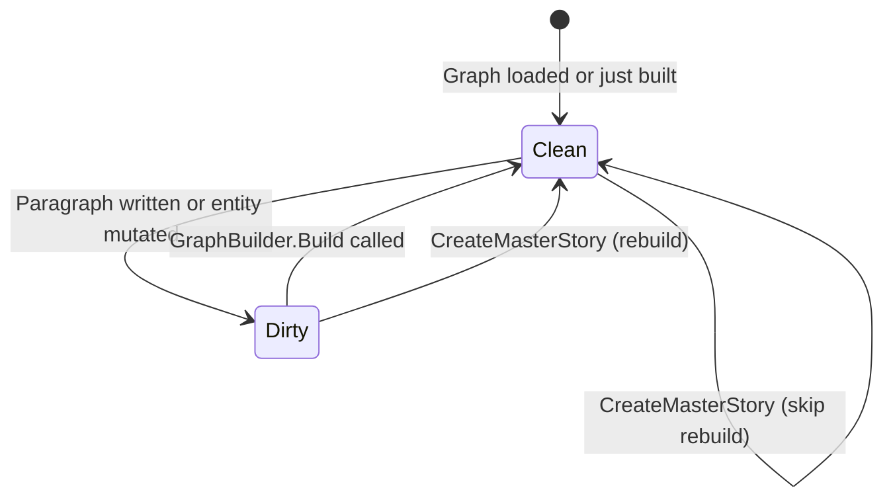

### Implementation

```csharp
// In GraphState.cs
public static bool IsDirty { get; set; } = true;
```

Set `IsDirty = true` whenever:
- A paragraph is written or updated via `AIStoryBuildersService`
- A character, location, or timeline is added, renamed, or deleted
- The chat tool mutations (`GraphMutationService`) modify entities

Set `IsDirty = false` after `GraphBuilder.Build` completes.

In `CreateMasterStory`, check the flag:

```csharp
if (GraphState.IsDirty || GraphState.Current == null)
{
    var fullStory = LoadFullStoryObject(objChapter.Story.Title);
    GraphState.Current = new GraphBuilder().Build(fullStory);
    GraphState.CurrentStory = fullStory;
    await PersistGraphAsync(fullStory, GraphState.Current, GetStoryPath(fullStory.Title));
    GraphState.IsDirty = false;
}
```

---

## Summary

This plan introduces a three-part addition to the paragraph-writing pipeline:

1. **Graph refresh** ensures the knowledge graph is always current before retrieval.
2. **Timeline-scoped query** extracts only the characters, locations, attributes, and events belonging to the current paragraph's timeline from the graph.
3. **Deterministic summary generation** compresses that structured data into a concise, word-capped prose block injected into the LLM prompt.

The result is that the LLM receives both **semantic context** (vector-retrieved related paragraphs) and **factual context** (graph-derived timeline summary), producing paragraphs that are consistent with established story facts within the active timeline.
