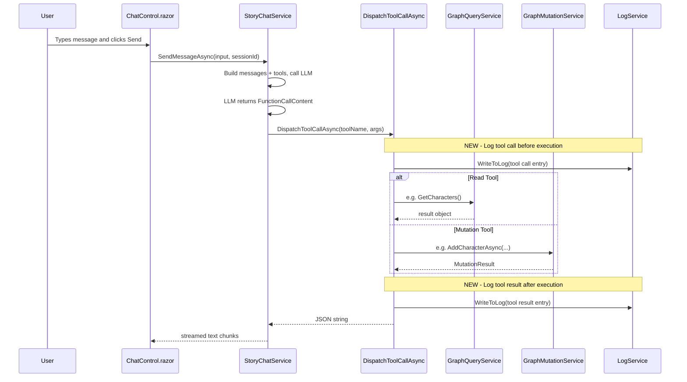
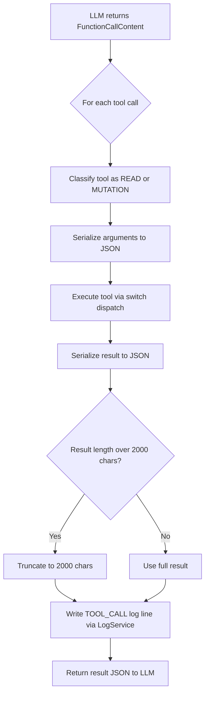
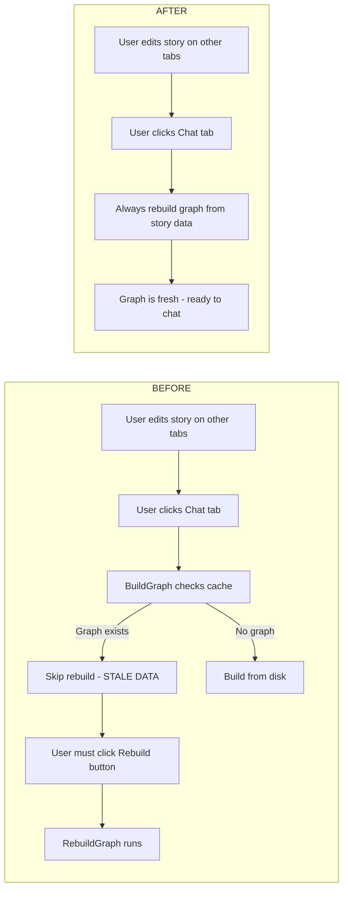
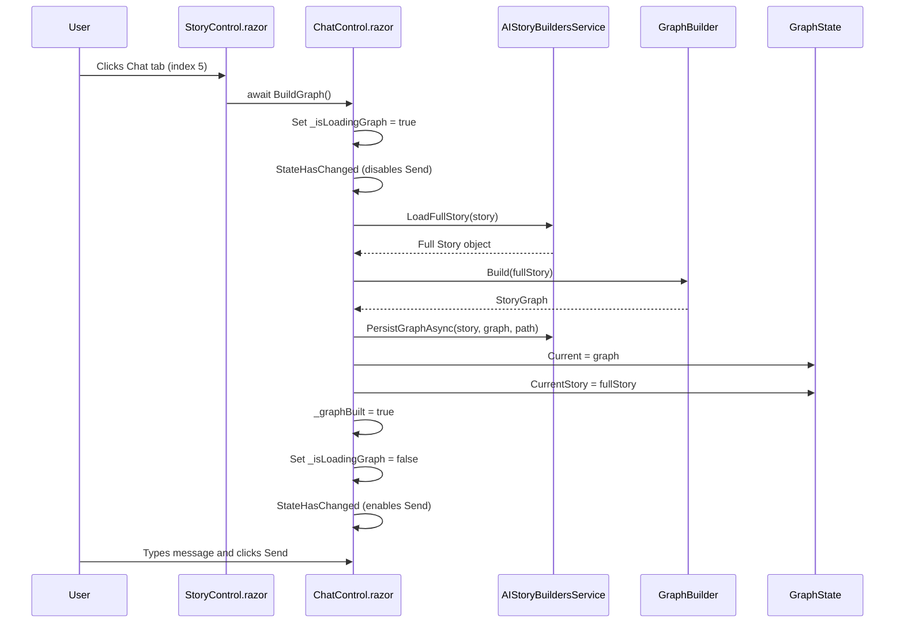

# Tool Call Logging and Auto-Rebuild Knowledge Graph Plan

## Overview

This document describes two features for the AIStoryBuilders Chat system:

1. **Tool Call Logging** — Log every AI tool call (name, arguments, result) with emphasis on graph API interactions.
2. **Auto-Rebuild Knowledge Graph** — Remove the manual "Rebuild Knowledge Graph" button and automatically rebuild when the user navigates to the Chat tab.

---

## Feature 1: Tool Call Logging

### Goal

Every time the AI invokes a tool through `StoryChatService.DispatchToolCallAsync()`, log the tool name, serialized arguments, serialized result, and a timestamp. Graph API calls (both read and mutation) should be clearly identifiable in the log output.

### Current State

| Component | File | Behavior |
|-----------|------|----------|
| `DispatchToolCallAsync()` | `Services/StoryChatService.cs` | Routes tool calls via switch statement, returns JSON result. **No logging.** Missing story-level read tools. |
| `SendMessageAsync()` | `Services/StoryChatService.cs` | Iterates tool-call loop (max 10 rounds), feeds `FunctionCallContent` to dispatch. **No logging of tool names/args.** |
| `LogService` | `Services/LogService.cs` | Writes timestamped lines to `AIStoryBuildersLog.csv`. Caps at 1000 lines. |
| `LlmCallHelper` | `AI/LlmCallHelper.cs` | Logs token counts and retry attempts. Does **not** log tool calls. |

### Architecture



### Design Decisions

| Decision | Choice | Rationale |
|----------|--------|-----------|
| Where to log | Inside `DispatchToolCallAsync()` | Single choke-point for all 35 tools |
| Log format | Structured CSV line via existing `LogService` | Consistent with existing logging; no new dependencies |
| Truncate large results | Yes, cap result string at 2000 chars | Prevent log bloat from full paragraph text or graph summaries |
| Classify tool type | Tag each entry as `READ` or `MUTATION` | Makes it easy to filter for graph-write operations |

### Log Entry Format

Each tool call produces **one** log line with pipe-delimited fields:

```
TOOL_CALL|{Timestamp}|{SessionId}|{ToolType}|{ToolName}|{ArgsJson}|{ResultJson}
```

| Field | Example |
|-------|---------|
| Prefix | `TOOL_CALL` |
| Timestamp | `2026-04-16T14:32:01.123Z` |
| SessionId | `a1b2c3d4-...` |
| ToolType | `READ` or `MUTATION` |
| ToolName | `GetCharacterRelationships` |
| ArgsJson | `{"characterName":"Alice"}` |
| ResultJson | `[{"source":"Alice","target":"Bob",...}]` (truncated at 2000 chars) |

### New Read Tools: Story-Level Properties

`GetStorys()` in `AIStoryBuildersService.Story.cs` returns each story with these properties: `Id`, `Title`, `Style`, `Theme`, `Synopsis`, `WorldFacts`. Currently **none of these are exposed as chat tools**. The existing `GetGraphSummary` only returns node/edge counts — it does not surface story metadata.

We add the following read tools so the AI can access every element that `GetStorys()` returns for the current story:

| New Tool | Returns | Source |
|----------|---------|--------|
| `GetStoryDetails` | Full story metadata: Title, Style, Theme, Synopsis, WorldFacts | `GraphState.CurrentStory` |
| `GetStoryStyle` | The story's writing style | `GraphState.CurrentStory.Style` |
| `GetStoryTheme` | The story's theme | `GraphState.CurrentStory.Theme` |
| `GetStorySynopsis` | The story's synopsis | `GraphState.CurrentStory.Synopsis` |
| `GetStoryWorldFacts` | The story's world-building facts | `GraphState.CurrentStory.WorldFacts` |

#### New DTO

**File:** `Models/ChatModels.cs`

Add a new DTO in the Read-Tool DTOs section:

```csharp
public class StoryDetailsDto
{
    public string Title { get; set; } = "";
    public string Style { get; set; } = "";
    public string Theme { get; set; } = "";
    public string Synopsis { get; set; } = "";
    public string WorldFacts { get; set; } = "";
}
```

#### New Query Service Methods

**File:** `Services/GraphQueryService.cs`

Add to `IGraphQueryService`:

```csharp
StoryDetailsDto GetStoryDetails();
string GetStoryStyle();
string GetStoryTheme();
string GetStorySynopsis();
string GetStoryWorldFacts();
```

Add to `GraphQueryService`:

```csharp
public StoryDetailsDto GetStoryDetails()
{
    var story = GraphState.CurrentStory;
    if (story == null) return new StoryDetailsDto();

    return new StoryDetailsDto
    {
        Title = story.Title ?? "",
        Style = story.Style ?? "",
        Theme = story.Theme ?? "",
        Synopsis = story.Synopsis ?? "",
        WorldFacts = story.WorldFacts ?? ""
    };
}

public string GetStoryStyle()
{
    return GraphState.CurrentStory?.Style ?? "";
}

public string GetStoryTheme()
{
    return GraphState.CurrentStory?.Theme ?? "";
}

public string GetStorySynopsis()
{
    return GraphState.CurrentStory?.Synopsis ?? "";
}

public string GetStoryWorldFacts()
{
    return GraphState.CurrentStory?.WorldFacts ?? "";
}
```

#### New AIFunction Definitions in `BuildTools()`

**File:** `Services/StoryChatService.cs` — inside `BuildTools()`:

```csharp
AIFunctionFactory.Create(
    [Description("Get full story metadata: title, style, theme, synopsis, and world facts.")]
    () => _queryService.GetStoryDetails(),
    nameof(IGraphQueryService.GetStoryDetails)),

AIFunctionFactory.Create(
    [Description("Get the writing style of the current story.")]
    () => _queryService.GetStoryStyle(),
    nameof(IGraphQueryService.GetStoryStyle)),

AIFunctionFactory.Create(
    [Description("Get the theme of the current story.")]
    () => _queryService.GetStoryTheme(),
    nameof(IGraphQueryService.GetStoryTheme)),

AIFunctionFactory.Create(
    [Description("Get the synopsis of the current story.")]
    () => _queryService.GetStorySynopsis(),
    nameof(IGraphQueryService.GetStorySynopsis)),

AIFunctionFactory.Create(
    [Description("Get the world-building facts of the current story.")]
    () => _queryService.GetStoryWorldFacts(),
    nameof(IGraphQueryService.GetStoryWorldFacts)),
```

#### New Dispatch Cases in `DispatchToolCallAsync`

**File:** `Services/StoryChatService.cs` — inside the switch:

```csharp
"GetStoryDetails" => _queryService.GetStoryDetails(),
"GetStoryStyle" => _queryService.GetStoryStyle(),
"GetStoryTheme" => _queryService.GetStoryTheme(),
"GetStorySynopsis" => _queryService.GetStorySynopsis(),
"GetStoryWorldFacts" => _queryService.GetStoryWorldFacts(),
```

### Tool Classification Map

All 40 tools split into two sets for log tagging:

```mermaid
graph LR
    subgraph READ Tools
        A1[GetCharacters]
        A2[GetLocations]
        A3[GetTimelines]
        A4[GetChapters]
        A5[GetParagraph]
        A6[GetCharacterRelationships]
        A7[GetCharacterAppearances]
        A8[GetChapterCharacters]
        A9[GetLocationUsage]
        A10[GetCharacterInteractions]
        A11[GetTimelineChapters]
        A12[GetOrphanedNodes]
        A13[GetCharacterArc]
        A14[GetLocationTimeline]
        A15[GetGraphSummary]
        A16[GetStoryDetails]
        A17[GetStoryStyle]
        A18[GetStoryTheme]
        A19[GetStorySynopsis]
        A20[GetStoryWorldFacts]
    end
    subgraph MUTATION Tools
        B1[AddCharacter]
        B2[UpdateCharacter]
        B3[RenameCharacter]
        B4[DeleteCharacter]
        B5[AddLocation]
        B6[UpdateLocation]
        B7[RenameLocation]
        B8[DeleteLocation]
        B9[AddTimeline]
        B10[UpdateTimeline]
        B11[RenameTimeline]
        B12[DeleteTimeline]
        B13[AddChapter]
        B14[UpdateChapter]
        B15[DeleteChapter]
        B16[AddParagraph]
        B17[UpdateParagraph]
        B18[DeleteParagraph]
        B19[UpdateStoryDetails]
        B20[ReEmbedStory]
    end
```



### Implementation Steps

#### Step 1: Inject `LogService` into `StoryChatService`

`StoryChatService` currently depends on `IGraphQueryService`, `IGraphMutationService`, and `SettingsService`. Add `LogService` as a fourth dependency.

**File:** `Services/StoryChatService.cs`

- Add a `private readonly LogService _logService;` field.
- Accept `LogService logService` in the constructor.
- Assign `_logService = logService;`.

#### Step 2: Add a read-only set of mutation tool names

Add a static `HashSet<string>` at class level to classify tools:

```csharp
private static readonly HashSet<string> MutationTools = new(StringComparer.OrdinalIgnoreCase)
{
    "AddCharacter", "UpdateCharacter", "RenameCharacter", "DeleteCharacter",
    "AddLocation", "UpdateLocation", "RenameLocation", "DeleteLocation",
    "AddTimeline", "UpdateTimeline", "RenameTimeline", "DeleteTimeline",
    "AddChapter", "UpdateChapter", "DeleteChapter",
    "AddParagraph", "UpdateParagraph", "DeleteParagraph",
    "UpdateStoryDetails", "ReEmbedStory"
};
```

#### Step 3: Add a `sessionId` parameter to `DispatchToolCallAsync`

The current signature is:

```csharp
private async Task<string> DispatchToolCallAsync(string toolName, IDictionary<string, object> args)
```

Change to:

```csharp
private async Task<string> DispatchToolCallAsync(
    string toolName, IDictionary<string, object> args, string sessionId)
```

Update the call site in `SendMessageAsync()` to pass the session ID.

#### Step 4: Add logging inside `DispatchToolCallAsync`

Wrap the existing dispatch logic with before/after logging:

```csharp
private async Task<string> DispatchToolCallAsync(
    string toolName, IDictionary<string, object> args, string sessionId)
{
    var toolType = MutationTools.Contains(toolName) ? "MUTATION" : "READ";
    var argsJson = JsonSerializer.Serialize(args ?? new Dictionary<string, object>());
    var timestamp = DateTime.UtcNow.ToString("o");

    // ... existing dispatch switch ...

    var resultJson = JsonSerializer.Serialize(result, new JsonSerializerOptions { WriteIndented = false });

    // Truncate result for logging
    var logResult = resultJson.Length > 2000
        ? resultJson[..2000] + "...(truncated)"
        : resultJson;

    _logService.WriteToLog(
        $"TOOL_CALL|{timestamp}|{sessionId}|{toolType}|{toolName}|{argsJson}|{logResult}");

    return resultJson;
}
```

#### Step 5: Update the call site in `SendMessageAsync`

In the tool-call loop, pass the session ID through:

```csharp
var result = await DispatchToolCallAsync(toolCall.Name, toolCall.Arguments, sessionId);
```

### Data Flow After Implementation



### Example Log Output

```
TOOL_CALL|2026-04-16T14:32:01.123Z|a1b2c3d4|READ|GetCharacters|{}|[{"Name":"Alice","Role":"Protagonist","Backstory":"..."}]
TOOL_CALL|2026-04-16T14:32:02.456Z|a1b2c3d4|READ|GetCharacterRelationships|{"characterName":"Alice"}|[{"source":"Alice","target":"Bob","label":"APPEARS_IN"}]
TOOL_CALL|2026-04-16T14:32:05.789Z|a1b2c3d4|MUTATION|RenameCharacter|{"currentName":"Alice","newName":"Alicia","confirmed":false}|{"Success":true,"Preview":"Would rename Alice to Alicia in 3 paragraphs"}
TOOL_CALL|2026-04-16T14:32:08.012Z|a1b2c3d4|MUTATION|RenameCharacter|{"currentName":"Alice","newName":"Alicia","confirmed":true}|{"Success":true,"Message":"Renamed Alice to Alicia. Updated 3 paragraphs."}
```

---

## Feature 2: Auto-Rebuild Knowledge Graph on Chat Tab Navigation

### Goal

Remove the "Rebuild Knowledge Graph" button from `ChatControl.razor`. Instead, automatically rebuild the graph every time the user navigates to the Chat tab.

### Current State

| Component | File | Current Behavior |
|-----------|------|------------------|
| `StoryControl.razor` | `Components/Pages/Controls/Story/StoryControl.razor` | Tab index 5 calls `chatControl.BuildGraph()` |
| `ChatControl.BuildGraph()` | `Components/Pages/Controls/Chat/ChatControl.razor` | Checks if graph is already loaded and matches story title; if so, skips. Otherwise loads from disk or builds fresh. |
| `ChatControl.RebuildGraph()` | `Components/Pages/Controls/Chat/ChatControl.razor` | Always rebuilds from story data, persists, and updates `GraphState`. Triggered by the button. |
| Rebuild button | `ChatControl.razor` lines 16-19 | `RadzenButton` labeled "Rebuild Knowledge Graph" with warning style |

### Problem

The user must remember to click "Rebuild Knowledge Graph" after making changes on other tabs (Characters, Locations, Chapters, etc.). If they forget, the Chat AI works with stale graph data. The graph should always be fresh when the Chat tab is opened.

### Before vs After



### Implementation Steps

#### Step 1: Remove the Rebuild button from `ChatControl.razor`

**File:** `Components/Pages/Controls/Chat/ChatControl.razor`

Delete the `RadzenButton` element for "Rebuild Knowledge Graph" (lines 16-19):

```razor
<!-- REMOVE THIS -->
<RadzenButton Text="Rebuild Knowledge Graph" Icon="account_tree"
              ButtonStyle="ButtonStyle.Warning" Variant="Variant.Outlined"
              Size="ButtonSize.Small" Click="RebuildGraph"
              Disabled="@(_isStreaming || _isRebuilding)" />
```

#### Step 2: Remove the `_isRebuilding` field

**File:** `Components/Pages/Controls/Chat/ChatControl.razor` (`@code` block)

Delete the field declaration:

```csharp
private bool _isRebuilding;
```

Remove the `_isRebuilding` guard from the Send button `disabled` attribute if it references it (currently it does not — the button only checks `_isStreaming`).

#### Step 3: Remove the `RebuildGraph()` method

**File:** `Components/Pages/Controls/Chat/ChatControl.razor` (`@code` block)

Delete the entire `RebuildGraph()` method (approximately lines 200-238).

#### Step 4: Modify `BuildGraph()` to always rebuild

Replace the existing `BuildGraph()` method with logic that always rebuilds the graph from story data, matching what `RebuildGraph()` currently does but integrated into the tab-navigation flow.

**File:** `Components/Pages/Controls/Chat/ChatControl.razor` (`@code` block)

Replace `BuildGraph()` with:

```csharp
public async Task BuildGraph()
{
    if (objStory == null) return;

    _isRebuilding = true;
    StateHasChanged();

    try
    {
        var fullStory = AIStoryBuildersService.LoadFullStory(
            new Story { Title = objStory.Title });
        var graph = GraphBuilder.Build(fullStory);
        string storyPath = $"{AIStoryBuildersService.BasePath}/{objStory.Title}";
        await AIStoryBuildersService.PersistGraphAsync(fullStory, graph, storyPath);
        GraphState.Current = graph;
        GraphState.CurrentStory = fullStory;
        _graphBuilt = true;
    }
    catch (Exception ex)
    {
        NotificationService.Notify(new NotificationMessage
        {
            Severity = NotificationSeverity.Error,
            Summary = "Error",
            Detail = ex.Message,
            Duration = 8000
        });
    }
    finally
    {
        _isRebuilding = false;
        StateHasChanged();
    }
}
```

> **Note:** `_isRebuilding` is retained as a private field here *only* to gate UI during the rebuild (disabling the Send button while rebuild is in progress). Rename it to something clearer if desired, e.g. `_isLoadingGraph`.

**Revised approach (cleaner):** Rename `_isRebuilding` to `_isLoadingGraph` and add it to the Send button disabled check:

```razor
<button class="btn btn-primary" @onclick="SendMessage"
        disabled="@(_isStreaming || _isLoadingGraph || string.IsNullOrWhiteSpace(_userInput))">
    Send
</button>
```

#### Step 5: No changes needed in `StoryControl.razor`

`StoryControl.razor` already calls `await chatControl.BuildGraph()` on tab index 5. Since `BuildGraph()` now always rebuilds, no change is required here.

### Component Interaction After Implementation



### Files Changed Summary

| File | Change |
|------|--------|
| `Components/Pages/Controls/Chat/ChatControl.razor` | Remove Rebuild button, remove `RebuildGraph()`, modify `BuildGraph()` to always rebuild, rename `_isRebuilding` to `_isLoadingGraph`, add loading guard to Send button |
| `Components/Pages/Controls/Story/StoryControl.razor` | No change needed |

---

## Combined File Change Matrix

| File | Feature 1 (Logging) | Feature 2 (Auto-Rebuild) |
|------|---------------------|--------------------------|
| `Services/StoryChatService.cs` | Inject `LogService`, add `MutationTools` set, add session ID param to `DispatchToolCallAsync`, add log writes, add 5 new story read tools to `BuildTools()` and dispatch switch | No change |
| `Components/Pages/Controls/Chat/ChatControl.razor` | No change | Remove button, remove `RebuildGraph()`, rewrite `BuildGraph()`, rename field |
| `Services/GraphQueryService.cs` | Add `GetStoryDetails()`, `GetStoryStyle()`, `GetStoryTheme()`, `GetStorySynopsis()`, `GetStoryWorldFacts()` to interface and implementation | No change |
| `Models/ChatModels.cs` | Add `StoryDetailsDto` class | No change |
| `Services/LogService.cs` | No change (existing API is sufficient) | No change |
| `MauiProgram.cs` | Verify `LogService` is registered in DI | No change |

---

## Testing Checklist

### Feature 1: Tool Call Logging

- [ ] Open a story, navigate to Chat tab, ask "What characters are in this story?"
- [ ] Verify `AIStoryBuildersLog.csv` contains a `TOOL_CALL|...|READ|GetCharacters|...` entry
- [ ] Ask the AI to rename a character (preview then confirm)
- [ ] Verify two `MUTATION` log entries appear: one with `confirmed: false`, one with `confirmed: true`
- [ ] Ask a question that triggers a tool returning a very long result (e.g. `GetParagraph` on a long paragraph)
- [ ] Verify the logged result is truncated at 2000 characters with `...(truncated)` suffix
- [ ] Verify the session ID in the log matches across a single conversation

### Story-Level Read Tools

- [ ] Open a story, navigate to Chat tab, ask "What is this story about?"
- [ ] Verify the AI calls `GetStoryDetails` or `GetStorySynopsis` and returns the synopsis
- [ ] Ask "What writing style is this story using?"
- [ ] Verify the AI calls `GetStoryStyle` and returns the correct style
- [ ] Ask "What is the theme?"
- [ ] Verify the AI calls `GetStoryTheme` and returns the correct theme
- [ ] Ask "What are the world facts?"
- [ ] Verify the AI calls `GetStoryWorldFacts` and returns the world-building facts
- [ ] Verify all 5 new tools appear as `READ` type in the log

### Feature 2: Auto-Rebuild Knowledge Graph

- [ ] Open a story, go to Characters tab, add a new character
- [ ] Navigate to Chat tab
- [ ] Verify the graph rebuilds automatically (no Rebuild button visible)
- [ ] Ask the AI about the new character — confirm it appears in the graph
- [ ] Go to Chapters tab, add a paragraph, then return to Chat tab
- [ ] Verify the new paragraph is reflected in the graph without manual action
- [ ] Verify the Send button is disabled while the graph is rebuilding
- [ ] Verify the Send button re-enables after the graph rebuild completes
