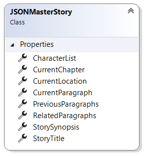
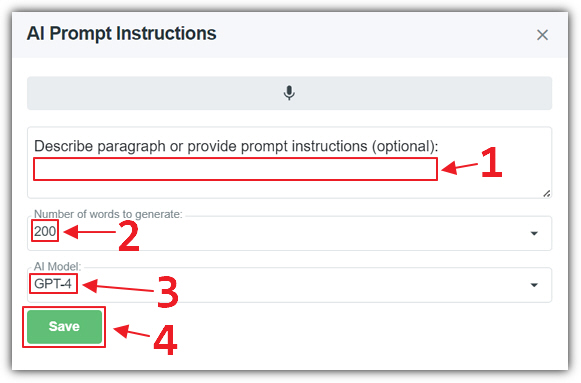

# Anatomy Of A Prompt
* * *

In this section we will describe how **AIStoryBuilders** creates
the instructions that are sent to the **OpenAI** model to generate
content. This is known as the *prompt*. The application typically
generates only a single paragraph **Section** at a time.

It generates this content using the (optional) instruction entered into the
dialog box when the user clicks the **AI** button when editing a
paragraph **Section**. It then constructs a **Master Story**object that encapsulates everything that is important about the story,
and sends all this to the **OpenAI** model to generate content.

Understanding how the **Master Story** is constructed will allow
the user to better understand how **AIStoryBuilders** works and to
get the best performance out of the application.

The **Master Story** object is composed of the following
elements:

- ### **System Message**

This contains any text that was added to the **System Message**
section on the **Details** tab. For example, "Write in the style of Mark Twain and do not add extensive scene descriptions". This allows you to indicate instructions that you want
to send to the **OpenAI** model each time, without the need to
constantly paste it into the AI prompt dialog when creating a paragraph **Section**.

- ### Story Title

This contains the title of the story entered on the **Details**
tab. This is important to the **OpenAI** model because the title
gives the AI a hint as to what the overall story is about.

- ### Story Style

This contains the Style of the story. Possible selections
are: Drama, Sci-Fi, Romance, Comedy, Fantasy, Mystery, Thriller, Children, Young
Adult, Action, Crime, Dystopian, Horror. This is important to the **OpenAI** model because
guides its writing style.

- ### Story Synopsis

This contains the synopsis of the story entered on the **Details**
tab. This is a general overview of the entire story. You will not want to be too
specific with this content because the **AIStoryBuilders**
application is only creating content for a single paragraph **Section**.
However, this is important because if give the **AI** a hint that provides more
information than just the story title.

- ### Current Chapter

This contains information entered into the **Chapter Synopsis**.
This helps the **AI** understand the point of the current chapter.
However, as with the **Story Synopsis** you do not want to be too
specific with granular details because this content is sent to the **AI**
each time content is generated for a paragraph **Section**.

- ### Current Location

This contains information about the **Location** for the current
paragraph **Section**. It also contains any attributes for the
**Location** that are set on the current **Timeline**.
Any **Location** attributes that do not have a **Timeline**
selected are always added. If the current paragraph **Section**
does not have a **Timeline** selected, **Location**
attributes that do not have a **Timeline** selected are also added.

- ### Character List

This contains information on the **Characters** selected for the
current paragraph **Section**. It also contains any attributes for
those **Characters** that are set on the current **Timeline**
that is selected for the current paragraph **Section**. If the
current paragraph **Section** does not have a **Timeline**
selected, **Character** attributes that do not have a **Timeline** selected are added. In addition any **Character**
attributes that do not have a **Timeline** selected are always
added.

- ### Previous Paragraphs

This is the most important part of the **Master Story** object.
This allows **AIStoryBuilders** to continue writing based on the
content that came before it. If the current paragraph **Section**
is the first one in the **Chapter** this will be empty. The **AI** will have to rely on the content entered in the **Chapter Synopsis**.

- ### Related Paragraphs

This reads through all paragraph **Sections** in all **Chapters** that come before the current **Chapter**. It then
performs a *vector search* against all previous paragraphs in the story
that are semantically related to the current paragraph **Section**.
It then selects and includes the top 10 matching paragraphs. This allows the
**AI** to have knowledge about related events that came at
any previous point in the story. This feature
alone sets **AIStoryBuilders** apart from any other similar
application.

- ### Current Paragraph

Finally, the contents of the current paragraph **Section** are
sent to the **AI**. If this is empty the **AI** will
simply create a paragraph **Section** that follows the previous
paragraph **Section**. However, if the current paragraph **Section** does have content, it will rewrite that content based upon the
instructions (if any are provided), and the other content described above.
