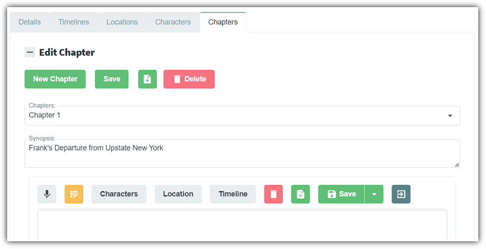

When editing a story the fifth tab is the **Chapters** tab. This
provides the following features:

- **New Chapter** - Clicking this button will allow you to create a new **Chapter** after the last Chapter. **Chapters** are always named sequentially starting with **Chapter 1**.
- **Save** - Saves the **Synopsis** of the current **Chapter**.
- **Insert Chapter** - Inserts a **Chapter** before the current **Chapter**.
- **Delete** - Deletes the current **Chapter**.
- **Synopsis** - Contains the contents of the **Synopsis** of the current**Chapter**. After making any changes, click the **Save** button to save your changes.
