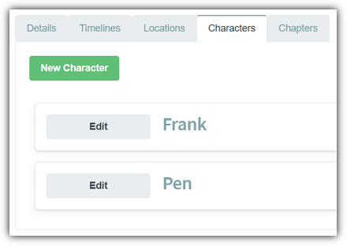
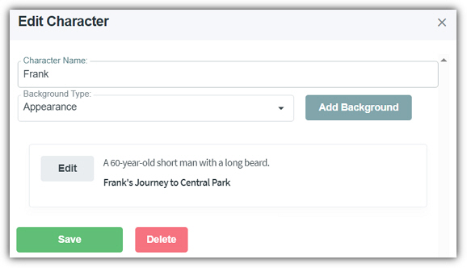

# Characters

[[home](Home)]

* * *

When editing a story the fourth tab is the **Characters** tab.
This provides the following features:

- **New Character** - Clicking this button opens the **New Character** dialog that allows you to add a new **Character**. All Character names must be unique.

- **Edit** - Clicking the **Edit** button next to a **Character** opens the **Character** for editing. This allows you to edit the Character's name and to view and edit the entries for the **Background Types** of the **Character**.
- **Save** - Saves the changes to the current **Character**.
- **Delete** - Deletes the current **Character**.

You can select a **Background Type** from
the **Background Type** dropdown to see all existing entries, for that background type for the character.

To add an additional entry for that
background type, click the **Add Background** button when that
background type is selected in the **Background Type** dropdown. To edit or delete a entry for a
**Background Type**, click the **Edit**
button. This allows you to edit the description of the entry and optionally set
the **Timeline**. You can delete the entry by clicking the **Delete**
button.
