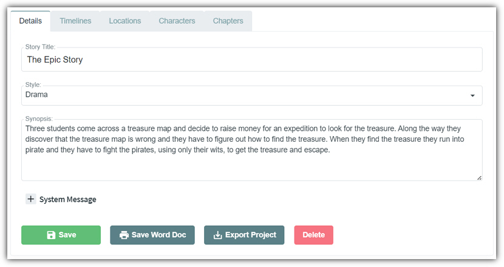
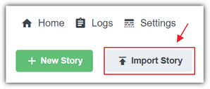

# Details

[[home](Home)]

* * *

When editing a story the first tab is the **Details** tab. This
provides the following features:

- **Story Title** - This contains the title of the story. This is important to the **OpenAI** model because the title
gives the AI a hint as to what the overall story is about.
- **Style** - This setting, selected from the dropdown, allows you to classify the overall
story to one from a common set of genres.
- **Story Synopsis** - This contains a general overview of the entire story. This is important because if gives the **AI** a hint that provides more
information than just the story title.
- **System Message** - Click the **+** icon to open this section for editing. Add any text that you want sent to the AI service whenever it is creating new content for a paragraph **Section**. For example: "Write in the style of Mark Twain and do not add extensive scene descriptions"
- **Save Word Doc** - Clicking this button will export the entire story to the **Microsoft Word** format.
- **Export Project** - Clicking this button will export the entire database and content for the
story in the **AIStoryBuilders** file format. This is suitable for
backing up the project.
- **Delete** - Clicking the **Delete** button allows you to delete the entire story from the database.

**Note:** The **AIStoryBuilders** format file can be opened by clicking the **Import Story** button
on the main menu.
