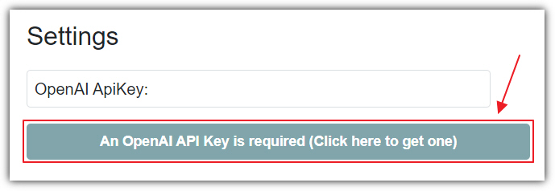
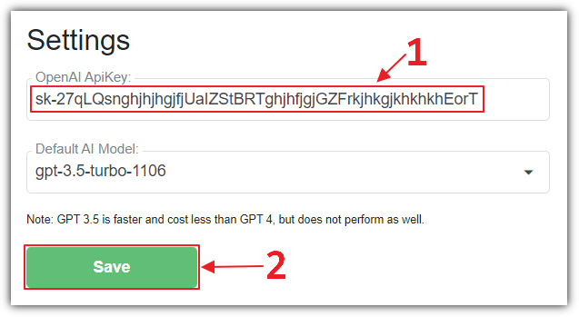
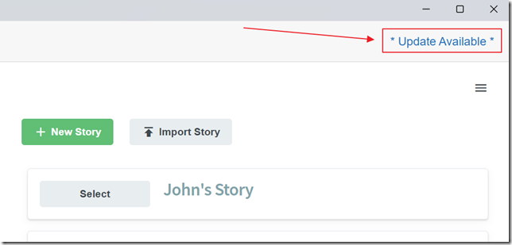
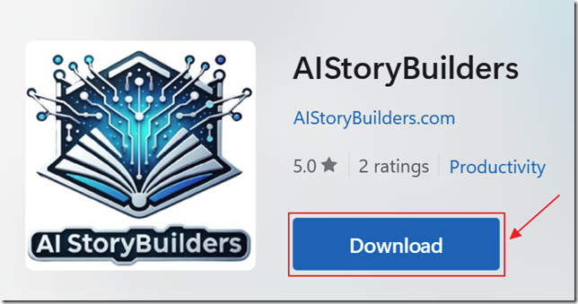
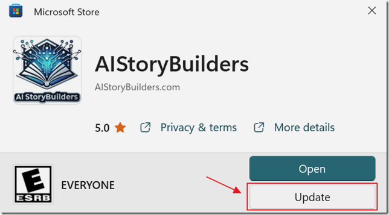
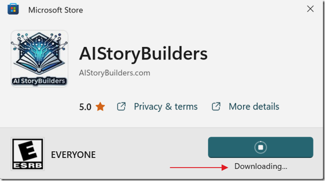
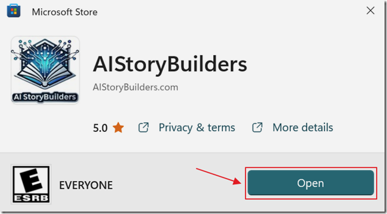

# Installing

###  Requirements

- An **OpenAI** account ([navigate to the **OpenAI** page](https://platform.openai.com/api-keys) to obtain one)

Or

- An **Azure OpenAI** Account (navigate to[**Azure OpenAI**](https://aka.ms/oai/access)to get access)

###  Two Options to run the Application

- **Online Web Browser Version** - Use AIStoryBuilders completely
in you desktop web browser. All that is required is an OpenAI key or an Azure
OpenAI key.
- **Microsoft Windows Desktop Version** - Run 				AIStoryBuilders on your Windows machine by installing 				AIStoryBuilders from the Microsoft Windows Store.

###  Online Web Browser Version (recommended)

- Click here for the: [Online web browser version](https://online.aistorybuilders.com/)
- **Note:**Remember to export and save your 	work because it will disappear if your web browser cache is deleted. Use the **Export Project** button to save your story and the**Import Story** button to reload your story.
- **Note:** Each web browser you use will have its own set of stories.
- **Note:** A unique GUID is created and that and the current version is transmitted to AIStoryBuilders.com each time you navigate to the site. No other information is transmitted. Your **OpenAI** key or **Azure OpenAI** settings are never transmitted to AIStoryBuilders.com. They are only stored in your web browser cache and transmitted to either **OpenAI** or **Azure OpenAI** service. All source code for the application is available[at this link](https://github.com/AIStoryBuilders/AIStoryBuildersOnline).

###   Install The Windows Desktop Application

- Navigate to the [Microsoft Store](https://apps.microsoft.com/detail/9NCJN9W323DB?rtc=1&amp;hl=en-us&amp;gl=US).

- Click the **Install** button.

- When the installation dialog appears click the **Install** button.

- Click **Open**.

- You can also open the program by opening your Windows Start menu and selecting it.

- When you first run the program you will be presented with the **Settings** page. You must enter a valid **OpenAI** key to proceed. If you don't have an **OpenAI** key, click the button to [navigate to the **OpenAI** page](https://platform.openai.com/api-keys) to obtain one.

- When you have your **OpenAI** key, enter it and click the **Save** button.

- If you get an error message, and you have entered a valid key, you may not have access to the **GPT-4** model. You can get information on obtaining access at this link: https://help.openai.com/en/articles/7102672-how-can-i-access-gpt-4.

- If you cannot get access to the **GPT-4** model, you can select the **GPT-3** model and click the **Save** button again.

*(****Note:****The free****OpenAI****account will allow you to get past the Settings page, but not work correctly (the logs will say "Rate limit reached"). To prevent this you must add a payment method to your****OpenAI****account using this link:*[*https://platform.openai.com/account/billing/payment-methods*](https://platform.openai.com/account/billing/payment-methods))

###  Upgrading

When **AIStoryBuilders** has 	a new version you will see **\* 	Update Available \***

Click on that link and your web browser will open and you will be taken 	to the **AIStoryBuilders** **Microsoft 	Store** web page.

Click the **Download** button.

The installer will open and will detect that an update is available.

Click the **Update** button.

The update will download.

Click **Open** to 	open the updated version.
