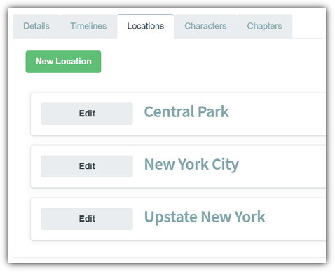
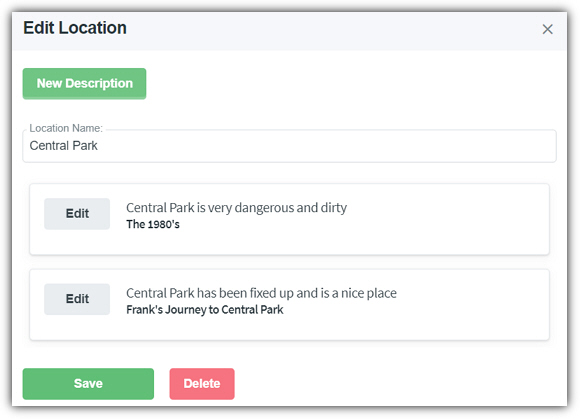
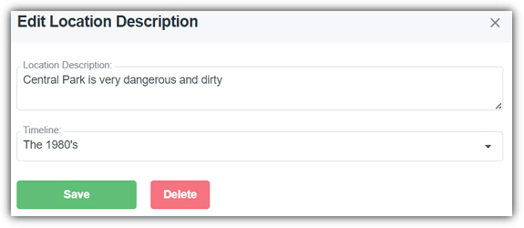

# Locations
* * *

When editing a story the third tab is the **Locations** tab.
This provides the following features:

- **New Location** - Clicking this button will allow you to create a new **Location**.

- **Edit** - Clicking the **Edit** button next to a **Location** opens the **Location** for editing. This allows you to edit the Location's name and to view and edit the entries for the descriptions of the **Location**.
- **New Description** - Opens the dialog that allows you to add a new description for the **Location**.
- **Save** - Saves the changes to the current **Location**.
- **Delete** - Deletes the current **Location**.

- **Edit Descriptions** - Clicking the **Edit** button next to a **Location** description opens the **Location** description for editing. A **Timeline** for the description can be optionally set.
- **Save** - Saves the changes to the current **Location** description.
- **Delete** - Deletes the current **Location** description.
