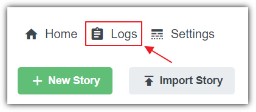
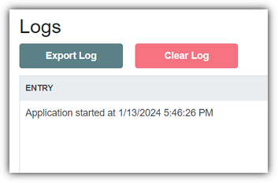
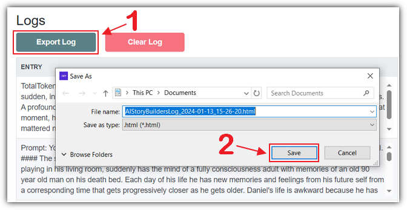
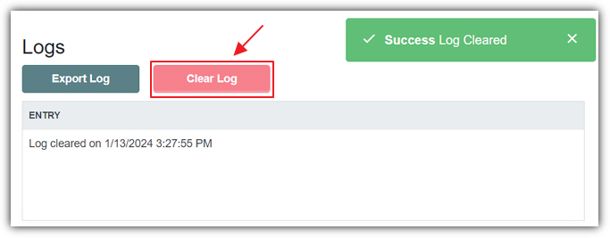

The **Logs** allows you to investigate any performance issues in
the application. This is the place you will want to come to if the application
behaves unexpectedly. In addition, examining the logs allows you to see what is
sent to the **AI** and its response is.

You can access **Logs** from the main menu by clicking on
**Logs**.

If there has been no communication with the **AI** you will see
a message indicating when the application was started.

If you need to export the logs for example for a support issue, simply click
the **Export Log** button and select a destination directory for
the log file.

You can clear the log file by clicking the **Clear Log** button.

**Note:** The application will automatically overwrite any old
log entries if the log becomes too big.
