**NOTE:** If this is your first time using the prgram, you will have to set up a
connection to the OpenAI or Azure OpenAI service. See directions here: [Settings](Settings)

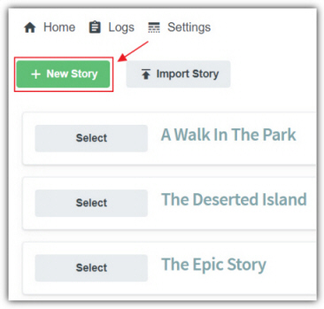

The first step to create a new story is to click the **New Story**
button.

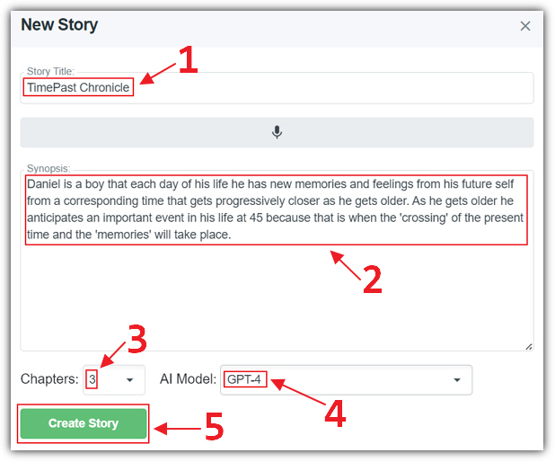

This will open the wizard and we are prompted to enter a **Story Title**,
a **Synopsis** for the story, and how many **Chapters**
we want to be automatically generated. We then click the **Create Story**
button.

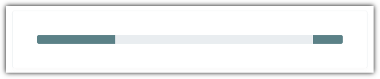

The program will call the **OpenAI** API to generate the
skeleton of the story.

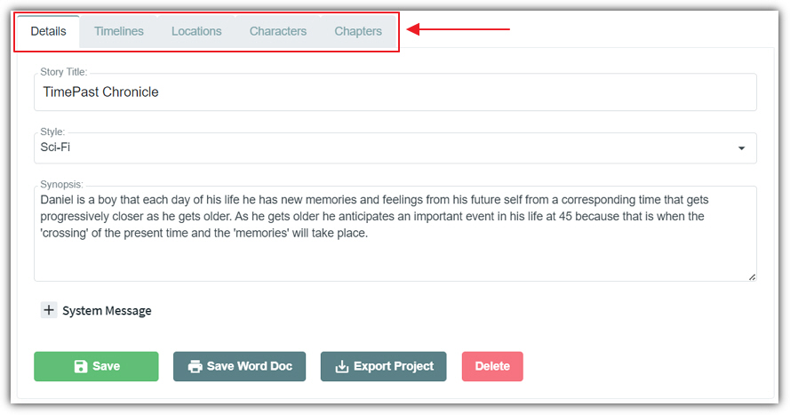

We are now in the story edit mode which consists of the following sections:

- **Details** - Contains settings for the entire story. Also allows the story to be saved and exported to **Microsoft Word**.
- **Timelines** - Allows **Timelines** to be defined and edited. These **Timelines** can be optionally associated with attributes for **Locations** and **Characters** and well as paragraph **Sections**.
- **Locations** - Allows **Locations** to be defined and edited.
- **Characters** - Allows **Characters** to be defined and edited.
- **Chapters** - Allows **Chapters** to be defined and edited. Each **Chapter** contains one or more paragraph **Sections**. These paragraph **Sections** comprise the content of the story.

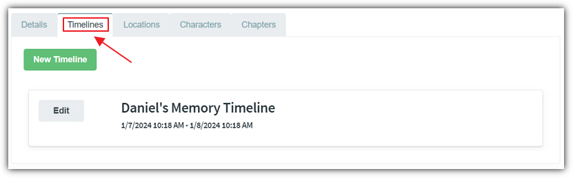

We can select the **Timelines** tab to navigate to the **Timelines** section. Clicking the edit button next to a **Timeline**
will allow us to edit that **Timeline**. We also have the option of
adding a new **Timeline** by clicking the **New Timeline**button.

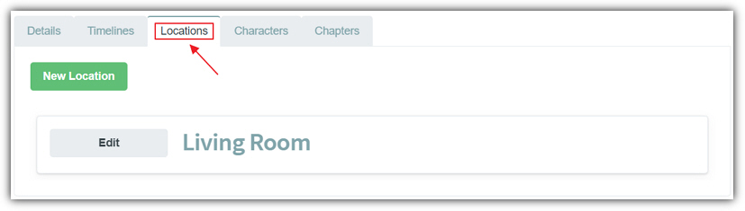

Clicking the **Locations** tab navigates us to **Locations**. We can edit an existing **Location** by
clicking the edit button next to that **Location**. We can also add
a new **Location** by clicking the **New Location**
button.

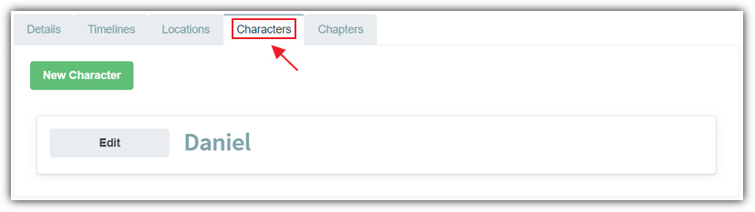

We can navigate to the **Characters** section by clicking the
**Characters** tab. This also allows us to edit an existing **Character** by clicking the edit button next to that **Character**.
We can also create a new **Character** by clicking the new **Character** button.

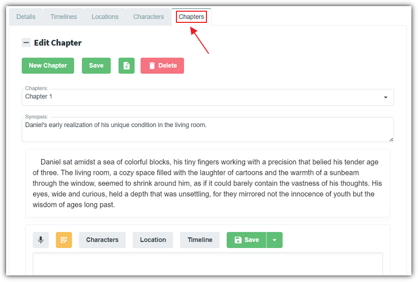

Finally, we can navigate to the **Chapters** section by clicking
the
**Chapters** tab.

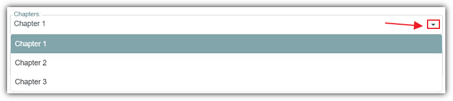

We can use the **Chapter** dropdown to switch between **Chapters**.

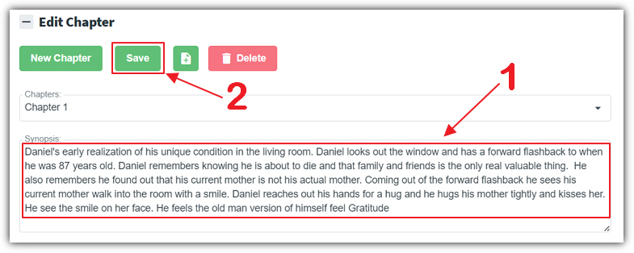

For **Chapter 1** we can update the **Synopsis**
for the **Chapter** to better guide the **AI** when we
ask it to generate or update content in the **Chapter**.

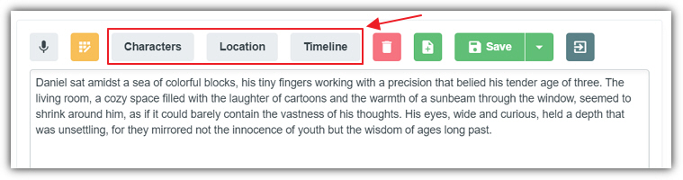

Each paragraph **Section** has optional **Characters**,
**Location**, and **Timeline** associated with it.

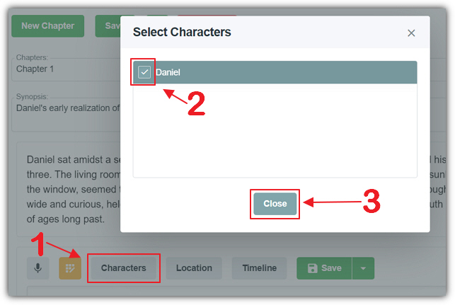

For example, to edit the **Characters** associated with that
paragraph **Section**, you can click the **Characters**
button to open the popup and select or deselect an existing **Character**
by clicking on its check box and then clicking the **Close**
button.

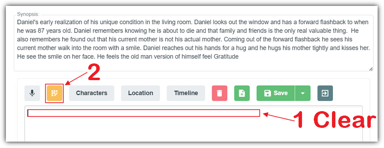

To use the **AI** to generate content, we can clear the existing
content in the paragraph **Section** by selecting it and clicking
the delete button to delete it. We can then click the **AI** button
to open the **AI** popup dialog.

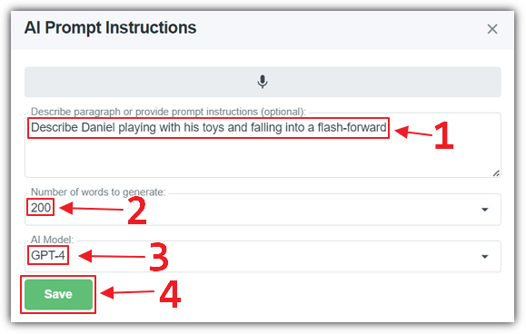

We can insert an optional instruction. If we omit the instruction the **AI** will generate content based on the **Chapter** **Synopsis** and any paragraphs that preceded the paragraph **Section**.

The program will make an API call to **OpenAI** to generate
content.

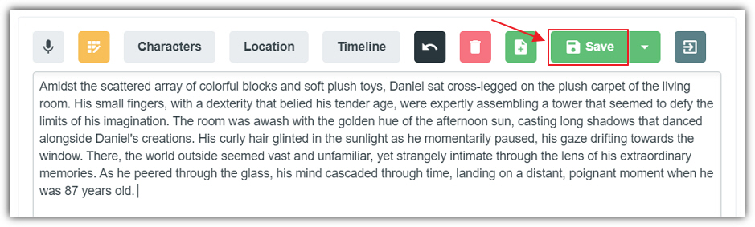

The generate content will be displayed. We can now click the **Save**
button to save it.

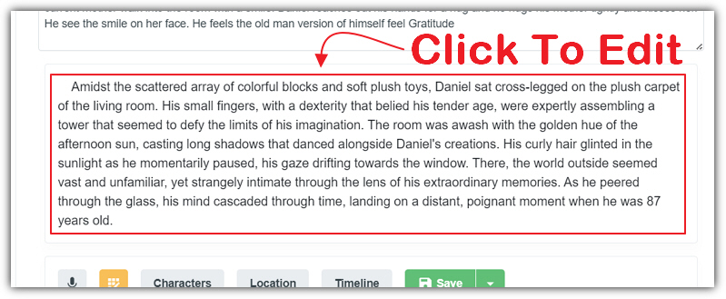

To edit an existing section, we can click on it to put it in edit mode.

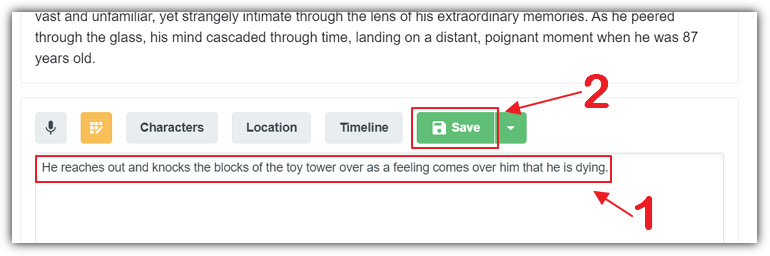

There will always be an edit box at the end of a chapter to allow you
to enter new content and click the **Save** button to save it.
