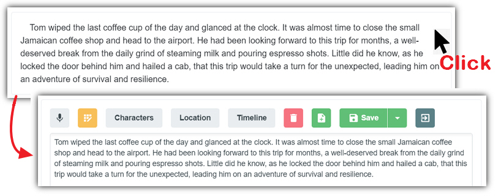
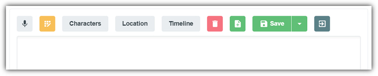
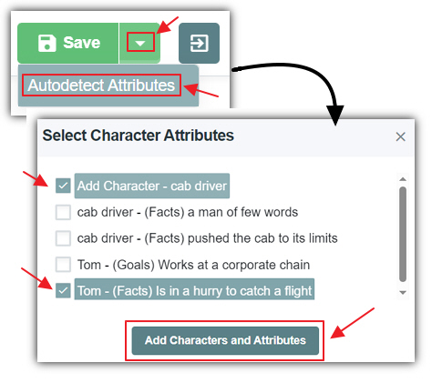
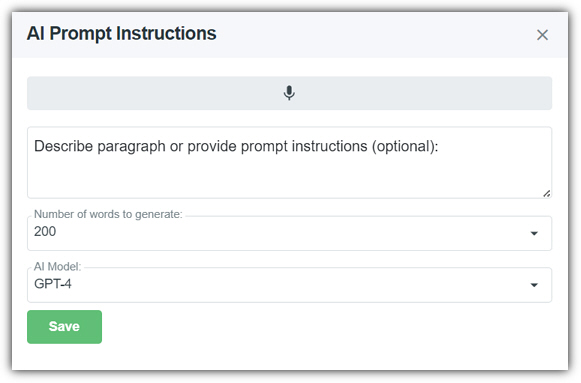

The **Chapters** tab contains one or more paragraph **Sections**. A **Section** is usually composed of a single
paragraph, but, this is not always the case.

A section with existing saved content will appear as normal non-editable
text. To edit it, simply click on it to put that section in **Edit**
mode.

When in **Edit** mode, each **Section** provides
the following features:

- **Microphone Button** - Clicking this button will enable speech to text to allow you to use your voice to create the text for the text box.
- **AI Button** - When you click the **AI** button it will open the **AI** dialog box (covered in more detail in the **AI** section below).
- **Characters** - Allows the **Characters** in the current **Section** to be set.
- **Location** - Allows the **Location** for the current **Section** to be set.
- **Timeline** - Allows the **Timeline** for the current **Section** to be set.
- **Delete** - Deletes the current **Section**.
- **Add Section** - Inserts a section above the current**Section**.
- **Save** - Saves the current **Section** content. This returns the paragraph **Section** to non-editing mode.

- **Autodetect Attributes** - Clicking the dropdown opens a dialog thatdetects what new characters and character attributes are contained in the current paragraph **Section** but are not already in the database. You can then select the new characters and character attributes that you want to add and click the "**Add Characters and Attributes**" button to add them to the database.
- **Exit Button** - This returns the paragraph **Section** to non-editing mode without saving.

# AI

When you click the **AI** button it will open the **AI**
dialog box. It has the following features:

- **Microphone Button** - Clicking this button will enable speech to text to allow you to use your voice to create the text for the**Instruction** box.
- **Instruction** (Labeled as *Describe paragraph or provide prompt instructions*) - This is optional. If you do not provide an instruction the AI will generate content based on the story and chapter summary and any paragraph sections that came before it. An instruction can be anything even asking the AI to fix the spelling. Additional possible instructions include (but are not limited to):
    - "Have Daniel argue with Tom because Tom broke his toy. Have Tom 	apologize"
    - Adding or removing details.
    - Changing the point of view or switching from past tense to present 	tense.
    - Having a character perform a different action.
    - Asking the content to be written with a different tone.
- **Number of words to generate** - Indicates approximately how many words you want the AI to create.
- **Save** - Triggers the **AI** to create content. The **AI** dialog box will close and the content will be displayed in the paragraph **Section**.

**Note:** After the **AI** creates new content, an
**Undo** button will appear in the toolbar. Clicking this button
will revert the content to the previous content.
