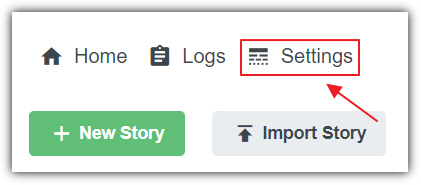
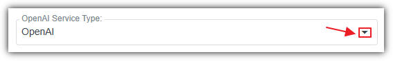
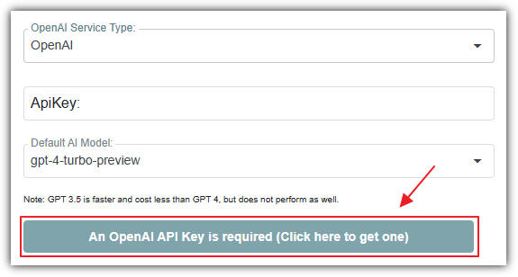
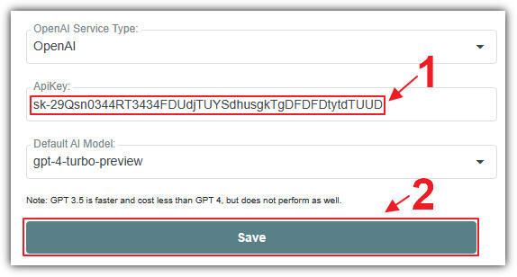
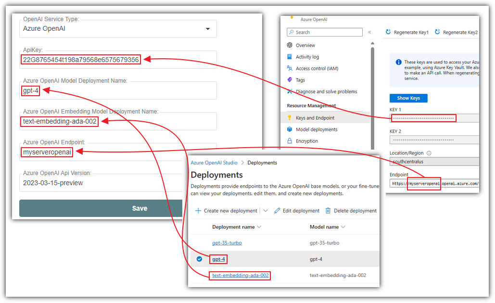

# Settings
* * *

There is no charge to use **AIStoryBuilders** software. However,
it requires the support of an AI model hosted by an AI service.

**Settings** controls what **AI** model is being used to generate
content, as well as the **API** key required to communicate with the **OpenAI**service (that hosts the **AI** model). You can access settings by clicking on
**Settings** on the main menu.

The default service is **OpenAI** (hosted at
https://platform.openai.com/docs/introduction), however, you also have the
option of using the **OpenAI** models hosted with **Microsoft**
(hosted at:
https://azure.microsoft.com/en-us/products/ai-services/openai-service).

To change the **OpenAI**service select the dropdown for the **OpenAI Service Type**.

## OpenAI Service

When using the **OpenAI service**, if an **OpenAI** API key has not been entered you can click the
*OpenAI API key is required* button to navigate to **OpenAI**
to create or retrieve one. You will be taken to a page that allows you to log in
or sign up to the **OpenAI** service. You will be billed by **OpenAI** directly for any charges. A typical charge is usually less than
$1 for an hour of heavy usage.

Next, enter your **OpenAI** API key in the ***OpenAI*** *ApiKey* section, and click the **Save** button.

You have the option to change the default model but it is not recommended as
the quality of the generated content is noticeably different.

## Azure OpenAI Service

You can sign up for access to the **Microsoft Azure OpenAI**
service here:
https://azure.microsoft.com/en-us/products/ai-services/openai-service

To use **Azure OpenAI** settings, the following are required:

- Follow these directions to deploy a **GPT 4** model:https://learn.microsoft.com/en-us/azure/ai-services/openai/how-to/working-with-models?tabs=powershell
- Also deploy the **text-embedding-ada-002 model** (used for creating *[embeddings](https://platform.openai.com/docs/guides/embeddings)* that allow AIStoryBuilders to index your story)
