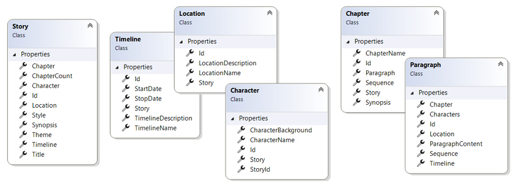
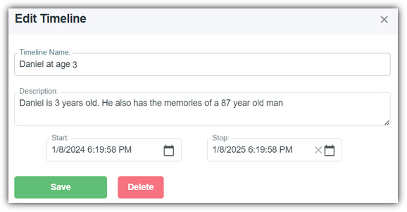
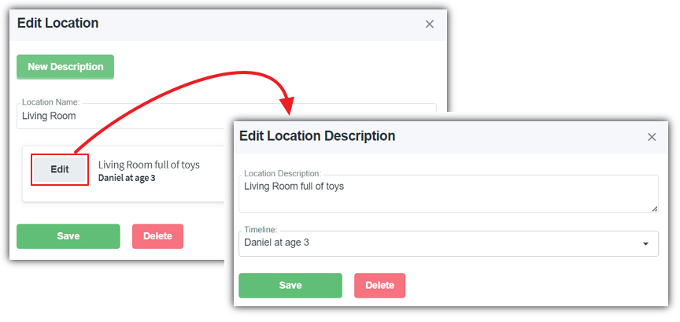
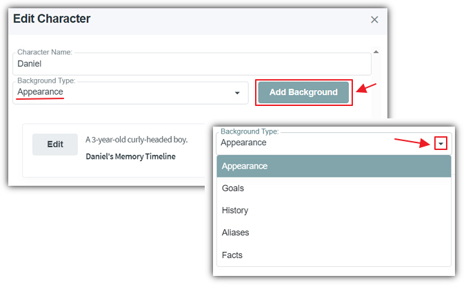
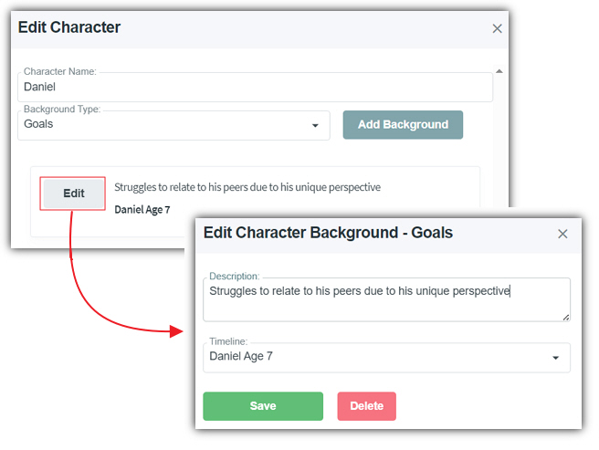
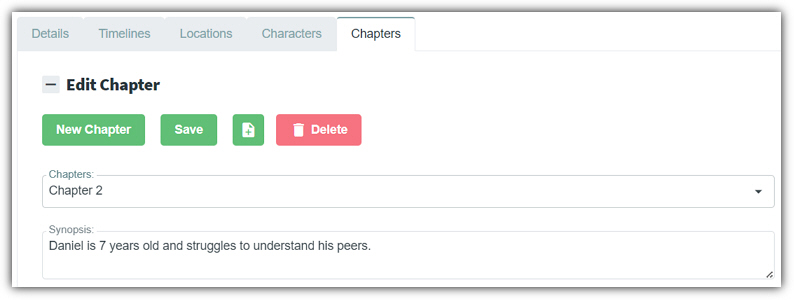
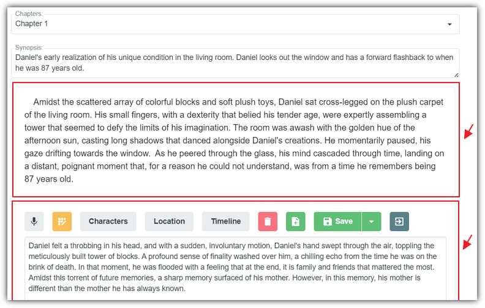

**AIStoryBuilders** uses a proprietary database format that
allows it to track the important parts of a story. The key entities that
compose this database are detailed below.

## Timelines

**Timelines** are the foundation of the **AIStoryBuilders**
database. All attributes added to all the other entities in the database can
optionally be associated with a **Timeline**. Proper use of **Timelines** is important because attributes, when properly segmented by
**Timelines**, prevents the **AI** from becoming
confused with different parts of the story.

For example, creating a **Timeline** for a character when they
are 3 years old allows you to attach **Character** attributes, such
as appearance and goals to that **Timeline**. This prevents these
**Character** attributes from being considered by the **AI**
when it generates content for the character in paragraph **Sections**
that are on another **Timeline**.

## Locations

**Locations** describe where a paragraph **Section**
takes place. The **Location** has descriptions that can optionally
be tied to a **Timeline**. This is used by the **AI**
when describing the setting in its generated content.

## Characters

Characters are composed of a **Character Name** and **Background Types**.

The possible **Background Types** are:

- **Appearance** - Anything that describes how a character looks. For example tall or blonde.
- **Goals** - Things that the character wants to do, for example, to open a restaurant.
- **History** - Important things about the character that don't happen in the story but are referred to in the story.
- **Aliases** - Other names the character is known by, for example Mom.
- **Facts** - Important things about the character that can explain a character's motivation. For example the character has cancer.

To edit or delete a entry for a background type, click the **Edit**
button. This allows you to edit the description of the entry and optionally set
the **Timeline**. You can delete the entry by clicking the **Delete**
button.

## Chapters

**Chapters** are used to segment the complete story. **Chapters** are composed of one or more paragraph **Sections**.
A single **Chapter** has a **Synopsis**. **Chapters** are always named sequentially starting with **Chapter 1**.

## Sections

**Sections** contain the prose that make up the complete story.
A **Section** is usually composed of a single paragraph, but, this
is not always the case. What is important about **Sections** is
that each **Section** is optionally associated with a specific set
of **Characters**, and a single **Location** and
**Timeline**. This allows the **AI** to limit its
focus to content filtered by these settings when generating content.
