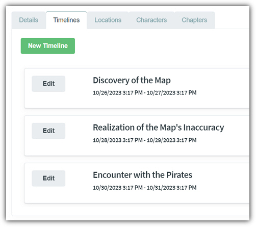
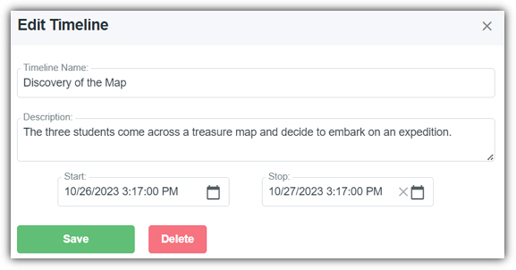

# Timelines
* * *

When editing a story the second tab is the **Timelines** tab.
This provides the following features:

- **New Timeline** - Clicking this button will allow you to create a new **Timeline**.
- **Edit** - Clicking the **Edit** button next to a **Timeline** opens the **Timeline** for editing.

- **Timeline Name** - The name of the **Timeline**.
- **Description** -  The description of the **Timeline**.
- **Start** - Indicates the start time of the **Timeline**.
- **Stop** - Indicates the stop time of the **Timeline**.
- **Save** - Saves the changes to the current **Timeline**.
- **Delete** - Deletes the current **Timeline**.
