# Utility and Fine-Tuning
* * *

(**Note:** Fine-Tuning is only available when using OpenAI not Azure OpenAI)

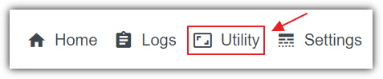

**Utility** and **Fine-Tuning** contains tools to
help you create and manage your **fine-tuned** models. You can access
the page by clicking on **Utility** on the main menu.

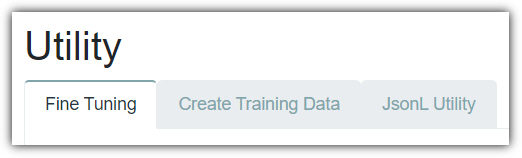

The **Utility** page consists of the following sections:

#### Fine Tuning

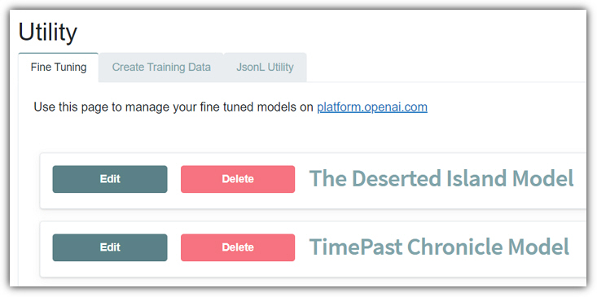

- Displays any **Fine-Tune** models you have created on**OpenAI**.
- **Edit** button - Allows you to rename the file name to a more easily understandable name.
- **Delete** button - Allows you to delete the **Fine-Tune** model. This will actually delete this model on **OpenAI**.

#### Create Training Data

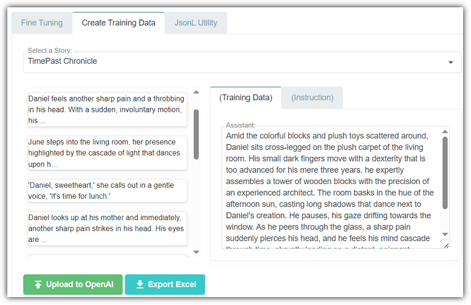

- Allows you to select an existing **Story** from the dropdown.
- Allows you to select a section in the left-hand window, and edit the content of the text in the **(Training Data)** and **(Instruction)** tab on the right.
- **Upload to OpenAI** button - Sends the selected **Story** to **OpenAI** as training data and starts processing it as a **fine-tuned** model.
- **Export Excel** button - Allows you to export the training data as an **Excel** file.

#### JsonL Utility

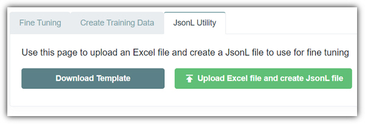

- **Download Template** - Provides an **Excel** file to use as a template for your **Fine-Tune** model training data.
- **Upload Excel file and create JsonL file** - Allows you to upload the **Excel** file and return the data in the **JsonL** format that can then be uploaded to **OpenAI** to **Fine-Tune** your model.

## Guide to Automatically Fine-Tuning Your AI Model with OpenAI

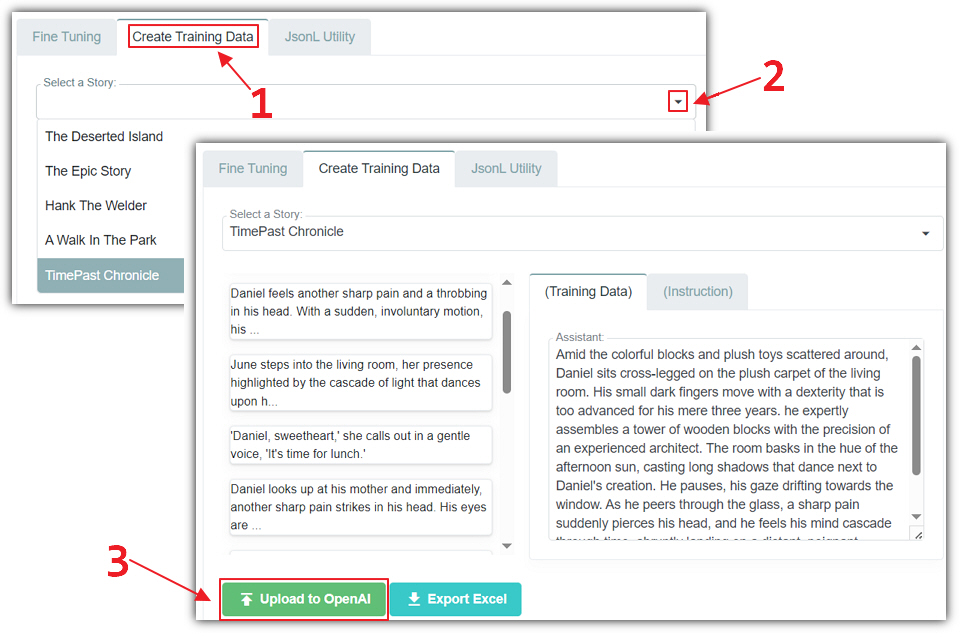

Creating the training data to create a **fine-tuned** model is
simple and easy when using the **Create Training Data** tab.

1. Navigate to the **Create Training Data** tab
2. Select an existing **Story** where all the existing prose has been edited to match your writing style
3. Click the **Upload to OpenAI** button

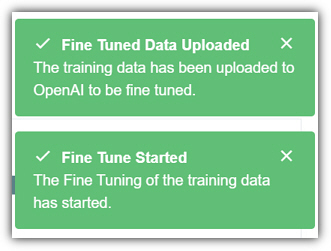

You will see status messages that the contents of the **Story**
have been uploaded to **OpenAI** as training data and that **fine-tuning** has started.

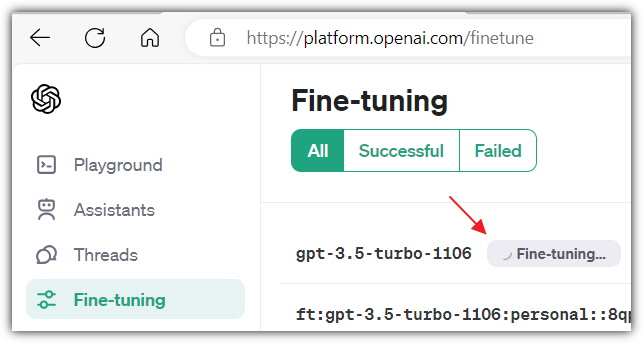

You can navigate to: https://platform.openai.com/finetune
and see the progress.

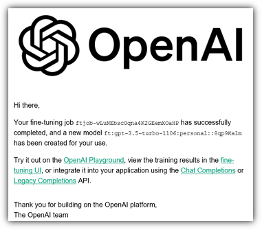

When **fine-tuning** is complete you will receive an email from
**OpenAI**.

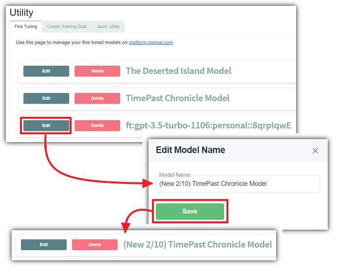

Click on the **Home**
button and then navigate back to the **Utility** page by clicking
the **Utility** button.

On the **Fine Tuning** tab you will see your new **fine-tuned**model.

**OpenAI** assigns a unique identifier to each **fine-tuned**model. If desired, you can rename your model to something more memorable or descriptive. This can be done by selecting the**Edit** button next to the model's name on the **Utility** page in the **AIStoryBuilders** application.

**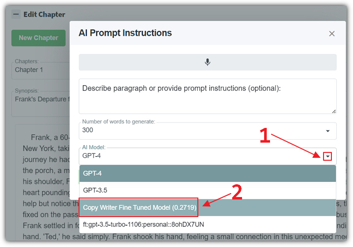**
Once your model is
**fine-tuned** and ready to go, you can start using it to generate responses by selecting it from the **AI Model** dropdown.

#### Export To Excel

You can also click the **Export Excel** button to export the
training data to **Excel**. This will allow you to edit the data
and then use the **JsonL Utility** page to convert it from **Excel** to **JsonL** to upload manually to **OpenAI**.
See "*Step-by-Step Guide to* *Manually* *Fine-Tuning Your AI Model with OpenAI*"
below.

#### Editing Text

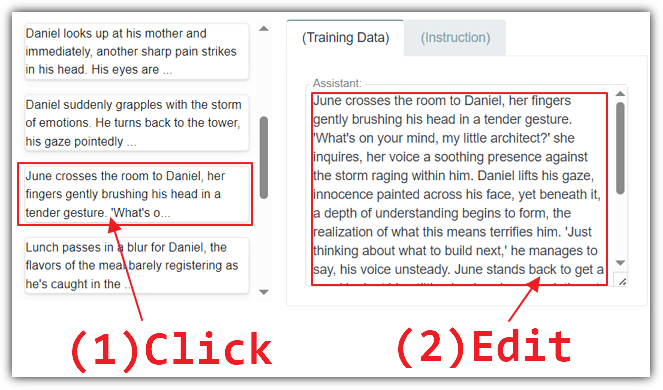

Before submitting the training data to **OpenAI**, you can click
on any section in the left-hand window and edit the content of the text in the
**(Training Data)** and **(Instruction)** tab on the
right.

## Step-by-Step Guide to Manually Fine-Tuning Your AI Model with OpenAI

1. **Create at Least 10 Samples**

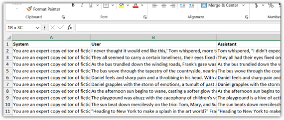

**Fine-tuning** an **AI** model with **OpenAI** starts with creating training data. You'll need at least**10** samples, however the more, the better. Use the **Download Template** button to retrieve the **Excel** file to use for the data. A sample of the type of content you would want to create can be found in the file at the following link:[FineTunedSample.xls](files/FineTunedSample2.xls)
2. **Create the JSONL File**

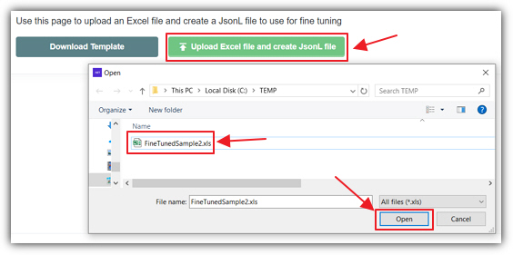

Once you have your training data entered into the **Excel** template, you need to format it in the **JSONL** file format to upload to **OpenAI**. **JSONL** stands for **JSON Lines**, which means each line must be a valid **JSON** object. This is difficult to do manually. Click the **Upload Excel file and create JsonL file** button to open the dialog to allow you to select the **Excel** file with your training data.

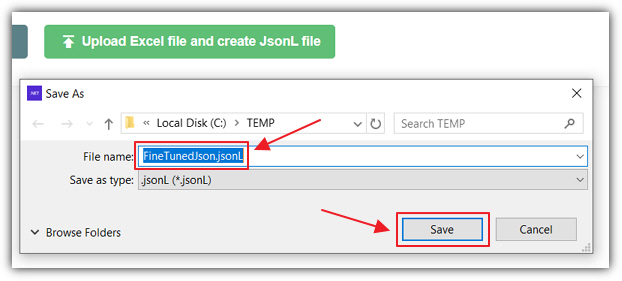

A **JSONL** file will be returned. Save the file.
3. **Upload to OpenAI**

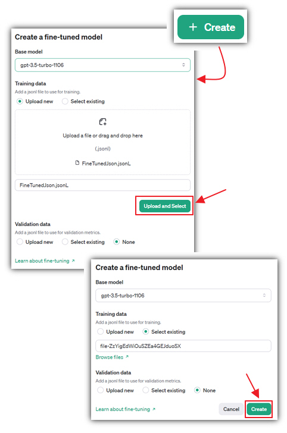

After preparing your **JSONL** file, navigate to:https://platform.openai.com/finetune and upload it to **OpenAI** through their user interface.
4. **Receive the Email on progress from OpenAI**

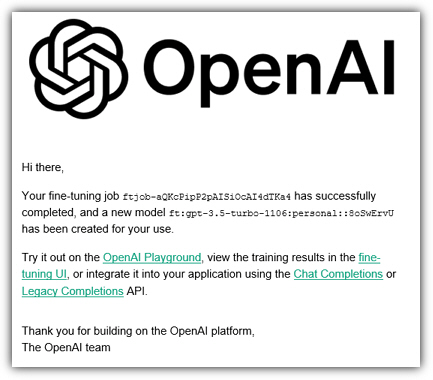

Once you trigger the **fine-tuning** process, **OpenAI** will use your training data to **fine-tune** the model. You'll receive an **email** notification once your model starts training and another when the training is complete. This email will contain important information about your model's training status and any issues encountered during the process.
5. (**Optional) Rename the Model**

**OpenAI** assigns a unique identifier to each **fine-tuned** model. If desired, you can rename your model to something more memorable or descriptive. This can be done by selecting the**Edit** button next to the model's name on the **Utility** page in the **AIStoryBuilders** application.
6. **Consume the Model When Making an AI Prompt**
Once your model is **fine-tuned** and ready to go, you can start using it to generate responses by selecting it from the **AI Model** dropdown.
