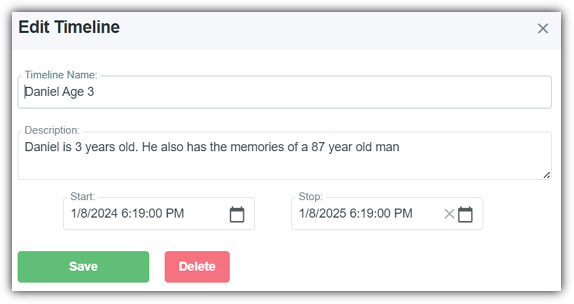
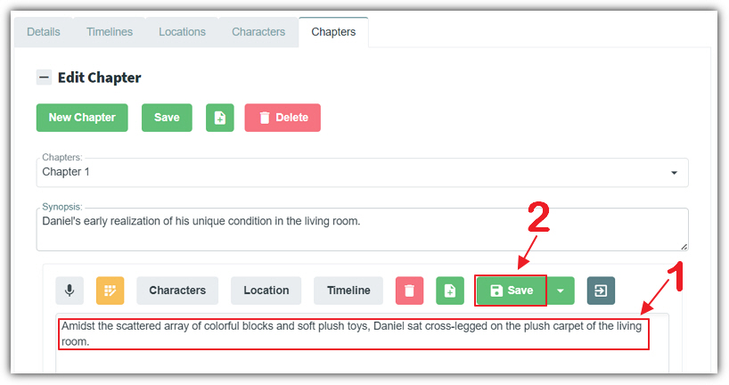
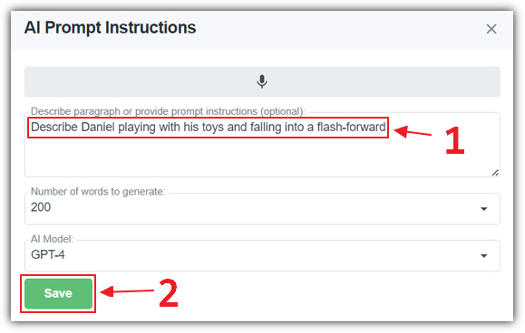
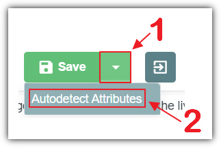
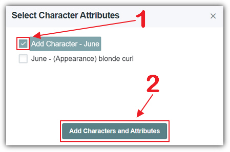

# Writing Styles
* * *

**AIStoryBuilders** supports two different writing styles.
Database first and writing first. **AIStoryBuilders** requires an
extensive database composed of **Timelines** **Locations** and
**Characters** to support its
ability to generate content and to effectively rewrite your content and to
follow your instructions.

# Database First

You have the option of populating the database first and then moving on to
the **Chapter** tab to write your story and use the **AI** to assist in creating
content. If you choose this method realize that you don't have to fill
everything in the database at once. It is sufficient to enter only the
database items that pertain to the specific **Chapter** that you're working on.

If you do choose this method it is suggested that you start with **Timelines**.
**Timelines** form the foundation of all database items because
**Locations** and
**Characters** contain attributes that you can optionally tie to a
**Timeline**.

**Timelines** are not required, however if you choose not to use them then the
**AI**
will be provided *all information* in the database when generating content for the paragraph
**Sections** . You will find that this will cause the **AI** to generate
content that is not as focused as the content you would get if you use **Timelines**.

Next, it is suggested that you enter database information for **Locations**.
A **Location** can have different attributes at different stages of
your story therefore it is recommended that you tie the attributes for a
**location** to a specific **Timeline**.

Finally, **Characters** should be added and attributes added to the
**Characters**.
**Characters** attributes are the most influential part of any content generated by the
**AI**.
There are a large number of attributes that can be tied to a character so
segmenting those attributes by **Timeline** it's very important.

# Writing First

It is perfectly acceptable to simply navigate to the **Chapter** tab and start
writing.

When you click the **AI** button you can instruct the **AI** as to what it
should write about. At this point you can provide information such as
**Character** attributes. However, you will find you will
need to repeat this information every time you ask the program to generate
**AI**
content.

However by using the **Autodetect Attributes** feature, you can
automatically add character attributes to the database. When using **Autodetect Attributes** the program detects what new characters and character attributes are contained in
the current paragraph **Section** but are not already in the database.

You can then select
the new characters and character attributes that you want to add and click the "**Add Characters and Attributes**" button to add them to the database.
